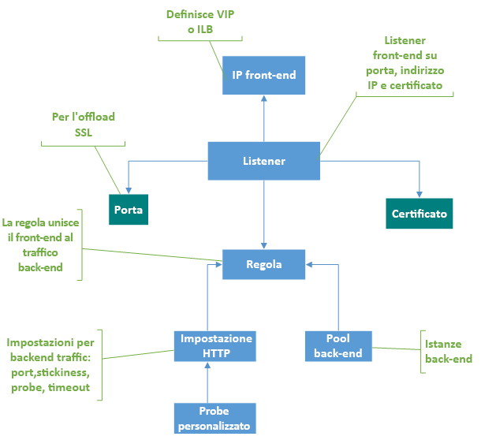

# Componenti del gateway applicazione

 Un gateway applicazione funge da singolo punto di contatto per i client. Distribuisce il traffico dell'applicazione in ingresso tra più pool back-end, tra cui VM di Azure, set di scalabilità di macchine virtuali, servizio app Azure e server locali/esterni. Per distribuire il traffico, un gateway applicazione usa diversi componenti descritti in questo articolo.

## Indirizzi IP front-end

Un indirizzo IP front-end è l'indirizzo IP associato a un gateway applicazione. È possibile configurare un gateway applicazione in modo che disponga di un indirizzo IP pubblico, un indirizzo IP privato o entrambi. Un gateway applicazione supporta un solo indirizzo IP pubblico o privato. La rete virtuale e l'indirizzo IP pubblico devono trovarsi nella stessa posizione del gateway applicazione. Una volta creato, un indirizzo IP front-end è associato a un listener.

### Indirizzo IP pubblico statico e dinamico

Lo SKU applicazione Azure gateway V2 può essere configurato in modo da supportare sia l'indirizzo IP interno statico sia l'indirizzo IP pubblico statico oppure solo un indirizzo IP pubblico statico. Non può essere configurato per supportare solo indirizzi IP interni statici.

Lo SKU V1 può essere configurato in modo da supportare indirizzi IP interni statici o dinamici e indirizzi IP pubblici dinamici. L'indirizzo IP dinamico del gateway applicazione non cambia in un gateway in esecuzione. Può cambiare solo quando si arresta o si avvia il gateway. Non cambia in caso di errori di sistema, aggiornamenti, aggiornamenti di Azure host e così via. 

Il nome DNS associato a un gateway applicazione non cambia nel ciclo di vita del gateway. Di conseguenza, è necessario usare un alias CNAME e puntare all'indirizzo DNS del gateway applicazione.

## Listener

Un listener è un'entità logica che controlla le richieste di connessione in ingresso. Un listener accetta una richiesta se il protocollo, la porta, il nome host e l'indirizzo IP associati alla richiesta corrispondono agli stessi elementi associati alla configurazione del listener.

Prima di usare un gateway applicazione, è necessario aggiungere almeno un listener. Possono essere presenti più listener collegati a un gateway applicazione e possono essere usati per lo stesso protocollo.

Quando un listener rileva le richieste in ingresso dai client, il gateway applicazione instrada tali richieste ai membri nel pool back-end configurato nella regola.

I listener supportano i protocolli e le porte seguenti.

### Porte

Una porta è la posizione in cui un listener è in ascolto per la richiesta del client. È possibile configurare porte comprese tra 1 e 65502 per lo SKU V1 e da 1 a 65199 per lo SKU V2.

### Protocolli

Il gateway applicazione supporta quattro protocolli: HTTP, HTTPS, HTTP/2 e WebSocket:
>[!NOTE]
>Il supporto del protocollo HTTP/2 è disponibile per i client che si connettono solo a listener del gateway applicazione. La comunicazione con i pool di server back-end è sempre su HTTP/1.1. Per impostazione predefinita, il supporto di HTTP/2 è disabilitato. È possibile scegliere di abilitarla.

- Specificare tra i protocolli HTTP e HTTPS nella configurazione del listener.
- Il supporto per i [protocolli WebSockets e http/2](https://docs.microsoft.com/azure/application-gateway/overview#websocket-and-http2-traffic) viene fornito in modalità nativa e il [supporto di WebSocket](https://docs.microsoft.com/azure/application-gateway/application-gateway-websocket) è abilitato per impostazione predefinita. Non esistono impostazioni configurabili dall'utente per abilitare o disabilitare in modo selettivo il supporto di WebSocket. Usare WebSocket con listener HTTP e HTTPS.

Usare un listener HTTPS per la terminazione SSL. Un listener HTTPS trasferisce il lavoro di crittografia e decrittografia al gateway applicazione, in modo che i server Web non vengano sovraccaricati dal sovraccarico.

### Pagine di errore personalizzate

Il gateway applicazione consente di creare pagine di errore personalizzate anziché visualizzare le pagine di errore predefinite. Se si usa una pagina di errore personalizzata, è possibile usare il proprio layout e marchio aziendali. Il gateway applicazione visualizza una pagina di errore personalizzata quando una richiesta non riesce a raggiungere il back-end.

Per altre informazioni, vedere [pagine di errore personalizzate per il gateway applicazione](https://docs.microsoft.com/azure/application-gateway/custom-error).

### Tipi di listener

Esistono due tipi di listener:

- **Basic**. Questo tipo di listener è in ascolto su un singolo sito di dominio, in cui è presente un singolo mapping DNS all'indirizzo IP del gateway applicazione. Questa configurazione del listener è necessaria quando si ospita un sito singolo dietro un gateway applicazione.

- **Multisito**. Questa configurazione del listener è necessaria quando si configura più di un'applicazione Web nella stessa istanza del gateway applicazione. Consente di configurare una topologia più efficiente per le distribuzioni aggiungendo fino a 100 siti Web a un gateway applicazione. Ogni sito Web può essere indirizzato al proprio pool back-end. Ad esempio, tre sottodomini, abc.contoso.com, xyz.contoso.com e pqr.contoso.com, puntano all'indirizzo IP del gateway applicazione. Si creeranno tre listener multisito e si configureranno ogni listener per la rispettiva porta e impostazione del protocollo.

    Per ulteriori informazioni, vedere [hosting su più siti](https://docs.microsoft.com/azure/application-gateway/application-gateway-web-app-overview).

Dopo aver creato un listener, associarlo a una regola di routing delle richieste. Questa regola determina il modo in cui la richiesta ricevuta sul listener deve essere indirizzata al back-end.

Il gateway applicazione elabora i listener nell'ordine indicato. Se il listener di base corrisponde a una richiesta in ingresso, viene elaborata per prima. Per instradare il traffico al back-end corretto, configurare un listener multisito prima di un listener di base.

## Regole di routing richieste

Una regola di routing delle richieste è un componente chiave di un gateway applicazione perché determina come instradare il traffico sul listener. La regola associa il listener, il pool di server back-end e le impostazioni HTTP back-end.

Quando un listener accetta una richiesta, la regola di routing delle richieste Invia la richiesta al back-end o la reindirizza altrove. Se la richiesta viene trasmessa al back-end, la regola di routing delle richieste definisce il pool di server back-end a cui eseguire l'inoltro. La regola di routing delle richieste determina anche se le intestazioni nella richiesta devono essere riscritte. Un listener può essere associato a una sola regola.

Esistono due tipi di regole di routing delle richieste:

- **Basic**. Tutte le richieste sul listener associato (ad esempio, blog.contoso.com/*) vengono inviate al pool back-end associato usando l'impostazione HTTP associata.

- **Basato sul percorso**. Questa regola di routing consente di instradare le richieste sul listener associato a un pool back-end specifico, in base all'URL nella richiesta. Se il percorso dell'URL in una richiesta corrisponde al modello di percorso in una regola basata sul percorso, la regola instrada la richiesta. Applica il modello di percorso solo al percorso URL, non ai relativi parametri di query. Se il percorso URL in una richiesta del listener non corrisponde ad alcuna regola basata sul percorso, instrada la richiesta al pool back-end predefinito e alle impostazioni HTTP.

Per altre informazioni, vedere [routing basato su URL](https://docs.microsoft.com/azure/application-gateway/url-route-overview).

### Supporto per il reindirizzamento

La regola di routing delle richieste consente anche di reindirizzare il traffico sul gateway applicazione. Si tratta di un meccanismo di reindirizzamento generico, pertanto è possibile eseguire il Reindirizzamento da e verso qualsiasi porta definita tramite regole.

È possibile scegliere la destinazione di reindirizzamento come altro listener (che consente di abilitare il Reindirizzamento da HTTP a HTTPS automatico) o da un sito esterno. È anche possibile scegliere di fare in modo che il reindirizzamento sia temporaneo o permanente oppure di aggiungere il percorso URI e la stringa di query all'URL reindirizzato.

Per altre informazioni, vedere [reindirizzare il traffico sul gateway applicazione](https://docs.microsoft.com/azure/application-gateway/redirect-overview).

### Riscrivere le intestazioni HTTP

Con le regole di routing delle richieste è possibile aggiungere, rimuovere o aggiornare le intestazioni di richiesta e risposta HTTP (S) quando i pacchetti di richiesta e risposta passano tra il client e i pool back-end tramite il gateway applicazione.

Le intestazioni possono essere impostate su valori statici o su altre intestazioni e variabili del server. Questo consente di utilizzare casi di utilizzo importanti, ad esempio l'estrazione di indirizzi IP del client, la rimozione di informazioni riservate sul back-end, l'aggiunta di ulteriore sicurezza e così via.

Per altre informazioni, vedere [riscrivere le intestazioni HTTP nel gateway applicazione](https://docs.microsoft.com/azure/application-gateway/rewrite-http-headers).

## Impostazioni HTTP

Un gateway applicazione instrada il traffico ai server back-end (specificati nella regola di routing delle richieste che includono le impostazioni HTTP) usando il numero di porta, il protocollo e altre impostazioni descritte in questo componente.

La porta e il protocollo usati nelle impostazioni HTTP determinano se il traffico tra il gateway applicazione e i server back-end è crittografato (fornendo SSL end-to-end) o non crittografato.

Questo componente viene usato anche per:

- Determinare se una sessione utente deve essere mantenuta nello stesso server utilizzando l' [affinità di sessione basata su cookie](https://docs.microsoft.com/azure/application-gateway/overview#session-affinity).

- Rimuovere normalmente i membri del pool back-end usando lo [svuotamento della connessione](https://docs.microsoft.com/azure/application-gateway/overview#connection-draining).

- Associare un probe personalizzato per monitorare l'integrità back-end, impostare l'intervallo di timeout della richiesta, sostituire il nome host e il percorso nella richiesta e fornire la facilità con un clic per specificare le impostazioni per il back-end del servizio app.

## Pool back-end

Un pool back-end instrada la richiesta ai server back-end che forniscono la richiesta. I pool back-end possono contenere:

- Schede di interfaccia di rete
- Set di scalabilità di macchine virtuali
- Indirizzi IP pubblici
- Indirizzi IP interni
- FQDN
- Backend multi-tenant (ad esempio il servizio app)

I membri del pool back-end del gateway applicazione non sono associati a un set di disponibilità. Un gateway applicazione può comunicare con istanze all'esterno della rete virtuale in cui si trova. Di conseguenza, i membri dei pool back-end possono essere tra i cluster, tra i Data Center o all'esterno di Azure, purché sia disponibile la connettività IP.

Se si usano indirizzi IP interni come membri del pool back-end, è necessario usare il [peering di rete virtuale](https://docs.microsoft.com/azure/virtual-network/virtual-network-peering-overview) o un [gateway VPN](https://docs.microsoft.com/azure/vpn-gateway/vpn-gateway-about-vpngateways). Il peering di rete virtuale è supportato e vantaggioso per il bilanciamento del carico del traffico in altre reti virtuali.

Un gateway applicazione può anche comunicare con i server locali quando sono connessi da Azure ExpressRoute o tunnel VPN se il traffico è consentito.

È possibile creare pool back-end diversi per diversi tipi di richieste. Ad esempio, creare un pool back-end per le richieste generali e quindi un altro pool back-end per le richieste ai microservizi per l'applicazione.

## Probe integrità

Per impostazione predefinita, un gateway applicazione esegue il monitoraggio dello stato di tutte le risorse nel pool back-end e rimuove automaticamente quelle non integre. Monitora quindi le istanze non integre e le aggiunge al pool back-end integro quando diventano disponibili e rispondono ai Probe di integrità.

Oltre al monitoraggio del probe di integrità predefinito, è anche possibile personalizzare il probe di integrità in base ai requisiti dell'applicazione. I probe personalizzati consentono un controllo più granulare sul monitoraggio dell'integrità. Quando si usano Probe personalizzati, è possibile configurare l'intervallo di probe, l'URL e il percorso da testare e il numero di risposte non riuscite da accettare prima che l'istanza del pool back-end sia contrassegnata come non integra. Si consiglia di configurare Probe personalizzati per monitorare l'integrità di ogni pool back-end.

Per altre informazioni, vedere [monitorare l'integrità del gateway applicazione](https://docs.microsoft.com/azure/application-gateway/application-gateway-probe-overview).

## Passaggi successivi

Creare un gateway applicazione:

* [Nel portale di Azure](quick-create-portal.md)
* [Utilizzando Azure PowerShell](quick-create-powershell.md)
* [Usando l'interfaccia della riga di comando di Azure](quick-create-cli.md)
