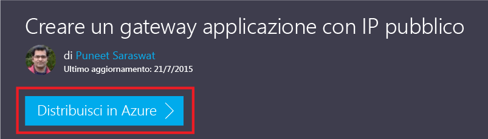
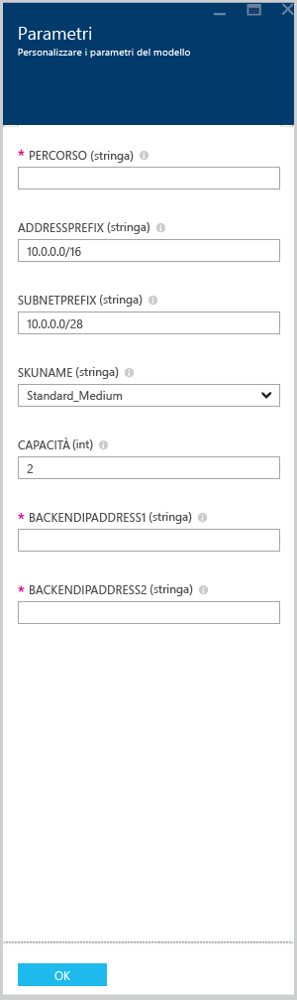

# <a name="create-an-application-gateway-by-using-the-azure-resource-manager-template"></a>Creare un gateway applicazione usando il modello di Gestione risorse di Azure

> [!div class="op_single_selector"]
> * [portale di Azure](application-gateway-create-gateway-portal.md)
> * [PowerShell per Azure Resource Manager](application-gateway-create-gateway-arm.md)
> * [PowerShell per Azure classico](application-gateway-create-gateway.md)
> * [Modello di Azure Resource Manager](application-gateway-create-gateway-arm-template.md)
> * [Interfaccia della riga di comando di Azure](application-gateway-create-gateway-cli.md)

Il gateway applicazione di Azure è un dispositivo di bilanciamento del carico di livello&7;. Fornisce richieste HTTP con routing delle prestazioni e failover tra server diversi, sia nel cloud che in locale. Il gateway applicazione offre numerose funzionalità di controller per la distribuzione di applicazioni (ADC, Application Delivery Controller), tra cui bilanciamento del carico HTTP, affinità di sessione basata su cookie, offload SSL (Secure Sockets Layer), probe di integrità personalizzati, supporto per più siti e molte altre. Per un elenco completo delle funzionalità supportate, vedere [Panoramica del gateway applicazione](application-gateway-introduction.md)

Questo articolo illustra come scaricare e modificare un modello di Azure Resource Manager esistente da GitHub e distribuire il modello da GitHub, da PowerShell e dall'interfaccia della riga di comando di Azure.

Se si sta distribuendo il modello di Gestione risorse di Azure direttamente da GitHub, senza alcuna modifica, andare al passaggio che illustra la distribuzione di un modello da GitHub.

## <a name="scenario"></a>Scenario

In questo scenario si apprenderà come:

* Creare un gateway applicazione con due istanze.
* Creare una rete virtuale denominata VirtualNetwork1 con un blocco CIDR riservato 10.0.0.0/16.
* Creare una subnet denominata Appgatewaysubnet che usa 10.0.0.0/28 come blocco CIDR.
* Impostare due indirizzi IP back-end configurati in precedenza per i server Web da usare per bilanciare il carico del traffico. In questo esempio di modello vengono usati gli indirizzi IP back-end 10.0.1.10 e 10.0.1.11.

> [!NOTE]
> Tali impostazioni sono i parametri per il modello. Per personalizzare il modello è possibile modificare le regole, il listener e il protocollo SSL che apre il file azuredeploy.json.


## <a name="download-and-understand-the-azure-resource-manager-template"></a>Scaricare e comprendere il modello di Gestione risorse di Azure

È possibile scaricare da GitHub il modello di Gestione risorse di Azure esistente per creare una rete virtuale e due subnet, apportare eventuali modifiche e riutilizzarlo. A tale scopo, seguire questa procedura:

1. Passare a [Create Application Gateway](https://github.com/Azure/azure-quickstart-templates/tree/master/101-application-gateway-create)(Crea gateway applicazione).
2. Fare clic su **azuredeploy.json**, quindi fare clic su **RAW**.
3. Salvare il file in una cartella locale nel computer.
4. Se si ha familiarità con i modelli di Gestione risorse di Azure, procedere al passaggio 7.
5. Aprire il file salvato e visualizzare il contenuto di **parameters** , alla riga 5. La sezione parameters del modello di Gestione risorse di Azure è un segnaposto per i valori che possono essere inseriti durante la distribuzione.
   
   | Parametro | Descrizione |
   | --- | --- |
   | **location** |Area di Azure in cui viene creato il gateway applicazione |
   | **VirtualNetwork1** |Nome della nuova rete virtuale |
   | **addressPrefix** |Spazio degli indirizzi per la rete virtuale, in formato CIDR |
   | **ApplicationGatewaysubnet** |Nome della subnet del gateway applicazione |
   | **subnetPrefix** |Blocco CIDR della subnet del gateway applicazione |
   | **skuname** |Dimensione dell'istanza SKU |
   | **capacity** |Numero di istanze |
   | **backendaddress1** |Indirizzo IP del primo server Web |
   | **backendaddress2** |Indirizzo IP del secondo server Web |

    > [!IMPORTANT]
    >I modelli di Gestione risorse di Azure conservati in GitHub possono cambiare nel tempo. Assicurarsi di aver controllato il modello prima di usarlo.

6. Controllare il contenuto in **resources** e prendere nota delle proprietà seguenti:

   * **type**. Tipo di risorsa che sarà creato dal modello. In questo caso il tipo è `Microsoft.Network/applicationGateways`, che rappresenta un gateway applicazione.
   * **name**. Nome della risorsa. Si noti l'uso di `[parameters('applicationGatewayName')]`, che indica che il nome viene specificato come input dell'utente o di un file di parametri durante la distribuzione.
   * **properties**. Elenco di proprietà per la risorsa. Questo modello usa la rete virtuale e l'indirizzo IP pubblico durante la creazione del gateway applicazione.

7. Tornare a [https://github.com/Azure/azure-quickstart-templates/blob/master/101-application-gateway-create/](https://github.com/Azure/azure-quickstart-templates/blob/master/101-application-gateway-create).
8. Fare clic su **azuredeploy-parameters.json** e quindi su **RAW**.
9. Salvare il file in una cartella locale nel computer.
10. Aprire il file salvato e modificare i valori dei parametri. Usare i valori riportati di seguito per la distribuzione del gateway applicazione descritto in questo scenario.

    ```json
        {
        "$schema": "http://schema.management.azure.com/schemas/2015-01-01/deploymentParameters.json#",
        {
        "location" : {
        "value" : "West US"
        },
        "addressPrefix": {
        "value": "10.0.0.0/16"
        },
        "subnetPrefix": {
        "value": "10.0.0.0/24"
        },
        "skuName": {
        "value": "Standard_Small"
        },
        "capacity": {
        "value": 2
        },
        "backendIpAddress1": {
        "value": "10.0.1.10"
        },
        "backendIpAddress2": {
        "value": "10.0.1.11"
        }
        }
    ```

11. Salvare il file. È possibile testare il modello JSON e il modello di parametri usando strumenti online di convalida di JSON come [JSlint.com](http://www.jslint.com/).

## <a name="deploy-the-azure-resource-manager-template-by-using-powershell"></a>Distribuire il modello di Gestione risorse di Azure usando PowerShell

Se è la prima volta che si usa Azure PowerShell, vedere [Come installare e configurare Azure PowerShell](/powershell/azureps-cmdlets-docs) e seguire le istruzioni per accedere ad Azure e selezionare la sottoscrizione.

### <a name="step-1"></a>Passaggio 1

```powershell
Login-AzureRmAccount
```

### <a name="step-2"></a>Passaggio 2

Controllare le sottoscrizioni per l'account.

```powershell
Get-AzureRmSubscription
```

Verrà richiesto di eseguire l'autenticazione con le proprie credenziali.

### <a name="step-3"></a>Passaggio 3

Scegliere le sottoscrizioni ad Azure da usare.

```powershell
Select-AzureRmSubscription -Subscriptionid "GUID of subscription"
```

### <a name="step-4"></a>Passaggio 4

Se necessario, creare un gruppo di risorse usando il cmdlet **New-AzureResourceGroup** . Nell'esempio seguente viene creato un nuovo gruppo di risorse denominato AppgatewayRG nella località Stati Uniti orientali.

```powershell
New-AzureRmResourceGroup -Name AppgatewayRG -Location "East US"
```

Eseguire il cmdlet **New-AzureRmResourceGroupDeployment** per distribuire la nuova rete virtuale usando il modello e i file di parametri scaricati e modificati in precedenza.

```powershell
New-AzureRmResourceGroupDeployment -Name TestAppgatewayDeployment -ResourceGroupName AppgatewayRG `
-TemplateFile C:\ARM\azuredeploy.json -TemplateParameterFile C:\ARM\azuredeploy-parameters.json
```

## <a name="deploy-the-azure-resource-manager-template-by-using-the-azure-cli"></a>Distribuire il modello di Gestione risorse di Azure usando l'interfaccia della riga di comando di Azure

Per distribuire il modello di Azure Resource Manager scaricato usando l'interfaccia della riga di comando di Azure, seguire questa procedura:

### <a name="step-1"></a>Passaggio 1

Se è la prima volta che si usa l'interfaccia della riga di comando di Azure, vedere [Installare l'interfaccia della riga di comando di Azure](../xplat-cli-install.md) e seguire le istruzioni fino al punto in cui si selezionano l'account e la sottoscrizione di Azure.

### <a name="step-2"></a>Passaggio 2

Eseguire il comando **azure config mode** per passare alla modalità Resource Manager, come illustrato nel frammento di codice seguente.

```azurecli
azure config mode arm
```

Di seguito è riportato l'output previsto per il comando precedente:

```azurecli
info:    New mode is arm
```

### <a name="step-3"></a>Passaggio 3

Se necessario, eseguire il comando **azure group create** per creare un nuovo gruppo di risorse, come illustrato nel frammento di codice seguente. Si noti l'output del comando. Nell'elenco riportato dopo l'output sono indicati i parametri usati. Per altre informazioni sui gruppi di risorse, vedere [Panoramica di Azure Resource Manager](../azure-resource-manager/resource-group-overview.md).

```azurecli
azure group create -n appgatewayRG -l eastus
```

**-n (o --nome)**. Nome del nuovo gruppo di risorse. Per questo scenario, *appgatewayRG*.

**-l (o --location)**. Area di Azure in cui viene creato il nuovo gruppo di risorse. Per questo scenario, *eastus*.

### <a name="step-4"></a>Passaggio 4

Eseguire il cmdlet **azure group deployment create** per distribuire la nuova rete virtuale usando il modello e i file di parametri scaricati e modificati nel passaggio precedente. Nell'elenco riportato dopo l'output sono indicati i parametri usati.

```azurecli
azure group deployment create -g appgatewayRG -n TestAppgatewayDeployment -f C:\ARM\azuredeploy.json -e C:\ARM\azuredeploy-parameters.json
```

## <a name="deploy-the-azure-resource-manager-template-by-using-click-to-deploy"></a>Distribuire il modello di Gestione risorse di Azure usando il pulsante per la distribuzione

Il pulsante per la distribuzione offre un altro modo per usare i modelli di Gestione risorse di Azure. Questo è un modo semplice di usare i modelli con il portale di Azure.

### <a name="step-1"></a>Passaggio 1

Vedere [Create an application gateway with public IP](https://azure.microsoft.com/documentation/templates/101-application-gateway-public-ip/)(Creare un gateway applicazione con IP pubblico).

### <a name="step-2"></a>Passaggio 2

Fare clic su **Distribuzione in Azure**.



### <a name="step-3"></a>Passaggio 3

Inserire i parametri per il modello di distribuzione nel portale e fare clic su **OK**.



### <a name="step-4"></a>Passaggio 4

Selezionare **Note legali** e fare clic su **Acquista**.

### <a name="step-5"></a>Passaggio 5

Nel pannello Distribuzione personalizzata fare clic su **Crea**.

## <a name="providing-certificate-data-to-resource-manager-templates"></a>Fornire i dati certificato ai modelli di Resource Manager

Quando si usa SSL con un modello, il certificato deve essere fornito in una stringa base64 anziché essere caricato. Per convertire un formato .pfx o .cer in una stringa base64, eseguire il comando PowerShell indicato qui di seguito. Tale frammento converte il certificato in una stringa base64 che può essere assegnata al modello. L'output previsto è una stringa che può essere archiviata in una variabile e incollata nel modello.

```powershell
[System.Convert]::ToBase64String([System.IO.File]::ReadAllBytes("<certificate path and name>.pfx"))
```

## <a name="next-steps"></a>Passaggi successivi

Per configurare l'offload SSL, vedere [Configurare un gateway applicazione per l'offload SSL](application-gateway-ssl.md).

Per configurare un gateway applicazione da usare con un servizio di bilanciamento del carico interno, vedere [Creare un gateway applicazione con un servizio di bilanciamento del carico interno (ILB)](application-gateway-ilb.md).

Per altre informazioni generali sulle opzioni di bilanciamento del carico, vedere:

* [Servizio di bilanciamento del carico di Azure](https://azure.microsoft.com/documentation/services/load-balancer/)
* [Gestione traffico di Azure](https://azure.microsoft.com/documentation/services/traffic-manager/)


<!--HONumber=Jan17_HO4-->


