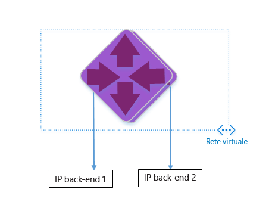

<properties
   pageTitle="Creare un gateway applicazione usando il modello di Gestione risorse di Azure | Microsoft Azure"
   description="Questa pagina fornisce istruzioni per la creazione di un gateway applicazione di Azure usando il modello di Gestione risorse di Azure"
   documentationCenter="na"
   services="application-gateway"
   authors="joaoma"
   manager="jdial"
   editor="tysonn"/>
<tags
   ms.service="application-gateway"
   ms.devlang="na"
   ms.topic="hero-article"
   ms.tgt_pltfrm="na"
   ms.workload="infrastructure-services"
   ms.date="02/02/2016"
   ms.author="joaoma"/>

# Creare un gateway applicazione usando il modello di Gestione risorse di Azure

Il gateway applicazione di Azure è un dispositivo di bilanciamento del carico di livello 7. Fornisce richieste HTTP con routing delle prestazioni e failover tra server diversi, sia nel cloud che in locale. Il gateway applicazione offre le seguenti funzionalità di distribuzione delle applicazioni: bilanciamento del carico HTTP, affinità delle sessioni basata sui cookie e offload SSL (Secure Sockets Layer).

> [AZURE.SELECTOR]
- [Azure Classic PowerShell](application-gateway-create-gateway.md)
- [Azure Resource Manager PowerShell](application-gateway-create-gateway-arm.md)
- [Azure Resource Manager template](application-gateway-create-gateway-arm-template.md)

 

Questo articolo illustra come scaricare e modificare un modello esistente di Gestione risorse di Azure da GitHub e distribuire il modello da GitHub, da PowerShell e dall'interfaccia della riga di comando di Azure.

Se si sta distribuendo il modello di Gestione risorse di Azure direttamente da GitHub, senza alcuna modifica, andare al passaggio che illustra la distribuzione di un modello da GitHub.

## Scenario

In questo scenario si apprenderà come:

- Creare un gateway applicazione con due istanze.
- Creare una rete virtuale denominata VirtualNetwork1 con un blocco CIDR riservato 10.0.0.0/16.
- Creare una subnet denominata Appgatewaysubnet che usa 10.0.0.0/28 come blocco CIDR.
- Impostare due indirizzi IP back-end configurati in precedenza per i server Web da usare per bilanciare il carico del traffico. In questo esempio di modello verranno usati gli indirizzi IP back-end 10.0.1.10 e 10.0.1.11.

>[AZURE.NOTE] Questi sono i parametri per il modello. Per personalizzare il modello è possibile modificare le regole, il listener e il protocollo SSL che apre il file azuredeploy.json.

## Scaricare e comprendere il modello di Gestione risorse di Azure

È possibile scaricare da GitHub il modello di Gestione risorse di Azure esistente per creare una rete virtuale e due subnet, apportare eventuali modifiche e riutilizzarlo. A tale scopo, seguire questa procedura:

1. Accedere a https://raw.githubusercontent.com/azure/azure-quickstart-templates/master/101-create-application-gateway/.
2. Fare clic su **azuredeploy.json** e quindi su **RAW**.
3. Salvare il file in una cartella locale nel computer.
4. Se si ha familiarità con i modelli di Gestione risorse di Azure, procedere al passaggio 7.
5. Aprire il file appena salvato e visualizzare il contenuto di **parameters**, alla riga 5. La sezione parameters del modello di Gestione risorse di Azure è un segnaposto per i valori che possono essere inseriti durante la distribuzione.

	| Parametro | Descrizione |
	|---|---|
	| **location** | Area di Azure in cui verrà creato il gateway applicazione |
	| **VirtualNetwork1** | Nome della nuova rete virtuale |
	| **addressPrefix** | Spazio degli indirizzi per la rete virtuale, in formato CIDR |
	| **ApplicationGatewaysubnet** | Nome della subnet del gateway applicazione |
	| **subnetPrefix** | Blocco CIDR della subnet del gateway applicazione |
	| **skuname** | Dimensione dell'istanza SKU |
	| **capacity** | Numero di istanze |
	| **backendaddress1** | Indirizzo IP del primo server Web |
	| **backendaddress2** | Indirizzo IP del secondo server Web |

>[AZURE.IMPORTANT] I modelli di Gestione risorse di Azure conservati in GitHub possono cambiare nel tempo. Assicurarsi di aver controllato il modello prima di usarlo.

6. Controllare il contenuto in **resources** e prendere nota di quanto segue:

	- **type**. Tipo di risorsa che sarà creato dal modello. In questo caso il tipo è **Microsoft.Network/applicationGateways**, che rappresenta un gateway applicazione.
	- **name**. Nome della risorsa. Si noti l'uso di **[parameters('applicationGatewayName')]** con cui si indica che il nome verrà specificato come input dall'utente o tramite un file di parametri durante la distribuzione.
	- **properties**. Elenco di proprietà per la risorsa. Questo modello usa la rete virtuale e l'indirizzo IP pubblico durante la creazione del gateway applicazione.

7. Tornare a https://raw.githubusercontent.com/azure/azure-quickstart-templates/master/101-create-application-gateway/azuredeploy.json.
8. Fare clic su **azuredeploy-parameters.json**, quindi fare clic su **RAW**.
9. Salvare il file in una cartella locale nel computer in uso.
10. Aprire il file appena salvato e modificare i valori dei parametri. Usare i valori riportati di seguito per la distribuzione del gateway applicazione descritto in questo scenario.

		{
		  "$schema": "http://schema.management.azure.com/schemas/2015-01-01/deploymentParameters.json#",
		{
    	"location" : {
        "value" : "West US"
    	},
    	"addressPrefix": {
        "value": "10.0.0.0/16"
    	},
    	"subnetPrefix": {
        "value": "10.0.0.0/24"
    	},
    	"skuName": {
        "value": "Standard_Small"
    	},
    	"capacity": {
        "value": 2
    	},
    	"backendIpAddress1": {
        "value": "10.0.1.10"
    	},
    	"backendIpAddress2": {
        "value": "10.0.1.11"
    	}
		}

11. Salvare il file. È possibile testare il modello JSON e il modello di parametri usando strumenti di convalida online di JSON come [JSlint.com](http://www.jslint.com/).

## Distribuire il modello di Gestione risorse di Azure usando PowerShell

Se è la prima volta che si usa Azure PowerShell, vedere [Come installare e configurare Azure PowerShell](powershell-install-configure.md) e seguire le istruzioni fino al termine della procedura per accedere ad Azure e selezionare la sottoscrizione scelta.

### Passaggio 1

		Login-AzureRmAccount

### Passaggio 2

Controllare le sottoscrizioni per l'account.

		get-AzureRmSubscription

Verrà richiesto di eseguire l'autenticazione con le proprie credenziali. 

### Passaggio 3

Scegliere quali sottoscrizioni Azure usare.  

		Select-AzureRmSubscription -Subscriptionid "GUID of subscription"

### Passaggio 4

Se necessario, creare un nuovo gruppo di risorse usando il cmdlet **New-AzureResourceGroup**. Nell'esempio seguente verrà creato un nuovo gruppo di risorse denominato AppgatewayRG nella località Stati Uniti orientali.

	 New-AzureRmResourceGroup -Name AppgatewayRG -Location "East US"
		VERBOSE: 5:38:49 PM - Created resource group 'AppgatewayRG' in location 'eastus'

		ResourceGroupName : AppgatewayRG
		Location          : eastus
		ProvisioningState : Succeeded
		Tags              :
		Permissions       :
	                 Actions  NotActions
	                 =======  ==========
	                  *

		ResourceId        : /subscriptions/xxxxxxxxxxxxxxxxxxxxxxxxxxxxxx/resourceGroups/AppgatewayRG

Eseguire il cmdlet **New-AzureRmResourceGroupDeployment** per distribuire la nuova rete virtuale usando il modello e i file di parametri scaricati e modificati in precedenza.

		New-AzureRmResourceGroupDeployment -Name TestAppgatewayDeployment -ResourceGroupName AppgatewayRG `
 		   -TemplateFile C:\ARM\azuredeploy.json -TemplateParameterFile C:\ARM\azuredeploy-parameters.json

L'output generato dalla riga di comando sarà il seguente:

		DeploymentName    : testappgatewaydeployment
		ResourceGroupName : appgatewayRG
		ProvisioningState : Succeeded
		Timestamp         : 9/19/2015 1:49:41 AM
		Mode              : Incremental
		TemplateLink      :
		Parameters        :
                   Name             Type                       Value
                   ===============  =========================  ==========
                   location         String                     East US
                   addressPrefix    String                     10.0.0.0/16
                   subnetPrefix     String                     10.0.0.0/24
                   skuName          String                     Standard_Small
                   capacity         Int                        2
                   backendIpAddress1  String                     10.0.1.10
                   backendIpAddress2  String                     10.0.1.11

		Outputs           :

## Distribuire il modello di Gestione risorse di Azure usando l'interfaccia della riga di comando di Azure

Per distribuire il modello di Gestione risorse di Azure scaricato usando l'interfaccia della riga di comando di Azure, seguire questa procedura:

1. Se è la prima volta che si usa l'interfaccia della riga di comando di Azure, vedere [Installare e configurare l'interfaccia della riga di comando di Azure](xplat-cli-install.md) e seguire le istruzioni fino al punto in cui si selezionano l'account e la sottoscrizione di Azure.
2. Eseguire il comando **azure config mode** per passare alla modalità Gestione risorse, come illustrato di seguito.

		azure config mode arm

Di seguito è riportato l'output previsto per il comando precedente:

		info:	New mode is arm

3. Se necessario, eseguire il comando **azure group create** per creare un nuovo gruppo di risorse, come illustrato di seguito. Si noti l'output del comando. Nell'elenco riportato dopo l'output sono indicati i parametri usati. Per altre informazioni sui gruppi di risorse, vedere [Panoramica di Gestione risorse di Azure](resource-group-overview.md).

		azure group create -n appgatewayRG -l eastus

**-n (o --name)**. Nome del nuovo gruppo di risorse. Per questo scenario, *appgatewayRG*.

**-l (o --location)**. L'area di Azure in cui verrà creato il nuovo gruppo di risorse. Per questo scenario, *eastus*.

4. Eseguire il cmdlet **azure group deployment create** per distribuire la nuova rete virtuale usando il modello e i file di parametri scaricati e modificati in precedenza. Nell'elenco riportato dopo l'output sono indicati i parametri usati.

		azure group deployment create -g appgatewayRG -n TestAppgatewayDeployment -f C:\ARM\azuredeploy.json -e C:\ARM\azuredeploy-parameters.json

Di seguito è riportato l'output previsto per il comando precedente:

		azure group deployment create -g appgatewayRG -n TestAppgatewayDeployment -f C:\ARM\azuredeploy.json -e C:\ARM\azuredeploy-parameters.json
		info:    Executing command group deployment create
		+ Initializing template configurations and parameters
		+ Creating a deployment
		info:    Created template deployment "TestAppgatewayDeployment"
		+ Waiting for deployment to complete
		data:    DeploymentName     : TestAppgatewayDeployment
		data:    ResourceGroupName  : appgatewayRG
		data:    ProvisioningState  : Succeeded
		data:    Timestamp          : 2015-09-21T20:50:27.5129912Z
		data:    Mode               : Incremental
		data:    Name               Type    Value
		data:    -----------------  ------  --------------
		data:    location           String  East US
		data:    addressPrefix      String  10.0.0.0/16
		data:    subnetPrefix       String  10.0.0.0/24
		data:    skuName            String  Standard_Small
		data:    capacity           Int     2
		data:    backendIpAddress1  String  10.0.1.10
		data:    backendIpAddress2  String  10.0.1.11
		info:    group deployment create command OK

**-g (o --resource-group)**. Nome del gruppo di risorse in cui verrà creata la nuova rete virtuale.

**-f (o --template-file)**. Percorso del file del modello di Gestione risorse di Azure.

**-e (o --parameters-file)**. Percorso del file di parametri di Gestione risorse di Azure.

## Distribuire il modello di Gestione risorse di Azure usando il pulsante per la distribuzione

Il pulsante per la distribuzione offre un altro modo per usare i modelli di Gestione risorse di Azure. Questo è un modo semplice di usare i modelli con il portale di Azure.

### Passaggio 1
Visitare la pagina relativa alla [creazione di un gateway applicazione con un indirizzo IP pubblico](https://azure.microsoft.com/documentation/templates/101-application-gateway-public-ip/).

### Passaggio 2

Fare clic su **Distribuisci in Azure**.

### Passaggio 3

Inserire i parametri per il modello di distribuzione nel portale e fare clic su **OK**.

### Passaggio 4

Selezionare **Note legali** e fare clic su **Acquista**.

### Passaggio 5

Nel pannello Distribuzione personalizzata fare clic su **Crea**.

## Passaggi successivi

Per configurare l'offload SSL, vedere [Configurare un gateway applicazione per l'offload SSL](application-gateway-ssl.md).

Per configurare un gateway applicazione da usare con il dispositivo di bilanciamento del carico interno, vedere [Creare un gateway applicazione con un dispositivo di bilanciamento del carico interno (ILB)](application-gateway-ilb.md).

Per altre informazioni generali sulle opzioni di bilanciamento del carico, vedere:

- [Servizio di bilanciamento del carico di Azure](https://azure.microsoft.com/documentation/services/load-balancer/)
- [Gestione traffico di Azure](https://azure.microsoft.com/documentation/services/traffic-manager/)

<!---HONumber=AcomDC_0218_2016-->