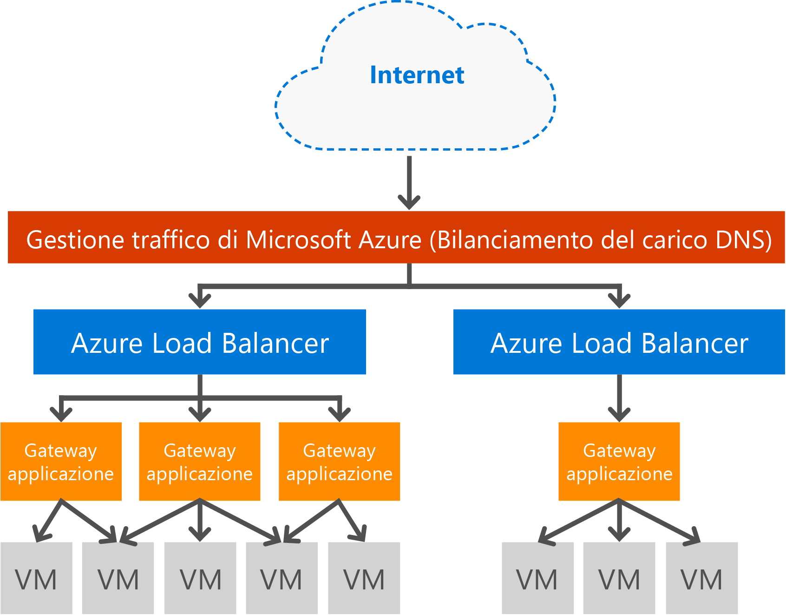

# Panoramica del gateway applicazione

Il gateway applicazione di Microsoft Azure è un'appliance virtuale dedicata che offre un servizio di controller per la distribuzione di applicazioni con varie funzionalità di bilanciamento del carico di livello 7 per l'applicazione. È costituito da più istanze del ruolo di lavoro che ne garantiscono la scalabilità e la disponibilità elevata. Consente ai clienti di ottimizzare la produttività delle Web farm eseguendo l'offload al gateway applicazione della terminazione SSL con utilizzo elevato di CPU. Offre anche altre funzionalità di routing di livello 7, tra cui la distribuzione round robin del traffico in ingresso, l'affinità di sessione basata su cookie, il routing basato su percorso URL e la possibilità di ospitare più siti Web dietro un unico gateway applicazione. Il gateway applicazione può essere configurato come gateway con connessione Internet, come gateway solo interno o come una combinazione di queste due opzioni. È completamente gestito in Azure e offre scalabilità e disponibilità elevata, oltre a un set completo di funzionalità di registrazione e diagnostica che ne migliorano la gestibilità. Quando si crea un gateway applicazione, un endpoint (indirizzo VIP o IP ILB interno) viene associato e usato per il traffico di rete in ingresso. L'indirizzo VIP o IP ILB viene fornito da Azure Load Balancer, che opera a livello di trasporto (TCP/UDP) e garantisce il bilanciamento del carico di tutto il traffico di rete in ingresso nelle istanze del ruolo di lavoro del gateway applicazione. Il gateway applicazione instrada quindi il traffico HTTP/HTTPS in base alla relativa configurazione, sia che si tratti di una macchina virtuale, di un servizio cloud o di un indirizzo IP interno o esterno.

Nello SKU WAF del gateway applicazione è incluso anche un Web application firewall (WAF) che offre alle applicazioni Web la protezione da exploit e vulnerabilità Web comuni. A questo scopo, il Web application firewall usa le regole di [OWASP Core Rule Set](https://www.owasp.org/index.php/Category:OWASP_ModSecurity_Core_Rule_Set_Project) 3.0 o 2.2.9.

## Differenze tra gli SKU del gateway applicazione

Il gateway applicazione è disponibile in due SKU: uno SKU standard e uno SKU WAF (Web application firewall).

### Standard

Lo SKU standard offre terminazione SSL, affinità di sessione basata su cookie, distribuzione del carico round robin, routing basato sul contenuto, possibilità di ospitare più siti Web e miglioramenti della sicurezza. I miglioramenti della sicurezza offerti dal gateway applicazione includono la gestione dei criteri SSL, il supporto SSL end-to-end e la terminazione SSL.

### WAF (Web application firewall)

Lo SKU WAF offre tutte le funzionalità dello SKU standard con l'aggiunta del [Web application firewall](application-gateway-web-application-firewall-overview.md), che fornisce regole di rilevamento degli attacchi che garantiscono la protezione delle applicazioni Web da exploit e vulnerabilità Web comuni.

## Funzionalità

Il gateway applicazione attualmente supporta la distribuzione di applicazioni di livello 7 con le funzionalità seguenti.

* **[Web application firewall](application-gateway-webapplicationfirewall-overview.md)**: il Web application firewall (WAF) del gateway applicazione di Azure protegge le applicazioni Web da attacchi basati sul Web comuni come SQL injection, cross-site scripting e hijack della sessione.
* **Bilanciamento del carico HTTP** : il gateway applicazione fornisce il bilanciamento del carico round robin. Il bilanciamento del carico viene eseguito al livello 7 e viene usato solo per il traffico HTTP(S).
* **Affinità di sessione basata su cookie**: questa funzionalità è utile quando si vuole mantenere una sessione utente nello stesso back-end. Usando i cookie gestiti del gateway, il gateway applicazione può indirizzare il traffico successivo proveniente da una sessione utente allo stesso back-end per l'elaborazione. Questa funzionalità è importante nei casi in cui lo stato della sessione viene salvato in locale sul server back-end per una sessione utente.
* **[Offload SSL (Secure Sockets Layer)](application-gateway-ssl-arm.md)**: questa funzionalità consente di evitare costose attività di decrittografia del traffico HTTPS nei server Web. Terminando la connessione SSL in corrispondenza del gateway applicazione e inoltrando al server la richiesta non crittografata, il server Web non deve gestire la decrittografia.  Il gateway applicazione crittografa nuovamente la risposta prima di restituirla al client. Questa funzionalità è utile negli scenari in cui il back-end si trova nella stessa rete virtuale protetta del gateway applicazione in Azure.
* **[SSL end-to-end](application-gateway-backend-ssl.md)**: il gateway applicazione supporta la crittografia end-to-end del traffico. A tale scopo, il gateway applicazione chiude la connessione SSL nel gateway applicazione. Il gateway quindi applica le regole di routing al traffico, crittografare nuovamente il pacchetto e inoltra il pacchetto al back-end appropriato in base alle regole di routing definite. Eventuali risposte dal server Web subiscono lo stesso processo in ritorno verso l'utente finale.
* **[Routing del contenuto basato su URL](application-gateway-url-route-overview.md)**: questa funzionalità offre la possibilità di usare server back-end diversi per traffico diverso. Il traffico per una cartella nel server Web o per una rete CDN potrebbe essere instradato a un back-end diverso, riducendo il carico non necessario nei back-end che non gestiscono contenuto specifico.
* **[Routing multisito](application-gateway-multi-site-overview.md)**: il gateway applicazione consente di consolidare fino a 20 siti Web in un singolo gateway applicazione.
* **[Supporto di WebSocket](application-gateway-websocket.md)**: un'altra eccellente funzionalità del gateway applicazione è il supporto nativo per WebSocket.
* **[Monitoraggio dell'integrità](application-gateway-probe-overview.md)**: il gateway applicazione offre il monitoraggio predefinito dell'integrità delle risorse back-end e probe personalizzati per il monitoraggio di scenari più specifici.
* **[Diagnostica avanzata](application-gateway-diagnostics.md)**: il gateway applicazione fornisce i log di diagnostica e accesso completi. I registri firewall sono disponibili per le risorse del gateway applicazione con WAF abilitato.

## Vantaggi

Il gateway applicazione è utile per:

* Applicazioni che necessitano delle richieste provenienti dalla stessa sessione utente/client per raggiungere la stessa macchina virtuale back-end, ad esempio applicazioni carrello acquisti e server di posta Web.
* Rimozione del sovraccarico della terminazione SSL per le server farm Web.
* Applicazioni, come la rete per la distribuzione di contenuti, per cui è necessario che più richieste HTTP nella stessa connessione TCP con esecuzione prolungata vengano instradate/bilanciate in server back-end diversi.
* Applicazioni che supportano il traffico WebSocket
* Protezione delle applicazioni Web dai comuni attacchi basati sul Web, come attacchi SQL injection, attacchi di scripting intersito e hijack delle sessioni.

Il bilanciamento del carico del gateway applicazione come servizio gestito da Azure consente il provisioning di un servizio di bilanciamento del carico di livello 7 dietro il servizio di bilanciamento del carico del software di Azure. Gestione traffico può essere usato per completare lo scenario come illustrato nell'immagine seguente, in cui Gestione traffico fornisce il reindirizzamento e la disponibilità del traffico a più risorse del gateway applicazione in aree diverse, mentre il gateway applicazione il fornisce bilanciamento del carico di livello 7 tra le aree. Un esempio di questo scenario è disponibile in [Using load balancing services in the Azure cloud](../traffic-manager/traffic-manager-load-balancing-azure.md) (Uso dei servizi di bilanciamento del carico nel cloud di Azure)

[!INCLUDE [load-balancer-compare-tm-ag-lb-include.md](../../includes/load-balancer-compare-tm-ag-lb-include.md)]

## Istanze e dimensioni del gateway

Il servizio Gateway applicazione è attualmente disponibile in tre dimensioni: **Small**, **Medium** e **Large**. Le dimensioni delle istanze piccole sono destinate a scenari di sviluppo e test.

È possibile creare fino a 50 gateway applicazione per sottoscrizione e ogni gateway applicazione può includere fino a 10 istanze. Ogni gateway applicazione può essere costituito da 20 listener HTTP. Per un elenco completo dei limiti del gateway applicazione, vedere i [limiti del servizio Gateway applicazione](../azure-subscription-service-limits.md?toc=%2fazure%2fapplication-gateway%2ftoc.json#application-gateway-limits).

La tabella seguente illustra una velocità effettiva media delle prestazioni per ogni istanza del gateway applicazione con offload SSL abilitato:

| Risposta della pagina di back-end | Small | Media | Large |
| --- | --- | --- | --- |
| 6K |7,5 Mbps |13 Mbps |50 Mbps |
| 100.000 |35 Mbps |100 Mbps |200 Mbps |

> [!NOTE]
> Questi valori sono indicazioni approssimative della velocità effettiva di un gateway applicazione. La velocità effettiva dipende da vari dettagli ambientali come le dimensioni medie delle pagine, la posizione delle istanze back-end e il tempo di elaborazione per gestire una pagina. Per dati esatti sulle prestazioni, è consigliabile eseguire propri test. Questi valori vengono forniti solo come indicazioni per la pianificazione della capacità.

## Monitoraggio dell’integrità

Il gateway applicazione di Azure monitora automaticamente l'integrità delle istanze back-end tramite probe di integrità di base o personalizzati. L'uso di probe di integrità garantisce che al traffico rispondano solo host integri. Per altre informazioni, vedere [Panoramica del monitoraggio dell'integrità del gateway applicazione](application-gateway-probe-overview.md).

## Configurazione e gestione

Quando viene configurato, il gateway applicazione può usare per l'endpoint un IP pubblico, un IP privato o entrambi. Il gateway applicazione viene configurato in una propria subnet all'interno di una rete virtuale. La subnet creata o usata per il gateway applicazione non può contenere altri tipi di risorse. Le uniche risorse consentite nella subnet sono altri gateway applicazione. Per proteggere le risorse di back-end, i server back-end possono essere contenuti in una subnet diversa nella stessa rete virtuale del gateway applicazione. Questa subnet aggiuntiva non è necessario per le applicazioni back-end, purché il gateway applicazione sia in grado di raggiungere l'indirizzo ip e di fornire funzionalità ADC ai server back-end. 

È possibile creare e gestire un gateway applicazione usando API REST, cmdlet di PowerShell, l'interfaccia della riga di comando di Azure o il [portale di Azure](https://portal.azure.com/). Per altre domande sul gateway applicazione, vedere l'elenco contenuto in [Domande frequenti sul gateway applicazione](application-gateway-faq.md).

## Prezzi

I prezzi sono basati su una tariffa oraria per istanza del gateway e una tariffa di elaborazione dei dati. I prezzi orari del gateway per lo SKU WAF sono diversi dalle tariffe dello SKU standard e sono indicati nella pagina relativa ai [dettagli sui prezzi del gateway applicazione](https://azure.microsoft.com/pricing/details/application-gateway/). Le tariffe di elaborazione dei dati rimangono invariate.

## domande frequenti

Per le domande frequenti sul gateway applicazione, vedere [Domande frequenti sul gateway applicazione](application-gateway-faq.md).
## Passaggi successivi

Dopo aver acquisito familiarità con il gateway applicazione, è possibile [creare un gateway applicazione](application-gateway-create-gateway-portal.md) oppure [configurare un gateway applicazione per l'offload SSL](application-gateway-ssl-arm.md) per bilanciare il carico delle connessioni HTTPS.

Per informazioni su come creare un gateway applicazione usando il routing del contenuto basato su URL, vedere [Creare un gateway applicazione con il routing basato su URL](application-gateway-create-url-route-arm-ps.md) .

