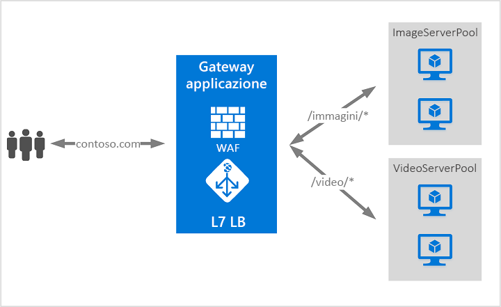

# Cos'è il gateway applicazione di Azure?

Il gateway applicazione di Azure è un servizio di bilanciamento del carico del traffico Web che consente di gestire il traffico verso le applicazioni Web. 

I servizi di bilanciamento del carico tradizionali operano a livello di trasporto (OSI livello 4 - TCP e UDP) ed eseguono il routing del traffico da un indirizzo IP e una porta di origine verso un indirizzo IP e una porta di destinazione. Con il gateway applicazione si può essere ancora più specifici. Ad esempio, è possibile eseguire il rounting del traffico in base all'URL in ingresso. Pertanto, se `/images` è nell'URL in ingresso, è possibile eseguire il rounting del traffico verso un set specifico di server, detto pool, configurato per le immagini. Se `/video` è nell'URL, viene eseguito il rounting di quel traffico verso un altro pool ottimizzato per i video.

Questo tipo di routing è detto bilanciamento del carico a livello di applicazione (OSI livello 7). Il gateway applicazione di Azure può eseguire il routing basato su URL e molto altro. Il gateway applicazione di Azure offre le funzionalità seguenti: 

## Routing basato su URL

Il routing basato su percorso URL consente di instradare il traffico a pool di server back-end in base ai percorsi URL della richiesta. Uno degli scenari è il rounting delle richieste di tipi di contenuto diversi a pool diversi.

Ad esempio, per le richieste `http://contoso.com/video/*` viene eseguito il rounting verso VideoServerPool mentre per le richieste `http://contoso.com/images/*` viene eseguito il rounting verso ImageServerPool. In caso di mancata corrispondenza dei percorsi, viene selezionato DefaultServerPool.

## Reindirizzamento

Uno scenario comune per molte applicazioni Web è il supporto del reindirizzamento automatico da HTTP a HTTPS per assicurare che tutte le comunicazioni tra l'applicazione e gli utenti avvengano tramite un percorso crittografato. 

In passato si usavano usato tecniche come la creazione di un pool dedicato il cui unico scopo è quello di reindirizzare le richieste ricevute su HTTP a HTTPS. Il gateway applicazione consente di reindirizzare il traffico sul gateway applicazione. Questo semplifica la configurazione delle applicazioni, ottimizza l'utilizzo delle risorse e supporta i nuovi scenari di reindirizzamento, tra cui il reindirizzamento globale e basato sul percorso. Il supporto del reindirizzamento nel gateway applicazione non è limitato al solo reindirizzamento da HTTP a HTTPS. Si tratta di un meccanismo di reindirizzamento generico che consente di eseguire il reindirizzamento da e verso qualsiasi porta definita mediante regole. Supporta anche il reindirizzamento a un sito esterno.

Il supporto del reindirizzamento nel gateway applicazione offre le funzionalità seguenti:

- Reindirizzamento globale da una porta a un'altra porta nel gateway. che consente il reindirizzamento da HTTP a HTTPS in un sito.
- Reindirizzamento basato sul percorso. Questo tipo di reindirizzamento consente il reindirizzamento da HTTP a HTTPS solo in un'area specifica del sito, ad esempio l'area del carrello acquisti indicata da `/cart/*`.
- Reindirizzamento a un sito esterno.

## Hosting di più siti

L'hosting di più siti consente di configurare più siti Web nella stessa istanza del gateway applicazione. Questa funzionalità permette di configurare una topologia più efficiente per le distribuzioni aggiungendo fino a 20 siti Web a un unico gateway applicazione. Ogni sito Web può essere indirizzato al proprio pool. Ad esempio, il gateway applicazione può servire il traffico per `contoso.com` e `fabrikam.com` da due pool di server denominati ContosoServerPool e FabrikamServerPool.

Per le richieste `http://contoso.com` viene eseguito il routing verso ContosoServerPool mentre per le richieste `http://fabrikam.com` viene eseguito il routing verso FabrikamServerPool.

Analogamente, la stessa distribuzione del gateway applicazione può ospitare due sottodomini dello stesso dominio padre. Gli esempi di uso di sottodomini possono includere `http://blog.contoso.com` e `http://app.contoso.com` ospitati in una singola distribuzione del gateway applicazione.

## Affinità di sessione

L'affinità di sessione basata su cookie è utile quando si vuole mantenere una sessione utente nello stesso server. Usando cookie gestiti dal gateway, il gateway applicazione può indirizzare il traffico successivo proveniente da una sessione utente allo stesso server per l'elaborazione. Questo è importante nei casi in cui lo stato della sessione viene salvato in locale sul server per una sessione utente.

## Terminazione di Secure Sockets Layer (SSL)

Il gateway applicazione supporta la terminazione SSL nel gateway, dopo la quale il traffico scorre generalmente non crittografato verso i server back-end. Questa funzionalità consente ai server Web di non gestire il costoso carico di crittografia e decrittografia. Tuttavia in alcuni casi le comunicazioni non crittografate verso i server non rappresentano un'opzione accettabile. Questo potrebbe dipendere da requisiti di sicurezza e conformità o da un'applicazione in grado di accettare solo connessioni protette. Per tali applicazioni, il gateway applicazione supporta ora la crittografia SSL end-to-end.

## Web application firewall

Web application firewall (WAF) è una funzionalità del gateway applicazione che offre una protezione centralizzata delle applicazioni Web da exploit e vulnerabilità comuni. WAF si basa su regole di set di regole principali [OWASP (Open Web Application Security Project)](https://www.owasp.org/index.php/Category:OWASP_ModSecurity_Core_Rule_Set_Project) 3.0 o 2.2.9. 

Le applicazioni Web sono sempre più vittime di attacchi che sfruttano le più comuni vulnerabilità note. Per citarne alcuni, tra i più comuni troviamo gli attacchi SQL injection e gli attacchi di scripting intersito. Impedire questo tipo di attacchi nel codice dell'applicazione può essere un'operazione complessa e potrebbe richiedere una manutenzione rigorosa, l'applicazione di patch e il monitoraggio a più livelli della topologia dell'applicazione. Un Web application firewall centralizzato semplifica notevolmente la gestione della sicurezza e offre agli amministratori delle applicazioni migliori garanzie contro le minacce o le intrusioni. Una soluzione WAF è anche in grado di reagire più velocemente a una minaccia alla sicurezza tramite l'applicazione di patch su una vulnerabilità nota in una posizione centrale, anziché proteggere ogni singola applicazione Web. È possibile convertire facilmente i gateway applicazione esistenti in un gateway applicazione con Web application firewall.

## Traffico Websocket e HTTP/2

Il gateway applicazione offre il supporto nativo per i protocolli WebSocket e HTTP/2. Non esistono impostazioni configurabili dall'utente per abilitare o disabilitare in modo selettivo il supporto di WebSocket. Il supporto di HTTP/2 può essere abilitato con Azure PowerShell.
 
I protocolli WebSocket HTTP/2 consentono una comunicazione full duplex tra un server e un client su una connessione TCP con esecuzione prolungata. Questo consente una comunicazione più interattiva tra il server Web e il client che può essere bidirezionale senza necessità di polling che invece è richiesto nelle implementazioni basate su HTTP. A differenza del protocollo HTTP, questi protocolli presentano un sovraccarico ridotto e possono riutilizzare la stessa connessione TCP per più richieste/risposte garantendo così un uso più efficiente delle risorse. Questi protocolli sono progettati per usare le porte HTTP 80 e 443 tradizionali.

## Passaggi successivi

A seconda dei requisiti e dell'ambiente, è possibile creare un'applicazione gateway di test usando il portale di Azure, Azure PowerShell o l'interfaccia della riga di comando di Azure:

- [Avvio rapido: Indirizzare il traffico Web con un gateway applicazione di Azure dal portale di Azure](quick-create-portal.md).
- [Avvio rapido: Indirizzare il traffico Web con un gateway applicazione di Azure da Azure PowerShell](quick-create-powershell.md)
- [Avvio rapido: Indirizzare il traffico Web con un gateway applicazione di Azure dall'interfaccia della riga di comando di Azure](quick-create-cli.md)
