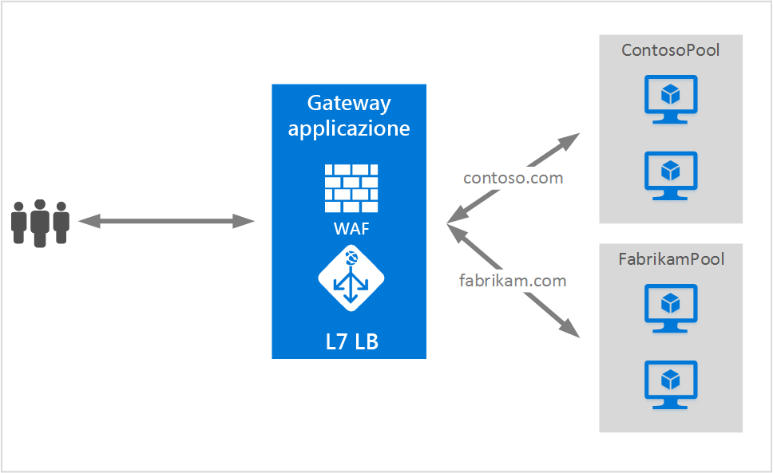

# <a name="application-gateway-multiple-site-hosting"></a>Hosting di più siti in un gateway applicazione

L'hosting di più siti consente di configurare più applicazioni Web nella stessa istanza del gateway applicazione. Questa funzionalità consente di configurare una topologia più efficiente per le distribuzioni aggiungendo fino a 20 siti Web a un unico gateway applicazione. Ogni sito Web può essere indirizzato al proprio pool back-end. Nell'esempio seguente, il gateway applicazione gestisce il traffico per contoso.com e fabrikam.com da due pool di server back-end denominati ContosoServerPool e FabrikamServerPool.



> [!IMPORTANT]
> Le regole vengono elaborate nell'ordine in cui sono elencate nel portale. È consigliabile configurare i listener multisito prima di configurare un listener di base.  In questo modo il traffico viene indirizzato al back-end appropriato. Se un listener di base viene elencato per primo e corrisponde a una richiesta in ingresso, sarà tale listener a elaborarla.

Le richieste per http://contoso.com vengono instradate a ContosoServerPool, mentre quelle per http://fabrikam.com vengono instradate a FabrikamServerPool.

Analogamente, la stessa distribuzione del gateway applicazione può ospitare due sottodomini dello stesso dominio padre. Tra gli esempi dell'uso di sottodomini si possono includere http://blog.contoso.com e http://app.contoso.com ospitati in una singola distribuzione del gateway applicazione.

## <a name="host-headers-and-server-name-indication-sni"></a>Intestazioni host e indicazione nome server (SNI)

Per abilitare l'hosting di più siti nella stessa infrastruttura sono disponibili tre comuni meccanismi.

1. Ospitare più applicazioni Web con un indirizzo IP univoco per ognuna.
2. Usare il nome host per ospitare più applicazioni Web nello stesso indirizzo IP.
3. Usare porte diverse per ospitare più applicazioni Web nello stesso indirizzo IP.

Un gateway applicazione ottiene attualmente un singolo indirizzo IP pubblico su cui rimane in ascolto del traffico. Di conseguenza, non è attualmente possibile supportare più applicazioni ognuna con il proprio indirizzo IP. Il gateway applicazione supporta l'hosting di più applicazioni ognuna in ascolto su porte diverse, ma in questo scenario le applicazioni dovrebbero accettare traffico su porte non standard e questa non è in genere una configurazione desiderata. Il gateway applicazione si basa su intestazioni host HTTP 1.1 per ospitare più siti Web nello stesso indirizzo IP pubblico e nella stessa porta. I siti ospitati nel gateway applicazione possono supportare anche l'offload SSL con l'estensione TLS dell'indicazione nome server (SNI). In questo scenario il browser client e la Web farm back-end devono quindi supportare HTTP/1.1 e l'estensione TLS definita nella specifica RFC 6066.

## <a name="listener-configuration-element"></a>Elemento di configurazione del listener

L'elemento di configurazione HTTPListener esistente è stato migliorato per supportare gli elementi del nome host e dell'indicazione nome server usati dal gateway applicazione per instradare il traffico al pool back-end appropriato. L'esempio di codice seguente è il frammento dell'elemento HttpListeners del file modello.

```json
"httpListeners": [
    {
        "name": "appGatewayHttpsListener1",
        "properties": {
            "FrontendIPConfiguration": {
                "Id": "/subscriptions/<subid>/resourceGroups/<rgName>/providers/Microsoft.Network/applicationGateways/applicationGateway1/frontendIPConfigurations/DefaultFrontendPublicIP"
            },
            "FrontendPort": {
                "Id": "/subscriptions/<subid>/resourceGroups/<rgName>/providers/Microsoft.Network/applicationGateways/applicationGateway1/frontendPorts/appGatewayFrontendPort443'"
            },
            "Protocol": "Https",
            "SslCertificate": {
                "Id": "/subscriptions/<subid>/resourceGroups/<rgName>/providers/Microsoft.Network/applicationGateways/applicationGateway1/sslCertificates/appGatewaySslCert1'"
            },
            "HostName": "contoso.com",
            "RequireServerNameIndication": "true"
        }
    },
    {
        "name": "appGatewayHttpListener2",
        "properties": {
            "FrontendIPConfiguration": {
                "Id": "/subscriptions/<subid>/resourceGroups/<rgName>/providers/Microsoft.Network/applicationGateways/applicationGateway1/frontendIPConfigurations/appGatewayFrontendIP'"
            },
            "FrontendPort": {
                "Id": "/subscriptions/<subid>/resourceGroups/<rgName>/providers/Microsoft.Network/applicationGateways/applicationGateway1/frontendPorts/appGatewayFrontendPort80'"
            },
            "Protocol": "Http",
            "HostName": "fabrikam.com",
            "RequireServerNameIndication": "false"
        }
    }
],
```

Per una distribuzione basata su modello end-to-end, vedere il [modello di Resource Manager con hosting di più siti](https://github.com/Azure/azure-quickstart-templates/blob/master/201-application-gateway-multihosting).

## <a name="routing-rule"></a>Regola di routing

Nella regola di routing non è necessaria alcuna modifica. È ancora necessario scegliere la regola di routing "Basic" per collegare il listener del sito appropriato al pool di indirizzi back-end corrispondente.

```json
"requestRoutingRules": [
{
    "name": "<ruleName1>",
    "properties": {
        "RuleType": "Basic",
        "httpListener": {
            "id": "/subscriptions/<subid>/resourceGroups/<rgName>/providers/Microsoft.Network/applicationGateways/applicationGateway1/httpListeners/appGatewayHttpsListener1')]"
        },
        "backendAddressPool": {
            "id": "/subscriptions/<subid>/resourceGroups/<rgName>/providers/Microsoft.Network/applicationGateways/applicationGateway1/backendAddressPools/ContosoServerPool')]"
        },
        "backendHttpSettings": {
            "id": "/subscriptions/<subid>/resourceGroups/<rgName>/providers/Microsoft.Network/applicationGateways/applicationGateway1/backendHttpSettingsCollection/appGatewayBackendHttpSettings')]"
        }
    }

},
{
    "name": "<ruleName2>",
    "properties": {
        "RuleType": "Basic",
        "httpListener": {
            "id": "/subscriptions/<subid>/resourceGroups/<rgName>/providers/Microsoft.Network/applicationGateways/applicationGateway1/httpListeners/appGatewayHttpListener2')]"
        },
        "backendAddressPool": {
            "id": "/subscriptions/<subid>/resourceGroups/<rgName>/providers/Microsoft.Network/applicationGateways/applicationGateway1/backendAddressPools/FabrikamServerPool')]"
        },
        "backendHttpSettings": {
            "id": "/subscriptions/<subid>/resourceGroups/<rgName>/providers/Microsoft.Network/applicationGateways/applicationGateway1/backendHttpSettingsCollection/appGatewayBackendHttpSettings')]"
        }
    }

}
]
```

## <a name="next-steps"></a>Passaggi successivi

Dopo aver acquisito familiarità con l'hosting di più siti, vedere [Creare un gateway applicazione per l'hosting di più applicazioni Web](application-gateway-create-multisite-azureresourcemanager-powershell.md) per creare un gateway applicazione con supporto di più applicazioni Web.


