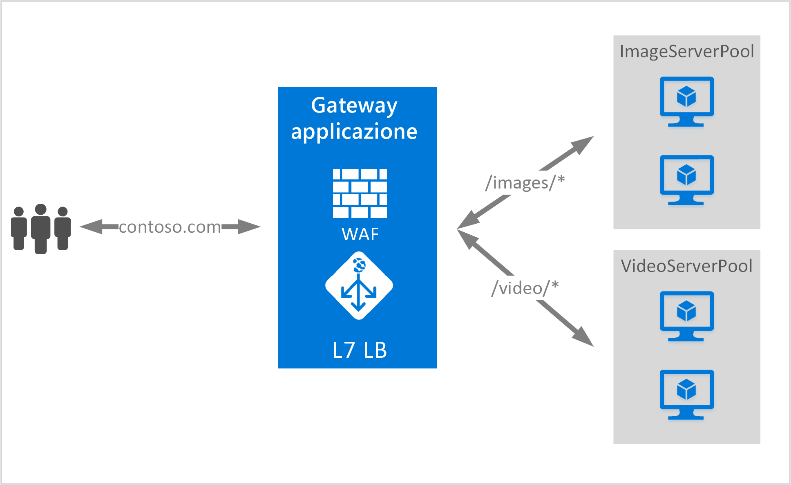

# <a name="url-path-based-routing-overview"></a>Panoramica del routing basato su percorso URL

Il routing basato su percorso URL consente di instradare il traffico a pool di server back-end in base ai percorsi URL della richiesta. 

Uno degli scenari è l'instradamento delle richieste di tipi di contenuto diversi a pool di server back-end diversi.

Nell'esempio seguente, il gateway applicazione soddisfa le richieste di traffico per contoso.com dai tre pool di server back-end, ad esempio VideoServerPool, ImageServerPool e DefaultServerPool.



Le richieste per http://contoso.com/video* vengono instradate a VideoServerPool, mentre quelle per http://contoso.com/images* vengono instradate a ImageServerPool. In caso di mancata corrispondenza dei percorsi, viene selezionato DefaultServerPool.

> [!IMPORTANT]
> Le regole vengono elaborate nell'ordine in cui sono elencate nel portale. È consigliabile configurare i listener multisito prima di configurare un listener di base.  In questo modo il traffico viene indirizzato al back-end appropriato. Se un listener di base viene elencato per primo e corrisponde a una richiesta in ingresso, sarà tale listener a elaborarla.

## <a name="urlpathmap-configuration-element"></a>Elemento di configurazione UrlPathMap

L'elemento UrlPathMap consente di specificare modelli di percorso dei mapping dei pool di server back-end. L'esempio di codice seguente è il frammento dell'elemento urlPathMap del file modello.

```json
"urlPathMaps": [{
    "name": "{urlpathMapName}",
    "id": "/subscriptions/{subscriptionId}/../microsoft.network/applicationGateways/{gatewayName}/urlPathMaps/{urlpathMapName}",
    "properties": {
        "defaultBackendAddressPool": {
            "id": "/subscriptions/    {subscriptionId}/../microsoft.network/applicationGateways/{gatewayName}/backendAddressPools/{poolName1}"
        },
        "defaultBackendHttpSettings": {
            "id": "/subscriptions/{subscriptionId}/../microsoft.network/applicationGateways/{gatewayName}/backendHttpSettingsList/{settingname1}"
        },
        "pathRules": [{
            "name": "{pathRuleName}",
            "properties": {
                "paths": [
                    "{pathPattern}"
                ],
                "backendAddressPool": {
                    "id": "/subscriptions/{subscriptionId}/../microsoft.network/applicationGateways/{gatewayName}/backendAddressPools/{poolName2}"
                },
                "backendHttpsettings": {
                    "id": "/subscriptions/{subscriptionId}/../microsoft.network/applicationGateways/{gatewayName}/backendHttpsettingsList/{settingName2}"
                }
            }
        }]
    }
}]
```

> [!NOTE]
> PathPattern: questa impostazione è un elenco dei modelli di percorso usati per la corrispondenza. Ognuno deve iniziare con una barra / e l'unica posizione in cui è consentito il carattere "*" è alla fine dopo "/". La stringa inviata al selettore di percorsi non include alcun testo dopo il primo carattere "?" o "#" e questi caratteri non sono consentiti qui.

Per altre informazioni, vedere un [modello di Azure Resource Manager che usa il routing basato su URL](https://azure.microsoft.com/documentation/templates/201-application-gateway-url-path-based-routing) .

## <a name="pathbasedrouting-rule"></a>Regola PathBasedRouting

RequestRoutingRule di tipo PathBasedRouting consente di associare un listener a un urlPathMap. Tutte le richieste ricevute per il listener vengono instradate in base ai criteri specificati in urlPathMap.
Frammento della regola PathBasedRouting:

```json
"requestRoutingRules": [
    {

"name": "{ruleName}",
"id": "/subscriptions/{subscriptionId}/../microsoft.network/applicationGateways/{gatewayName}/requestRoutingRules/{ruleName}",
"properties": {
    "ruleType": "PathBasedRouting",
    "httpListener": {
        "id": "/subscriptions/{subscriptionId}/../microsoft.network/applicationGateways/{gatewayName}/httpListeners/<listenerName>"
    },
    "urlPathMap": {
        "id": "/subscriptions/{subscriptionId}/../microsoft.network/applicationGateways/{gatewayName}/ urlPathMaps/{urlpathMapName}"
    },

}
    }
]
```

## <a name="next-steps"></a>Passaggi successivi

Dopo aver acquisito familiarità con il routing di contenuti basato su URL, passare a [Create a Path-based rule for an application gateway by using the portal](application-gateway-create-url-route-portal.md) (Creare una regola basata sul percorso per un gateway applicazione usando il portale) per la creazione di un gateway applicazione con regole di routing basate su URL.

