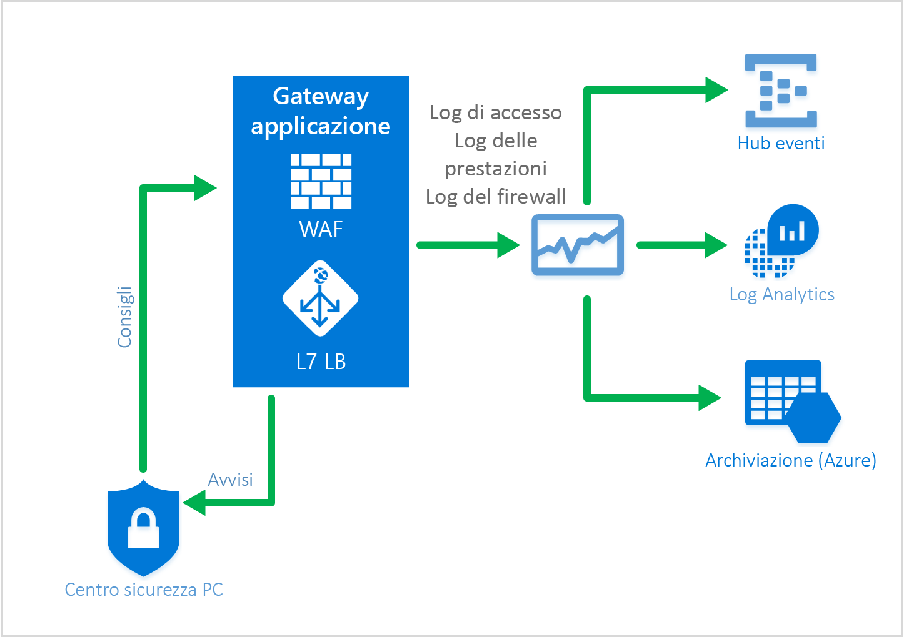

# <a name="web-application-firewall-waf"></a>Web application firewall (WAF)

Web application firewall (WAF) è una funzionalità del gateway applicazione che offre una protezione centralizzata delle applicazioni Web da exploit e vulnerabilità comuni. 

Il Web application firewall si basa sulle regole di [OWASP Core Rule Set](https://www.owasp.org/index.php/Category:OWASP_ModSecurity_Core_Rule_Set_Project) 3.0 o 2.2.9. Le applicazioni Web sono sempre più vittime di attacchi che sfruttano le più comuni vulnerabilità note. Per citarne alcuni, tra i più comuni troviamo gli attacchi SQL injection e gli attacchi di scripting intersito. Impedire questo tipo di attacchi nel codice dell'applicazione può risultare un'operazione complessa e potrebbe richiedere una manutenzione rigorosa, l'applicazione di patch e il monitoraggio a più livelli della topologia dell'applicazione. Un Web application firewall centralizzato semplifica notevolmente la gestione della sicurezza e offre agli amministratori delle applicazioni migliori garanzie contro le minacce o le intrusioni. Una soluzione WAF è anche in grado di reagire più velocemente a una minaccia alla sicurezza tramite l'applicazione di patch su una vulnerabilità nota in una posizione centrale, anziché proteggere ogni singola applicazione Web. È possibile convertire facilmente i gateway applicazione esistenti in un gateway applicazione con Web application firewall.


Il gateway applicazione funziona come controller per la distribuzione di applicazioni che offre terminazione SSL, affinità di sessione basate su cookie, distribuzione del carico round robin, routing basato sui contenuti, possibilità di ospitare più siti Web e miglioramenti alla sicurezza. I miglioramenti della sicurezza offerti dal gateway applicazione includono la gestione dei criteri di SSL e il supporto di SSL end-to-end. La sicurezza delle applicazioni è ora potenziata dall'integrazione diretta di Web application firewall nell'offerta ADC. In questo modo è facile configurare una posizione centrale per gestire e proteggere le applicazioni Web dalle vulnerabilità Web più comuni.

## <a name="benefits"></a>Vantaggi

Di seguito sono indicati i vantaggi principali del gateway applicazione e del Web application firewall:

### <a name="protection"></a>Protezione

* Protezione dell'applicazione Web dalle vulnerabilità e dagli attacchi del Web, senza alcuna modifica al codice di back-end.

* Protezione contemporanea di più applicazioni Web con un gateway applicazione. Il gateway applicazione supporta l'hosting di un massimo di 20 siti Web su un singolo gateway. Tutti questi siti possono essere protetti dagli attacchi Web con Web application firewall.

### <a name="monitoring"></a>Monitoraggio

* Monitorare l'applicazione Web contro gli attacchi tramite un log di Web application firewall in tempo reale. Questo log è integrato in [Monitoraggio di Azure](../monitoring-and-diagnostics/monitoring-overview.md) per tenere traccia degli avvisi e dei log di Web application firewall e monitorare facilmente le tendenze.

* Web application firewall sarà presto integrato con il Centro sicurezza di Azure. Il Centro sicurezza di Azure offre una visualizzazione centralizzata dello stato di sicurezza di tutte le risorse di Azure.

### <a name="customization"></a>Personalizzazione

* Possibilità di personalizzare le regole di Web application firewall e i gruppi di regole per soddisfare i requisiti dell'applicazione ed eliminare i falsi positivi.

## <a name="features"></a>Funzionalità

Web application firewall è preconfigurato con CRS 3.0 per impostazione predefinita, ma è possibile scegliere di usare la versione 2.2.9. CRS 3.0 offre meno falsi positivi rispetto alla versione 2.2.9. È possibile [personalizzare le regole in base alle esigenze](application-gateway-customize-waf-rules-portal.md). Le vulnerabilità Web per le quali Web application firewall offre protezione includono:

* Protezione dagli attacchi SQL injection
* Protezione dagli attacchi di scripting intersito
* Protezione dai comuni attacchi Web, ad esempio attacchi di iniezione di comandi, richieste HTTP non valide, attacchi HTTP Response Splitting e Remote File Inclusion
* Protezione dalle violazioni del protocollo HTTP
* Protezione contro eventuali anomalie del protocollo HTTP, ad esempio user agent host mancante e accept header
* Prevenzione contro robot, crawler e scanner
* Rilevamento di errori di configurazione comuni dell'applicazione (ad esempio, Apache, IIS e così via)

Per un elenco dettagliato delle regole e delle relative funzionalità di protezione, vedere i [set di regole principali](#core-rule-sets) seguenti.

### <a name="core-rule-sets"></a>Set di regole principali

Il gateway applicazione supporta due set di regole, ovvero CRS 3.0 e CRS 2.2.9. Questi set di regole principali sono raccolte di regole che proteggono le applicazioni Web da attività dannose.

#### <a name="owasp30"></a>OWASP_3.0

Il set di regole principali 3.0 fornito offre 13 gruppi di regole come illustrato nella tabella seguente. Ognuno di questi gruppi di regole contiene più regole che possono essere disabilitate.

|RuleGroup|Descrizione|
|---|---|
|**[REQUEST-910-IP-REPUTATION](application-gateway-crs-rulegroups-rules.md#crs910)**|Contiene le regole per la protezione da spammer noti o attività dannose.|
|**[REQUEST-911-METHOD-ENFORCEMENT](application-gateway-crs-rulegroups-rules.md#crs911)**|Contiene le regole per bloccare i metodi (PUT, PATCH< e così via)|
|**[REQUEST-912-DOS-PROTECTION](application-gateway-crs-rulegroups-rules.md#crs912)**| Contiene le regole per la protezione da attacchi di tipo Denial of Service (DoS).|
|**[REQUEST-913-SCANNER-DETECTION](application-gateway-crs-rulegroups-rules.md#crs913)**| Contiene le regole per la protezione da scanner di ambienti e porte.|
|**[REQUEST-920-PROTOCOL-ENFORCEMENT](application-gateway-crs-rulegroups-rules.md#crs920)**|Contiene le regole per la protezione da problemi di protocollo e codifica.|
|**[REQUEST-921-PROTOCOL-ATTACK](application-gateway-crs-rulegroups-rules.md#crs921)**|Contiene le regole per la protezione da header injection, request smuggling e response splitting|
|**[REQUEST-930-APPLICATION-ATTACK-LFI](application-gateway-crs-rulegroups-rules.md#crs930)**|Contiene le regole per la protezione da attacchi in file e percorsi.|
|**[REQUEST-931-APPLICATION-ATTACK-RFI](application-gateway-crs-rulegroups-rules.md#crs931)**|Contiene le regole per la protezione da Remote File Inclusion (RFI)|
|**[REQUEST-932-APPLICATION-ATTACK-RCE](application-gateway-crs-rulegroups-rules.md#crs932)**|Contiene le regole per la protezione da Remote Code Execution.|
|**[REQUEST-933-APPLICATION-ATTACK-PHP](application-gateway-crs-rulegroups-rules.md#crs933)**|Contiene le regole per la protezione da attacchi PHP injection.|
|**[REQUEST-941-APPLICATION-ATTACK-XSS](application-gateway-crs-rulegroups-rules.md#crs941)**|Contiene le regole per la protezione da cross site scripting.|
|**[REQUEST-942-APPLICATION-ATTACK-SQLI](application-gateway-crs-rulegroups-rules.md#crs942)**|Contiene le regole per la protezione da attacchi SQL injection.|
|**[REQUEST-943-APPLICATION-ATTACK-SESSION-FIXATION](application-gateway-crs-rulegroups-rules.md#crs943)**|Contiene le regole per la protezione da attacchi Session Fixation.|

#### <a name="owasp229"></a>OWASP_2.2.9

Il set di regole principali 2.2.9 fornito offre 10 gruppi di regole come illustrato nella tabella seguente. Ognuno di questi gruppi di regole contiene più regole che possono essere disabilitate.

|RuleGroup|Descrizione|
|---|---|
|**[crs_20_protocol_violations](application-gateway-crs-rulegroups-rules.md#crs20)**|Contiene le regole per la protezione da violazioni del protocollo, ovvero caratteri non validi, GET con un corpo di richiesta e così via.|
|**[crs_21_protocol_anomalies](application-gateway-crs-rulegroups-rules.md#crs21)**|Contiene le regole per la protezione da informazioni di intestazione errate.|
|**[crs_23_request_limits](application-gateway-crs-rulegroups-rules.md#crs23)**|Contiene le regole per la protezione da argomenti o file che superano i limiti.|
|**[crs_30_http_policy](application-gateway-crs-rulegroups-rules.md#crs30)**|Contiene le regole per la protezione da metodi, intestazioni e tipi di file con restrizioni. |
|**[crs_35_bad_robots](application-gateway-crs-rulegroups-rules.md#crs35)**|Contiene le regole per la protezione da agenti di ricerca Web e scanner.|
|**[crs_40_generic_attacks](application-gateway-crs-rulegroups-rules.md#crs40)**|Contiene le regole per la protezione da attacchi generici, ovvero Session Fixation, Remote File Inclusion, PHP injection e così via.|
|**[crs_41_sql_injection_attacks](application-gateway-crs-rulegroups-rules.md#crs41sql)**|Contiene le regole per la protezione da attacchi SQL injection|
|**[crs_41_xss_attacks](application-gateway-crs-rulegroups-rules.md#crs41xss)**|Contiene le regole per la protezione da cross site scripting.|
|**[crs_42_tight_security](application-gateway-crs-rulegroups-rules.md#crs42)**|Contiene una regola per la protezione da attacchi Path Traversal|
|**[crs_45_trojans](application-gateway-crs-rulegroups-rules.md#crs45)**|Contiene regole per la protezione da backdoor trojan.|

### <a name="waf-modes"></a>Modalità del WAF

Il WAF del gateway applicazione può essere configurato per l'esecuzione nelle due modalità seguenti:

* **Modalità di rilevamento**: quando configurato per l'esecuzione in modalità di rilevamento, il WAF del gateway applicazione monitora e registra tutti gli avvisi sulle minacce in un file di log. È necessario abilitare la registrazione diagnostica per il gateway applicazione usando la sezione **Diagnostica**. Verificare anche che il log del WAF sia selezionato e attivato. Quando viene eseguito in modalità di rilevamento, Web application firewall non blocca le richieste in ingresso.
* **Modalità di prevenzione** : quando configurato per l'esecuzione in modalità di prevenzione, il gateway applicazione blocca attivamente le intrusioni e gli attacchi rilevati tramite le regole. L'autore dell'attacco riceve un'eccezione di accesso non autorizzato 403 e la connessione viene terminata. La modalità di prevenzione continua a registrare gli attacchi nei registri del WAF.

### <a name="application-gateway-waf-reports"></a>Monitoraggio WAF

Il monitoraggio dello stato del gateway applicazione è un'attività importante. Il monitoraggio dell'integrità di Web application firewall e delle applicazioni protette è reso possibile dalla registrazione e dall'integrazione con Monitoraggio di Azure, il Centro sicurezza di Azure (presto disponibile) e Log Analytics.



#### <a name="azure-monitor"></a>Monitoraggio di Azure

Ogni log del gateway applicazione è integrato con [Monitoraggio di Azure](../monitoring-and-diagnostics/monitoring-overview.md).  Ciò consente di tenere traccia delle informazioni diagnostiche, inclusi i registri e gli avvisi del Web application firewall.  Questa funzionalità viene fornita all'interno della risorsa del gateway applicazione nella scheda **Diagnostica** del portale o direttamente tramite il servizio Monitoraggio di Azure. Per altre informazioni sull'abilitazione dei log di diagnostica per il gateway applicazione, vedere la [diagnostica per il gateway applicazione](application-gateway-diagnostics.md)

#### <a name="azure-security-center"></a>Centro sicurezza di Azure

Il [Centro sicurezza di Azure](../security-center/security-center-intro.md) consente di prevenire, rilevare e rispondere alle minacce con un livello di visibilità e controllo più elevato della sicurezza delle risorse di Azure. Il gateway applicazione è ora [integrato nel Centro sicurezza di Azure](application-gateway-integration-security-center.md). Il Centro sicurezza di Azure analizza l'ambiente per rilevare eventuali applicazioni Web non protette ed è ora in grado di consigliare il WAF del gateway applicazione per proteggere le risorse vulnerabili. È possibile creare il WAF del gateway applicazione direttamente dal Centro sicurezza di Azure.  Queste istanze WAF sono integrate nel Centro sicurezza di Azure, a cui inviano avvisi e informazioni sull'integrità per consentire la creazione di report.


#### <a name="logging"></a>Registrazione

Il WAF del gateway applicazione fornisce rapporti dettagliati su ogni minaccia rilevata. La registrazione è integrata con i log di diagnostica di Azure e gli avvisi vengono registrati in formato JSON. Questi log possono essere integrati con [Log Analytics](../log-analytics/log-analytics-azure-networking-analytics.md).


```json
{
  "resourceId": "/SUBSCRIPTIONS/{subscriptionId}/RESOURCEGROUPS/{resourceGroupId}/PROVIDERS/MICROSOFT.NETWORK/APPLICATIONGATEWAYS/{appGatewayName}",
  "operationName": "ApplicationGatewayFirewall",
  "time": "2017-03-20T15:52:09.1494499Z",
  "category": "ApplicationGatewayFirewallLog",
  "properties": {
    "instanceId": "ApplicationGatewayRole_IN_0",
    "clientIp": "104.210.252.3",
    "clientPort": "4835",
    "requestUri": "/?a=%3Cscript%3Ealert(%22Hello%22);%3C/script%3E",
    "ruleSetType": "OWASP",
    "ruleSetVersion": "3.0",
    "ruleId": "941320",
    "message": "Possible XSS Attack Detected - HTML Tag Handler",
    "action": "Blocked",
    "site": "Global",
    "details": {
      "message": "Warning. Pattern match \"<(a|abbr|acronym|address|applet|area|audioscope|b|base|basefront|bdo|bgsound|big|blackface|blink|blockquote|body|bq|br|button|caption|center|cite|code|col|colgroup|comment|dd|del|dfn|dir|div|dl|dt|em|embed|fieldset|fn|font|form|frame|frameset|h1|head|h ...\" at ARGS:a.",
      "data": "Matched Data: <script> found within ARGS:a: <script>alert(\\x22hello\\x22);</script>",
      "file": "rules/REQUEST-941-APPLICATION-ATTACK-XSS.conf",
      "line": "865"
    }
  }
} 

```

## <a name="application-gateway-waf-sku-pricing"></a>Prezzi dello SKU WAF del gateway applicazione

Web application firewall è disponibile in un nuovo SKU del WAF. Questo SKU è disponibile solo nel modello di provisioning di Azure Resource Manager e non nel modello di distribuzione classica. Lo SKU del WAF è disponibile solo in istanze del gateway applicazione di medie e grandi dimensioni. Tutti i limiti relativi al gateway applicazione si applicano anche allo SKU de WAF. I prezzi sono basati su una tariffa oraria per istanza del gateway e una tariffa di elaborazione dei dati. I prezzi orari del gateway per lo SKU del WAF sono diversi dalle tariffe dello SKU standard e sono indicati nella pagina relativa ai [dettagli sui prezzi del gateway applicazione](https://azure.microsoft.com/pricing/details/application-gateway/). Le tariffe di elaborazione dei dati rimangono invariate. Non sono presenti tariffe per regola o gruppo di regole. È possibile proteggere più applicazioni Web dietro lo stesso Web application firewall e non vengono applicati costi aggiuntivi per il supporto di più applicazioni. 

La fatturazione per WAF entrerà in vigore il 5/5/2017, fino ad allora verranno applicate le tariffe standard per lo SKU del WAF.

## <a name="next-steps"></a>Passaggi successivi

Dopo aver appreso altre informazioni sulle funzionalità di WAF, vedere [Come configurare Web application firewall nel gateway applicazione](application-gateway-web-application-firewall-portal.md).


