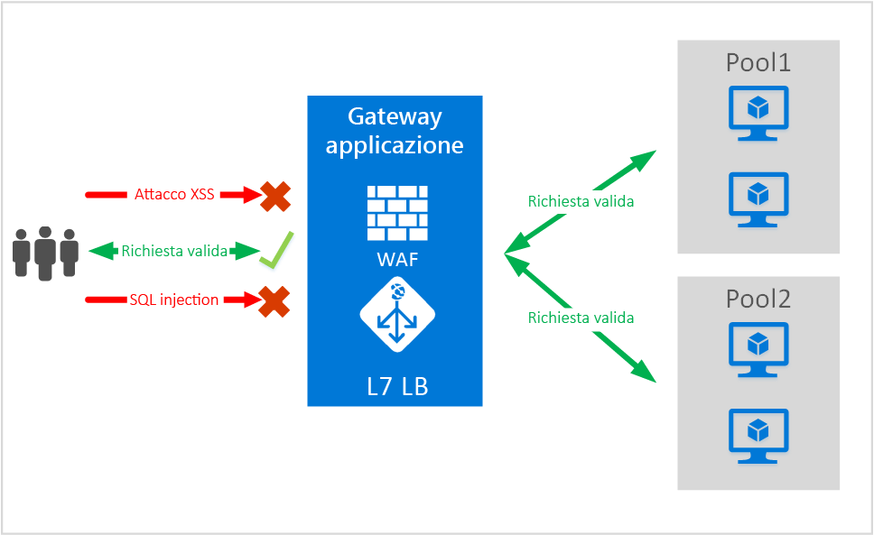
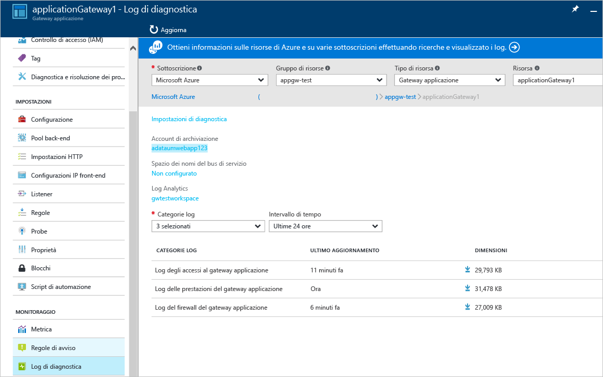

# Firewall applicazione Web del gateway applicazione (anteprima)
Le applicazioni Web sono sempre più vittime di attacchi che sfruttano le più comuni vulnerabilità note. Per citarne alcuni, tra i più comuni troviamo gli attacchi SQL injection e gli attacchi di scripting intersito.
Impedire questo tipo di attacchi nel codice dell'applicazione può risultare un'operazione complessa e potrebbe richiedere una manutenzione rigorosa, l'applicazione di patch e il monitoraggio a più livelli della topologia dell'applicazione. La protezione centralizzata dagli attacchi Web rende molto più semplice la gestione della sicurezza e offre all'applicazione migliori garanzie contro le minacce di intrusioni. Una soluzione WAF è anche in grado di reagire più velocemente a una minaccia alla sicurezza tramite l'applicazione di patch su una vulnerabilità nota che si trova in una posizione centrale e mette in sicurezza ogni singola applicazione Web.

Il gateway applicazione funziona come un application delivery controller che offre terminazione SSL, affinità di sessione basate su cookie, distribuzione del carico round robin, routing basato sui contenuti, possibilità di ospitare più siti Web e miglioramenti alla sicurezza. I miglioramenti della sicurezza offerti dal gateway applicazione includono la gestione dei criteri di SSL e il supporto di SSL end-to-end. Introducendo il WAF (firewall applicazione Web) integrato direttamente nell'offerta ADC, stiamo rinforzando le funzionalità di sicurezza dell'applicazione. In questo modo è facile configurare una posizione centrale per gestire e proteggere le applicazioni Web dalle vulnerabilità Web più comuni.

La configurazione del WAF nel gateway applicazione offre i vantaggi seguenti:

* Protezione dell'applicazione Web dalle vulnerabilità e dagli attacchi del Web, senza alcuna modifica al codice di back-end.
* Protezione contemporanea di più applicazioni Web con un gateway applicazione. Il gateway applicazione può ospitare e proteggere dagli attacchi Web fino a 20 siti Web su un singolo gateway.
* Monitoraggio dell'applicazione Web contro gli attacchi tramite report in tempo reale generati dai log del WAF del gateway applicazione.
* Alcuni controlli di conformità richiedono che tutti gli endpoint comunicanti con Internet siano protetti da una soluzione WAF. Grazie al gateway applicazione con WAF abilitato è possibile soddisfare questi requisiti di conformità.

## Overview
Il WAF del gateway applicazione è disponibile in un nuovo SKU (SKU WAF) e preconfigurato con ModSecurity e OWASP Core Rule Set per offrire protezione di base dalle 10 più comuni vulnerabilità OWASP del Web.

* Protezione dagli attacchi SQL injection
* Protezione dagli attacchi di scripting intersito
* Protezione dai comuni attacchi Web, ad esempio attacchi di iniezione di comandi, richieste HTTP non valide, attacchi HTTP Response Splitting e Remote File Inclusion
* Protezione dalle violazioni del protocollo HTTP
* Protezione contro eventuali anomalie del protocollo HTTP, ad esempio user agent host mancante e accept header
* Protezione da DoS HTTP, tra cui prevenzione di HTTP Flood e Slow HTTP DoS
* Prevenzione contro robot, crawler e scanner
* Rilevamento di comuni errori di configurazione dell'applicazione (ad esempio Apache, IIS e così via)

## Modalità del WAF
Il WAF del gateway applicazione può essere configurato per l'esecuzione nelle due modalità seguenti:

* **Modalità di rilevamento** : quando configurato per l'esecuzione in modalità di rilevamento, il WAF del gateway applicazione monitora e registra tutti gli avvisi sulle minacce in un file di log. È necessario verificare che la registrazione diagnostica per il gateway applicazione venga attivata dalla sezione Diagnostica. Verificare anche che il log del WAF sia selezionato e attivato.
* **Modalità di prevenzione** : quando configurato per l'esecuzione in modalità di prevenzione, il gateway applicazione blocca attivamente le intrusioni e gli attacchi rilevati tramite le regole. L'autore dell'attacco riceve un'eccezione di accesso non autorizzato 403 e la connessione viene terminata. La modalità di prevenzione continua a registrare gli attacchi nei registri del WAF.

## Report del WAF del gateway applicazione
Il WAF del gateway applicazione fornisce rapporti dettagliati su ogni minaccia rilevata. La registrazione è integrata con i log di diagnostica di Azure e gli avvisi vengono registrati in formato json.

    {
        "resourceId": "/SUBSCRIPTIONS/<subscriptionId>/RESOURCEGROUPS/<resourceGroupName>/PROVIDERS/MICROSOFT.NETWORK/APPLICATIONGATEWAYS/<applicationGatewayName>",
        "operationName": "ApplicationGatewayFirewall",
        "time": "2016-09-20T00:40:04.9138513Z",
        "category": "ApplicationGatewayFirewallLog",
        "properties":     {
            "instanceId":"ApplicationGatewayRole_IN_0",
            "clientIp":"108.41.16.164",
            "clientPort":1815,
            "requestUri":"/wavsep/active/RXSS-Detection-Evaluation-POST/",
            "ruleId":"OWASP_973336",
            "message":"XSS Filter - Category 1: Script Tag Vector",
            "action":"Logged",
            "site":"Global",
            "message":"XSS Filter - Category 1: Script Tag Vector",
            "details":{"message":" Warning. Pattern match "(?i)(<script","file":"/owasp_crs/base_rules/modsecurity_crs_41_xss_attacks.conf","line":"14"}}
    }

## Prezzi dello SKU WAF del gateway applicazione
Durante l'anteprima, non sono previsti costi aggiuntivi per l'uso del WAF del gateway applicazione. L'utente riceverà l'addebito per le tariffe dello SKU Basic esistenti. Gli addebiti per lo SKU del WAF verranno comunicati in fase di distribuzione a livello globale. I clienti che hanno scelto di distribuire il gateway applicazione nello SKU WAF inizieranno a ricevere il relativo addebito dei costi solo dopo l'annuncio di distribuzione a livello globale.

## Passaggi successivi
Dopo aver appreso maggiori informazioni sulle funzionalità del firewall applicazione Web, visitare [How to configure Web Application Firewall on Application Gateway](application-gateway-web-application-firewall-portal.md)(Come configurare il firewall applicazione Web sul gateway applicazione).

<!--HONumber=Oct16_HO2-->

