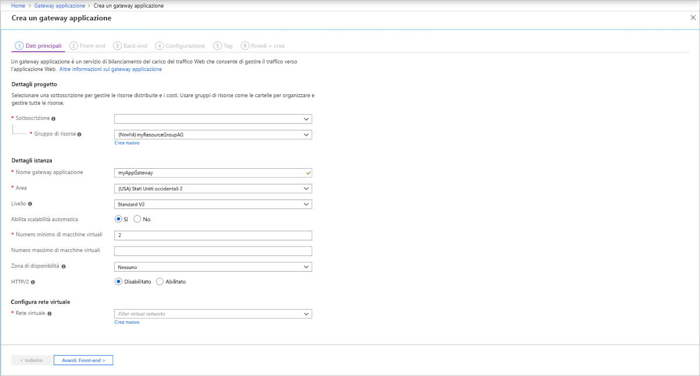
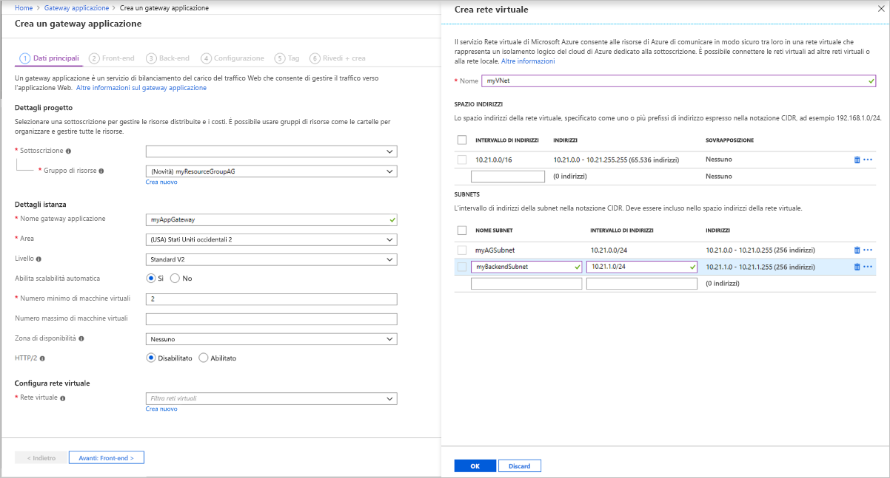
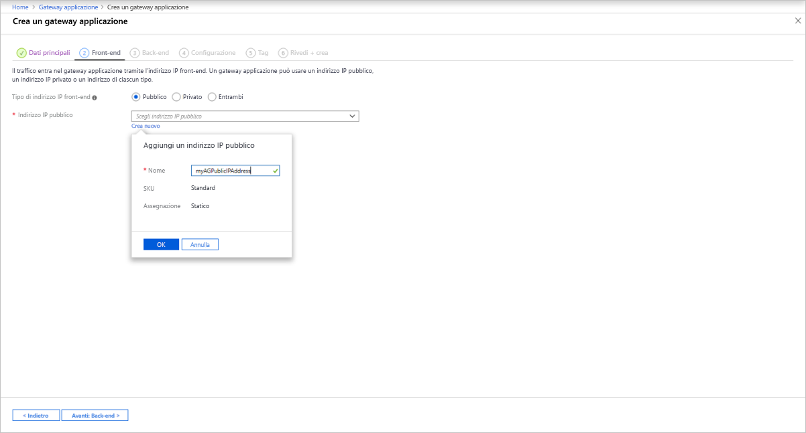
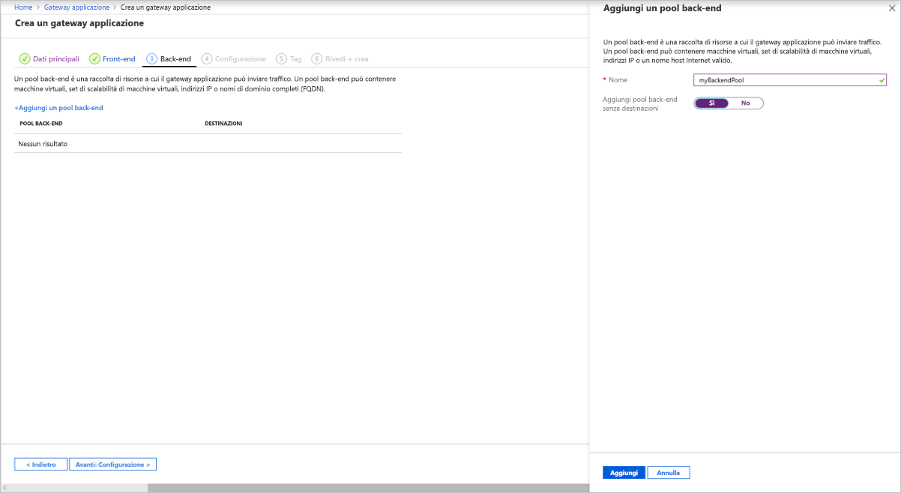
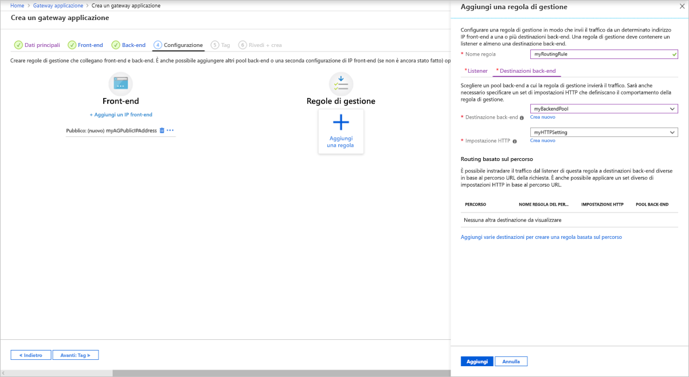

# <a name="tutorial-configure-an-application-gateway-with-ssl-termination-using-the-azure-portal"></a>Esercitazione: Configurare un gateway applicazione con la terminazione SSL tramite il portale di Azure

È possibile usare il portale di Azure per configurare un [gateway applicazione](overview.md) con un certificato per la terminazione SSL che usa macchine virtuali per i server back-end.

In questa esercitazione si apprenderà come:

> [!div class="checklist"]
> * Creare un certificato autofirmato
> * Creare un gateway applicazione con il certificato
> * Creare le macchine virtuali usate come server back-end
> * Testare il gateway applicazione

Se non si ha una sottoscrizione di Azure, creare un [account gratuito](https://azure.microsoft.com/free/?WT.mc_id=A261C142F) prima di iniziare.

[!INCLUDE [updated-for-az](../../includes/updated-for-az.md)]

## <a name="sign-in-to-azure"></a>Accedere ad Azure

Accedere al portale di Azure all'indirizzo [https://portal.azure.com](https://portal.azure.com)

## <a name="create-a-self-signed-certificate"></a>Creare un certificato autofirmato

In questa sezione viene creato un certificato autofirmato usando il comando [New-SelfSignedCertificate](https://docs.microsoft.com/powershell/module/pkiclient/new-selfsignedcertificate). Il certificato viene caricato nel portale di Azure quando si crea il listener per il gateway applicazione.

Nel computer locale aprire una finestra di Windows PowerShell come amministratore. Eseguire il comando seguente per creare il certificato:

```powershell
New-SelfSignedCertificate `
  -certstorelocation cert:\localmachine\my `
  -dnsname www.contoso.com
```

L'output sarà simile alla risposta seguente:

```
PSParentPath: Microsoft.PowerShell.Security\Certificate::LocalMachine\my

Thumbprint                                Subject
----------                                -------
E1E81C23B3AD33F9B4D1717B20AB65DBB91AC630  CN=www.contoso.com
```

Usare [Export-PfxCertificate](https://docs.microsoft.com/powershell/module/pkiclient/export-pfxcertificate) con l'identificazione personale restituita per esportare un file pfx dal certificato:

> [!NOTE]
> Non usare caratteri speciali nella password del file con estensione pfx. Sono supportati solo caratteri alfanumerici.

```powershell
$pwd = ConvertTo-SecureString -String "Azure123456!" -Force -AsPlainText
Export-PfxCertificate `
  -cert cert:\localMachine\my\E1E81C23B3AD33F9B4D1717B20AB65DBB91AC630 `
  -FilePath c:\appgwcert.pfx `
  -Password $pwd
```

## <a name="create-an-application-gateway"></a>Creare un gateway applicazione

1. Selezionare **Crea una risorsa** nel menu a sinistra del portale di Azure. Verrà visualizzata la finestra **Nuovo**.

2. Selezionare **Rete** e quindi **Gateway applicazione** nell'elenco **In primo piano**.

### <a name="basics-tab"></a>Scheda Informazioni di base

1. Nella scheda **Informazioni di base** immettere questi valori per le impostazioni del gateway applicazione seguenti:

   - **Gruppo di risorse**: selezionare **myResourceGroupAG** come gruppo di risorse. Se non esiste, selezionare **Crea nuovo** per crearlo.
   - **Nome del gateway applicazione**: immettere *myAppGateway* come nome del gateway applicazione.

        

2.  Per le comunicazioni tra le risorse create in Azure è necessaria una rete virtuale. È possibile creare una nuova rete virtuale oppure usarne una esistente. In questo esempio verrà creata una nuova rete virtuale in concomitanza con la creazione del gateway applicazione. Le istanze del gateway applicazione vengono create in subnet separate. In questo esempio vengono create due subnet: una per il gateway applicazione e l'altra per i server back-end.

    In **Configura rete virtuale** creare una nuova rete virtuale selezionando **Crea nuovo**. Nella finestra **Crea rete virtuale** visualizzata immettere i valori seguenti per creare la rete virtuale e due subnet:

    - **Nome**: immettere *myVnet* come nome della rete virtuale.

    - **Nome subnet** (subnet del gateway applicazione): Nella griglia **Subnet** verrà visualizzata una subnet denominata *Predefinita*. Modificare il nome della subnet in *myAGSubnet*.<br>La subnet del gateway applicazione può contenere solo i gateway applicazione. Non sono consentite altre risorse.

    - **Nome subnet** (subnet del server back-end): Nella seconda riga della griglia **Subnet** immettere *myBackendSubnet* nella colonna **Nome subnet**.

    - **Intervallo di indirizzi** (subnet del server back-end): Nella seconda riga della griglia **Subnet** immettere un intervallo di indirizzi che non si sovrappone all'intervallo di indirizzi di *myAGSubnet*. Ad esempio, se l'intervallo di indirizzi di *myAGSubnet* è 10.0.0.0/24, immettere *10.0.1.0/24* per l'intervallo di indirizzi di *myBackendSubnet*.

    Selezionare **OK** per chiudere la finestra **Crea rete virtuale** e salvare le impostazioni della rete virtuale.

    
    
3. Nella scheda **Informazioni di base** accettare i valori predefiniti per le altre impostazioni e quindi selezionare **Successivo: Front-end**.

### <a name="frontends-tab"></a>Scheda Front-end

1. Nella scheda **Front- end** verificare che **Tipo di indirizzo IP front-end** sia impostato su **Pubblico**. <br>È possibile configurare l'indirizzo IP front-end come pubblico o privato in base al caso d'uso. In questo esempio si sceglierà un indirizzo IP front-end pubblico.
   > [!NOTE]
   > Per lo SKU v2 del gateway applicazione, è possibile scegliere solo la configurazione **pubblica** dell'IP front-end. La configurazione di indirizzi IP front-end privati non è attualmente abilitata per questo SKU v2.

2. Scegliere **Crea nuovo** per **Indirizzo IP pubblico** e immettere *myAGPublicIPAddress* per il nome dell'indirizzo IP pubblico, quindi selezionare **OK**. 

   

3. Selezionare **Avanti: Back-end**.

### <a name="backends-tab"></a>Scheda Back-end

Il pool back-end viene usato per instradare le richieste ai server back-end che gestiscono la richiesta. I pool back-end possono essere costituiti da schede di interfaccia di rete, set di scalabilità di macchine virtuali, indirizzi IP pubblici, indirizzi IP interni, nomi di dominio completi (FQDN) e back-end multi-tenant come Servizio app di Azure. In questo esempio verrà creato un pool back-end vuoto con il gateway applicazione a cui verranno aggiunte le destinazioni back-end.

1. Nella scheda **Back- end** selezionare **Aggiungi un pool back-end**.

2. Nella finestra **Aggiungi un pool back-end** visualizzata immettere i valori seguenti per creare un pool back-end vuoto:

    - **Nome**: immettere *myBackendPool* come nome del pool back-end.
    - **Aggiungi pool back-end senza destinazioni**: selezionare **Sì** per creare un pool back-end senza destinazioni. Le destinazioni back-end verranno aggiunte dopo la creazione del gateway applicazione.

3. Nella finestra **Aggiungi un pool back-end** selezionare **Aggiungi** per salvare la configurazione del pool back-end e tornare alla scheda **Back-end**.

   

4. Nella scheda **Back-end** selezionare **Passaggio successivo: Configurazione**.

### <a name="configuration-tab"></a>Scheda Configurazione

Nella scheda **Configurazione** verranno connessi il front-end e il pool back-end creati tramite una regola di routing.

1. Selezionare **Aggiungi una regola** nella colonna **Regole di routing**.

2. Nella finestra **Aggiungi una regola di routing** visualizzata immettere *myRoutingRule* per **Nome regola**.

3. Una regola di routing richiede un listener. Nella scheda **Listener** nella finestra **Aggiungi una regola di routing** immettere i valori seguenti per il listener:

    - **Nome listener**: immettere *myListener* per il nome del listener.
    - **IP front-end**: selezionare **Pubblico** per scegliere l'indirizzo IP pubblico creato per il front-end.
    - **Protocollo**: selezionare **HTTPS**.
    - **Porta**: verificare che sia immesso 443 per la porta.

   In **Certificato HTTP**:

   - **File di certificato PFX**: individuare e selezionare il file c:\appgwcert.pfx creato in precedenza.
   - **Nome del certificato**: immettere *mycert1* come nome del certificato.
   - **Password**: digitare *Azure123456!* come password.
  
        Accettare i valori predefiniti per le altre impostazioni nella scheda **Listener**, quindi selezionare la scheda **Destinazioni back-end** per configurare il resto della regola di routing.

   

4. Nella scheda **Destinazioni back-end** selezionare **myBackendPool** per **Destinazione back-end**.

5. Per **Impostazione HTTP** selezionare **Crea nuovo** per creare una nuova impostazione HTTP. L'impostazione HTTP determinerà il comportamento della regola di routing. Nella finestra **Aggiungi un'impostazione HTTP** visualizzata immettere *myHTTPSetting* per **Nome impostazione HTTP**. Accettare i valori predefiniti per le altre impostazioni nella finestra **Aggiungi un'impostazione HTTP** e quindi selezionare **Aggiungi** per tornare alla finestra **Aggiungi una regola di routing**. 

   

6. Nella finestra **Aggiungi una regola di routing** selezionare **Aggiungi** per salvare la regola di routing e tornare alla scheda **Configurazione**.

   

7. Selezionare **Avanti: Tag** e quindi **Passaggio successivo: Rivedi e crea**.

### <a name="review--create-tab"></a>Scheda Rivedi e crea

Rivedere le impostazioni nella scheda **Rivedi e crea** e quindi selezionare **Crea** per creare la rete virtuale, l'indirizzo IP pubblico e il gateway applicazione. La creazione del gateway applicazione in Azure può richiedere diversi minuti. Attendere fino al termine della distribuzione prima di passare alla sezione successiva.

## <a name="add-backend-targets"></a>Aggiungere destinazioni back-end

In questo esempio vengono usate macchine virtuali come back-end di destinazione. È possibile usare macchine virtuali esistenti o crearne di nuove. Vengono create due macchine virtuali, usate da Azure come server back-end per il gateway applicazione.

A questo scopo, è necessario:

1. Creare due nuove macchine virtuali, *myVM* e *myVM2*, da usare come server back-end.
2. Installare IIS nelle macchine virtuali per verificare che il gateway applicazione sia stato creato correttamente.
3. Aggiungere i server back-end al pool back-end.

### <a name="create-a-virtual-machine"></a>Creare una macchina virtuale

1. Nel portale di Azure fare clic su **Crea una risorsa**. Verrà visualizzata la finestra **Nuovo**.
2. Selezionare **Windows Server 2016 Datacenter** nell'elenco **Più comuni**. Viene visualizzata la pagina **Creare una macchina virtuale**.

   Il gateway applicazione può indirizzare il traffico a qualsiasi tipo di macchina virtuale usato nel pool back-end. In questo esempio si usa Windows Server 2016 Datacenter.

1. Immettere questi valori nella scheda **Informazioni di base** per le seguenti impostazioni della macchina virtuale:

    - **Gruppo di risorse**: selezionare **myResourceGroupAG** come nome del gruppo di risorse.
    - **Nome macchina virtuale**: immettere *myVM* come nome della macchina virtuale.
    - **Nome utente**: immettere *azureuser* come nome utente dell'amministratore.
    - **Password**: immettere *Azure123456!* come password amministratore.
4. Accettare tutte le altre impostazioni predefinite e quindi selezionare **Avanti: Dischi**.  
5. Accettare le impostazioni predefinite della scheda **Dischi** e quindi selezionare **Avanti: Rete**.
6. Nella scheda **Rete** verificare che **myVNet** sia selezionato per la **Rete virtuale** e che la **Subnet** sia **myBackendSubnet**. Accettare tutte le altre impostazioni predefinite e quindi selezionare **Avanti: Gestione**.

   Il gateway applicazione può comunicare con le istanze all'esterno della rete virtuale in cui si trova, ma è necessario verificare che ci sia la connettività IP.
1. Nella scheda **Gestione** impostare **Diagnostica di avvio** su **Off**. Accettare tutte le altre impostazioni predefinite e quindi selezionare **Rivedi e crea**.
2. Nella scheda **Rivedi e crea** rivedere le impostazioni, correggere eventuali errori di convalida e quindi selezionare **Crea**.
3. Attendere il completamento della distribuzione prima di continuare.

### <a name="install-iis-for-testing"></a>Installare IIS a scopo di test

In questo esempio viene installato IIS nelle macchine virtuali solo per verificare che il gateway applicazione sia stato creato correttamente da Azure.

1. Aprire [Azure PowerShell](https://docs.microsoft.com/azure/cloud-shell/quickstart-powershell). A tale scopo, selezionare **Cloud Shell** dalla barra di spostamento superiore del portale di Azure e quindi selezionare **PowerShell** nell'elenco a discesa. 

    

2. Eseguire questo comando per installare IIS nella macchina virtuale: 

   ```azurepowershell-interactive
          Set-AzVMExtension `
            -ResourceGroupName myResourceGroupAG `
            -ExtensionName IIS `
            -VMName myVM `
            -Publisher Microsoft.Compute `
            -ExtensionType CustomScriptExtension `
            -TypeHandlerVersion 1.4 `
            -SettingString '{"commandToExecute":"powershell Add-WindowsFeature Web-Server; powershell Add-Content -Path \"C:\\inetpub\\wwwroot\\Default.htm\" -Value $($env:computername)"}' `
            -Location EastUS
   ```

3. Creare una seconda macchina virtuale e installare IIS seguendo la procedura precedentemente completata. Uso *myVM2* per il nome della macchina virtuale e per l'impostazione **VMName** del cmdlet **Set-AzVMExtension**.

### <a name="add-backend-servers-to-backend-pool"></a>Aggiungere i server back-end al pool back-end

1. Fare clic su **Tutte le risorse** e quindi selezionare **myAppGateway**.

2. Selezionare **Pool back-end** dal menu a sinistra.

3. Selezionare **myBackendPool**.

4. In **Destinazioni** selezionare **Macchina virtuale** dall'elenco a discesa.

5. In **MACCHINA VIRTUALE** e **INTERFACCE DI RETE** selezionare le macchine virtuali **myVM** e **myVM2** e le relative interfacce di rete associate dagli elenchi a discesa.

    

6. Selezionare **Salva**.

7. Attendere il completamento della distribuzione prima di procedere al passaggio successivo.

## <a name="test-the-application-gateway"></a>Testare il gateway applicazione

1. Selezionare **Tutte le risorse** e quindi **myAGPublicIPAddress**.

    

2. Nella barra degli indirizzi del browser digitare *https://\<indirizzo IP del gateway applicazione\>* .

   Per accettare l'avviso di sicurezza se si è usato un certificato autofirmato, selezionare **Dettagli** (o **Avanzate** in Chrome) e quindi passare alla pagina Web:

    

    Il sito Web IIS protetto viene quindi visualizzato come illustrato nell'esempio seguente:

    

## <a name="next-steps"></a>Passaggi successivi

> [!div class="nextstepaction"]
> [Altre informazioni sul supporto del gateway applicazione SSL](ssl-overview.md)
