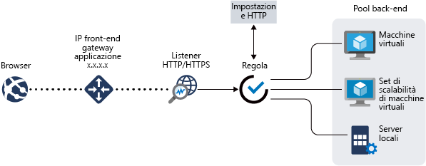

# Funzionalità del gateway applicazione Azure

Il [gateway applicazione di Azure](overview.md) è un servizio di bilanciamento del carico del traffico Web che consente di gestire il traffico verso le applicazioni Web.

Il gateway applicazione include le funzionalità seguenti:

- [Terminazione Secure Sockets Layer (SSL/TLS)](#secure-sockets-layer-ssltls-termination)
- [Scalabilità automatica](#autoscaling)
- [Ridondanza della zona](#zone-redundancy)
- [Indirizzo VIP statico](#static-vip)
- [Web application firewall](#web-application-firewall)
- [Controller di ingresso per il servizio Azure Kubernetes](#ingress-controller-for-aks)
- [Routing basato su URL](#url-based-routing)
- [Hosting di più siti](#multiple-site-hosting)
- [Reindirizzamento](#redirection)
- [Affinità di sessione](#session-affinity)
- [Traffico Websocket e HTTP/2](#websocket-and-http2-traffic)
- [Esaurimento delle connessioni](#connection-draining)
- [Pagine di errore personalizzate](#custom-error-pages)
- [Riscrivere l'URL e le intestazioni HTTP](#rewrite-http-headers-and-url)
- [Ridimensionamento](#sizing)

## Terminazione Secure Sockets Layer (SSL/TLS)

Il gateway applicazione supporta la terminazione SSL/TLS nel gateway, dopo la quale il traffico scorre generalmente non crittografato verso i server back-end. Questa funzionalità consente ai server Web di non gestire il costoso carico di crittografia e decrittografia. Tuttavia, a volte le comunicazioni non crittografate con i server non sono un'opzione accettabile. Questo può dipendere dai requisiti di sicurezza e conformità o dal fatto che l'applicazione può accettare solo connessioni sicure. Per queste applicazioni, il gateway applicazione supporta la crittografia SSL/TLS end-to-end.

Per altre informazioni, vedere [Panoramica della terminazione SSL e del protocollo SSL end-to-end con il gateway applicazione](ssl-overview.md)

## Scalabilità automatica

Il Standard_v2 del gateway applicazione supporta la scalabilità automatica e può aumentare o ridurre le prestazioni in base alla modifica di modelli di carico del traffico. La scalabilità automatica elimina anche la necessità di scegliere un numero di istanze o le dimensioni della distribuzione durante il provisioning. 

Per altre informazioni sul gateway applicazione Standard_v2 funzionalità, vedere la pagina relativa alla [scalabilità automatica V2](application-gateway-autoscaling-zone-redundant.md).

## Ridondanza della zona

Un gateway applicazione Standard_v2 può estendersi su più zone di disponibilità, offrendo una migliore resilienza degli errori e rimuovendo la necessità di effettuare il provisioning di gateway applicazione distinti in ogni zona.

## Indirizzo VIP statico

Il gateway applicazione Standard_v2 SKU supporta esclusivamente il tipo di indirizzo VIP statico. Questa funzionalità garantisce che l'indirizzo VIP associato al gateway applicazione non cambi nel corso del ciclo di vita del gateway applicazione.

## Web application firewall

Web Application Firewall (WAF) è un servizio che offre una protezione centralizzata delle applicazioni Web da exploit e vulnerabilità comuni. WAF si basa su regole dei [set di regole principali OWASP (Open Web Application Security Project)](https://www.owasp.org/index.php/Category:OWASP_ModSecurity_Core_Rule_Set_Project) 3.1 (solo WAF_v2), 3.0 e 2.2.9. 

Le applicazioni Web sono sempre più vittime di attacchi che sfruttano le più comuni vulnerabilità note. Per citarne alcuni, tra i più comuni troviamo gli attacchi SQL injection e gli attacchi di scripting intersito. Impedire questo tipo di attacchi nel codice dell'applicazione può essere un'operazione complessa e potrebbe richiedere una manutenzione rigorosa, l'applicazione di patch e il monitoraggio a più livelli della topologia dell'applicazione. Un Web application firewall centralizzato semplifica notevolmente la gestione della sicurezza e offre agli amministratori delle applicazioni migliori garanzie contro le minacce o le intrusioni. Una soluzione WAF è anche in grado di reagire più velocemente a una minaccia alla sicurezza tramite l'applicazione di patch su una vulnerabilità nota in una posizione centrale, anziché proteggere ogni singola applicazione Web. È possibile convertire facilmente i gateway applicazione esistenti in un gateway applicazione abilitato per il Web Application Firewall.

Per altre informazioni, vedere [Che cos'è Azure Web Application Firewall?](../web-application-firewall/overview.md).

## Controller di ingresso per il servizio Azure Kubernetes
Il controller di ingresso del gateway applicazione consente di usare il gateway applicazione come ingresso per un cluster del [servizio Azure Kubernetes](https://azure.microsoft.com/services/kubernetes-service/). 

Il controller di ingresso viene eseguito come Pod nel cluster AKS e USA [le risorse di ingresso Kubernetes](https://kubernetes.io/docs/concepts/services-networking/ingress/) e le converte in una configurazione del gateway applicazione, che consente al gateway di bilanciare il carico del traffico ai pod Kubernetes. Il controller di ingresso supporta solo gli SKU gateway applicazione Standard_v2 e WAF_v2. 

Per altre informazioni, vedere [Controller di ingresso del gateway applicazione di Azure](ingress-controller-overview.md).

## Routing basato su URL

Il routing basato su percorso URL consente di instradare il traffico a pool di server back-end in base ai percorsi URL della richiesta. Uno degli scenari è il rounting delle richieste di tipi di contenuto diversi a pool diversi.

Ad esempio, per le richieste `http://contoso.com/video/*` viene eseguito il rounting verso VideoServerPool mentre per le richieste `http://contoso.com/images/*` viene eseguito il rounting verso ImageServerPool. In caso di mancata corrispondenza dei percorsi, viene selezionato DefaultServerPool.

Per altre informazioni, vedere [Panoramica del routing basato sul percorso URL](url-route-overview.md).

## Hosting di più siti

Con il gateway applicazione, è possibile configurare il routing in base al nome host o al nome di dominio per più di un'applicazione Web nello stesso gateway applicazione. Consente di configurare una topologia più efficiente per le distribuzioni aggiungendo fino a più di 100 siti Web a un unico gateway applicazione. Ogni sito Web può essere indirizzato al proprio pool back-end. Ad esempio, tre domini, contoso.com, fabrikam.com e adatum.com, puntano all'indirizzo IP del gateway applicazione. Si creeranno tre listener multisito e si configurerà ogni listener per la rispettiva impostazione della porta e del protocollo. 

Le richieste per `http://contoso.com` vengono indirizzate a ContosoServerPool, `http://fabrikam.com` vengono instradate a FabrikamServerPool e così via.

Analogamente, la stessa distribuzione del gateway applicazione può ospitare due sottodomini dello stesso dominio padre. Gli esempi di uso di sottodomini possono includere `http://blog.contoso.com` e `http://app.contoso.com` ospitati in una singola distribuzione del gateway applicazione. Per altre informazioni, vedere [hosting di più siti nel gateway applicazione](multiple-site-overview.md).

È anche possibile definire nomi host con caratteri jolly in un listener multisito e fino a cinque nomi host per ogni listener. Per altre informazioni, vedere [nomi host con caratteri jolly nel listener (anteprima)](multiple-site-overview.md#wildcard-host-names-in-listener-preview).

## Reindirizzamento

Uno scenario comune per molte applicazioni Web è il supporto del reindirizzamento automatico da HTTP a HTTPS per assicurare che tutte le comunicazioni tra l'applicazione e gli utenti avvengano tramite un percorso crittografato.

È possibile che in passato siano state usate tecniche come la creazione di un pool dedicato il cui unico scopo è quello di reindirizzare le richieste ricevute su HTTP ad HTTPS. Il gateway applicazione consente di reindirizzare il traffico sul gateway applicazione. Questo semplifica la configurazione delle applicazioni, ottimizza l'utilizzo delle risorse e supporta i nuovi scenari di reindirizzamento, tra cui il reindirizzamento globale e basato sul percorso. Il supporto del reindirizzamento nel gateway applicazione non è limitato al solo reindirizzamento da HTTP ad HTTPS. Si tratta di un meccanismo di reindirizzamento generico che consente di eseguire il reindirizzamento da e verso qualsiasi porta definita mediante regole. Supporta anche il reindirizzamento a un sito esterno.

Il supporto del reindirizzamento nel gateway applicazione offre le funzionalità seguenti:

- Reindirizzamento globale da una porta a un'altra porta nel gateway. che consente il reindirizzamento da HTTP a HTTPS in un sito.
- Reindirizzamento basato sul percorso. Questo tipo di reindirizzamento consente il reindirizzamento da HTTP a HTTPS solo in un'area specifica del sito, ad esempio l'area del carrello acquisti indicata da `/cart/*`.
- Reindirizzamento a un sito esterno.

Per altre informazioni, vedere [Panoramica del reindirizzamento del gateway applicazione](redirect-overview.md).

## Affinità di sessione

L'affinità di sessione basata su cookie è utile quando si vuole mantenere una sessione utente nello stesso server. Usando cookie gestiti dal gateway, il gateway applicazione può indirizzare il traffico successivo proveniente da una sessione utente allo stesso server per l'elaborazione. Questo è importante nei casi in cui lo stato della sessione viene salvato in locale sul server per una sessione utente.

Per altre informazioni, vedere funzionamento di [un gateway applicazione](how-application-gateway-works.md#modifications-to-the-request).

## Traffico Websocket e HTTP/2

Il gateway applicazione offre il supporto nativo per i protocolli WebSocket e HTTP/2. Non esistono impostazioni configurabili dall'utente per abilitare o disabilitare in modo selettivo il supporto di WebSocket.

I protocolli WebSocket HTTP/2 consentono una comunicazione full duplex tra un server e un client su una connessione TCP con esecuzione prolungata. Questo consente una comunicazione più interattiva tra il server Web e il client che può essere bidirezionale senza necessità di polling che invece è richiesto nelle implementazioni basate su HTTP. Questi protocolli presentano un sovraccarico ridotto, a differenza di HTTP, e possono riutilizzare la stessa connessione TCP per più richieste/risposte, causando un utilizzo più efficiente delle risorse. Questi protocolli sono progettati per usare le porte HTTP 80 e 443 tradizionali.

Per altre informazioni, vedere [Supporto per WebSocket](application-gateway-websocket.md) e [supporto per HTTP/2](configuration-listeners.md#http2-support).

## Esaurimento delle connessioni

Lo svuotamento delle connessioni aiuta a rimuovere in modo controllato i membri del pool back-end durante gli aggiornamenti pianificati del servizio. Questa modalità viene abilitata tramite l'impostazione http back-end e può essere applicata a tutti i membri di un pool back-end durante la creazione delle regole. Dopo l'abilitazione, il gateway applicazione assicura che tutte le istanze di annullamento della registrazione di un pool back-end non ricevano alcuna nuova richiesta, consentendo al tempo stesso di completare le richieste esistenti entro un limite di tempo Questo vale sia per le istanze back-end che vengono rimosse dal pool back-end in modo esplicito mediante una modifica di configurazione dell'utente, sia per le istanze back-end che vengono segnalate come non integre, come determinato dai probe di integrità. L'unica eccezione è costituita dalle richieste associate per l'annullamento della registrazione delle istanze, che sono state annullate in modo esplicito a causa dell'affinità di sessione gestita dal gateway e continuano a essere inviate tramite proxy alle istanze di annullamento della registrazione.

Per altre informazioni, vedere [Panoramica della configurazione del gateway applicazione](configuration-http-settings.md#connection-draining).

## Pagine di errore personalizzate

Il gateway applicazione consente di creare pagine di errore personalizzate da visualizzare al posto delle pagine di errore predefinite. Con una pagina di errore personalizzata è possibile usare il layout e il marchio aziendali.

Per altre informazioni, vedere [Errori personalizzati](custom-error.md).

## Riscrivere l'URL e le intestazioni HTTP

Le intestazioni HTTP consentono al client e al server di passare informazioni aggiuntive insieme alla richiesta o alla risposta. La riscrittura delle intestazioni HTTP consente di affrontare diversi scenari importanti, ad esempio:

- Aggiunta di campi di intestazione relativi alla sicurezza come HSTS/X-XSS-Protection.
- Rimozione di campi di intestazione della risposta che possono rivelare informazioni riservate.
- Rimozione delle informazioni sulle porte dalle intestazioni X-Forwarded-For.

Il gateway applicazione e lo SKU WAF v2 supportano la possibilità di aggiungere, rimuovere o aggiornare le intestazioni di richieste e risposte HTTP durante lo spostamento dei pacchetti di richiesta e risposta tra il client e i pool back-end. È anche possibile riscrivere gli URL, i parametri della stringa di query e il nome host. Con la riscrittura dell'URL e il routing basato sul percorso URL, è possibile scegliere di indirizzare le richieste a uno dei pool back-end in base al percorso originale o al percorso riscritto, usando l'opzione Rivaluta mappa percorso. 

Consente anche di aggiungere le condizioni necessarie per garantire che le intestazioni specificate o l'URL vengono riscritti solo in presenza di determinate condizioni. Queste condizioni sono basate sulle informazioni della richiesta e della risposta.

Per altre informazioni, vedere [riscrivere le intestazioni HTTP e l'URL](rewrite-http-headers-url.md).

## Ridimensionamento

Il Standard_v2 del gateway applicazione può essere configurato per la scalabilità automatica o per le distribuzioni a dimensione fissa. Lo SKU V2 non offre dimensioni diverse per le istanze. Per altre informazioni sulle prestazioni e sui prezzi di V2, vedere [scalabilità automatica V2](application-gateway-autoscaling-zone-redundant.md) e [informazioni sui prezzi](understanding-pricing.md).

Il gateway applicazione standard (V1) viene offerto in tre dimensioni: **small**, **medium**e **large**. Le dimensioni delle istanze piccole sono destinate a scenari di sviluppo e test.

Per un elenco completo dei limiti del gateway applicazione, vedere i [limiti del servizio Gateway applicazione](../azure-resource-manager/management/azure-subscription-service-limits.md?toc=%2fazure%2fapplication-gateway%2ftoc.json#application-gateway-limits).

La tabella seguente illustra una velocità effettiva media delle prestazioni per ogni istanza del gateway applicazione v1 con offload SSL abilitato:

| Dimensioni medie risposta della pagina di back-end | Piccola | Media | Grande |
| --- | --- | --- | --- |
| 6 KB |7,5 Mbps |13 Mbps |50 Mbps |
| 100 kB |35 Mbps |100 Mbps |200 Mbps |

> [!NOTE]
> Questi valori sono indicazioni approssimative della velocità effettiva di un gateway applicazione. La velocità effettiva dipende da vari dettagli ambientali come le dimensioni medie delle pagine, la posizione delle istanze back-end e il tempo di elaborazione per gestire una pagina. Per dati esatti sulle prestazioni, è consigliabile eseguire propri test. Questi valori vengono forniti solo come indicazioni per la pianificazione della capacità.

## Confronto delle funzionalità della versione

Per un confronto tra le funzionalità del gateway applicazione V1-V2, vedere [scalabilità automatica e gateway applicazione con ridondanza della zona V2](application-gateway-autoscaling-zone-redundant.md#feature-comparison-between-v1-sku-and-v2-sku)

## Passaggi successivi

- Informazioni sul funzionamento del gateway applicazione: funzionamento del [gateway applicazione](how-application-gateway-works.md)