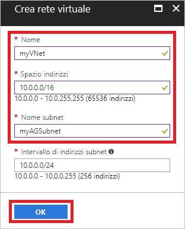
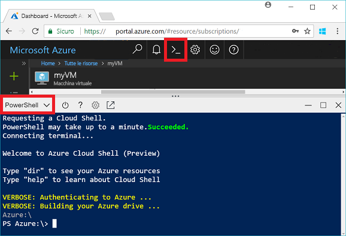
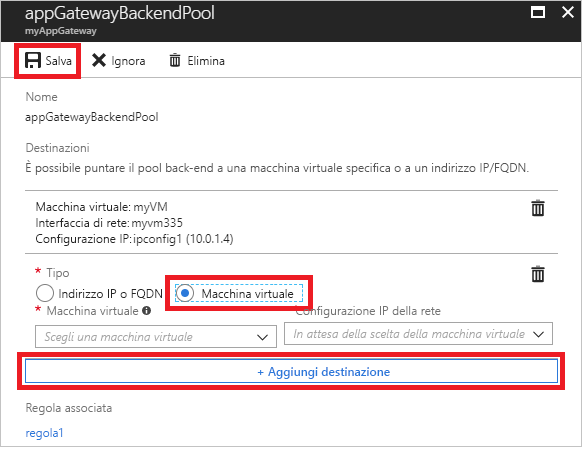
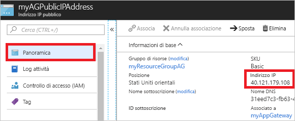

# <a name="quickstart-direct-web-traffic-with-azure-application-gateway---azure-portal"></a>Guida introduttiva: Indirizzare il traffico Web con un gateway applicazione di Azure - Portale di Azure

Con il gateway applicazione di Azure è possibile indirizzare il traffico Web dell'applicazione a risorse specifiche assegnando listener alle porte, creando regole e aggiungendo risorse a un pool back-end.

Questa guida introduttiva illustra come usare il portale di Azure per creare rapidamente il gateway applicazione con due macchine virtuali nel relativo pool back-end. Il gateway verrà quindi testato per assicurarsi che funzioni correttamente.

Se non si ha una sottoscrizione di Azure, creare un [account gratuito](https://azure.microsoft.com/free/?WT.mc_id=A261C142F) prima di iniziare.

## <a name="log-in-to-azure"></a>Accedere ad Azure

Accedere al portale di Azure all'indirizzo [http://portal.azure.com](http://portal.azure.com)

## <a name="create-an-application-gateway"></a>Creare un gateway applicazione

Si deve creare una rete virtuale perché il gateway applicazione possa comunicare con altre risorse. È possibile creare una rete virtuale durante la creazione del gateway applicazione. In questo esempio vengono create due subnet: una per il gateway applicazione e l'altra per le macchine virtuali. 

1. Fare clic su **Crea una risorsa** nell'angolo superiore sinistro del portale di Azure.
2. Selezionare **Rete** e quindi **Gateway applicazione** nell'elenco In primo piano.
3. Immettere i valori seguenti per il gateway applicazione:

    - *myAppGateway* come nome del gateway applicazione.
    - *myResourceGroupAG* come nuovo gruppo di risorse.

    

4. Accettare i valori predefiniti per le altre impostazioni e quindi fare clic su **OK**.
5. Fare clic su **Scegliere una rete virtuale** > **Crea nuova** e quindi immettere i valori seguenti per la rete virtuale:

    - *myVNet* come nome della rete virtuale.
    - *10.0.0.0/16* come spazio indirizzi della rete virtuale.
    - *myAGSubnet* come nome della subnet.
    - *10.0.0.0/24* come spazio indirizzi della subnet.

    

6. Fare clic su **OK** per creare la rete virtuale e la subnet.
6. Fare clic su **Scegliere un indirizzo IP pubblico** > **Crea nuovo** e quindi immettere il nome dell'indirizzo IP pubblico. In questo esempio il nome dell'indirizzo IP pubblico è *myAGPublicIPAddress*. Accettare i valori predefiniti per le altre impostazioni e quindi fare clic su **OK**.
8. Accettare i valori predefiniti per la configurazione del listener, lasciare disabilitato il web application firewall e quindi fare clic su **OK**.
9. Rivedere le impostazioni nella pagina di riepilogo e quindi fare clic su **OK** per creare la rete virtuale, l'indirizzo IP pubblico e il gateway applicazione. La creazione del gateway applicazione può richiedere fino a 30 minuti. Attendere fino al termine della distribuzione prima di passare alla sezione successiva.

### <a name="add-a-subnet"></a>Aggiungere una subnet

1. Fare clic su **Tutte le risorse** nel menu a sinistra e quindi su **myVNet** nell'elenco delle risorse.
2. Fare clic su **Subnet** > **Subnet**.

    

3. Immettere *myBackendSubnet* come nome della subnet e quindi fare clic su **OK**.

## <a name="create-backend-servers"></a>Creare i server back-end

In questo esempio vengono create due macchine virtuali da usare come server back-end per il gateway applicazione. 

### <a name="create-a-virtual-machine"></a>Creare una macchina virtuale

1. Fare clic su **Nuovo**.
2. Selezionare **Calcolo** e quindi selezionare **Windows Server 2016 Datacenter** nell'elenco In primo piano.
3. Immettere i valori seguenti per la macchina virtuale:

    - *myVM* come nome della macchina virtuale.
    - *azureuser* come nome utente dell'amministratore.
    - *Azure123456!* come password.
    - Selezionare **Usa esistente** e quindi *myResourceGroupAG*.

4. Fare clic su **OK**.
5. Selezionare **DS1_V2** come dimensioni per la macchina virtuale e quindi fare clic su **Seleziona**.
6. Assicurarsi che **myVNet** sia selezionato per la rete virtuale e che la subnet sia **myBackendSubnet**. 
7. Fare clic su **Disabilitato** per disabilitare la diagnostica di avvio.
8. Fare clic su **OK**, verificare le impostazioni nella pagina di riepilogo e quindi fare clic su **Crea**.

### <a name="install-iis"></a>Installare IIS

È possibile installare IIS nelle macchine virtuali per verificare l'avvenuta creazione del gateway applicazione.

1. Aprire la shell interattiva e assicurarsi che sia impostata su **PowerShell**.

    

2. Eseguire questo comando per installare IIS nella macchina virtuale: 

    ```azurepowershell-interactive
    Set-AzureRmVMExtension `
      -ResourceGroupName myResourceGroupAG `
      -ExtensionName IIS `
      -VMName myVM `
      -Publisher Microsoft.Compute `
      -ExtensionType CustomScriptExtension `
      -TypeHandlerVersion 1.4 `
      -SettingString '{"commandToExecute":"powershell Add-WindowsFeature Web-Server; powershell Add-Content -Path \"C:\\inetpub\\wwwroot\\Default.htm\" -Value $($env:computername)"}' `
      -Location EastUS
    ```

3. Creare una seconda macchina virtuale e installare IIS seguendo la procedura appena completata. Immettere *myVM2* per il nome e per VMName in Set-AzureRmVMExtension.

### <a name="add-backend-servers"></a>Aggiungere i server back-end

Dopo aver creato le macchine virtuali, è necessario aggiungerle al pool back-end nel gateway applicazione.

1. Fare clic su **Tutte le risorse** > **myAppGateway**.
2. Fare clic su **Pool back-end**. È stato creato automaticamente un pool predefinito con il gateway applicazione. Fare clic su **appGatewayBackendPool**.
3. Fare clic su **Aggiungi destinazione** > **Macchina virtuale** e quindi selezionare *myVM*. Selezionare **Aggiungi destinazione** > **Macchina virtuale** e quindi selezionare *myVM2*.

    

4. Fare clic su **Save**.

## <a name="test-the-application-gateway"></a>Testare il gateway applicazione

L'installazione di IIS non è necessaria per creare il gateway applicazione, ma è stata eseguita in questa guida introduttiva per verificare se il gateway applicazione è stato creato correttamente.

1. Individuare l'indirizzo IP pubblico del gateway applicazione nella schermata Panoramica. Fare clic su **Tutte le risorse** > **myAGPublicIPAddress**.

    

2. Copiare l'indirizzo IP pubblico e quindi incollarlo nella barra degli indirizzi del browser.

    

Quando si aggiorna il browser, dovrebbe apparire il nome dell'altra macchina virtuale.

## <a name="clean-up-resources"></a>Pulire le risorse

Per prima cosa esplorare le risorse create con il gateway applicazione e poi, quando non sono più necessari, è possibile eliminare il gruppo di risorse, il gateway applicazione e tutte le risorse correlate. A questo scopo, selezionare il gruppo di risorse che contiene il gateway applicazione e fare clic su **Elimina**.

## <a name="next-steps"></a>Passaggi successivi

> [!div class="nextstepaction"]
> [Gestire il traffico Web con un gateway applicazione mediante l'interfaccia della riga di comando di Azure](./tutorial-manage-web-traffic-cli.md)
