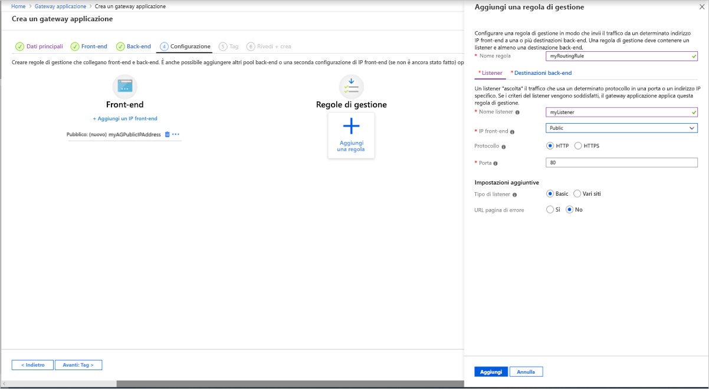
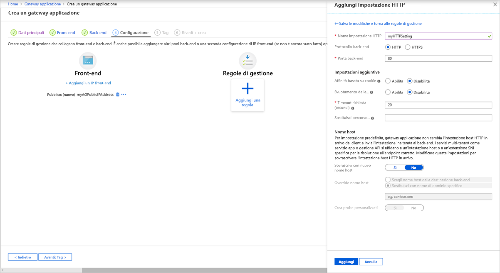

# <a name="quickstart-direct-web-traffic-with-azure-application-gateway---azure-portal"></a>Guida introduttiva: Indirizzare il traffico Web con un gateway applicazione di Azure - Portale di Azure

In questa Guida introduttiva si usa il portale di Azure per creare un gateway applicazione. Quindi testarlo per verificare che funzioni correttamente. 

Il gateway applicazione indirizza il traffico web dell'applicazione a risorse specifiche in un pool back-end. Si assegnano listener alle porte, si creano regole e si aggiungono risorse a un pool back-end. Per semplicità, in questo articolo viene usata una semplice configurazione con un IP front-end pubblico, un listener di base per ospitare un singolo sito nel gateway applicazione, una regola di routing delle richieste di base e due macchine virtuali nel pool back-end.

È anche possibile completare questa Guida introduttiva usando [Azure PowerShell](quick-create-powershell.md) o l'interfaccia della riga di comando di [Azure](quick-create-cli.md)

[!INCLUDE [updated-for-az](../../includes/updated-for-az.md)]


## <a name="prerequisites"></a>Prerequisites

- Un account Azure con una sottoscrizione attiva. [Creare un account gratuitamente](https://azure.microsoft.com/free/?WT.mc_id=A261C142F).

## <a name="sign-in-to-the-azure-portal"></a>Accedere al portale di Azure

Accedere al [portale di Azure](https://portal.azure.com) con il proprio account Azure.

## <a name="create-an-application-gateway"></a>Creare un gateway applicazione

Il gateway applicazione verrà creato usando le schede della pagina **creare un gateway applicazione** .

1. Nel menu del portale di Azure o dalla pagina **Home** selezionare **Crea una risorsa**. Verrà visualizzata la finestra **Nuovo**.

2. Selezionare **Rete** e quindi **Gateway applicazione** nell'elenco **In primo piano**.

### <a name="basics-tab"></a>Scheda Informazioni di base

1. Nella scheda **Informazioni di base** immettere questi valori per le impostazioni del gateway applicazione seguenti:

   - **Gruppo di risorse**: selezionare **myResourceGroupAG** per il gruppo di risorse. Se non esiste, selezionare **Crea nuovo** per crearlo.
   - **Nome del gateway applicazione**: immettere *myAppGateway* per il nome del gateway applicazione.

     

2. Per le comunicazioni tra le risorse create in Azure è necessaria una rete virtuale. È possibile creare una nuova rete virtuale oppure usarne una esistente. In questo esempio verrà creata una nuova rete virtuale in concomitanza con la creazione del gateway applicazione. Le istanze del gateway applicazione vengono create in subnet separate. In questo esempio vengono create due subnet: una per il gateway applicazione e l'altra per i server back-end.

    In **Configura rete virtuale** creare una nuova rete virtuale selezionando **Crea nuovo**. Nella finestra **Crea rete virtuale** visualizzata immettere i valori seguenti per creare la rete virtuale e due subnet:

    - **Nome**: immettere *myVNet* per il nome della rete virtuale.

    - **Nome subnet** (subnet del gateway applicazione): nella griglia **Subnet** viene visualizzata una subnet denominata *default*. Modificare il nome della subnet in *myAGSubnet*.<br>La subnet del gateway applicazione può contenere solo i gateway applicazione. Non sono consentite altre risorse.

    - **Nome subnet** (subnet server back-end): nella seconda riga della griglia **Subnet** immettere *myBackendSubnet* nella colonna **nome subnet** .

    - **Intervallo di indirizzi** (subnet server back-end): nella seconda riga della griglia **Subnet** immettere un intervallo di indirizzi che non si sovrappone all'intervallo di indirizzi di *myAGSubnet*. Ad esempio, se l'intervallo di indirizzi di *myAGSubnet* è 10.0.0.0/24, immettere *10.0.1.0/24* per l'intervallo di indirizzi di *myBackendSubnet*.

    Selezionare **OK** per chiudere la finestra **Crea rete virtuale** e salvare le impostazioni della rete virtuale.

     
    
3. Nella scheda **nozioni di base** accettare i valori predefiniti per le altre impostazioni e quindi fare clic su Next (front **-end**).

### <a name="frontends-tab"></a>Scheda Front-end

1. Nella scheda **Front- end** verificare che **Tipo di indirizzo IP front-end** sia impostato su **Pubblico**. <br>È possibile configurare l'indirizzo IP front-end come pubblico o privato in base al caso d'uso. In questo esempio si sceglierà un indirizzo IP front-end pubblico.
   > [!NOTE]
   > Per lo SKU v2 del gateway applicazione, è possibile scegliere solo la configurazione IP front-end **pubblico**. È comunque possibile avere una configurazione IP front-end con indirizzo pubblico e privato, ma la configurazione IP front-end solo privato (solo modalità bilanciamento del carico interno) non è attualmente abilitata per lo SKU v2. 

2. Scegliere **Crea nuovo** per **Indirizzo IP pubblico** e immettere *myAGPublicIPAddress* per il nome dell'indirizzo IP pubblico, quindi selezionare **OK**. 

     

3. Selezionare **Avanti: backend**.

### <a name="backends-tab"></a>Scheda Back-end

Il pool back-end viene usato per instradare le richieste ai server back-end che gestiscono la richiesta. I pool back-end possono essere costituiti da schede di interfaccia di rete, set di scalabilità di macchine virtuali, indirizzi IP pubblici, indirizzi IP interni, nomi di dominio completi (FQDN) e back-end multi-tenant come Servizio app di Azure. In questo esempio verrà creato un pool back-end vuoto con il gateway applicazione a cui verranno aggiunte le destinazioni back-end.

1. Nella scheda **Back- end** selezionare **Aggiungi un pool back-end**.

2. Nella finestra **Aggiungi un pool back-end** visualizzata immettere i valori seguenti per creare un pool back-end vuoto:

    - **Nome**: immettere *myBackendPool* per il nome del pool back-end.
    - **Aggiungi pool back-end senza destinazioni**: selezionare **Sì** per creare un pool back-end senza destinazioni. Le destinazioni back-end verranno aggiunte dopo la creazione del gateway applicazione.

3. Nella finestra **Aggiungi un pool back-end** selezionare **Aggiungi** per salvare la configurazione del pool back-end e tornare alla scheda **Back-end**.

     

4. Nella scheda **backend** selezionare **Avanti: configurazione**.

### <a name="configuration-tab"></a>Scheda Configurazione

Nella scheda **Configurazione** verranno connessi il front-end e il pool back-end creati tramite una regola di routing.

1. Selezionare **Aggiungi una regola** nella colonna **Regole di routing**.

2. Nella finestra **Aggiungi una regola di routing** visualizzata immettere *myRoutingRule* per **Nome regola**.

3. Una regola di routing richiede un listener. Nella scheda **Listener** nella finestra **Aggiungi una regola di routing** immettere i valori seguenti per il listener:

    - **Nome listener** *: immettere il nome del listener come* nome del listener.
    - **IP**front-end: selezionare **pubblico** per scegliere l'indirizzo IP pubblico creato per il front-end.
  
      Accettare i valori predefiniti per le altre impostazioni nella scheda **Listener**, quindi selezionare la scheda **Destinazioni back-end** per configurare il resto della regola di routing.

   

4. Nella scheda **Destinazioni back-end** selezionare **myBackendPool** per **Destinazione back-end**.

5. Per **Impostazione HTTP** selezionare **Crea nuovo** per creare una nuova impostazione HTTP. L'impostazione HTTP determinerà il comportamento della regola di routing. Nella finestra **Aggiungi un'impostazione HTTP** visualizzata immettere *myHTTPSetting* per **Nome impostazione HTTP**. Accettare i valori predefiniti per le altre impostazioni nella finestra **Aggiungi un'impostazione HTTP** e quindi selezionare **Aggiungi** per tornare alla finestra **Aggiungi una regola di routing**. 

     

6. Nella finestra **Aggiungi una regola di routing** selezionare **Aggiungi** per salvare la regola di routing e tornare alla scheda **Configurazione**.

     

7. Fare clic su **Avanti: Tag** e quindi su **Avanti: verifica + crea**.

### <a name="review--create-tab"></a>Scheda Rivedi e crea

Rivedere le impostazioni nella scheda **Rivedi e crea** e quindi selezionare **Crea** per creare la rete virtuale, l'indirizzo IP pubblico e il gateway applicazione. La creazione del gateway applicazione in Azure può richiedere diversi minuti. Attendere fino al termine della distribuzione prima di passare alla sezione successiva.

## <a name="add-backend-targets"></a>Aggiungere destinazioni back-end

In questo esempio vengono usate macchine virtuali come back-end di destinazione. È possibile usare macchine virtuali esistenti o crearne di nuove. Verranno create due macchine virtuali come server back-end per il gateway applicazione.

A questo scopo, è necessario:

1. Creare due nuove macchine virtuali, *myVM* e *myVM2*, da usare come server back-end.
2. Installare IIS nelle macchine virtuali per verificare che il gateway applicazione sia stato creato correttamente.
3. Aggiungere i server back-end al pool back-end.

### <a name="create-a-virtual-machine"></a>Creare una macchina virtuale

1. Nel menu del portale di Azure o dalla pagina **Home** selezionare **Crea una risorsa**. Verrà visualizzata la finestra **Nuovo**.
2. Selezionare **Calcolo** e quindi selezionare **Windows Server 2016 Datacenter** nell'elenco **Più comuni**. Viene visualizzata la pagina **Creare una macchina virtuale**.<br>Il gateway applicazione può indirizzare il traffico a qualsiasi tipo di macchina virtuale usato nel pool back-end. In questo esempio si usa Windows Server 2016 Datacenter.
3. Immettere questi valori nella scheda **Informazioni di base** per le seguenti impostazioni della macchina virtuale:

    - **Gruppo di risorse**: selezionare **myResourceGroupAG** per il nome del gruppo di risorse.
    - **Nome macchina virtuale**: immettere *myVM* per il nome della macchina virtuale.
    - **Username**: digitare *azureuser* come nome utente amministratore.
    - **Password**: digitare la password.
4. Accettare le altre impostazioni predefinite e quindi selezionare **Avanti: dischi**.  
5. Accettare i valori predefiniti per la scheda **dischi** , quindi selezionare **Avanti: rete**.
6. Nella scheda **Rete** verificare che **myVNet** sia selezionato per la **Rete virtuale** e che la **Subnet** sia **myBackendSubnet**. Accettare le altre impostazioni predefinite e quindi selezionare **Avanti: gestione**.<br>Il gateway applicazione può comunicare con le istanze all'esterno della rete virtuale in cui si trova, ma è necessario verificare che ci sia la connettività IP.
7. Nella scheda **Gestione** impostare **Diagnostica di avvio** su **Off**. Accettare tutte le altre impostazioni predefinite e quindi selezionare **Rivedi e crea**.
8. Nella scheda **Rivedi e crea** rivedere le impostazioni, correggere eventuali errori di convalida e quindi selezionare **Crea**.
9. Attendere il termine della creazione della macchina virtuale prima di continuare.

### <a name="install-iis-for-testing"></a>Installare IIS a scopo di test

In questo esempio viene installato IIS nelle macchine virtuali solo per verificare che il gateway applicazione sia stato creato correttamente da Azure.

1. Aprire Azure PowerShell. Selezionare **cloud Shell** dalla barra di spostamento superiore del portale di Azure, quindi selezionare **PowerShell** nell'elenco a discesa. 

    

2. Eseguire questo comando per installare IIS nella macchina virtuale: 

    ```azurepowershell-interactive
    Set-AzVMExtension `
      -ResourceGroupName myResourceGroupAG `
      -ExtensionName IIS `
      -VMName myVM `
      -Publisher Microsoft.Compute `
      -ExtensionType CustomScriptExtension `
      -TypeHandlerVersion 1.4 `
      -SettingString '{"commandToExecute":"powershell Add-WindowsFeature Web-Server; powershell Add-Content -Path \"C:\\inetpub\\wwwroot\\Default.htm\" -Value $($env:computername)"}' `
      -Location EastUS
    ```

3. Creare una seconda macchina virtuale e installare IIS seguendo la procedura precedentemente completata. Uso *myVM2* per il nome della macchina virtuale e per l'impostazione **VMName** del cmdlet **Set-AzVMExtension**.

### <a name="add-backend-servers-to-backend-pool"></a>Aggiungere i server back-end al pool back-end

1. Nel menu del portale di Azure selezionare **Tutte le risorse** oppure cercare e selezionare *Tutte le risorse*. Selezionare quindi **myAppGateway**.

2. Selezionare **Pool back-end** dal menu a sinistra.

3. Selezionare **myBackendPool**.

4. In **Destinazioni** selezionare **Macchina virtuale** dall'elenco a discesa.

5. In **MACCHINA VIRTUALE** e **INTERFACCE DI RETE** selezionare le macchine virtuali **myVM** e **myVM2** e le relative interfacce di rete associate dagli elenchi a discesa.

    

6. Selezionare **Salva**.

7. Attendere il completamento della distribuzione prima di procedere al passaggio successivo.

## <a name="test-the-application-gateway"></a>Testare il gateway applicazione

Nonostante l'installazione di IIS non sia necessaria per creare il gateway applicazione, è stata eseguita in questa guida introduttiva per verificare se il gateway applicazione è stato creato correttamente in Azure. Usare IIS per testare il gateway applicazione:

1. Trovare l'indirizzo IP pubblico del gateway applicazione nella pagina **Panoramica** corrispondente.  In alternativa, è possibile selezionare **Tutte le risorse**, immettere *myAGPublicIPAddress* nella casella di ricerca e quindi selezionare la voce corrispondente nei risultati della ricerca. Azure mostra l'indirizzo IP pubblico nella pagina **Panoramica**.
2. Copiare l'indirizzo IP pubblico e quindi incollarlo nella barra degli indirizzi del browser.
3. Controllare la risposta. Una risposta valida verifica che il gateway applicazione sia stato creato correttamente e possa connettersi al back-end.

   

## <a name="clean-up-resources"></a>Pulire le risorse

Quando le risorse create con il gateway applicazione non sono più necessarie, eliminare il gruppo di risorse. Quando si elimina il gruppo di risorse, vengono rimossi anche il gateway applicazione e tutte le risorse correlate.

Per eliminare il gruppo di risorse:

1. Nel menu del portale di Azure selezionare **Gruppi di risorse** oppure cercare e selezionare *Gruppi di risorse*.
2. Nella pagina **Gruppo di risorse** cercare **myResourceGroupAG** nell'elenco e selezionarlo.
3. Nella pagina **Gruppo di risorse** selezionare **Elimina gruppo di risorse**.
4. Immettere *myResourceGroupAG* in **DIGITARE IL NOME DEL GRUPPO DI RISORSE** e quindi selezionare **Elimina**

## <a name="next-steps"></a>Passaggi successivi

> [!div class="nextstepaction"]
> [Gestire il traffico Web con un gateway applicazione mediante l'interfaccia della riga di comando di Azure](./tutorial-manage-web-traffic-cli.md)
