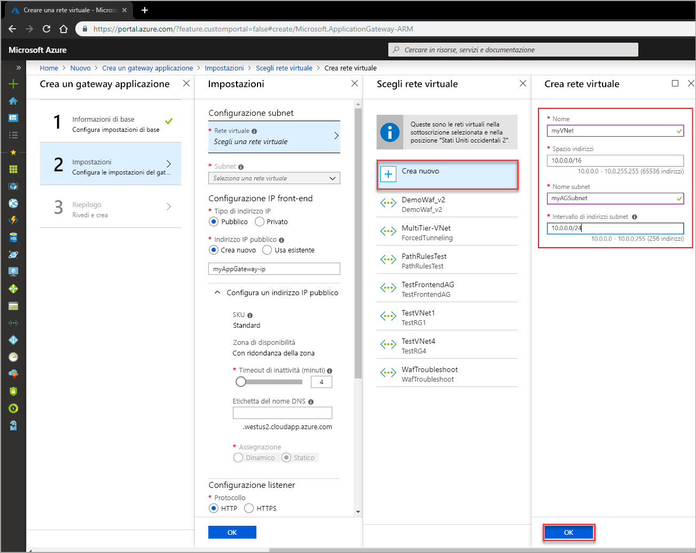
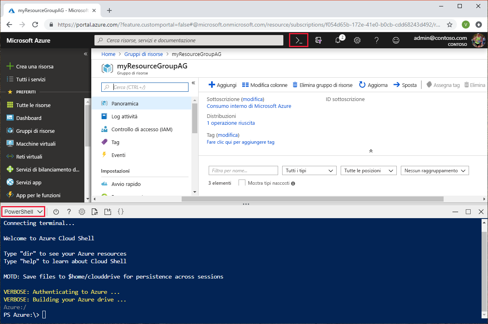
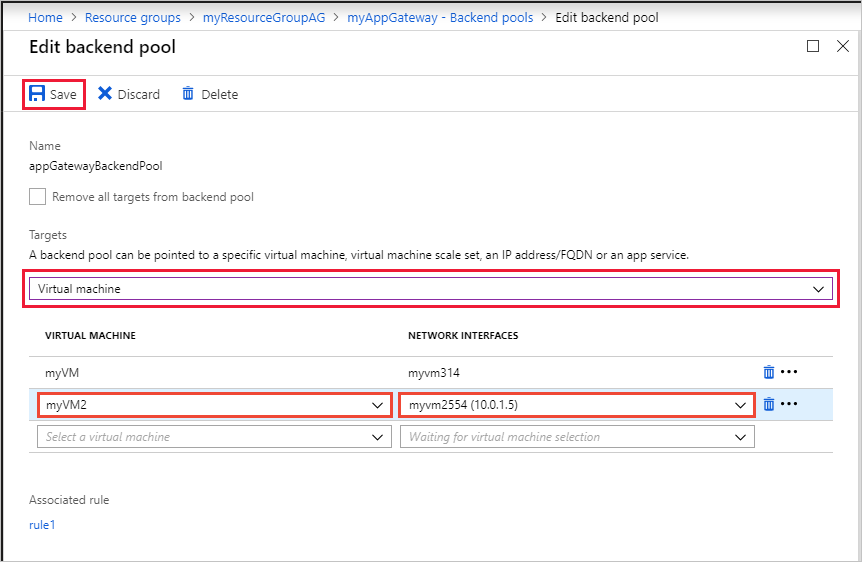
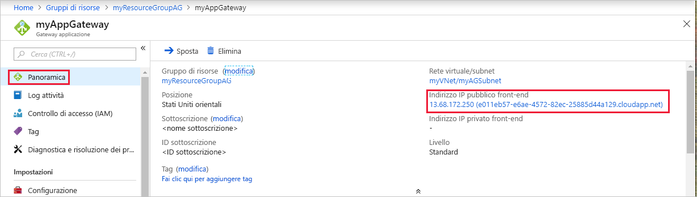

# <a name="quickstart-direct-web-traffic-with-azure-application-gateway---azure-portal"></a>Avvio rapido: Indirizzare il traffico Web con un gateway applicazione Azure - Portale di Azure

Questa guida di avvio rapido illustra come usare il portale di Azure per creare un gateway applicazione.  Al termine della creazione, si testa il gateway applicazione per verificare che funzioni correttamente. Con il gateway applicazione di Azure si indirizza il traffico Web dell'applicazione a risorse specifiche assegnando listener alle porte, creando regole e aggiungendo risorse a un pool back-end. Per semplicità, questo articolo usa una configurazione semplice con un indirizzo IP pubblico front-end, un listener di base per ospitare un singolo sito nel gateway applicazione, due macchine virtuali usate per il pool back-end e una regola di routing delle richieste di base.

Se non si ha una sottoscrizione di Azure, creare un [account gratuito](https://azure.microsoft.com/free/?WT.mc_id=A261C142F) prima di iniziare.


[!INCLUDE [updated-for-az](../../includes/updated-for-az.md)]

## <a name="sign-in-to-azure"></a>Accedere ad Azure

Accedere al [portale di Azure](https://portal.azure.com) con il proprio account Azure.

## <a name="create-an-application-gateway"></a>Creare un gateway applicazione

Per le comunicazioni tra le risorse create in Azure è necessaria una rete virtuale. È possibile creare una nuova rete virtuale oppure usarne una esistente. In questo esempio verrà creata una nuova rete virtuale. È possibile creare una rete virtuale durante la creazione del gateway applicazione. Le istanze del gateway applicazione vengono create in subnet separate. In questo esempio vengono create due subnet: una per il gateway applicazione e l'altra per i server back-end.

1. Selezionare **Crea una risorsa** nel menu a sinistra del portale di Azure. Verrà visualizzata la finestra **Nuovo**.

2. Selezionare **Rete** e quindi **Gateway applicazione** nell'elenco **In primo piano**.

### <a name="basics-page"></a>Pagina Informazioni di base

1. Nella pagina **Informazioni di base** immettere questi valori per le impostazioni del gateway applicazione seguenti:

   - **Nome**: immettere *myAppGateway* come nome del gateway applicazione.
   - **Gruppo di risorse**: selezionare **myResourceGroupAG** come gruppo di risorse. Se non esiste, selezionare **Crea nuovo** per crearlo.

     

2. Accettare i valori predefiniti per le altre impostazioni e quindi selezionare **OK**.

### <a name="settings-page"></a>Pagina Impostazioni

1. Nella pagina **Impostazioni** sotto **Configurazione subnet**, selezionare **Scegliere una rete virtuale**. <br>

2. Nella pagina **Scegliere una rete virtuale** selezionare **Crea nuova** e quindi immettere i valori per le seguenti impostazioni della rete virtuale:

   - **Nome**: immettere *myVnet* come nome della rete virtuale.

   - **Spazio degli indirizzi**: immettere *10.0.0.0/16* come spazio indirizzi della rete virtuale.

   - **Nome della subnet**: immettere *myAGSubnet* come nome della subnet.<br>La subnet del gateway applicazione può contenere solo i gateway applicazione. Non sono consentite altre risorse.

   - **Intervallo di indirizzi subnet**: immettere *10.0.0.0/24* come intervallo di indirizzi della subnet.

     

3. Selezionare **OK** per tornare alla pagina **Impostazioni**.

4. Scegliere **Configurazione IP front-end**. In **Configurazione dell'indirizzo IP front-end** verificare che **Tipo di indirizzo IP** sia impostato su **pubblico**. In **Indirizzo IP pubblico**, verificare che **Crea nuovo** sia selezionato. <br>È possibile configurare l'indirizzo IP front-end come pubblico o privato in base al caso d'uso. In questo esempio si sceglierà un indirizzo IP front-end pubblico.
   > [!NOTE]
   > Per lo SKU v2 del gateway applicazione, è possibile scegliere solo la configurazione **pubblica** dell'IP front-end. La configurazione privata dell'IP front-end non è attualmente abilitata per lo SKU v2.

5. Immettere *myAGPublicIPAddress* come nome dell'indirizzo IP pubblico. 

6. Accettare i valori predefiniti per le altre impostazioni e quindi selezionare **OK**.<br>In questo articolo si sceglieranno i valori predefiniti per motivi di semplicità, ma è possibile configurare valori personalizzati per le altre impostazioni in base al caso d'uso specifico 

### <a name="summary-page"></a>Pagina Riepilogo

Rivedere le impostazioni nella pagina di **riepilogo** e quindi selezionare **OK** per creare la rete virtuale, l'indirizzo IP pubblico e il gateway applicazione. La creazione del gateway applicazione in Azure può richiedere diversi minuti. Attendere fino al termine della distribuzione prima di passare alla sezione successiva.

## <a name="add-backend-pool"></a>Aggiungere un pool back-end

Il pool back-end viene usato per instradare le richieste ai server back-end che gestiscono la richiesta. I pool back-end possono essere costituiti da schede di interfaccia di rete, set di scalabilità di macchine virtuali, indirizzi IP pubblici, indirizzi IP interni, nomi di dominio completi (FQDN) e back-end multi-tenant come Servizio app di Azure. Si aggiungeranno le destinazioni back-end a un pool back-end.

In questo esempio vengono usate macchine virtuali come back-end di destinazione. È possibile usare macchine virtuali esistenti o crearne di nuove. Vengono create due macchine virtuali, usate da Azure come server back-end per il gateway applicazione.

A questo scopo, è necessario:

1. Creare una nuova subnet *myBackendSubnet*, in cui verranno create le nuove VM.
2. Creare due nuove macchine virtuali, *myVM* e *myVM2*, da usare come server back-end.
3. Installare IIS nelle macchine virtuali per verificare che il gateway applicazione sia stato creato correttamente.
4. Aggiungere i server back-end al pool back-end.

### <a name="add-a-subnet"></a>Aggiungere una subnet

Aggiungere una subnet alla rete virtuale creata seguendo questa procedura:

1. Selezionare **Tutte le risorse** nel menu a sinistra del portale di Azure, immettere *myVNet* nella casella di ricerca e quindi selezionare **myVNet** dai risultati della ricerca.

2. Selezionare **Subnet** dal menu a sinistra e quindi **+ Subnet**. 

   

3. Dalla pagina **Aggiungi subnet** immettere *myBackendSubnet* come **nome** della subnet e quindi selezionare **OK**.

### <a name="create-a-virtual-machine"></a>Creare una macchina virtuale

1. Nel portale di Azure fare clic su **Crea una risorsa**. Verrà visualizzata la finestra **Nuovo**.
2. Selezionare **Calcolo** e quindi selezionare **Windows Server 2016 Datacenter** nell'elenco **In primo piano**. Viene visualizzata la pagina **Creare una macchina virtuale**.<br>Il gateway applicazione può indirizzare il traffico a qualsiasi tipo di macchina virtuale usato nel pool back-end. In questo esempio si usa Windows Server 2016 Datacenter.
3. Immettere questi valori nella scheda **Informazioni di base** per le seguenti impostazioni della macchina virtuale:

    - **Gruppo di risorse**: selezionare **myResourceGroupAG** come nome del gruppo di risorse.
    - **Nome macchina virtuale**: immettere *myVM* come nome della macchina virtuale.
    - **Nome utente**: immettere *azureuser* come nome utente dell'amministratore.
    - **Password**: immettere *Azure123456!* come password amministratore.
4. Accettare tutte le altre impostazioni predefinite e quindi selezionare **Avanti: Dischi**.  
5. Accettare le impostazioni predefinite della scheda **Dischi** e quindi selezionare **Avanti: Rete**.
6. Nella scheda **Rete** verificare che **myVNet** sia selezionato per la **Rete virtuale** e che la **Subnet** sia **myBackendSubnet**. Accettare tutte le altre impostazioni predefinite e quindi selezionare **Avanti: Gestione**.<br>Il gateway applicazione può comunicare con le istanze all'esterno della rete virtuale in cui si trova, ma è necessario verificare che ci sia la connettività IP.
7. Nella scheda **Gestione** impostare **Diagnostica di avvio** su **Off**. Accettare tutte le altre impostazioni predefinite e quindi selezionare **Rivedi e crea**.
8. Nella scheda **Rivedi e crea** rivedere le impostazioni, correggere eventuali errori di convalida e quindi selezionare **Crea**.
9. Attendere il termine della creazione della macchina virtuale prima di continuare.

### <a name="install-iis-for-testing"></a>Installare IIS a scopo di test

In questo esempio viene installato IIS nelle macchine virtuali solo per verificare che il gateway applicazione sia stato creato correttamente da Azure.

1. Aprire [Azure PowerShell](https://docs.microsoft.com/azure/cloud-shell/quickstart-powershell). A tale scopo, selezionare **Cloud Shell** dalla barra di spostamento superiore del portale di Azure e quindi selezionare **PowerShell** nell'elenco a discesa. 

    

2. Eseguire questo comando per installare IIS nella macchina virtuale: 

    ```azurepowershell-interactive
    Set-AzVMExtension `
      -ResourceGroupName myResourceGroupAG `
      -ExtensionName IIS `
      -VMName myVM `
      -Publisher Microsoft.Compute `
      -ExtensionType CustomScriptExtension `
      -TypeHandlerVersion 1.4 `
      -SettingString '{"commandToExecute":"powershell Add-WindowsFeature Web-Server; powershell Add-Content -Path \"C:\\inetpub\\wwwroot\\Default.htm\" -Value $($env:computername)"}' `
      -Location EastUS
    ```

3. Creare una seconda macchina virtuale e installare IIS seguendo la procedura precedentemente completata. Uso *myVM2* per il nome della macchina virtuale e per l'impostazione **VMName** del cmdlet **Set-AzVMExtension**.

### <a name="add-backend-servers-to-backend-pool"></a>Aggiungere i server back-end al pool back-end

1. Fare clic su **Tutte le risorse** e quindi selezionare **myAppGateway**.

2. Selezionare **Pool back-end** dal menu a sinistra. Azure ha creato automaticamente un pool predefinito, **appGatewayBackendPool**, quando è stato creato il gateway applicazione. 

3. Selezionare **appGatewayBackendPool**.

4. In **Destinazioni** selezionare **Macchina virtuale** dall'elenco a discesa.

5. In **MACCHINA VIRTUALE** e **INTERFACCE DI RETE** selezionare le macchine virtuali **myVM** e **myVM2** e le relative interfacce di rete associate dagli elenchi a discesa.

    

6. Selezionare **Salva**.

## <a name="test-the-application-gateway"></a>Testare il gateway applicazione

Nonostante l'installazione di IIS non sia necessaria per creare il gateway applicazione, è stata eseguita in questa guida introduttiva per verificare se il gateway applicazione è stato creato correttamente in Azure. Usare IIS per testare il gateway applicazione:

1. Trovare l'indirizzo IP pubblico del gateway applicazione nella pagina **Panoramica** corrispondente.  In alternativa, è possibile selezionare **Tutte le risorse**, immettere *myAGPublicIPAddress* nella casella di ricerca e quindi selezionare la voce corrispondente nei risultati della ricerca. Azure mostra l'indirizzo IP pubblico nella pagina **Panoramica**.
2. Copiare l'indirizzo IP pubblico e quindi incollarlo nella barra degli indirizzi del browser.
3. Controllare la risposta. Una risposta valida verifica che il gateway applicazione sia stato creato correttamente e possa connettersi al back-end.

## <a name="clean-up-resources"></a>Pulire le risorse

Quando le risorse create con il gateway applicazione non sono più necessarie, rimuovere il gruppo di risorse. La rimozione del gruppo di risorse comporta anche la rimozione del gateway applicazione e di tutte le risorse correlate. 

Per rimuovere il gruppo di risorse:
1. Nel menu a sinistra del portale di Azure, selezionare **Gruppi di risorse**.
2. Nella pagina **Gruppo di risorse** cercare **myResourceGroupAG** nell'elenco e selezionarlo.
3. Nella pagina **Gruppo di risorse** selezionare **Elimina gruppo di risorse**.
4. Immettere *myResourceGroupAG* in **DIGITARE IL NOME DEL GRUPPO DI RISORSE** e quindi selezionare **Elimina**

## <a name="next-steps"></a>Passaggi successivi

> [!div class="nextstepaction"]
> [Gestire il traffico Web con un gateway applicazione mediante l'interfaccia della riga di comando di Azure](./tutorial-manage-web-traffic-cli.md)
