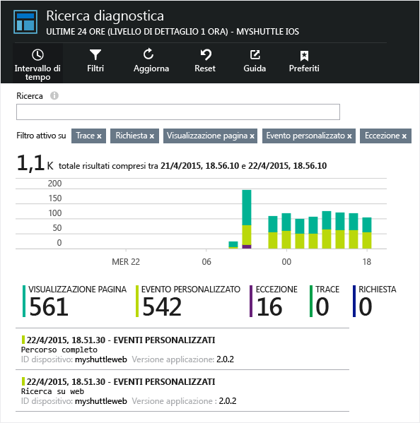
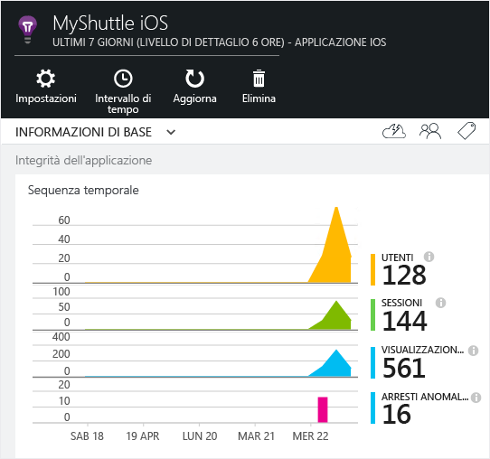
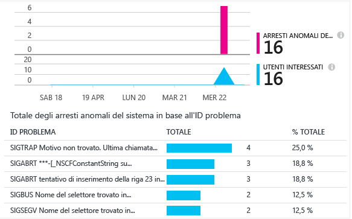

<properties 
    pageTitle="Application Insights per app per Android" 
    description="Analizzare l'utilizzo e le prestazioni dell'app Android con Application Insights." 
    services="application-insights" 
    documentationCenter="android"
    authors="alancameronwills" 
    manager="ronmart"/>

<tags 
    ms.service="application-insights" 
    ms.workload="mobile" 
    ms.tgt_pltfrm="mobile-android" 
    ms.devlang="na" 
    ms.topic="get-started-article" 
	ms.date="04/28/2015" 
    ms.author="awills"/>

# Application Insights per app per Android

Visual Studio Application Insights consente di monitorare un'applicazione per dispositivi mobili per verificarne l'utilizzo, gli eventi e gli arresti anomali.

## Requisiti

Sono necessari gli elementi seguenti:

* Una sottoscrizione con [Microsoft Azure](http://azure.com). È possibile accedere con un account Microsoft, che in genere si ottiene per Windows, XBox Live o altri servizi cloud Microsoft.
* Android Studio
* Android SDK Versione 9 o successive.

## Creare una risorsa di Application Insights

Nel [portale di Azure][portal] creare una nuova risorsa di Application Insights. Scegliere l'opzione Android.


Viene visualizzato un pannello che mostra le prestazioni e i dati di utilizzo relativi all'app. Per visualizzare di nuovo questo pannello al successivo accesso ad Azure, nella schermata Start dovrebbe venire visualizzato un riquadro per l'app. In alternativa, fare clic su Sfoglia per cercarla.

## Installare il plug-in Application Insights in Studio Android

(se non lo si è già fatto).

1.  Avviare Studio Android e configurare il plug-in

    

2.  Selezionare e installare il plug-in Application Insights Android Studio.

    

## <a name="sdk"></a>Installare SDK nell'applicazione


1.  Selezionare Strumenti -> Integra Application Insights.

    
    
3.  Creare un componente nella sottoscrizione

    

    Usare la chiave di strumentazione ricevuta dalla risorsa di Application Insights.

4.  Sincronizzare gradle per scaricare l'SDK ed eseguire l'integrazione con il progetto

    
    
    Altre informazioni sono disponibili alla [pagina di utilizzo](http://go.microsoft.com/fwlink/?LinkID=533220).
    
A questo punto il riferimento seguente è stato aggiunto al build.gradle dei moduli, autorizzazioni per `INTERNET` e `ACCESS_NETWORK_STATE`, e un tag di metadati contenente la chiave di strumentazione del componente è stato aggiunto al file `AndroidManifest.xml` del modulo

```java

    dependencies {
    compile 'com.microsoft.azure:applicationinsights-android:+'
    }
```

```xml

    <manifest>
    <uses-permission android:name="android.permission.INTERNET" />
    <uses-permission android:name="android.permission.ACCESS_NETWORK_STATE" />
    
    <application>
        <meta-data
            android:name="com.microsoft.applicationinsights.instrumentationKey"
            android:value="${AI_INSTRUMENTATION_KEY}" />
    </application>
    </manifest>
```

#### Facoltativo: impostare la chiave di strumentazione nel codice

È anche possibile impostare la chiave di strumentazione nel codice. Questa impostazione sostituirà quello impostato in `AndroidManifest.xml`

```java

    ApplicationInsights.setup(this, "<YOUR-IKEY-GOES-HERE>");
    ApplicationInsights.start();
```


## Usare l'SDK

Inizializzare l'SDK e iniziare a tenere traccia dei dati di telemetria.

Aggiungere l'importazione seguente all'attività radice dell'app

```java

     import com.microsoft.applicationinsights.library.ApplicationInsights;
```

E aggiungere quanto segue al callback `onCreate` dell'attività.

```java

    ApplicationInsights.setup(this.getApplicationContext(), this.getApplication());
    ApplicationInsights.start();
```

Dopo avere chiamato `ApplicationInsights.start()`, l'SDK inizierà a tenere traccia dell'attività del ciclo di vita Android e di qualsiasi eccezione non gestita.

> [AZURE.NOTE]Gli eventi del ciclo di vita dell'applicazione vengono raccolti solo in Android SDK versione 15 e successive (Ice Cream Sandwich+).

Oltre a questi possono essere raccolti eventi personalizzati, tracce, metriche ed eccezioni gestite. Usare l'[API di Application Insights][api] per inviare dati di telemetria.

* TrackEvent(eventName) per altre azioni utente
* TrackTrace(logEvent) per la [registrazione diagnostica][diagnostic]
* TrackHandledException(exception) in clausole catch
* TrackMetric(name, value) in un'attività in background per inviare report periodici delle metriche non associate a eventi specifici.

Un esempio di inizializzazione e di una raccolta di dati di telemetria manuale sono riportati di seguito.

```java

    public class MyActivity extends Activity {

      @Override
      protected void onCreate(Bundle savedInstanceState) {
        
        ApplicationInsights.setup(this);
        //... other initialization code ...//
        ApplicationInsights.start();
        
        // track telemetry data
        TelemetryClient client = TelemetryClient.getInstance();
        HashMap<String, String> properties = new HashMap<String, String>();
        properties.put("property1", "my custom property");
        client.trackEvent("sample event", properties);
        client.trackTrace("sample trace");
        client.trackMetric("sample metric", 3);
        client.trackHandledException(new Exception("sample exception"));
      }
    }
```

## <a name="run"></a> Eseguire il progetto

Eseguire l'applicazione (MAIUSC+F10 in Windows, CTRL+R in OS X) per generare dati di telemetria.

## Visualizzare i dati in Application Insights

Tornare a http://portal.azure.com e passare alla risorsa di Application Insights.

Fare clic su Cerca per aprire [Ricerca diagnostica][diagnostic], ovvero la finestra in cui vengono visualizzati i primi eventi. Se non viene visualizzato alcun contenuto, attendere uno o due minuti e fare clic su Aggiorna.



I dati verranno visualizzati nel pannello Panoramica non appena l'app viene usata.



Fare clic su qualsiasi grafico per ottenere altri dettagli. Selezionare ad esempio gli arresti anomali:




## <a name="usage"></a>Passaggi successivi

[Tenere traccia dell'utilizzo dell'app][track]

[Ricerca diagnostica][diagnostic]

[Esplora metriche][metrics]

[Risoluzione dei problemi][qna]


<!--Link references-->

[api]: app-insights-api-custom-events-metrics.md
[diagnostic]: app-insights-diagnostic-search.md
[metrics]: app-insights-metrics-explorer.md
[portal]: http://portal.azure.com/
[qna]: app-insights-troubleshoot-faq.md
[track]: app-insights-custom-events-metrics-api.md

 

<!---HONumber=August15_HO6-->