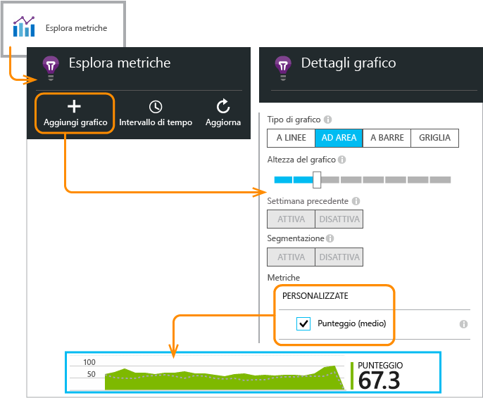
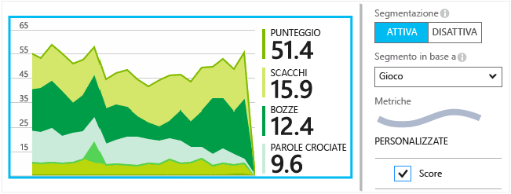

<properties 
	pageTitle="API di Application Insights per metriche ed eventi personalizzati" 
	description="Inserire alcune righe di codice nell'app desktop o per dispositivi, nella pagina Web o nel servizio per tenere traccia dell'utilizzo e diagnosticare i problemi." 
	services="application-insights"
    documentationCenter="" 
	authors="alancameronwills" 
	manager="douge"/>
 
<tags 
	ms.service="application-insights" 
	ms.workload="tbd" 
	ms.tgt_pltfrm="ibiza" 
	ms.devlang="multiple" 
	ms.topic="article" 
	ms.date="11/18/2015" 
	ms.author="awills"/>

# API di Application Insights per metriche ed eventi personalizzati 

*Application Insights è disponibile in anteprima.*

Inserire alcune righe di codice nell'applicazione per scoprire come viene usato dagli utenti o per agevolare la diagnosi dei problemi. È possibile inviare i dati di telemetria dalle app desktop e per dispositivi, dai client Web e dai server Web.

Gli agenti di raccolta dati di Application Insights usano questa API per inviare dati di telemetria standard come visualizzazioni pagina e report di eccezioni, ma è possibile usarli anche per inviare i propri dati di telemetria personalizzati.

## Riepilogo dell'API

L'API è uniforme in tutte le piattaforme, a parte alcune variazioni di lieve entità.

Metodo | Usato per
---|---
[`TrackPageView`](#page-views) | Pagine, schermate, pannelli o form
[`TrackEvent`](#track-event) | Azioni dell'utente e altri eventi. Usato per tenere traccia del comportamento dell'utente o per monitorare le prestazioni.
[`TrackMetric`](#track-metric) | Misurazioni delle prestazioni, ad esempio la lunghezza della coda, non correlate a eventi specifici
[`TrackException`](#track-exception)|Registrare le eccezioni per la diagnosi. Tracciare dove si verificano in relazione ad altri eventi ed esaminare le analisi dello stack.
[`TrackRequest`](#track-request)| Registrare la frequenza e la durata delle richieste del server per l'analisi delle prestazioni.
[`TrackTrace`](#track-trace)|Messaggi nei log di diagnostica. È anche possibile acquisire i log di terze parti.
[`TrackDependency`](#track-dependency)|Registrare la durata e la frequenza delle chiamate ai componenti esterni da cui dipende l'app.

È possibile [associare proprietà e metriche](#properties) alla maggior parte di queste chiamate di telemetria.


## <a name="prep"></a>Prima di iniziare

Completare queste operazioni, se non è stato ancora fatto:

* Aggiungere Application Insights SDK al progetto:
 * [Progetto ASP.NET][greenbrown]
 * [Progetto Windows][windows]
 * [Progetto Java][java] 
 * [JavaScript in ogni pagina Web][client]   

* Nel dispositivo o nel codice del server Web includere:

    *C#:* `using Microsoft.ApplicationInsights;`

    *VB:* `Imports Microsoft.ApplicationInsights`

    *Java:* `import com.microsoft.applicationinsights.TelemetryClient;`

## Costruire un oggetto TelemetryClient

Costruire un'istanza di TelemetryClient (tranne che in JavaScript nelle pagine Web):

*C#:*

    private TelemetryClient telemetry = new TelemetryClient();

*VB:*

    Private Dim telemetry As New TelemetryClient

*Java*

    private TelemetryClient telemetry = new TelemetryClient();

TelemetryClient è thread-safe.

Si consiglia di utilizzare un'istanza di `TelemetryClient` per ciascun modulo dell'applicazione. Ad esempio, ci potrebbe essere un `TelemetryClient` nel servizio web per segnalare le richieste http in ingresso e un altro in una classe middleware per segnalare gli eventi di logica di business. È possibile impostare proprietà quali `TelemetryClient.Context.User.Id` per tenere traccia degli utenti e delle sessioni o `TelemetryClient.Context.Device.Id` per identificare il computer. Queste informazioni sono associate a tutti gli eventi inviati dall'istanza.


## Tenere traccia di un evento

In Application Insights un *evento personalizzato* è un punto dati che è possibile visualizzare sia in [Esplora metriche][metrics] come conteggio aggregato sia come singole occorrenze in [Ricerca diagnostica][diagnostic]. (Non è correlata a MVC o ad altri "eventi" framework.)

Inserire chiamate Trackevents nel codice per contare la frequenza d'uso di una particolare funzionalità, la frequenza di raggiungimento di obiettivi specifici o di particolari tipi di errore.

Ad esempio, in un'app di gioco, inviare un evento ogni volta che un utente vince il gioco:

*JavaScript*

    appInsights.trackEvent("WinGame");

*C#*
    
    telemetry.TrackEvent("WinGame");

*VB*


    telemetry.TrackEvent("WinGame")

*Java*

    telemetry.trackEvent("WinGame");

In questo caso, "WinGame" è il nome visualizzato nel portale di Application Insights. Fare clic sul riquadro Eventi personalizzati nel pannello Panoramica:


Il grafico è raggruppato in base al Nome evento per visualizzare i relativi contributi degli eventi più significativi. Per controllarlo, selezionare il grafico e utilizzare il controllo di raggruppamento.


Nell'elenco sotto il grafico selezionare un nome evento. Fare clic per visualizzare le singole occorrenze dell'evento.


Per visualizzare altri dettagli, fare clic su qualsiasi occorrenza.


## Tenere traccia delle metriche

Usare TrackMetric per inviare le metriche che non sono associate a determinati eventi. Ad esempio, è possibile monitorare la lunghezza di una coda a intervalli regolari.

Le metriche vengono visualizzate come grafici statistici in Esplora metriche, ma a differenza degli eventi, non è possibile cercare singole occorrenze nella ricerca diagnostica.

I valori metrici devono essere >= 0 per essere visualizzati correttamente.


*JavaScript*

    appInsights.trackMetric("Queue", queue.Length);

*C#*

    telemetry.TrackMetric("Queue", queue.Length);

*VB*

    telemetry.TrackMetric("Queue", queue.Length)

*Java*

    telemetry.trackMetric("Queue", queue.Length);

Infatti, è possibile farlo in un thread in background:

*C#*

    private void Run() {
     var appInsights = new TelemetryClient();
     while (true) {
      Thread.Sleep(60000);
      appInsights.TrackMetric("Queue", queue.Length);
     }
    }


Per visualizzare i risultati, aprire Esplora metriche e aggiungere un nuovo grafico. Impostarlo per visualizzare le metriche.



Esistono tuttavia alcuni [limiti sul numero di metriche](#limits) da usare.

## Visualizzazioni pagina

In un'app per dispositivo o pagine Web i dati di telemetria delle visualizzazioni pagina vengono inviati per impostazione predefinita quando viene caricata ogni schermata o pagina. È tuttavia possibile modificarli per tenere traccia delle visualizzazioni pagina in momenti diversi o aggiuntivi. Ad esempio, in un'app che visualizza schede o pannelli, è possibile tenere traccia di una "pagina" ogni volta che l'utente apre un nuovo pannello.


I dati utente e sessione vengono inviati come proprietà insieme alle visualizzazioni pagina, in modo che i grafici utente e sessione si attivino in presenza dei dati di telemetria delle visualizzazioni pagina.

#### Visualizzazioni pagina personalizzate

*JavaScript*

    appInsights.trackPageView("tab1");

*C#*

    telemetry.TrackPageView("GameReviewPage");

*VB*

    telemetry.TrackPageView("GameReviewPage")


Se si hanno più schede in pagine HTML diverse, è possibile specificare anche l'URL:

    appInsights.trackPageView("tab1", "http://fabrikam.com/page1.htm");


## Tenere traccia di una richiesta

Questo metodo viene usato dal server SDK per registrare le richieste HTTP.

È anche possibile chiamarlo manualmente se si vogliono simulare le richieste in un contesto in cui il modulo del servizio Web non è in esecuzione.

*C#*

    // At start of processing this request:

    // Operation Id and Name are attached to all telemetry and help you identify
    // telemetry associated with one request:
    telemetry.Context.Operation.Id = Guid.NewGuid().ToString();
    telemetry.Context.Operation.Name = requestName;
    
    var stopwatch = System.Diagnostics.Stopwatch.StartNew();

    // ... process the request ...

    stopwatch.Stop();
    telemetryClient.TrackRequest(requestName, DateTime.Now,
       stopwatch.Elapsed, 
       "200", true);  // Response code, success


## Tenere traccia di un'eccezione

Inviare le eccezioni ad Application Insights: per [contarle][metrics], come un'indicazione della frequenza di un problema e per [esaminare le singole occorrenze][diagnostic]. I report includono le analisi dello stack.

*C#*

    try
    {
        ...
    }
    catch (Exception ex)
    {
       telemetry.TrackException(ex);
    }

*JavaScript*

    try
    {
       ...
    }
    catch (ex)
    {
       appInsights.trackException(ex);
    }

Gli SDK rilevano molte eccezioni automaticamente, pertanto non è sempre necessario richiamare TrackException in modo esplicito.

* ASP.NET: [Scrivere codice per intercettare le eccezioni](app-insights-asp-net-exceptions.md)
* J2EE: [Le eccezioni vengono rilevate automaticamente](app-insights-java-get-started.md#exceptions-and-request-failures)
* App Windows: [Arresti anomali del sistema vengono rilevati automaticamente](app-insights-windows-crashes.md)
* JavaScript: Rilevato automaticamente. Se si desidera disabilitare la raccolta automatica, aggiungere una riga al frammento di codice che si inserisce nelle pagine Web:

    ```
    ({
      instrumentationKey: "your key"
      , disableExceptionTracking: true
    })
    ```


## Monitorare una traccia 

Usare questa opzione per diagnosticare i problemi mediante l'invio di una traccia di navigazione ad Application Insights. È possibile inviare blocchi di dati di diagnostica e controllarli in [Ricerca diagnostica][diagnostic].

 

Gli [adattatori di log][trace] usano questa API per inviare i log di terze parti al portale.


*C#*

    telemetry.TrackTrace(message, SeverityLevel.Warning, properties);

Il limite delle dimensioni in `message` è molto superiore al limite per le proprietà. È possibile eseguire ricerche nel contenuto del messaggio, ma (a differenza dei valori di proprietà) non è possibile filtrarlo.

## Rilevamento delle dipendenze

Utilizzare questa chiamata per rilevare i tempi di risposta e percentuali di successo delle chiamate a un frammento di codice esterno. I risultati vengono visualizzati nei grafici dipendenze nel portale.

```C#

            var success = false;
            var startTime = DateTime.UtcNow;
            var timer = System.Diagnostics.Stopwatch.StartNew();
            try
            {
                success = dependency.Call();
            }
            finally
            {
                timer.Stop();
                telemetry.TrackDependency("myDependency", "myCall", startTime, timer.Elapsed, success);
            }
```

Tenere presente che il server SDK include un [modulo dipendenza](app-insights-dependencies.md) che consente di individuare e tracciare alcune chiamate della dipendenza automaticamente - ad esempio a database e API REST. È necessario installare un agente nel server per l'utilizzo del modulo. Utilizzare questa chiamata se si desidera tenere traccia di chiamate che non vengono intercettate dal rilevamento automatico o se non si desidera installare l'agente.

Per disattivare il modulo standard per il rilevamento delle dipendenze, modificare il file [ApplicationInsights.config](app-insights-configuration-with-applicationinsights-config.md) ed eliminare il riferimento a `DependencyCollector.DependencyTrackingTelemetryModule`.


## Scaricamento dei dati

In genere SDK invia i dati in momenti scelti per ridurre al minimo l'impatto sull'utente. In alcuni casi tuttavia è possibile scaricare il buffer, ad esempio, se si sta usando SDK in un'applicazione che si arresta.

*C#*

    telemetry.Flush();

    // Allow some time for flushing before shutdown.
    System.Threading.Thread.Sleep(1000);

Si noti che la funzione è asincrona per i canali in memoria, ma sincrona se si sceglie di utilizzare il [canale persistente](app-insights-windows-desktop.md#persistence-channel).


## Utenti autenticati

In un'app Web gli utenti sono identificati dai cookie per impostazione predefinita. Un utente può essere conteggiato più volte, se accede all'app da un computer o un browser diverso o se elimina i cookie.

Se gli utenti accedono all'app, è possibile ottenere un conteggio più preciso impostando l'ID dell'utente autenticato nel codice del browser:

*JavaScript*

```JS
    // Called when my app has identified the user.
    function Authenticated(signInId) {
      var validatedId = signInId.replace(/[,;=| ]+/g, "_");
      appInsights.setAuthenticatedUserContext(validatedId);
      ...
    }
```

In un'applicazione MVC, ad esempio ASP.NET web:

*Razor*

        @if (Request.IsAuthenticated)
        {
            <script>
                appInsights.setAuthenticatedUserContext("@User.Identity.Name".replace(/[,;=| ]+/g, "_"));
            </script>
        }

Non è necessario usare il nome di accesso dell'utente corrente. È sufficiente usare un ID univoco per l'utente. Non deve includere spazi o i caratteri `,;=|`.

L'ID utente viene inoltre impostato in un cookie di sessione e inviato al server. Se l'SDK del server è installato, l'ID dell'utente autenticato verrà inviato come parte delle proprietà di contesto della telemetria del client e del server, affinché sia possibile filtrarlo ed eseguire ricerche al suo interno.

Se l'app raggruppa gli utenti in account, è inoltre possibile passare un identificatore per l'account (con le stesse limitazioni di caratteri).


      appInsights.setAuthenticatedUserContext(validatedId, accountId);

In [Esplora metriche](app-insights-metrics-explorer.md), è possibile creare un grafico che conta gli **Utenti, autenticati** e **gli account utente**.

È inoltre possibile [ricercare][diagnostic] i punti dati del client con account e nomi utente specifici.

## <a name="properties"></a>Filtrare, cercare e segmentare i dati con proprietà

È possibile associare proprietà e misure agli eventi (anche a metriche, visualizzazioni pagine, eccezioni e altri dati di telemetria).

Le **proprietà** sono valori di stringa che è possibile usare per filtrare i dati di telemetria nei report di utilizzo. Ad esempio, se l'app comprende più giochi, è possibile associare il nome del gioco a ogni evento per vedere quali sono i giochi più diffusi.

Esiste un limite di circa 1 KB per la lunghezza di stringa. Se si vogliono inviare grandi quantità di dati, usare il parametro del messaggio di [TrackTrace](#track-trace).

Le **metriche** sono valori numerici che possono essere rappresentati graficamente. Ad esempio, è possibile verificare se esiste un aumento graduale nei punteggi raggiunti dai giocatori. I grafici possono essere segmentati in base alle proprietà inviate con l'evento, in modo da poter avere i grafici separati o in pila per giochi diversi.

I valori metrici devono essere >= 0 per essere visualizzati correttamente.


Esistono tuttavia alcuni [limiti sul numero di proprietà, sui valori delle proprietà e sulle metriche](#limits) che è possibile usare.


*JavaScript*

    appInsights.trackEvent
      ("WinGame",
         // String properties:
         {Game: currentGame.name, Difficulty: currentGame.difficulty},
         // Numeric metrics:
         {Score: currentGame.score, Opponents: currentGame.opponentCount}
         );

    appInsights.trackPageView
        ("page name", "http://fabrikam.com/pageurl.html",
          // String properties:
         {Game: currentGame.name, Difficulty: currentGame.difficulty},
         // Numeric metrics:
         {Score: currentGame.score, Opponents: currentGame.opponentCount}
         );
          

*C#*

    // Set up some properties and metrics:
    var properties = new Dictionary <string, string> 
       {{"game", currentGame.Name}, {"difficulty", currentGame.Difficulty}};
    var metrics = new Dictionary <string, double>
       {{"Score", currentGame.Score}, {"Opponents", currentGame.OpponentCount}};

    // Send the event:
    telemetry.TrackEvent("WinGame", properties, metrics);


*VB*

    ' Set up some properties:
    Dim properties = New Dictionary (Of String, String)
    properties.Add("game", currentGame.Name)
    properties.Add("difficulty", currentGame.Difficulty)

    Dim metrics = New Dictionary (Of String, Double)
    metrics.Add("Score", currentGame.Score)
    metrics.Add("Opponents", currentGame.OpponentCount)

    ' Send the event:
    telemetry.TrackEvent("WinGame", properties, metrics)


*Java*
    
    Map<String, String> properties = new HashMap<String, String>();
    properties.put("game", currentGame.getName());
    properties.put("difficulty", currentGame.getDifficulty());
    
    Map<String, Double> metrics = new HashMap<String, Double>();
    metrics.put("Score", currentGame.getScore());
    metrics.put("Opponents", currentGame.getOpponentCount());
    
    telemetry.trackEvent("WinGame", properties, metrics);


> [AZURE.NOTE]Assicurarsi di non registrare informazioni personali identificabili nelle proprietà.

**Se è stata usata la metrica**, aprire Esplora metriche e selezionare la metrica dal gruppo personalizzato:


*Se non viene visualizzata l'unità di misura, o se l'intestazione personalizzata non è presente, chiudere il pannello di selezione e riprovare più tardi. Ci può talvolta volere un'ora per aggregare le metriche attraverso la pipeline.*

**Se si usano proprietà e metriche**, segmentare la metrica in base alla proprietà:





In **Ricerca diagnostica** è possibile visualizzare le proprietà e le metriche di singole occorrenze di un evento.


Usare il campo Ricerca per visualizzare le occorrenze di eventi con un valore della proprietà particolare.


[Altre informazioni sulle espressioni di ricerca][diagnostic].

#### Metodo alternativo per impostare proprietà e metriche

Se è più pratico, è possibile raccogliere i parametri di un evento in un oggetto separato:

    var event = new EventTelemetry();

    event.Name = "WinGame";
    event.Metrics["processingTime"] = stopwatch.Elapsed.TotalMilliseconds;
    event.Properties["game"] = currentGame.Name;
    event.Properties["difficulty"] = currentGame.Difficulty;
    event.Metrics["Score"] = currentGame.Score;
    event.Metrics["Opponents"] = currentGame.Opponents.Length;

    telemetry.TrackEvent(event);


#### <a name="timed"></a> Temporizzazione degli eventi

A volte si vuole rappresentare in un grafico il tempo necessario per eseguire un'azione. Ad esempio, si potrebbe voler sapere quanto tempo occorre agli utenti per scegliere tra le opzioni disponibili in un gioco. Questo è un esempio utile dell'uso del parametro di misurazione.


*C#*

    var stopwatch = System.Diagnostics.Stopwatch.StartNew();

    // ... perform the timed action ...

    stopwatch.Stop();

    var metrics = new Dictionary <string, double>
       {{"processingTime", stopwatch.Elapsed.TotalMilliseconds}};

    // Set up some properties:
    var properties = new Dictionary <string, string> 
       {{"signalSource", currentSignalSource.Name}};

    // Send the event:
    telemetry.TrackEvent("SignalProcessed", properties, metrics);


## <a name="defaults"></a>Proprietà predefinite per i dati di telemetria personalizzati

Se si intende impostare solo i valori di proprietà predefiniti per alcuni eventi personalizzati scritti, è possibile impostarli in un TelemetryClient. Vengono associati a ogni elemento di telemetria inviato da quel client.

*C#*

    using Microsoft.ApplicationInsights.DataContracts;

    var gameTelemetry = new TelemetryClient();
    gameTelemetry.Context.Properties["Game"] = currentGame.Name;
    // Now all telemetry will automatically be sent with the context property:
    gameTelemetry.TrackEvent("WinGame");
    
*VB*

    Dim gameTelemetry = New TelemetryClient()
    gameTelemetry.Context.Properties("Game") = currentGame.Name
    ' Now all telemetry will automatically be sent with the context property:
    gameTelemetry.TrackEvent("WinGame")

*Java*

    import com.microsoft.applicationinsights.TelemetryClient;
    import com.microsoft.applicationinsights.TelemetryContext;
    ...


    TelemetryClient gameTelemetry = new TelemetryClient();
    TelemetryContext context = gameTelemetry.getContext();
    context.getProperties().put("Game", currentGame.Name);
    
    gameTelemetry.TrackEvent("WinGame");


    
Le singole chiamate di telemetria possono sostituire i valori predefiniti nei relativi dizionari delle proprietà.

**Per i client Web di JavaScript**, [usare gli inizializzatori di telemetria JavaScript](#js-initializer).

**Per aggiungere proprietà a tutti i dati di telemetria** inclusi i dati da moduli di raccolta standard, [creare un inizializzatore di telemetria](app-insights-api-filtering-sampling.md#add-properties).


## Campionamento, filtri e pre-elaborazione della telemetria 

È possibile scrivere il codice per elaborare i dati di telemetria prima che venga inviato da SDK. L'elaborazione include i dati inviati dai moduli telemetria standard come la raccolta delle richieste HTTP e la raccolta delle dipendenze.

* [Aggiungere proprietà](app-insights-api-filtering-sampling.md#add-properties) di telemetria - ad esempio numeri di versione o valori calcolati da altre proprietà.
* [Campionamento](app-insights-api-filtering-sampling.md#sampling) consente di ridurre il volume dei dati inviati dall'app al portale, senza influenzare le metriche visualizzate e senza influire sulla possibilità di diagnosticare i problemi navigando tra elementi correlati come eccezioni, richieste e visualizzazioni di pagina.
* [Filtro](app-insights-api-filtering-sampling.md#filtering) riduce il volume. È possibile controllare gli elementi inviati o eliminati, ma è necessario tener conto dell'effetto sulle metriche. A seconda di come si eliminano gli elementi, è possibile perdere la possibilità di navigare tra elementi correlati.

[Altre informazioni](app-insights-api-filtering-sampling.md)


## Disabilitazione della telemetria

Per **avviare e arrestare in modo dinamico** la raccolta e la trasmissione di dati di telemetria:

*C#*

```C#

    using  Microsoft.ApplicationInsights.Extensibility;

    TelemetryConfiguration.Active.DisableTelemetry = true;
```

Per **disabilitare gli agenti di raccolta standard selezionati** - ad esempio, i contatori delle prestazioni, delle richieste HTTP o delle dipendenze - eliminare o impostare come commento le righe pertinenti in [ApplicationInsights.config][config]. È possibile eseguire questa operazione, ad esempio, se si vogliono inviare i propri dati TrackRequest.

## <a name="debug"></a>Modalità di sviluppo

Durante il debug, è utile che la telemetria venga velocizzata nella pipeline in modo da visualizzare immediatamente i risultati. È possibile che vengano visualizzati anche altri messaggi che consentono di tracciare eventuali problemi con i dati di telemetria. Disattivarla in fase di produzione, poiché potrebbe rallentare l'app.


*C#*
    
    TelemetryConfiguration.Active.TelemetryChannel.DeveloperMode = true;

*VB*

    TelemetryConfiguration.Active.TelemetryChannel.DeveloperMode = True


## <a name="ikey"></a> Impostare la chiave di strumentazione per la telemetria personalizzata selezionata

*C#*
    
    var telemetry = new TelemetryClient();
    telemetry.Context.InstrumentationKey = "---my key---";
    // ...


## <a name="dynamic-ikey"></a> Chiave di strumentazione dinamica

Per evitare di combinare i dati di telemetria da ambienti di sviluppo, test e produzione, è possibile [creare risorse distinte di Application Insights][create] e modificare le relative chiavi a seconda dell'ambiente.

Invece di ottenere la chiave di strumentazione dal file di configurazione, è possibile impostarla nel codice. Impostare la chiave in un metodo di inizializzazione, ad esempio global.aspx.cs in un servizio ASP.NET:

*C#*

    protected void Application_Start()
    {
      Microsoft.ApplicationInsights.Extensibility.
        TelemetryConfiguration.Active.InstrumentationKey = 
          // - for example -
          WebConfigurationManager.Settings["ikey"];
      ...

*JavaScript*

    appInsights.config.instrumentationKey = myKey; 


Nelle pagine Web è possibile impostarla dallo stato del server Web anziché codificarla nello script. Ad esempio, in una pagina Web generata in un'app ASP.NET:

*JavaScript in Razor*

    <script type="text/javascript">
    // Standard Application Insights web page script:
    var appInsights = window.appInsights || function(config){ ...
    // Modify this part:
    }({instrumentationKey:  
      // Generate from server property:
      @Microsoft.ApplicationInsights.Extensibility.
         TelemetryConfiguration.Active.InstrumentationKey"
    }) // ...


## TelemetryContext

TelemetryClient dispone di una proprietà di contesto, che contiene un numero di valori che vengono inviati insieme a tutti i dati di telemetria. Sono in genere impostati dai moduli di telemetria standard, ma è possibile anche impostarli personalmente. Ad esempio:

    telemetryClient.Context.Operation.Name = "MyOperationName";

Se si imposta uno di questi valori personalmente, provare a rimuovere la riga pertinente da [ApplicationInsights.config][config], in modo che i valori personali e quelli standard non si confondano.

* **Componente** identifica l'app e la relativa versione
* **Dispositivo** i dati relativi al dispositivo in cui è in esecuzione l'app (nelle app Web, questo è il dispositivo client o server da cui vengono inviati i dati di telemetria)
* **InstrumentationKey** identifica la risorsa di Application Insights in Azure dove verranno visualizzati i dati di telemetria. Viene in genere presa dal file ApplicationInsights.config
* **Percorso** identifica la posizione geografica del dispositivo.
* **Operazione** nelle app Web, la richiesta HTTP corrente. In altri tipi di app è possibile impostarla per raggruppare gli eventi tra loro.
 * L'**ID**: un valore generato che mette in correlazione eventi diversi, in modo che quando si analizza qualsiasi evento in Ricerca diagnostica, è possibile trovare "Elementi correlati"
 * **Nome**: un identificatore, in genere l'URL della richiesta HTTP. 
 * **SyntheticSource**: se non è null o vuota, questa stringa indica che l'origine della richiesta è stata identificata come un test Web o un robot. Per impostazione predefinita verranno esclusi dai calcoli in Esplora metriche.
* **Proprietà** proprietà che vengono inviate con tutti i dati di telemetria. Può essere sostituita in singole chiamate Trace*.
* **Sessione** identifica la sessione dell'utente. L'ID viene impostato su un valore generato, che viene modificato quando l'utente non è stato attivo per un periodo di tempo.
* **Utente**: le informazioni dell'utente. 


## Limiti

Esistono tuttavia alcuni limiti sul numero di metriche e eventi per applicazione.

1. Fino a 500 punti dati di telemetria al secondo per chiave di strumentazione (ovvero, per ogni applicazione). Sono inclusi i dati di telemetria standard inviati dai moduli SDK e gli eventi personalizzati, le metriche e altri dati di telemetria inviati dal codice.
1.	Al massimo 200 nomi di metrica univoci e 200 nomi di proprietà univoci per l'applicazione. Le metriche includono l'invio di dati tramite TrackMetric, nonché le misurazioni di altri tipi di dati, ad esempio gli eventi. Le metriche e nomi di proprietà sono globali per una chiave di strumentazione, non definiti nell'ambito del tipo di dati.
2.	Le proprietà possono essere usate per le operazioni di filtro e di raggruppamento solo quando possiedono meno di 100 valori univoci per ogni proprietà. Superati i 100 valori univoci, la proprietà può essere ancora usata per la ricerca e il filtro ma non per i filtri.
3.	Proprietà standard, ad esempio Nome richiesta e URL pagina sono limitate a 1000 valori univoci alla settimana. Superati i 1000 valori univoci, i valori aggiuntivi vengono contrassegnati come "Altri valori". Il valore originale può essere ancora usato per la ricerca full-text e il filtro.

* *D: per quanto tempo vengono conservati i dati?*

    Vedere l'argomento relativo a [conservazione dei dati e privacy][data].


## Documentazione di riferimento

* [Riferimento ASP.NET](https://msdn.microsoft.com/library/dn817570.aspx)
* [Riferimento Java](http://dl.windowsazure.com/applicationinsights/javadoc/)
* [Informazioni di riferimento su JavaScript](https://github.com/Microsoft/ApplicationInsights-JS/blob/master/API-reference.md)
* [Android SDK](https://github.com/Microsoft/ApplicationInsights-Android)
* [iOS SDK](https://github.com/Microsoft/ApplicationInsights-iOS)


## Codice SDK

* [ASP.NET Core SDK](https://github.com/Microsoft/ApplicationInsights-dotnet)
* [ASP.NET 5](https://github.com/Microsoft/ApplicationInsights-aspnet5)
* [Android SDK](https://github.com/Microsoft/ApplicationInsights-Android)
* [SDK per Java](https://github.com/Microsoft/ApplicationInsights-Java)
* [JavaScript SDK](https://github.com/Microsoft/ApplicationInsights-JS)
* [iOS SDK](https://github.com/Microsoft/ApplicationInsights-iOS)
* [Tutte le piattaforme](https://github.com/Microsoft?utf8=%E2%9C%93&query=applicationInsights)

## Domande

* *Le chiamate Track\_() quali eccezioni potrebbero generare?*
    
    Nessuna. Non è necessario eseguirne il wrapping in clausole try-catch. Se l'SDK rileva un problema, registrerà un messaggio che verrà visualizzato nell'output della console di debug e quindi nella ricerca diagnostica per approfondirne i dettagli.


* *Esiste un'API REST?*

    Sì, ma è non ancora pubblicata.

## <a name="next"></a>Passaggi successivi


[Cercare eventi e log][diagnostic]

[Esempi e procedure dettagliate](app-insights-code-samples.md)

[Risoluzione dei problemi][qna]


<!--Link references-->

[client]: app-insights-javascript.md
[config]: app-insights-configuration-with-applicationinsights-config.md
[create]: app-insights-create-new-resource.md
[data]: app-insights-data-retention-privacy.md
[diagnostic]: app-insights-diagnostic-search.md
[exceptions]: app-insights-asp-net-exceptions.md
[greenbrown]: app-insights-start-monitoring-app-health-usage.md
[java]: app-insights-java-get-started.md
[metrics]: app-insights-metrics-explorer.md
[qna]: app-insights-troubleshoot-faq.md
[trace]: app-insights-search-diagnostic-logs.md
[windows]: app-insights-windows-get-started.md

 

<!---HONumber=AcomDC_1125_2015-->