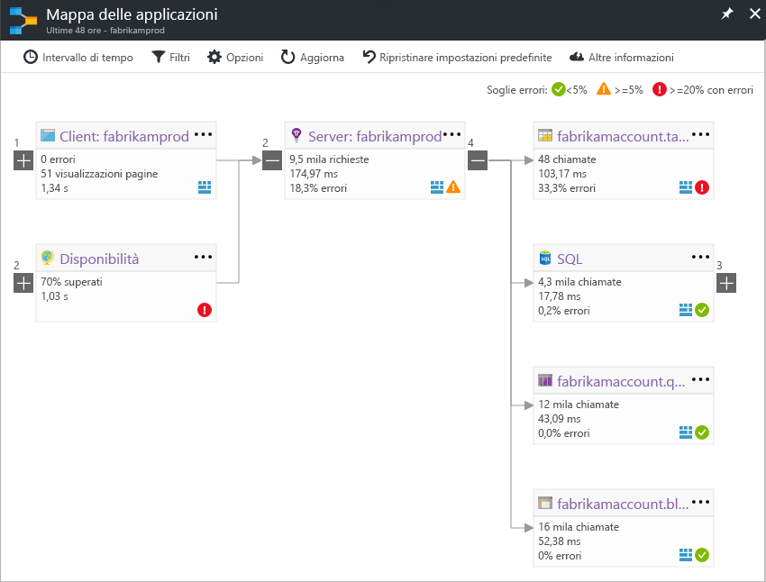

# Mappa delle applicazioni in Application Insights
In [Azure Application Insights](app-insights-overview.md), Mappa delle applicazioni è un layout visivo delle relazioni di dipendenza dei componenti dell'applicazione. Ogni componente mostra gli indicatori KPI, ad esempio carico, prestazioni, errori e avvisi per individuare eventuali componenti che generano un errore o un problema di prestazioni. È possibile fare clic da qualsiasi componente per ottenere una diagnostica più dettagliata, ad esempio sugli eventi di Application Insights. Se l'app usa i servizi di Azure, è possibile anche fare clic sulla diagnostica di Azure, ad esempio per consigli di Advisor su database SQL.

Come altri tipi di grafico, è possibile aggiungere una mappa delle applicazioni al dashboard di Azure, in cui è completamente funzionale. 

## Aprire la mappa delle applicazioni
Aprire la mappa nel pannello di panoramica dell'applicazione:

La mappa mostra:

* Test della disponibilità
* Componente lato client (monitorato con JavaScript SDK)
* Componente lato server
* Dipendenze dei componenti client e server

È possibile espandere e comprimere i gruppi di collegamento di dipendenza:

Se si dispone di numerose dipendenze di un tipo (SQL, HTTP e così via), possono essere visualizzate raggruppate. 

## Individuazione di problemi
Ogni nodo dispone di indicatori di prestazioni rilevanti, ad esempio tassi di carico, prestazioni ed errori per il componente. 

Le icone di avviso evidenziano possibili problemi. Un avviso di colore arancione indica che si verificano errori nelle richieste, visualizzazioni di pagina o chiamate di dipendenza. Il rosso indica una percentuale di errore superiore al 5%. Se si vuole modificare queste soglie, aprire Opzioni.

Vengono visualizzati anche avvisi attivi: 

Se si usa SQL Azure, è presente un'icona che indica quando sono disponibili consigli su come è possibile migliorare le prestazioni. 

Per ottenere altri dettagli, fare clic su qualsiasi icona:

## Diagnostica tramite clic
Ciascun nodo della mappa permette una diagnostica tramite clic mirati. Le opzioni variano a seconda del tipo del nodo.

Per i componenti ospitati in Azure, le opzioni includono collegamenti diretti a essi.

## Filtri e intervallo di tempo
Per impostazione predefinita, la mappa riepiloga tutti i dati disponibili per l'intervallo di tempo scelto. è possibile filtrarlo in modo da includere solo i nomi di operazioni o dipendenze specifici.

* Nome dell'operazione: include sia le visualizzazioni pagina che i tipi di richiesta lato server. Con questa opzione, la mappa mostra l'indicatore KPI nel nodo lato server/client solo per le operazioni selezionate. Mostra le dipendenze chiamate nel contesto di tali operazioni specifiche.
* Nome di base delle dipendenze: include le dipendenze del browser AJAX e lato server. Se si segnalano dati di telemetria di dipendenza personalizzati con l'API TrackDependency, questi vengono visualizzati anche qui. È possibile selezionare le dipendenze da mostrare sulla mappa. Attualmente, questa selezione non filtra le richieste lato server o le visualizzazioni di pagina lato client.

## Salvare i filtri
Per salvare i filtri applicati, bloccare la visualizzazione filtrata su un [dashboard](app-insights-dashboards.md).

## Riquadro dell'errore
Quando si fa clic su un nodo nella mappa, viene visualizzato un riquadro dell'errore sul lato destro che riassume i problemi relativi a tale nodo. Gli errori vengono prima raggruppati per ID operazione e quindi per ID del problema.

Per passare all'istanza più recente dell'errore fare clic sull'errore stesso.

## Integrità delle risorse
Per alcuni tipi di risorsa, l'integrità delle risorse viene visualizzata nella parte superiore del riquadro dell'errore. Ad esempio, facendo clic su un nodo SQL verranno visualizzati l'integrità del database ed eventuali avvisi che sono stati attivati.

È possibile fare clic sul nome della risorsa per visualizzare le metriche di panoramica standard per la risorsa.

## Mappe delle app del sistema end-to-end

*È necessaria la versione 2.3 o successive di SDK*

Se l'applicazione include diversi componenti, ad esempio un servizio back-end oltre all'App Web, è anche possibile visualizzarli tutti in una mappa integrata delle app.

La mappa dell'app consente di trovare i nodi del server seguendo le chiamate di dipendenza HTTP inviate tra i server con Application Insights SDK installato. Si presuppone che ogni risorsa di Application Insights contenga un server.

### Mappa con app multi-ruolo (anteprima)

La funzionalità di anteprima della mappa dell'app multi-ruolo consente di usare la mappa dell'app con più server che inviano dati alla stessa risorsa o alla stessa chiave di strumentazione di Application Insights. I server nella mappa vengono segmentati in base alla proprietà cloud_RoleName negli elementi di telemetria. Impostare *Multi-role Application Map* (Mappa dell'applicazione multi-ruolo) su *On* (Attivo) nel pannello Anteprime per abilitare questa configurazione.

Questo approccio potrebbe essere necessario in un'applicazione di micro-servizi o in altri scenari in cui si desidera correlare gli eventi tra più server all'interno di una singola risorsa di Application Insights.

## Video

> [!VIDEO https://channel9.msdn.com/events/Connect/2016/112/player] 

## Commenti e suggerimenti
Inviare commenti e suggerimenti tramite l'apposita opzione del portale.

## Passaggi successivi

* [Portale di Azure](https://portal.azure.com)
