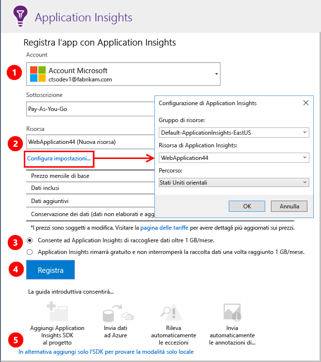

# Installare Application Insights per un sito Web ASP.NET

Questa procedura consente di configurare un'app Web ASP.NET per l'invio di dati di telemetria al servizio [Azure Application Insights](app-insights-overview.md). È valida per le app ASP.NET ospitate nel server IIS o nel cloud. Offre grafici e un linguaggio di query avanzato che permettono di comprendere le prestazioni dell'app e il suo utilizzo da parte degli utenti, oltre ad avvisi automatici in caso di errori o problemi di prestazioni. Molti sviluppatori trovano utili queste funzionalità così come sono, ma è anche possibile estendere e personalizzare i dati di telemetria, se necessario.

Il programma di installazione richiede pochi clic in Visual Studio. Per evitare addebiti è possibile limitare il volume dei dati di telemetria. In questo modo è possibile provare le funzionalità ed eseguire il debug o monitorare un sito con un numero di utenti limitato. Se si decide di monitorare l'intero sito di produzione, è facile aumentare il limite in un secondo momento.

## Prima di iniziare
Sono necessari:

* Visual Studio 2013 Update 3 o versioni successive. È preferibile una versione successiva.
* Una sottoscrizione a [Microsoft Azure](http://azure.com). Se il team o l'organizzazione ha una sottoscrizione di Azure, il proprietario potrà aggiungere l'utente alla sottoscrizione usando il rispettivo [account Microsoft](http://live.com).

Se si è interessati, vedere gli argomenti alternativi seguenti:

* [Strumentazione di un'app Web in fase di esecuzione](app-insights-monitor-performance-live-website-now.md)
* [Servizi cloud di Azure](app-insights-cloudservices.md)

## Passaggio 1: Aggiungere Application Insights SDK

Fare clic con il pulsante destro del mouse sul progetto dell'app Web in Esplora soluzioni e scegliere **Aggiungi** > **Application Insights Telemetry** oppure **Configura Application Insights**.

In Visual Studio 2015, un'opzione per l'aggiunta di Application Insights è disponibile anche nella finestra di dialogo Nuovo progetto.

Passare alla pagina di configurazione di Application Insights:

**a.** Selezionare l'account e la sottoscrizione usati per accedere ad Azure.

**b.** Selezionare la risorsa in Azure in cui si vogliono visualizzare i dati dell'app. In genere:

* Usare un'[unica risorsa per diversi componenti](app-insights-monitor-multi-role-apps.md) di una singola applicazione. 
* Creare risorse separate per applicazioni non correlate.
 
Se si vuole impostare il gruppo di risorse o la località in cui verranno archiviati i dati, fare clic su **Configura impostazioni**. I gruppi di risorse vengono usati per controllare l'accesso ai dati. Se si hanno diverse app che fanno parte dello stesso sistema, ad esempio, è possibile inserire i relativi dati di Application Insights nello stesso gruppo di risorse.

**c.** Impostare un tetto massimo al limite del volume di dati gratuito, per evitare eventuali addebiti. Application Insights è gratuito fino a un determinato volume di dati di telemetria. Dopo aver creato la risorsa, è possibile modificare la selezione nel portale aprendo **Funzionalità + prezzi** > **Gestione del volume dati** > **Limite di utilizzo volume giornaliero**.

**d.** Fare clic su **Registra** per proseguire e configurare Application Insights per l'app Web. I dati di telemetria verranno inviati al [portale di Azure](https://portal.azure.com), sia durante il debug che dopo la pubblicazione dell'app.

**e.** Per non inviare i dati di telemetria al portale durante il debug, è possibile aggiungere Application Insights SDK all'app senza configurare una risorsa nel portale. Si potranno visualizzare i dati di telemetria in Visual Studio durante il debug. Successivamente, è possibile tornare a questa pagina di configurazione oppure attendere di aver distribuito l'app e quindi [attivare la telemetria in fase di esecuzione](app-insights-monitor-performance-live-website-now.md).

## Passaggio 2: Eseguire l'app
Eseguire l'app con F5. Aprire pagine diverse per generare alcuni dati di telemetria.

In Visual Studio verrà visualizzato il conteggio degli eventi che sono stati registrati.

## Passaggio 3: Visualizzare i dati di telemetria
È possibile visualizzare i dati di telemetria in Visual Studio o nel portale Web di Application Insights. Cercare i dati di telemetria in Visual Studio per eseguire il debug dell'app. Monitorare le prestazioni e l'utilizzo nel portale Web quando il sistema è attivo. 

### Visualizzare i dati di telemetria in Visual Studio

In Visual Studio aprire la finestra di Application Insights. Fare clic sul pulsante **Application Insights** oppure fare clic con il pulsante destro del mouse sul progetto in Esplora soluzioni, scegliere **Application Insights** e quindi fare clic su **Cerca nei dati di telemetria attivi**.

Nella finestra Ricerca di Application Insights di Visual Studio esaminare i dati di telemetria generati sul lato server dell'app nella visualizzazione **Dati di Dati di telemetria della sessione di debug**. Sperimentare i filtri e fare clic su qualsiasi evento per visualizzare altri dettagli.

> [!NOTE]
> Se non vengono visualizzati dati, verificare che l'intervallo di tempo sia corretto e fare clic sull'icona di ricerca.

[Uso di Application Insights in Visual Studio](app-insights-visual-studio.md).

### Visualizzare i dati di telemetria nel portale Web

Se non si è scelto di installare solo l'SDK, è possibile visualizzare i dati di telemetria anche nel portale Web di Application Insights. Il portale offre un maggior numero di grafici, strumenti di analisi e viste di più componenti rispetto a Visual Studio. Nel portale sono anche disponibili avvisi.

Aprire la risorsa Application Insights. Accedere al [portale di Azure](https://portal.azure.com/) per cercarla o fare clic con il pulsante destro del mouse sul progetto in Visual Studio e scegliere la risorsa.

> [!NOTE]
> Se viene visualizzato un errore di accesso, è possibile che si abbiano più set di credenziali Microsoft e che l'accesso sia stato eseguito con il set sbagliato. Nel portale disconnettersi e accedere nuovamente.

Nel portale verrà visualizzata la telemetria dell'app.

Per visualizzare altri dettagli nel portale, fare clic su qualsiasi riquadro o grafico.

[Altre informazioni sull'uso di Application Insights nel portale di Azure](app-insights-dashboards.md).

## Passaggio 4: Pubblicare l'app
Pubblicare l'app nel server IIS o in Azure. Verificare in [Flusso metriche attive](app-insights-metrics-explorer.md#live-metrics-stream) che tutto funzioni correttamente.

La telemetria viene creata nel portale di Application Insights, in cui è possibile monitorare le metriche, eseguire ricerche sui dati di telemetria e configurare i [dashboard](app-insights-dashboards.md), nonché usare l'avanzato [linguaggio di query di Log Analytics](https://docs.loganalytics.io/) per analizzare l'utilizzo e le prestazioni o trovare eventi specifici.

È anche possibile continuare ad analizzare i dati di telemetria in [Visual Studio](app-insights-visual-studio.md) con strumenti come la ricerca diagnostica e le [tendenze](app-insights-visual-studio-trends.md).

> [!NOTE]
> Se la quantità di dati di telemetria inviata dall'app sta per raggiungere le [limitazioni](app-insights-pricing.md#limits-summary), viene attivato il [campionamento](app-insights-sampling.md) automatico. Il campionamento riduce la quantità di dati di telemetria inviata dall'app mantenendo i dati correlati per scopi diagnostici.
>
>

##  Le impostazioni sono state completate.

Congratulazioni. Il pacchetto Application Insights è stato installato nell'app e configurato per l'invio di dati di telemetria al servizio Application Insights in Azure.

La risorsa di Azure che riceve i dati di telemetria dell'app è identificata da una *chiave di strumentazione*, disponibile nel file ApplicationInsights.config.

## Eseguire l'aggiornamento alle versioni future dell'SDK
Per eseguire l'aggiornamento a una [nuova versione dell'SDK](https://github.com/Microsoft/ApplicationInsights-dotnet-server/releases), aprire di nuovo **Gestione pacchetti NuGet** e filtrare i pacchetti installati. Selezionare **Microsoft.ApplicationInsights.Web** e scegliere **Aggiorna**.

Se sono state apportate personalizzazioni a ApplicationInsights.config, salvarne una copia prima di eseguire l'aggiornamento. Successivamente, unire le modifiche nella nuova versione.

## Video

> [!VIDEO https://channel9.msdn.com/events/Connect/2016/100/player]

## Passaggi successivi

### Altri dati di telemetria

* **[Dati sul browser e sul caricamento di pagine](app-insights-javascript.md)**: inserire un frammento di codice nelle pagine Web.
* **[Ottenere un monitoraggio più dettagliato di dipendenze ed eccezioni](app-insights-monitor-performance-live-website-now.md)**: installare Status Monitor nel server.
* **[Scrivere codice per gli eventi personalizzati](app-insights-api-custom-events-metrics.md)**: ottenere conteggi, orari o misurazioni delle azioni utente.
* **[Ottenere dati di log](app-insights-asp-net-trace-logs.md)**: correlare i dati di log con i dati di telemetria.

### Analisi

* **[Uso di Application Insights in Visual Studio](app-insights-visual-studio.md)** Include informazioni su debug con telemetria, ricerca diagnostica e drill-through nel codice.
* **[Uso del portale Application Insights](app-insights-dashboards.md)**  Include informazioni su dashboard, strumenti avanzati di diagnostica e di analisi, avvisi, mappa attiva delle dipendenze dell'applicazione ed esportazione dei dati di telemetria.
* **[Analytics](app-insights-analytics-tour.md)**: linguaggio di query avanzato.

### Avvisi

* [Test di disponibilità](app-insights-monitor-web-app-availability.md): creare test per verificare che il sito sia visibile sul Web.
* [Diagnostica intelligente](app-insights-proactive-diagnostics.md): questi test vengono eseguiti automaticamente e non è quindi necessario effettuare alcuna operazione per configurarli. Se l'app ha una frequenza insolita di richieste non riuscite, verrà comunicato automaticamente.
* [Avvisi per le metriche](app-insights-alerts.md): impostare questi avvisi per essere avvertiti se una metrica supera una soglia. È possibile impostarli nelle metriche personalizzate di cui si scrive il codice nell'app.

### Automazione

* [Automatizzare la creazione di risorse di Application Insights](app-insights-powershell.md)
