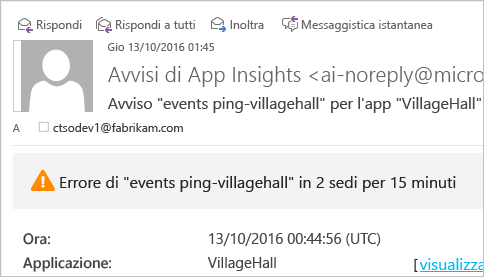
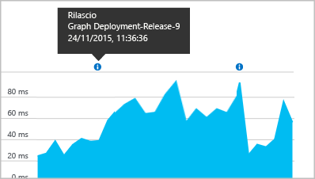

# <a name="set-up-application-insights-for-aspnet"></a>Installare Application Insights per ASP.NET
[Visual Studio Application Insights](app-insights-overview.md) consente di monitorare un'applicazione live per [rilevare e diagnosticare i problemi di prestazioni e le eccezioni](app-insights-detect-triage-diagnose.md) e [rilevare la modalità di uso dell'app](app-insights-overview-usage.md).  Può essere usato per app ospitate nei server IIS locali o in VM del cloud oppure per app Web di Azure.

## <a name="before-you-start"></a>Prima di iniziare
Sono necessari:

* Visual Studio 2013 Update 3 o versioni successive. È preferibile una versione successiva.
* Una sottoscrizione a [Microsoft Azure](http://azure.com). Se il team o l'organizzazione ha una sottoscrizione di Azure, il proprietario potrà aggiungere l'utente alla sottoscrizione usando il rispettivo [account Microsoft](http://live.com). 

Se si è interessati, sono disponibili articoli alternativi sugli argomenti seguenti:

* [Strumentazione di un'app Web in fase di esecuzione](app-insights-monitor-performance-live-website-now.md)
* [Servizi cloud di Azure](app-insights-cloudservices.md)

## <a name="a-nameidea-1-add-application-insights-sdk"></a><a name="ide"></a> 1. Aggiungere Application Insights SDK
### <a name="if-its-a-new-project"></a>Se è un nuovo progetto...
Quando si crea un nuovo progetto in Visual Studio, verificare che Application Insights sia selezionato. 


### <a name="-or-if-its-an-existing-project"></a>o se è un progetto esistente
Fare clic con il pulsante destro del mouse sul progetto in Esplora soluzioni e scegliere **Aggiungi Application Insights Telemetry** o **Configura Application Insights**.


* Se si usa un progetto ASP.NET Core, [seguire queste istruzioni per correggere alcune righe di codice](https://github.com/Microsoft/ApplicationInsights-aspnetcore/wiki/Getting-Started#add-application-insights-instrumentation-code-to-startupcs). 

## <a name="a-nameruna-2-run-your-app"></a><a name="run"></a> 2. Eseguire l'app
Eseguire l'applicazione con F5 e provarla aprendo pagine diverse per generare alcuni dati di telemetria.

In Visual Studio verrà visualizzato il conteggio degli eventi che sono stati registrati. 


## <a name="3-see-your-telemetry"></a>3. Visualizzare i dati di telemetria
### <a name="-in-visual-studio"></a>In Visual Studio
Aprire la finestra di Application Insights in Visual Studio facendo clic sul pulsante Application Insights oppure facendo clic con il pulsante destro del mouse sul progetto in Esplora soluzioni:


Questa visualizzazione contiene i dati di telemetria generati sul lato server dell'app. Sperimentare i filtri e fare clic su qualsiasi evento per visualizzare altri dettagli.

[Uso di Application Insights in Visual Studio](app-insights-visual-studio.md).

<a name="monitor"></a> 

### <a name="-in-the-portal"></a>Nel portale
Se non è stata scelta l'opzione *Installa solo SDK* , i dati di telemetria possono essere visualizzati anche nel portale Web di Application Insights. 

Il portale offre un maggior numero di grafici, strumenti di analisi e dashboard rispetto a Visual Studio. 

Aprire la risorsa Application Insights nel [portale di Azure](https://portal.azure.com/).


Nel portale verrà visualizzata la telemetria dell'app: 

* I primi dati di telemetria vengono visualizzati in [Flusso metriche attive](app-insights-metrics-explorer.md#live-metrics-stream).
* I singoli eventi vengono visualizzati in **Cerca** (1). La visualizzazione dei dati potrebbe richiedere alcuni minuti. Fare clic su qualsiasi evento per visualizzarne le proprietà. 
* Le metriche aggregate vengono visualizzate nei grafici (2). Potrebbe essere necessario qualche minuto prima che i dati vengano visualizzati qui. Fare clic su qualsiasi grafico per aprire un pannello con altri dettagli.

[Altre informazioni sull'uso di Application Insights nel portale di Azure](app-insights-dashboards.md).

## <a name="4-publish-your-app"></a>4. Pubblicare l'app
Pubblicare l'app nel server IIS o in Azure. Verificare in [Flusso metriche attive](app-insights-metrics-explorer.md#live-metrics-stream) che tutto funzioni correttamente.

Nel portale di Application Insights verrà creata la telemetria e sarà possibile monitorare le metriche, eseguire ricerche sui dati di telemetria e configurare i [dashboard](app-insights-dashboards.md), nonché usare l'avanzato [linguaggio di query di Analisi](app-insights-analytics.md) per analizzare l'utilizzo e le prestazioni e trovare eventi specifici. 

È anche possibile continuare ad analizzare i dati di telemetria in [Visual Studio](app-insights-visual-studio.md) con strumenti come la ricerca diagnostica e [Tendenze](app-insights-visual-studio-trends.md).

> [!NOTE]
> Se la quantità di dati di telemetria inviata dall'app sta per raggiungere le [limitazioni](app-insights-pricing.md#limits-summary), viene attivato il [campionamento](app-insights-sampling.md) automatico. Il campionamento riduce la quantità di dati di telemetria inviata dall'app mantenendo i dati correlati per scopi diagnostici.
> 
> 

## <a name="a-namelanda-what-did-add-application-insights-do"></a><a name="land"></a> Funzione del comando "Aggiungi Application Insights"
Application Insights invia i dati di telemetria dell'app al portale di Application Insights, ospitato in Microsoft Azure:


Il comando esegue quindi tre operazioni:

1. Aggiunge il pacchetto NuGet della versione Web di Application Insights SDK al progetto. In Visual Studio fare clic con il pulsante destro del mouse sul progetto e scegliere Gestisci pacchetti NuGet.
2. Crea una risorsa di Application Insights nel [portale di Azure](https://portal.azure.com/). È qui che verranno visualizzati i dati. Recupera la *chiave di strumentazione* , che identifica la risorsa.
3. Inserisce la chiave di strumentazione in `ApplicationInsights.config`, in modo che l'SDK possa inviare dati di telemetria al portale.

Se si vuole, è possibile eseguire questi passaggi manualmente per [ASP.NET 4](app-insights-windows-services.md) o [ASP.NET Core](https://github.com/Microsoft/ApplicationInsights-aspnetcore/wiki/Getting-Started).

### <a name="to-upgrade-to-future-sdk-versions"></a>Per eseguire l'aggiornamento a future versioni di SDK
Per eseguire l'aggiornamento a una [nuova versione dell'SDK](https://github.com/Microsoft/ApplicationInsights-dotnet-server/releases), riaprire Gestione pacchetti NuGet e filtrare i pacchetti installati. Selezionare Microsoft.ApplicationInsights.Web e scegliere Aggiorna

Se sono state eseguite tutte le personalizzazioni apportate al file ApplicationInsights.config, salvarne una copia prima di eseguire l'aggiornamento e, successivamente, unire le modifiche nella nuova versione.

## <a name="add-more-telemetry"></a>Aggiungere altri dati di telemetria
### <a name="web-pages-and-singlepage-apps"></a>Pagine Web e app a singola pagina
1. [Aggiungere il frammento JavaScript](app-insights-javascript.md) alle pagine Web per evidenziare nei pannelli Browser e Utilizzo i dati sulle visualizzazioni delle pagine, i tempi di caricamento, le eccezioni del browser, le prestazioni delle chiamate AJAX e i conteggi degli utenti e delle sessioni.
2. [Scrivere codice per gli eventi personalizzati](app-insights-api-custom-events-metrics.md) delle azioni utente relative a conteggi, ore o misure.

### <a name="dependencies-exceptions-and-performance-counters"></a>Dipendenze, eccezioni e contatori delle prestazioni
[Installare Status Monitor](app-insights-monitor-performance-live-website-now.md) in ogni computer server per ottenere dati di telemetria aggiuntivi sull'app. Risultato finale:

* [Contatori delle prestazioni](app-insights-performance-counters.md) - 
  CPU, memoria, disco e altri contatori delle prestazioni relativi all'app. 
* [Eccezioni](app-insights-asp-net-exceptions.md): dati di telemetria più dettagliati per alcune eccezioni.
* [Dipendenze](app-insights-asp-net-dependencies.md): chiamate all'API REST o ai servizi SQL. Stabilire se le risposte lente dei componenti esterni causano problemi di prestazioni nell'app. Se l'app viene eseguita in .NET 4.6, non è necessario Status Monitor per ottenere questi dati di telemetria.

### <a name="diagnostic-code"></a>Codice di diagnostica
In caso di problemi, è possibile inserire nell'app il codice per diagnosticarli in diversi modi:

* [Acquisire le tracce dei log](app-insights-asp-net-trace-logs.md): se si usa già Log4N, NLog o System.Diagnostics.Trace per registrare gli eventi di traccia, si può inviare l'output ad Application Insights per poterlo correlare alle richieste, effettuarvi ricerche e analizzarlo. 
* [Metriche ed eventi personalizzati](app-insights-api-custom-events-metrics.md): usare TrackEvent() e TrackMetric() nel codice delle pagine Web o nel server.
* [Contrassegnare i dati di telemetria con proprietà aggiuntive](app-insights-api-filtering-sampling.md#add-properties)

Usare la [ricerca](app-insights-diagnostic-search.md) per trovare e correlare eventi specifici e [Analytics](app-insights-analytics.md) per eseguire query più avanzate.

## <a name="alerts"></a>Avvisi
È importante conoscere per primi eventuali problemi dell'app, senza aspettare che siano gli utenti a comunicarlo. 

* [Creare test Web](app-insights-monitor-web-app-availability.md) per assicurarsi che il sito sia visibile sul Web.
* La [diagnostica proattiva](app-insights-proactive-diagnostics.md) viene eseguita automaticamente, se l'app ha una determinata quantità minima di traffico. Non è necessario eseguire alcuna operazione per configurarla. Se l'app ha una frequenza insolita di richieste non riuscite, verrà comunicato automaticamente.
* [Impostare avvisi per le metriche](app-insights-alerts.md) per essere avvertiti se una metrica supera una soglia. È possibile impostarli nelle metriche personalizzate di cui si scrive il codice nell'app.

Per impostazione predefinita, le notifiche di avviso vengono inviate al proprietario della sottoscrizione di Azure. 



## <a name="version-and-release-tracking"></a>Verifica della versione
### <a name="track-application-version"></a>Tenere traccia della versione dell'applicazione
Assicurarsi che `buildinfo.config` sia generato dal processo di MSBuild. Nel file con estensione csproj, aggiungere:  

```XML

    <PropertyGroup>
      <GenerateBuildInfoConfigFile>true</GenerateBuildInfoConfigFile>    <IncludeServerNameInBuildInfo>true</IncludeServerNameInBuildInfo>
    </PropertyGroup> 
```

Quando ha le informazioni di compilazione, il modulo Web di Application Insights aggiunge automaticamente la **versione dell'applicazione** come proprietà a ogni elemento dei dati di telemetria. Questo consente di filtrare in base alla versione quando si eseguono [ricerche diagnostiche](app-insights-diagnostic-search.md) o quando si [esplorano le metriche](app-insights-metrics-explorer.md). 

Si noti tuttavia che il numero di versione di build viene generato solo da Build MS, non dallo sviluppatore di build in Visual Studio.

### <a name="release-annotations"></a>Annotazioni sulle versioni
Se si usa Visual Studio Team Services, è possibile [aggiungere un marcatore di annotazione](app-insights-annotations.md) ai grafici quando si rilascia una nuova versione.



## <a name="next-steps"></a>Passaggi successivi
|  |
| --- | --- |
| **[Uso di Application Insights in Visual Studio](app-insights-visual-studio.md)**<br/>Debug con telemetria, ricerca diagnostica e drill-through nel codice. |
| **[Uso del portale Application Insights](app-insights-dashboards.md)**<br/>Dashboard, strumenti avanzati di diagnostica e di analisi, avvisi, mappa attiva delle dipendenze dell'applicazione ed esportazione dei dati di telemetria. |
| **[Aggiungere altri dati](app-insights-asp-net-more.md)**<br/>Monitorare l'utilizzo, la disponibilità, le dipendenze e le eccezioni, integrare le tracce dei framework di registrazione e scrivere telemetria personalizzata. |


<!--HONumber=Nov16_HO2-->


