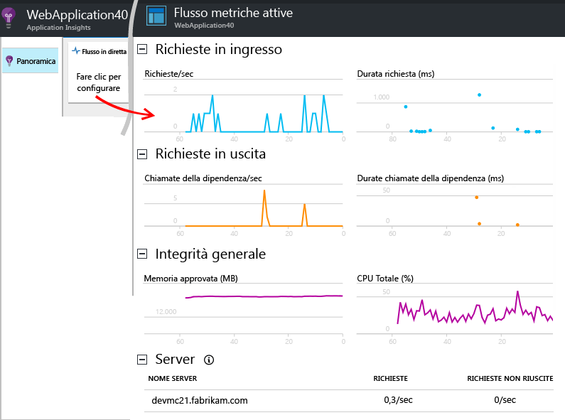
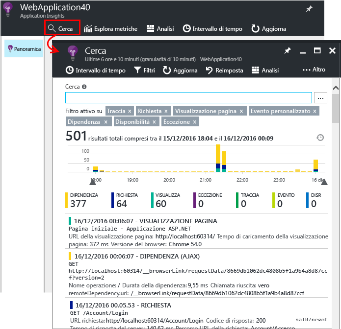
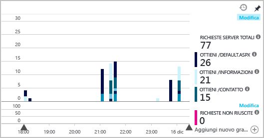

# <a name="set-up-application-insights-for-your-aspnet-website"></a>Installare Application Insights per un sito Web ASP.NET
[Azure Application Insights](app-insights-overview.md) monitora l'applicazione attiva per [rilevare e diagnosticare i problemi di prestazioni e le eccezioni](app-insights-detect-triage-diagnose.md). Consente anche di [individuare come viene usata l'app](app-insights-overview-usage.md). Può essere usato per la funzionalità App Web del servizio app di Azure, nonché per le app ospitate nei server IIS locali o in VM del cloud.

## <a name="before-you-start"></a>Prima di iniziare
Sono necessari:

* Visual Studio 2013 Update 3 o versioni successive. È preferibile una versione successiva.
* Una sottoscrizione a [Microsoft Azure](http://azure.com). Se il team o l'organizzazione ha una sottoscrizione di Azure, il proprietario potrà aggiungere l'utente alla sottoscrizione usando il rispettivo [account Microsoft](http://live.com).

Se si è interessati, vedere gli argomenti alternativi seguenti:

* [Strumentazione di un'app Web in fase di esecuzione](app-insights-monitor-performance-live-website-now.md)
* [Servizi cloud di Azure](app-insights-cloudservices.md)

## <a name="ide"></a>Passaggio 1: Aggiungere Application Insights SDK

Fare clic con il pulsante destro del mouse sul progetto dell'app Web in Esplora soluzioni e scegliere **Aggiungi** e quindi **Application Insights Telemetry** oppure **Configura Application Insights**.


In Visual Studio 2015, un'opzione per l'aggiunta di Application Insights è disponibile anche nella finestra di dialogo Nuovo progetto.

Passare alla pagina di configurazione di Application Insights:


1. Selezionare l'account e la sottoscrizione usati per accedere ad Azure.
2. Selezionare la risorsa in Azure in cui si vogliono visualizzare i dati dell'app. In genere si crea una risorsa separata per ogni app. Se si vuole impostare il gruppo di risorse o la località in cui verranno archiviati i dati, fare clic su **Configura impostazioni**. I gruppi di risorse vengono usati per controllare l'accesso ai dati. Se si hanno diverse app che fanno parte dello stesso sistema, ad esempio, è possibile inserire i relativi dati di Application Insights nello stesso gruppo di risorse.
3. Application Insights è gratuito fino a un determinato volume di dati di telemetria. È possibile imporre un limite a tale volume per evitare addebiti. Dopo aver creato la risorsa, è possibile modificare la selezione nel portale aprendo **Funzionalità + prezzi**, **gestione dati** e quindi **Limite di utilizzo volume giornaliero**.
4. Fare clic su **Registra** per proseguire e configurare Application Insights per l'app Web. I dati di telemetria verranno inviati al [portale di Azure](https://portal.azure.com), sia durante il debug che dopo la pubblicazione dell'app.
5. In alternativa, è possibile aggiungere semplicemente Application Insights SDK all'app. In questo caso, si potranno visualizzare i dati di telemetria in Visual Studio durante il debug. Successivamente, è possibile tornare a questa pagina di configurazione oppure attendere di aver distribuito l'app e quindi [attivare la telemetria in fase di esecuzione](app-insights-monitor-performance-live-website-now.md).


## <a name="run"></a>Passaggio 2: Eseguire l'app
Eseguire l'app con F5. Aprire pagine diverse per generare alcuni dati di telemetria.

In Visual Studio verrà visualizzato il conteggio degli eventi che sono stati registrati.


## <a name="step-3-see-your-telemetry-in-visual-studio-or-application-insights"></a>Passaggio 3: Visualizzare i dati di telemetria in Visual Studio o Application Insights
È possibile visualizzare i dati di telemetria in Visual Studio o nel portale Web di Application Insights.

**In Visual Studio** aprire la finestra di Application Insights. Fare clic sul pulsante **Application Insights** oppure fare clic con il pulsante destro del mouse sul progetto in Esplora soluzioni, scegliere **Application Insights** e quindi fare clic su **Cerca nei dati di telemetria attivi**.

Nella finestra Ricerca di Application Insights di Visual Studio esaminare i dati di telemetria generati sul lato server dell'app nella visualizzazione **Dati di Dati di telemetria della sessione di debug**. Sperimentare i filtri e fare clic su qualsiasi evento per visualizzare altri dettagli.


> [!NOTE]
> Se non vengono visualizzati dati, verificare che l'intervallo di tempo sia corretto e fare clic sull'icona di ricerca.

[Uso di Application Insights in Visual Studio](app-insights-visual-studio.md).

<a name="monitor"></a>
### <a name="the-application-insights-web-portal"></a>Portale Web di Application Insights
Se non si è scelto di installare solo l'SDK, è possibile visualizzare i dati di telemetria anche nel **portale Web di Application Insights**. Il portale offre un maggior numero di grafici, strumenti di analisi e dashboard rispetto a Visual Studio.

Aprire la risorsa Application Insights. Accedere al [portale di Azure](https://portal.azure.com/) per cercarla o fare clic con il pulsante destro del mouse sul progetto in Visual Studio e scegliere la risorsa.


> [!NOTE]
> Se viene visualizzato un errore di accesso, è possibile che si abbiano più set di credenziali Microsoft e che l'accesso sia stato eseguito con il set sbagliato. Nel portale disconnettersi e accedere nuovamente.

Nel portale verrà visualizzata la telemetria dell'app.


Per visualizzare altri dettagli, fare clic su qualsiasi riquadro o grafico.

### <a name="more-details-in-the-application-insights-web-portal"></a>Altri dettagli nel portale Web di Application Insights
Di seguito sono riportati alcuni esempi degli altri dettagli visualizzabili nel portale.

* [**Flusso metriche attive**](app-insights-live-stream.md) visualizza la telemetria quasi immediatamente.

    

    Aprire Flusso metriche attive mentre l'app è in esecuzione per consentire la connessione.

    Flusso metriche attive visualizza la telemetria solo per un minuto dopo l'invio. Per altre analisi cronologiche, usare Ricerca, Esplora metriche e Analisi. La visualizzazione dei dati in queste posizioni potrebbe richiedere alcuni minuti.

* [**Cerca**](app-insights-diagnostic-search.md) visualizza singoli eventi, ad esempio richieste, eccezioni e visualizzazioni pagina. È possibile filtrare per tipo di evento, corrispondenza di termini e valori di proprietà. Fare clic su qualsiasi evento per visualizzarne le proprietà e gli eventi correlati.

    

 * In modalità di sviluppo è possibile visualizzare diversi eventi di dipendenza (AJAX). Si tratta di sincronizzazioni tra il browser e l'emulatore del server. Per nasconderle, fare clic sul filtro **Dipendenza**.
* Le [**metriche aggregate**](app-insights-metrics-explorer.md), ad esempio frequenza delle richieste e degli errori, vengono visualizzate nei grafici. Fare clic su qualsiasi grafico per aprire un pannello con altri dettagli. Fare clic sul tag **Modifica** di un grafico per impostare filtri e dimensioni.

    

[Altre informazioni sull'uso di Application Insights nel portale di Azure](app-insights-dashboards.md).

## <a name="step-4-publish-your-app"></a>Passaggio 4: Pubblicare l'app
Pubblicare l'app nel server IIS o in Azure. Verificare in [Flusso metriche attive](app-insights-metrics-explorer.md#live-metrics-stream) che tutto funzioni correttamente.

La telemetria viene creata nel portale di Application Insights, in cui è possibile monitorare le metriche, eseguire ricerche sui dati di telemetria e configurare i [dashboard](app-insights-dashboards.md), nonché usare l'avanzato [linguaggio di query di Analisi](app-insights-analytics.md) per analizzare l'utilizzo e le prestazioni o trovare eventi specifici.

È anche possibile continuare ad analizzare i dati di telemetria in [Visual Studio](app-insights-visual-studio.md) con strumenti come la ricerca diagnostica e le [tendenze](app-insights-visual-studio-trends.md).

> [!NOTE]
> Se la quantità di dati di telemetria inviata dall'app sta per raggiungere le [limitazioni](app-insights-pricing.md#limits-summary), viene attivato il [campionamento](app-insights-sampling.md) automatico. Il campionamento riduce la quantità di dati di telemetria inviata dall'app mantenendo i dati correlati per scopi diagnostici.
>
>

## <a name="land"></a>Funzione del comando Aggiungi Application Insights
Application Insights invia i dati di telemetria dell'app al portale di Application Insights, ospitato in Azure.


Il comando esegue quindi tre operazioni:

1. Aggiunge il pacchetto NuGet di SDK di Application Insights Web al progetto. Per visualizzarlo in Visual Studio, fare clic con il pulsante destro del mouse sul progetto e scegliere **Gestisci pacchetti NuGet**.
2. Crea una risorsa Application Insights nel [portale di Azure](https://portal.azure.com/), in cui vengono visualizzati i dati, e recupera la *chiave di strumentazione* che identifica la risorsa.
3. Inserisce la chiave di strumentazione in `ApplicationInsights.config`, in modo che l'SDK possa inviare dati di telemetria al portale.

Se si vuole, è possibile eseguire questi passaggi manualmente per [ASP.NET 4](app-insights-windows-services.md) o [ASP.NET Core](https://github.com/Microsoft/ApplicationInsights-aspnetcore/wiki/Getting-Started).

### <a name="upgrade-to-future-sdk-versions"></a>Eseguire l'aggiornamento alle versioni future dell'SDK
Per eseguire l'aggiornamento a una [nuova versione dell'SDK](https://github.com/Microsoft/ApplicationInsights-dotnet-server/releases), aprire di nuovo **Gestione pacchetti NuGet** e filtrare i pacchetti installati. Selezionare **Microsoft.ApplicationInsights.Web** e scegliere **Aggiorna**.

Se sono state apportate personalizzazioni a ApplicationInsights.config, salvarne una copia prima di eseguire l'aggiornamento. Successivamente, unire le modifiche nella nuova versione.

## <a name="add-more-telemetry"></a>Aggiungere altri dati di telemetria
Di seguito sono riportati altri tipi di dati di telemetria che è possibile aggiungere.
### <a name="dependencies-exceptions-and-performance-counters"></a>Dipendenze, eccezioni e contatori delle prestazioni

[Installare Status Monitor](http://go.microsoft.com/fwlink/?LinkId=506648) in ogni computer server IIS per ottenere dati di telemetria aggiuntivi sulle app Web. Se è già installato, non è necessario eseguire alcuna operazione. Status Monitor potrebbe essere già stato usato per avviare il monitoraggio di un'app in fase di esecuzione.

Usando Status Monitor insieme a SDK in fase di compilazione, si ottiene un set più completo di dati di telemetria, che include:

* [Contatori delle prestazioni](app-insights-performance-counters.md): CPU, memoria, disco e altri contatori delle prestazioni relativi all'app.
* [Eccezioni](app-insights-asp-net-exceptions.md): dati di telemetria più dettagliati per alcune eccezioni.
* [Dipendenze](app-insights-asp-net-dependencies.md): inclusi i valori restituiti.

### <a name="webpages-and-single-page-apps"></a>Pagine Web e app a singola pagina
1. [Aggiungere il frammento JavaScript](app-insights-javascript.md) alle pagine Web per mostrare dati su visualizzazioni pagina, tempi di caricamento, eccezioni del browser, prestazioni delle chiamate AJAX e conteggi degli utenti e delle sessioni. Questi dati verranno visualizzati nei pannelli Browser e Utilizzo.
2. [Scrivere codice per gli eventi personalizzati](app-insights-api-custom-events-metrics.md) delle azioni utente relative a conteggi, ore o misure.


### <a name="diagnostic-code"></a>Codice di diagnostica
In caso di problemi, è possibile inserire nell'app il codice per diagnosticarli in diversi modi:

* [Acquisire le tracce dei log](app-insights-asp-net-trace-logs.md): se si usa già Log4N, NLog o System.Diagnostics.Trace per registrare gli eventi di traccia, l'output può essere inviato ad Application Insights. È possibile correlare questo output alle richieste, effettuarvi ricerche e analizzarlo.
* [Metriche ed eventi personalizzati](app-insights-api-custom-events-metrics.md): usare TrackEvent() e TrackMetric() nel codice delle pagine Web o del server.
* [Contrassegnare i dati di telemetria con proprietà aggiuntive](app-insights-api-filtering-sampling.md#add-properties).

Usare la [ricerca](app-insights-diagnostic-search.md) per trovare e correlare eventi specifici e [Analytics](app-insights-analytics.md) per eseguire query più avanzate.

## <a name="alerts"></a>Avvisi
È importante conoscere per primi eventuali problemi dell'app.

* [Test di disponibilità](app-insights-monitor-web-app-availability.md): creare test per verificare che il sito sia visibile sul Web.
* [Diagnostica intelligente](app-insights-proactive-diagnostics.md): questi test vengono eseguiti automaticamente e non è quindi necessario effettuare alcuna operazione per configurarli. Se l'app ha una frequenza insolita di richieste non riuscite, verrà comunicato automaticamente.
* [Avvisi per le metriche](app-insights-alerts.md): impostare questi avvisi per essere avvertiti se una metrica supera una soglia. È possibile impostarli nelle metriche personalizzate di cui si scrive il codice nell'app.

Per impostazione predefinita, le notifiche di avviso vengono inviate al proprietario della sottoscrizione di Azure.


## <a name="version-and-release-tracking"></a>Verifica della versione
Per tenere traccia della versione dell'applicazione, assicurarsi che il processo di Microsoft Build Engine generi `buildinfo.config`. Nel file con estensione csproj, aggiungere:  

```XML

    <PropertyGroup>
      <GenerateBuildInfoConfigFile>true</GenerateBuildInfoConfigFile>    <IncludeServerNameInBuildInfo>true</IncludeServerNameInBuildInfo>
    </PropertyGroup>
```

Quando ha le informazioni di compilazione, il modulo Web di Application Insights aggiunge automaticamente la **versione dell'applicazione** come proprietà a ogni elemento dei dati di telemetria. Questo consente di applicare filtri in base alla versione quando si eseguono [ricerche diagnostiche](app-insights-diagnostic-search.md) o quando si [esaminano le metriche](app-insights-metrics-explorer.md).

Si noti tuttavia che il numero di versione della build viene generato solo da Microsoft Build Engine, non dalla build dello sviluppatore in Visual Studio.

### <a name="release-annotations"></a>Annotazioni sulle versioni
Se si usa Visual Studio Team Services, è possibile [aggiungere un marcatore di annotazione](app-insights-annotations.md) ai grafici quando si rilascia una nuova versione. L'immagine seguente illustra come viene visualizzato il marcatore.


## <a name="video"></a>Video

> [!VIDEO https://channel9.msdn.com/events/Connect/2016/100/player]

## <a name="next-steps"></a>Passaggi successivi
**[Uso di Application Insights in Visual Studio](app-insights-visual-studio.md)**<br/>Include informazioni su debug con telemetria, ricerca diagnostica e drill-through nel codice.

**[Uso del portale Application Insights](app-insights-dashboards.md)**<br/> Include informazioni su dashboard, strumenti avanzati di diagnostica e di analisi, avvisi, mappa attiva delle dipendenze dell'applicazione ed esportazione dei dati di telemetria.

