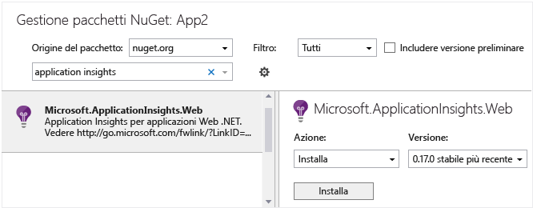

<properties
   pageTitle="Application Insights per Servizi cloud di Azure"
   description="Monitorare i ruoli Web e di lavoro in modo efficace con Application Insights"
   services="application-insights"
   documentationCenter=""
   authors="soubhagyadash"
   manager="victormu"
   editor="alancameronwills"/>

<tags
   ms.service="application-insights"
   ms.devlang="na"
   ms.tgt_pltfrm="ibiza"
   ms.topic="article"
   ms.workload="tbd"
   ms.date="06/17/2015"
   ms.author="sdash"/>

# Application Insights per Servizi cloud di Azure

*Application Insights è disponibile in anteprima*

Le [app del servizio Cloud di Microsoft Azure](http://azure.microsoft.com/services/cloud-services/) possono essere monitorate da [Visual Studio Application Insights][start] in termini di disponibilità, prestazioni, errori e utilizzo. Con il feedback ottenuto sulle prestazioni e sull'efficacia dell'app in circostanze normali, è possibile prendere decisioni informate sulla direzione della progettazione in ogni ciclo di vita di sviluppo.

È necessaria una sottoscrizione con [Microsoft Azure](http://azure.com). È possibile accedere con un account Microsoft, che in genere si ottiene per Windows, XBox Live o altri servizi cloud Microsoft.

#### Applicazione di esempio instrumentata con Application Insights

Esaminare questa [applicazione di esempio](https://github.com/Microsoft/ApplicationInsights-Home/tree/master/Samples/AzureEmailService) in cui Application Insights viene aggiunto a un servizio cloud con due ruoli di lavoro ospitati in Azure.

Di seguito viene illustrato come adattare nello stesso modo il proprio progetto di servizio cloud.

## Creare una risorsa di Application Insights per ogni ruolo

Una risorsa di Application Insights rappresenta il punto in cui vengono analizzati e visualizzati i dati di telemetria.

1.  Nel [portale di Azure][portal] creare una nuova risorsa di Application Insights. Scegliere l'app ASP.NET per il tipo di applicazione. 

    

2.  Eseguire una copia della chiave di strumentazione. Sarà necessaria per configurare l'SDK.

    

È in genere preferibile creare una risorsa separata per i dati da ogni ruolo Web e di lavoro.

In alternativa, è possibile inviare dati da tutti i ruoli a una sola risorsa, ma impostare una [proprietà predefinita][apidefaults] in modo da potere filtrare o raggruppare i risultati di ogni ruolo.

## Installare l'SDK in ogni progetto

1. In Visual Studio modificare i pacchetti NuGet del progetto dell'app per cloud.

    

2. Aggiungere il pacchetto NuGet [Application Insights per Web](http://www.nuget.org/packages/Microsoft.ApplicationInsights.Web). Questa versione dell'SDK include i moduli che aggiungono il contesto del server come le informazioni sui ruoli.

    

3. Configurare l'SDK per inviare i dati alla risorsa di Application Insights.

    Aprire `ApplicationInsights.config` e inserire la riga seguente:

    `<InstrumentationKey>` *chiave di strumentazione copiata* `</InstrumentationKey>`

    Usare la chiave di strumentazione copiata dalla risorsa di Application Insights.

4. Impostare il file ApplicationInsights.config da copiare sempre nella directory di output. Questa operazione è necessaria solo per i ruoli di lavoro.

In alternativa, è possibile impostare la chiave di strumentazione (iKey) nel codice. Ciò è utile, ad esempio, se si vuole usare le impostazioni di configurazione dei servizi di Azure (CSCFG) per gestire le chiavi di strumentazione per i rispettivi ambienti. L'[applicazione di esempio](https://github.com/Microsoft/ApplicationInsights-Home/tree/master/Samples/AzureEmailService) illustra come è possibile impostare la chiave iKey:

* [Ruolo Web](https://github.com/Microsoft/ApplicationInsights-Home/blob/master/Samples/AzureEmailService/MvcWebRole/Global.asax.cs#L27)
* [Ruolo di lavoro](https://github.com/Microsoft/ApplicationInsights-Home/blob/master/Samples/AzureEmailService/WorkerRoleA/WorkerRoleA.cs#L232)
* [Per pagine Web](https://github.com/Microsoft/ApplicationInsights-Home/blob/master/Samples/AzureEmailService/MvcWebRole/Views/Shared/_Layout.cshtml#L13)

## Usare l'SDK per segnalare la telemetria
### Segnalare richieste
 * Nei ruoli Web il modulo delle richieste raccoglie automaticamente i dati sulle richieste HTTP. Vedere il progetto [MVCWebRole di esempio](https://github.com/Microsoft/ApplicationInsights-Home/tree/master/Samples/AzureEmailService/MvcWebRole) per alcuni esempi di come è possibile eseguire l'override del comportamento di raccolta predefinito. 
 * È possibile acquisire le prestazioni delle chiamate ai ruoli di lavoro tenendone traccia nello stesso modo in cui avviene per le richieste HTTP. In Application Insights, il tipo di telemetria per le richieste misura un'unità di lavoro lato server denominata che può essere programmata e può avere indipendentemente esito negativo o positivo. Mentre le richieste HTTP vengono acquisite automaticamente dall'SDK, è possibile inserire il proprio codice per tenere traccia delle richieste ai ruoli di lavoro.
 * Vedere i due ruoli di lavoro di esempio instrumentati per segnalare le richieste: [WorkerRoleA](https://github.com/Microsoft/ApplicationInsights-Home/tree/master/Samples/AzureEmailService/WorkerRoleA) e [WorkerRoleB](https://github.com/Microsoft/ApplicationInsights-Home/tree/master/Samples/AzureEmailService/WorkerRoleB)

### Segnalare dipendenze
  * Application Insights SDK può segnalare le chiamate eseguite dall'app alle dipendenze esterne, ad esempio le API REST e le istanze di SQL Server. Ciò consente di vedere se una specifica dipendenza sta causando ritardi nelle risposte o errori.
  * Per tenere traccia delle dipendenze, è necessario impostare il ruolo Web o di lavoro con l'[agente di Application Insights](app-insights-monitor-performance-live-website-now.md), noto anche come "Status Monitor".
  * Per usare l'agente di Application Insights con i ruoli Web/di lavoro:
    * Aggiungere la cartella [AppInsightsAgent](https://github.com/Microsoft/ApplicationInsights-Home/tree/master/Samples/AzureEmailService/WorkerRoleA/AppInsightsAgent) e i due file in essa contenuti ai progetti di ruolo Web/di lavoro. Assicurarsi di impostare le proprietà di compilazione in modo che vengano sempre copiate nella directory di output. Questi file installeranno l'agente.
    * Aggiungere le attività di avvio per il file CSDEF, come illustrato [qui](https://github.com/Microsoft/ApplicationInsights-Home/tree/master/Samples/AzureEmailService/AzureEmailService/ServiceDefinition.csdef#L18).
    * NOTA: i *ruoli di lavoro* richiedono tre variabili di ambiente, come illustrato [qui](https://github.com/Microsoft/ApplicationInsights-Home/tree/master/Samples/AzureEmailService/AzureEmailService/ServiceDefinition.csdef#L44). Questa operazione non è necessaria per i ruoli Web.

Di seguito è illustrato un esempio di ciò che viene visualizzato nel portale di Application Insights:

* Diagnostica avanzata con le richieste e le dipendenze correlate automaticamente:

    

* Prestazioni del ruolo Web, con informazioni sulle dipendenze:

    

* Di seguito è illustrata una schermata relativa alle richieste e alle informazioni sulle dipendenze per un ruolo di lavoro:

    

### Segnalazione delle eccezioni

* Vedere [Monitoraggio delle eccezioni in Application Insights](app-insights-asp-net-exceptions.md) per informazioni su come è possibile raccogliere le eccezioni non gestite da diversi tipi di applicazioni Web.
* Il ruolo Web di esempio contiene i controller MVC5 e Web API 2. Le eccezioni non gestite da questi controller vengono acquisite con gli elementi seguenti:
    * [AiHandleErrorAttribute](https://github.com/Microsoft/ApplicationInsights-Home/blob/master/Samples/AzureEmailService/MvcWebRole/Telemetry/AiHandleErrorAttribute.cs) impostato [qui](https://github.com/Microsoft/ApplicationInsights-Home/blob/master/Samples/AzureEmailService/MvcWebRole/App_Start/FilterConfig.cs#L12) per i controller MVC5
    * [AiWebApiExceptionLogger](https://github.com/Microsoft/ApplicationInsights-Home/blob/master/Samples/AzureEmailService/MvcWebRole/Telemetry/AiWebApiExceptionLogger.cs) impostato [qui](https://github.com/Microsoft/ApplicationInsights-Home/blob/master/Samples/AzureEmailService/MvcWebRole/App_Start/WebApiConfig.cs#L25) per i controller Web API 2
* Per i ruoli di lavoro esistono due modi per tenere traccia delle eccezioni.
    * TrackException(ex)
    * Se è stato aggiunto il pacchetto NuGet del listener di traccia di Application Insights, è possibile usare System.Diagnostics.Trace per registrare le eccezioni. [Esempio di codice.](https://github.com/Microsoft/ApplicationInsights-Home/blob/master/Samples/AzureEmailService/WorkerRoleA/WorkerRoleA.cs#L107)

### Contatori delle prestazioni

Per impostazione predefinita, vengono raccolti i contatori seguenti:

    * \Process(??APP_WIN32_PROC??)\% Processor Time
	* \Memory\Available Bytes
	* \.NET CLR Exceptions(??APP_CLR_PROC??)# of Exceps Thrown / sec
	* \Process(??APP_WIN32_PROC??)\Private Bytes
	* \Process(??APP_WIN32_PROC??)\IO Data Bytes/sec
	* \Processor(_Total)\% Processor Time

Inoltre, per i ruoli Web vengono raccolti anche i contatori seguenti:

	* \ASP.NET Applications(??APP_W3SVC_PROC??)\Requests/Sec	
	* \ASP.NET Applications(??APP_W3SVC_PROC??)\Request Execution Time
	* \ASP.NET Applications(??APP_W3SVC_PROC??)\Requests In Application Queue

È possibile specificare altri contatori delle prestazioni personalizzati o di Windows, come illustrato [qui](https://github.com/Microsoft/ApplicationInsights-Home/blob/master/Samples/AzureEmailService/WorkerRoleA/ApplicationInsights.config#L14).

  

### Telemetria correlata per i ruoli di lavoro

Per riuscire a individuare la causa di una richiesta non riuscita o con latenza elevata occorrono strumenti di diagnostica avanzati. Con i ruoli Web, l'SDK configura automaticamente la correlazione tra i dati di telemetria correlati. Per ottenere lo stesso risultato con i ruoli di lavoro, è possibile usare un inizializzatore di telemetria personalizzato per impostare un attributo di contesto Operation.Id comune per tutti i dati di telemetria. Ciò consentirà di vedere immediatamente se il problema di errore/latenza è stato causato da una dipendenza o dal codice.

Ecco come:

* Impostare l'ID correlazione in un oggetto CallContext come mostrato [qui](https://github.com/Microsoft/ApplicationInsights-Home/blob/master/Samples/AzureEmailService/WorkerRoleA/WorkerRoleA.cs#L36). In questo caso, viene usato l'ID richiesta come ID correlazione.
* Aggiungere un'implementazione personalizzata di TelemetryInitializer, che imposterà l'oggetto Operation.Id sull'oggetto correlationId impostato in precedenza. Vedere qui: [ItemCorrelationTelemetryInitializer](https://github.com/Microsoft/ApplicationInsights-Home/blob/master/Samples/AzureEmailService/WorkerRoleA/Telemetry/ItemCorrelationTelemetryInitializer.cs#L13)
* Aggiungere l'inizializzatore di telemetria personalizzato. È possibile eseguire questa operazione nel file ApplicationInsights.config o nel codice come illustrato [qui](https://github.com/Microsoft/ApplicationInsights-Home/blob/master/Samples/AzureEmailService/WorkerRoleA/WorkerRoleA.cs#L233).

L'operazione è terminata. Le funzionalità del portale sono già collegate per poter visualizzare tutti i dati di telemetria associati:

#### Dati non visualizzati

* Aprire il riquadro [Ricerca][diagnostic] per visualizzare i singoli eventi.
* Usare l'applicazione, aprendo pagine diverse in modo da generare alcuni dati di telemetria.
* Attendere alcuni secondi e fare clic su Aggiorna.
* Vedere [Risoluzione dei problemi][qna].

## Completare l'installazione

Per ottenere una visione completa a 360 gradi dell'applicazione, è necessario eseguire ancora alcune operazioni:

* [Aggiungere l'SDK per JavaScript alle pagine Web][client] per ottenere dati di telemetria basati su browser quali i conteggi delle visualizzazioni delle pagine, i tempi di caricamento delle pagina e le eccezioni di script e per consentire la scrittura dei dati di telemetria negli script delle pagine.
* Aggiungere il rilevamento delle dipendenze per diagnosticare i problemi causati da database o da altri componenti usati dall'app:
 * [Nell'app Web o nella macchina virtuale di Azure][azure]
 * [Nel server IIS locale][redfield]
* [Acquisire le tracce dei log][netlogs] dal framework di registrazione preferito
* [Tenere traccia di eventi personalizzati e metriche][api] nei client, nel server o in entrambi per altre informazioni sulle modalità di uso dell'applicazione.
* [Configurare i test Web][availability] in modo da assicurarsi che l'applicazione sia disponibile e reattiva.

## Esempio

[L'esempio](https://github.com/Microsoft/ApplicationInsights-Home/tree/master/Samples/AzureEmailService) monitora un servizio che ha un ruolo Web e due ruoli di lavoro.

[api]: app-insights-api-custom-events-metrics.md
[apidefaults]: app-insights-api-custom-events-metrics.md#default-properties
[apidynamicikey]: app-insights-api-custom-events-metrics.md#dynamic-ikey
[availability]: app-insights-monitor-web-app-availability.md
[azure]: app-insights-azure.md
[client]: app-insights-javascript.md
[diagnostic]: app-insights-diagnostic-search.md
[netlogs]: app-insights-asp-net-trace-logs.md
[perf]: app-insights-web-monitor-performance.md
[portal]: http://portal.azure.com/
[qna]: app-insights-troubleshoot-faq.md
[redfield]: app-insights-monitor-performance-live-website-now.md
[start]: app-insights-get-started.md

<!---HONumber=August15_HO6-->