# Rilevare, valutare e diagnosticare con Application Insights

[Application Insights](app-insights-overview.md) è un servizio estendibile di gestione delle prestazioni delle applicazioni per sviluppatori Web, che aiuta a capire le prestazioni dell'app e le modalità del suo utilizzo quando è attiva. E se è presente un problema, consente di scoprirlo, aiuta a valutarne l'impatto e a determinarne la causa.

Ecco un account da un team che sviluppa applicazioni web:

* *"Un paio di giorni fa, è stato distribuito un 'piccolo' aggiornamento rapido. Non è stato eseguito un superamento test esteso, ma purtroppo alcune modifiche impreviste sono state unite nel payload, a causa di incompatibilità tra il front-end e il back-end. Immediatamente si è verificato un incremento delle eccezioni del server, sono stati generati avvisi e si è venuti a conoscenza della situazione. Con pochi clic nel portale di Application Insights si ottengono informazioni sufficienti dagli stack di chiamate delle eccezioni per circoscrivere il problema. È stato eseguito immediatamente il rollback e i danni sono stati limitati. Application Insights ha reso questa parte del ciclo DevOps molto semplice e utilizzabile."*

Ecco come un team di sviluppo Web tipico usa Application Insights per gestire le prestazioni. Sarà possibile seguire il team di Fabrikam Bank che sviluppa il sistema bancario online (OBS).

Il team lavora a un ciclo DevOps simile al seguente:

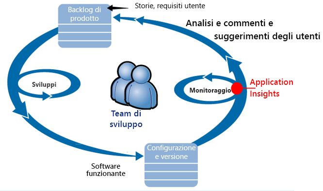

I requisiti passano nel backlog di sviluppo (elenco attività). Lavorano per brevi sprint, in cui spesso viene distribuito il software funzionante - in genere sotto forma di miglioramenti ed estensioni per l'applicazione esistente. L'app attiva viene aggiornata di frequente con le nuove funzionalità. Mentre è attiva, il team ne esegue il monitoraggio per le prestazioni e l'uso con l'aiuto di Application Insights. Questi dati APM riconducono al loro backlog di sviluppo.

Il team usa Application Insights per monitorare attentamente l'applicazione web attiva per gli elementi seguenti:

* Prestazioni. Il team vuole capire come variano i tempi di risposta in base al numero di richieste; la quantità usata di CPU, la rete, il disco e altre risorse, e dove sono i colli di bottiglia.
* Errori. Se esistono eccezioni o richieste non riuscite, o se un contatore delle prestazioni non rientra nell'intervallo noto, il team deve esserne informato rapidamente in modo che sia possibile intraprendere l'azione.
* Utilizzo. Ogni volta che viene rilasciata una nuova funzionalità, il team desidera sapere in quale misura viene usata e se gli utenti hanno difficoltà con essa.

Ci si concentra ora parte del ciclo dedicata ai commenti e suggerimenti:

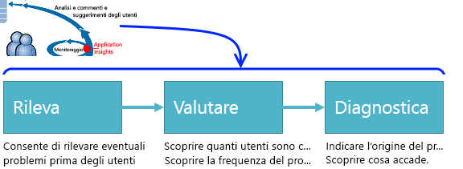

## Rilevare scarsa disponibilità
Marcela Markova è un senior developer del team di OBS e accetta di essere responsabile del monitoraggio delle prestazioni online. Imposta alcuni [test di disponibilità](app-insights-monitor-web-app-availability.md):

* Un test con singolo URL per la pagina di destinazione principale per l'app, http://fabrikambank.com/onlinebanking/. Imposta i criteri del codice HTTP 200 e il testo 'Benvenuto'. Se il test ha esito negativo, è presente un grave problema relativo alla rete o ai server o forse un problema di distribuzione, oppure un utente ha modificato il messaggio di benvenuto nella pagina senza comunicarlo a lei.
* Un test più approfondito in più passaggi, che registra e ottiene un elenco di account corrente, che verifica alcuni dettagli chiave in ogni pagina. Questo test verifica che il collegamento al database degli account sia funzionante. Usa un id cliente fittizio: alcuni vengono mantenuti a scopo di test.

Con questi test impostati, Marcela è certa che il team verrà rapidamente a conoscenza di ogni interruzione.  

Gli errori vengono visualizzati come punti rossi nel grafico del test Web:

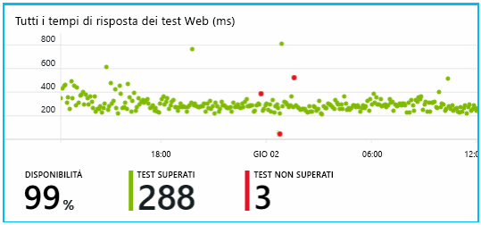

Ma soprattutto viene inviato al team di sviluppo un avviso su eventuali errori mediante posta elettronica. In questo modo ne verranno a conoscenza prima quasi tutti i clienti.

## Monitorare le metriche delle prestazioni
Nella pagina Panoramica in Application Insights è presente un grafico che mostra una serie di [metriche chiave](app-insights-web-monitor-performance.md).

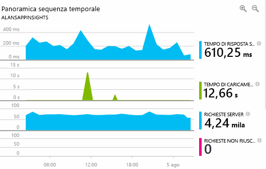

Il tempo di caricamento della pagina del browser deriva dai dati di telemetria inviati direttamente dalle pagine Web. Il tempo di risposta del server, il numero di richieste al server e il numero di richieste non riuscite sono tutti misurati nel server Web e inviati direttamente ad Application Insights.

Marcela è un po' in apprensione riguardo al grafico di risposta del server, che mostra il tempo medio che intercorre tra il momento in cui il server riceve una richiesta HTTP dal browser di un utente al momento in cui viene inviata la risposta. Non è raro vedere una variazione all'interno del grafico, in ragione della variazione del carico sul sistema. Tuttavia, nel caso specifico sembra che vi sia una correlazione tra gli incrementi minimi nel conteggio delle risposte e quelli rilevanti nel tempo di risposta. Questa correlazione potrebbe indicare che il funzionamento del sistema è al limite.

Apre i grafici dei server:

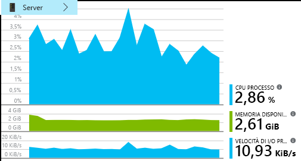

Apparentemente non si rilevano limitazioni delle risorse, quindi magari i salti nei grafici di risposta del server sono solo una coincidenza.

## Avvisi
Marcela, ad ogni modo, vuole monitorare i tempi di risposta. Se aumentano in modo eccessivo, vuole esserne informata.

Quindi imposta un [avviso](app-insights-metrics-explorer.md) se i tempi di risposta sono superiori alla soglia tipica. Questo le consentirà di conoscere la velocità dei tempi di risposta.

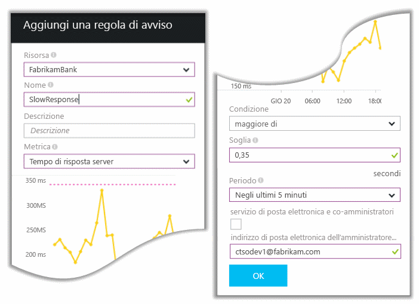

È possibile impostare avvisi su svariate altre metriche. Ad esempio, è possibile ricevere messaggi di posta elettronica se il numero di eccezioni risulta elevato o la memoria disponibile è insufficiente o se è presente un picco nelle richieste del client.

## Avvisi del rilevamento intelligente
Il giorno successivo arriva un avviso in posta elettronica da Application Insights. Quando lo apre, si accorge però che non è l'avviso sui tempi di risposta che aveva impostato. Al contrario, indica che c'è stato un aumento improvviso delle richieste non riuscite, ovvero, delle richieste che hanno restituito 500 o più codici di errore.

Le richieste non riuscite sono quelle richieste in cui gli utenti hanno individuato un errore, in genere dopo un'eccezione generata nel codice. Forse viene visualizzato il messaggio "Sorry we couldn't update your details right now" (Non è possibile aggiornare i dettagli adesso). Oppure, nella peggiore delle ipotesi, viene visualizzato un dump dello stack sullo schermo dell'utente concesso dal server web.

L'avviso la lascia stupita perché l'ultima volta il numero delle richieste non riuscite era particolarmente basso. In un server occupato, un numero esiguo di errori è un evento prevedibile.

Lo stupore nasceva anche dal fatto che non era necessario configurare l'avviso. In effetti, Rilevamento intelligente è incluso automaticamente in Application Insights. Si adatta automaticamente al consueto modello di errore dell'app "abituandosi" agli errori di una particolare pagina o un carico elevato, o collegato ad altre metriche. Genera l'avviso solo in caso di un aumento prevedibile.

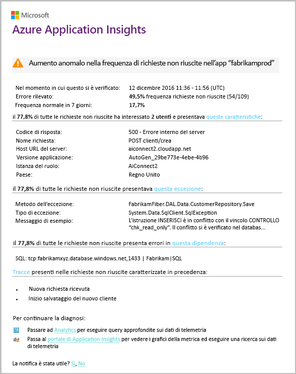

Si tratta di un messaggio di posta elettronica molto utile. Non si limita a generare un avviso, ma esegue anche valutazioni e diagnosi.

Mostra il numero di clienti coinvolti e le pagine Web o le operazioni. Marcela può decidere se è necessario ottenere l'impegno dell'intero team come esercitazione, o se può essere ignorato fino alla settimana successiva.

Il messaggio di posta elettronica mostra inoltre il verificarsi di una particolare eccezione e, cosa ancora più interessante, che l'errore è associato a chiamate non riuscite a un particolare database. Questo spiega come mai si è generato improvvisamente l'errore anche se il team di Marcela non ha distribuito aggiornamenti di recente.

Contatta il responsabile del team di database. In effetti, hanno rilasciato un aggiornamento rapido nell'ultima mezz'ora, ma forse c'è stata una piccola modifica dello schema.

In definitiva, il problema sta per essere risolto anche prima di esaminare i log, e dopo soli 15 minuti dal momento in cui si è generato l'errore. Tuttavia, Marcela seleziona il collegamento per aprire Application Insights. Si apre direttamente su una richiesta non riuscita in cui è possibile visualizzare la chiamata al database non riuscita nell'elenco delle chiamate di dipendenza associato.

## Rilevamento di eccezioni
Con una configurazione minima, le [eccezioni](app-insights-asp-net-exceptions.md) vengono segnalate automaticamente ad Application Insights. Possono anche essere acquisite in modo esplicito con l'inserimento di chiamate a [TrackException()](app-insights-api-custom-events-metrics.md#trackexception) nel codice:  

    var telemetry = new TelemetryClient();
    ...
    try
    { ...
    }
    catch (Exception ex)
    {
       // Set up some properties:
       var properties = new Dictionary <string, string>
         {{"Game", currentGame.Name}};

       var measurements = new Dictionary <string, double>
         {{"Users", currentGame.Users.Count}};

       // Send the exception telemetry:
       telemetry.TrackException(ex, properties, measurements);
    }

Il team della banca Fabrikam ha sviluppato la pratica di inviare sempre i dati di telemetria di un'eccezione, a meno che non vi sia un ripristino ovvio.  

In effetti, la strategia usata è persino più ampia: vengono inviati i dati di telemetria in tutti i casi in cui il cliente sia frustrato riguardo a ciò che voleva fare, che corrisponda o meno a un'eccezione del codice. Ad esempio, se il sistema esterno di bonifico interbancario restituisce un messaggio che indica che non è possibile completare l'operazione per qualche ragione operativa (nessun errore del cliente), allora si tiene traccia di quell'evento.

    var successCode = AttemptTransfer(transferAmount, ...);
    if (successCode < 0)
    {
       var properties = new Dictionary <string, string>
            {{ "Code", returnCode, ... }};
       var measurements = new Dictionary <string, double>
         {{"Value", transferAmount}};
       telemetry.TrackEvent("transfer failed", properties, measurements);
    }

TrackException viene usato per segnalare le eccezioni perché invia una copia dello stack. TrackEvent viene usato per segnalare altri eventi. È possibile collegare le proprietà che potrebbero essere utili nella diagnosi.

Eccezioni ed eventi vengono visualizzati nel pannello [Ricerca diagnostica](app-insights-diagnostic-search.md). È possibile esaminarli per visualizzare le proprietà aggiuntive e l'analisi dello stack.

## Monitoraggio dell'attività dell'utente
Quando il tempo di risposta è coerentemente adeguato e sono presenti poche eccezioni, il team di sviluppo può passare all'usabilità. Si può pensare a come migliorare l'esperienza degli utenti e a incoraggiare più utenti affinché raggiungano gli obiettivi desiderati.

Ad esempio, un tipico percorso utente nel sito Web presenta chiaramente un "imbuto." Molti clienti esaminano le frequenze dei diversi tipi di prestito. Un numero inferiore compila il modulo delle offerte. Tra quelli che ricevono un'offerta, alcuni proseguono per avere il prestito.

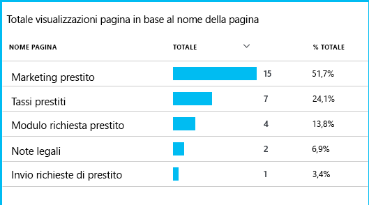

Considerando il punto in cui la maggior parte degli utenti abbandona, l'azienda può valutare come fare in modo che più utenti completino il percorso fino alla fine. In alcuni casi potrebbe trattarsi di un errore dell'esperienza utente, ad esempio, è difficile trovare il pulsante "Avanti" o le istruzioni non sono intuitive. Più probabilmente, esistono motivi aziendali più significativi per gli abbandoni: forse i tassi di prestito sono troppo alti.

Qualunque sia il motivo, i dati consentono al team di valutare l'attività degli utenti. È possibile inserire più chiamate di rilevamento per scoprire altri dettagli. Si può usare TrackEvent() per contare tutte le azioni utente, dai piccoli dettagli come i singoli clic sui pulsanti, ai risultati più significativi come il pagamento di un prestito.

Il team si sta abituando ad avere informazioni sull'attività degli utenti. Attualmente, quando progetta una nuova funzionalità, valuta in che modo potrà ricevere commenti e suggerimenti sull'utilizzo. Progetta quindi chiamate di rilevamento che vengono incorporate nella funzionalità fin dall'inizio. I commenti e suggerimenti saranno usati per migliorare la funzionalità in ogni ciclo di sviluppo.

## Monitoraggio proattivo
Marcela non resta ferma in attesa di avvisi. Subito dopo ogni ridistribuzione, esamina i [tempi di risposta](app-insights-web-monitor-performance.md), sia la figura nel suo complesso che la tabella delle richieste più lente, nonché il numero di eccezioni.  

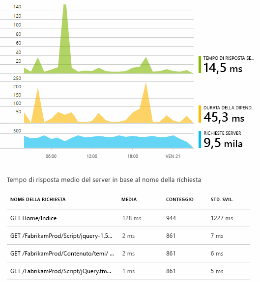

Marcela riesce a valutare l'impatto sulle prestazioni di ogni distribuzione, in genere confrontando ogni settimana con l'ultima. Se si verifica un improvviso peggioramento, lo segnala agli sviluppatori rilevanti.

## Valutazione
Valutazione: consente di valutare la gravità e l'estensione di un problema. È il primo passaggio dopo il rilevamento. Si dovrebbe chiamare il team a mezzanotte oppure è possibile soprassedere fino al successivo divario utile nel backlog? Esistono alcune domande fondamentali nella valutazione.

Qual è la portata di ciò che sta accadendo? I grafici nel pannello Panoramica offrono nuove prospettive per risolvere un problema. Ad esempio, l'applicazione di Fabrikam ha generato quattro avvisi di test Web una notte. Osservando il grafico il mattino successivo, il team ha potuto vedere che vi erano infatti alcuni punti rossi, anche se la maggior parte dei test erano in verde. Esaminando il grafico di disponibilità, era chiaro che tutti questi problemi intermittenti provenivano da un'unica posizione di test. La situazione era ovviamente dovuta a un problema di rete che interessava solo una route e molto probabilmente si sarebbe risolta automaticamente da sola.  

Al contrario, un aumento significativo e stabile nel grafico del numero di eccezioni e dei tempi di risposta è ovviamente qualcosa di cui preoccuparsi seriamente.

Una tattica di valutazione utile è fare una prova in prima persona. Se si rileva lo stesso problema, risulta chiaro che è reale.

Quale parte di utenti è interessata? Per ottenere una risposta approssimativa, dividere la percentuale di errori per il numero di sessioni.

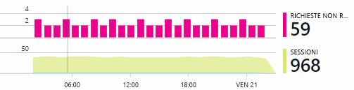

Nel caso di una risposta lenta, confrontare la tabella delle richieste che rispondono più lentamente con la frequenza d'uso di ogni pagina.

Quanto è importante lo scenario bloccato? Se si tratta di un problema funzionale che blocca una storia utente specifica, chiedersi quanto è importante. Se i clienti non possono pagare le fatture, si tratta di un problema grave. Se non è possibile modificare le preferenze di colore dello schermo, è un problema non urgente. I dettagli dell'evento o dell'eccezione o l'identità della pagina lenta consentono di individuare dove i clienti riscontrano problemi.

## Diagnosi
La diagnosi non è proprio uguale al debug. Prima di iniziare l'analisi del codice, si deve avere un'idea approssimativa del motivo, del luogo e del momento in cui si verifica il problema.

**Quando si verifica?** La visualizzazione cronologica fornita dai grafici di eventi e di metriche consente di correlare gli effetti alle possibili cause. Se sono presenti picchi intermittenti nel tempo di risposta e nella frequenza delle eccezioni, esaminare il numero di richieste: se i picchi si presentano contemporaneamente, sembrerebbe un problema di risorse. È necessario assegnare più CPU o memoria oppure è una dipendenza che non riesce a gestire il carico?

**Dipende da chi?**  Se si verifica una riduzione improvvisa delle prestazioni di un particolare tipo di richiesta, ad esempio quando il cliente desidera un estratto conto, potrebbe essere dovuto a un sottosistema esterno invece che all'applicazione Web. In Esplora metriche, selezionare la percentuale di errori di dipendenza e la frequenza della durata delle dipendenze e confrontare le cronologie delle ultime ore o giorni con il problema rilevato. Se vi sono variazioni di correlazione, il problema potrebbe essere dovuto a un sottosistema esterno.  

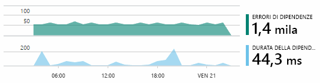

Alcuni problemi di dipendenza lenta sono problemi di georilevazione. La banca Fabrikam usa macchine virtuali di Azure e ha scoperto che aveva inavvertitamente posizionato i server Web e di account in paesi diversi. Si è avuto un notevole miglioramento con la migrazione di uno dei server.

**Che cosa è successo?** Se il problema non sembra essere una dipendenza e se non è sempre presente, è probabilmente causato da una modifica recente. La prospettiva storica offerta dai grafici di metriche e di eventi semplifica la correlazione di eventuali modifiche improvvise con le distribuzioni. Ciò consente di limitare l'ambito della ricerca del problema.

**Cosa sta succedendo?** Alcuni problemi si verificano solo raramente e possono essere difficili da rilevare mediante il test offline. È possibile solo tentare di acquisire il bug quando si verifica in tempo reale. È possibile esaminare i dump dello stack nei report di eccezione. Inoltre, è possibile scrivere le chiamate di traccia, con il framework di registrazione preferito o con TrackTrace() o TrackEvent().  

Fabrikam ha un problema intermittente con i trasferimenti tra conti, ma solo con determinati tipi di conti. Per comprendere meglio la situazione, sono state inserite chiamate TrackTrace() in punti chiave nel codice, associando il tipo di conto come una proprietà a ogni chiamata. In tal modo è facile filtrare solo quelle tracce in Ricerca diagnostica. Sono stati associati anche i valori dei parametri come proprietà e misure alle chiamate di traccia.

## Gestire il problema
Una volta che è stato diagnosticato il problema, è possibile creare un piano per risolverlo. Potrebbe essere necessario eseguire il rollback di una modifica recente o forse è sufficiente andare avanti per risolvere il problema. Dopo aver eseguito la correzione, Application Insights indicherà se ha avuto esito positivo.  

Il team di sviluppo della banca Fabrikam adotta un approccio più strutturato per la misurazione delle prestazioni rispetto a quello usato prima di Application Insights.

* Gli obiettivi delle prestazioni erano impostati in termini di misure specifiche nella pagina di panoramica di Application Insights.
* Progettano le misurazioni di prestazioni nell'applicazione fin dall'inizio, ad esempio le metriche che misurano l'avanzamento utente tramite 'grafici'.  

## Utilizzo
Application Insights consente anche di essere usato per informazioni sulle operazioni che gli utenti possono eseguire con un'app. Dopo che è stato eseguito senza problemi, il team desidera sapere quali funzionalità sono più diffuse, quali sono quelle preferite dagli utenti o quali presentano problemi e quali sono visitate più frequentemente. Tali informazioni consentiranno di stabilire le priorità relative al lavoro imminente. E sarà possibile valutare l'esito di ogni funzionalità come parte del ciclo di sviluppo. [Altre informazioni](app-insights-web-track-usage.md).

## Applicazioni
Ecco come un solo team usa Application Insights non solo per risolvere singoli problemi, ma per migliorare il ciclo di vita dello sviluppo. Si tratta di suggerimenti e idee su come Application Insights può aiutare a gestire le prestazioni delle proprie applicazioni.

## Video

> [!VIDEO https://channel9.msdn.com/events/Connect/2016/112/player]

## Passaggi successivi
È possibile iniziare in diversi modi, a seconda delle caratteristiche dell'applicazione. Scegliere l'opzione più adatta:

* [Applicazione Web ASP.NET](app-insights-asp-net.md)
* [Applicazione Web Java](app-insights-java-get-started.md)
* [Applicazione Web Node.js](app-insights-nodejs.md)
* App già distribuite, ospitate in [IIS](app-insights-monitor-web-app-availability.md), [J2EE](app-insights-java-live.md) o [Azure](app-insights-azure.md).
* [Pagine Web](app-insights-javascript.md): app a singola pagina o pagina Web ordinaria da usare autonomamente o in combinazione con una delle opzioni del server.
* [Test di disponibilità](app-insights-monitor-web-app-availability.md) per testare l'applicazione dalla rete internet pubblica.

