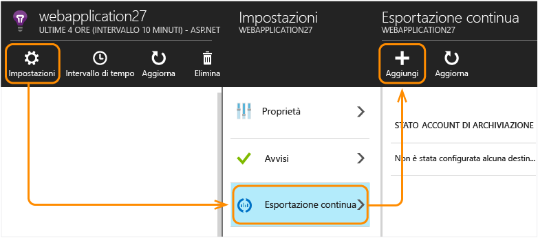
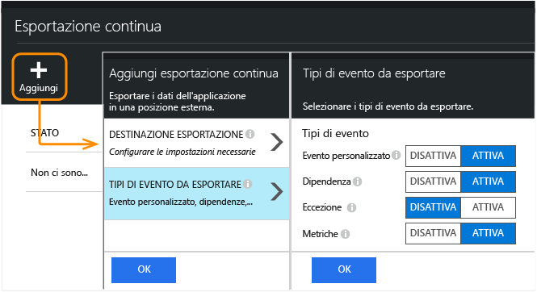
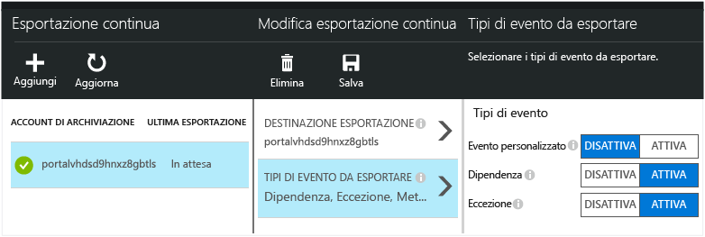
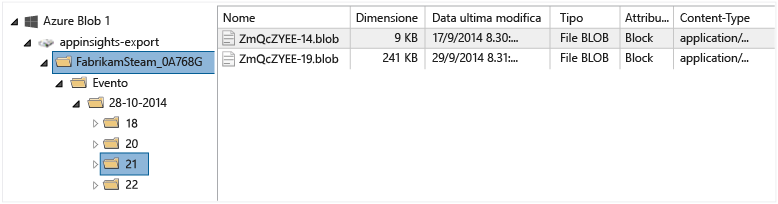

# Esportare i dati di telemetria da Application Insights
Si vogliono mantenere i dati di telemetria per un periodo più lungo del periodo di mantenimento standard o elaborarli in un modo particolare? A tale scopo, l'esportazione continua è ideale. Gli eventi visualizzati nel portale di Application Insights possono essere esportati nella risorsa di archiviazione di Microsoft Azure in formato JSON. Da qui è possibile scaricare i dati e scrivere qualsiasi tipo di codice necessario per elaborarli.

La funzionalità di esportazione continua è disponibile nel periodo di valutazione gratuito e nei [piani tariffari Standard e Premium](https://azure.microsoft.com/pricing/details/application-insights/).

Prima di configurare l'esportazione continua, è necessario prendere in considerazione alcune alternative:

* [Il pulsante Esporta](app-insights-metrics-explorer.md#export-to-excel) nella parte superiore del pannello delle metriche o di ricerca consente di trasferire tabelle e grafici in un foglio di calcolo di Excel.
* [Dati di analisi](app-insights-analytics.md) offre un linguaggio avanzato di query per la telemetria che consente anche di esportare i risultati.
* Se lo scopo è [esplorare i dati in Power BI](http://blogs.msdn.com/b/powerbi/archive/2015/11/04/explore-your-application-insights-data-with-power-bi.aspx), è possibile farlo senza usare l'esportazione continua.

## Creare un account di archiviazione
Se non si dispone già di un account di archiviazione "classico", crearne uno ora.

1. Creare un account di archiviazione per la sottoscrizione nel [portale di Azure](https://portal.azure.com).
   
    
2. Creare un contenitore
   
    

##  Configurare l'esportazione continua
Nel pannello Panoramica dell'applicazione nel portale di Application Insights aprire Esportazione continua:

Aggiungere un'esportazione e scegliere un [account di archiviazione Azure](../storage/storage-introduction.md) in cui inserire i dati:

Scegliere i tipi di evento che si vuole esportare:

Dopo averla creata, l'esportazione viene avviata. Si ottengono solo i dati che arrivano dopo aver creato l'esportazione.

Può verificarsi un ritardo di circa un'ora prima che i dati vengano visualizzati nel BLOB.

Se si vogliono modificare i tipi di eventi in un secondo momento, è sufficiente modificare l'esportazione:

Per interrompere il flusso, fare clic su Disabilita. Quando si fa nuovamente clic su Abilita, il flusso verrà riavviato con nuovi dati. Non si otterranno i dati che arrivano nel portale mentre l'esportazione è stata disabilitata.

Per interrompere il flusso in modo permanente, eliminare l'esportazione. Questa operazione non elimina i dati dalla risorsa di archiviazione.

#### Non si riesce ad aggiungere o modificare un'esportazione?
* Per aggiungere o modificare le esportazioni, è necessario avere i diritti di accesso proprietario, collaboratore o collaboratore di Application Insights. [Informazioni sui ruoli][roles].

##  Quali eventi si ottengono?
I dati esportati sono dati di telemetria non elaborati ricevuti dall'applicazione, tranne che per l'aggiunta di dati del percorso calcolati dall'indirizzo IP del client.

I dati che il [campionamento](app-insights-sampling.md) ha rimosso non sono inclusi nei dati esportati.

Le altre metriche calcolate non sono incluse. Ad esempio, non si procederà all'esportazione dell'uso medio della CPU, ma si procederà all'esportazione dei dati di telemetria non elaborati a partire dai quali viene calcolata la media.

I dati includono anche i risultati di ogni [test Web di disponibilità](app-insights-monitor-web-app-availability.md) impostato.

> [!NOTE]
> **Campionamento.** Se l'applicazione invia una grande quantità di dati e si sta utilizzando la versione 2.0.0-beta3 o versioni successive dell’SDK di Application Insights per ASP.NET, la funzionalità del campionamento adattivo può operare e inviare solo una percentuale dei dati di telemetria. [Altre informazioni sul campionamento.](app-insights-sampling.md)
> 
> 

##  Esaminare i dati
È possibile esaminare lo spazio di archiviazione direttamente nel portale. Fare clic su **Sfoglia**, selezionare l'account di archiviazione e quindi aprire **Contenitori**.

Per esaminare l'archiviazione di Azure in Visual Studio, aprire **Visualizza**, **Cloud Explorer**. (Se non si dispone di tale comando del menu, è necessario installare l’SDK di Azure: aprire la finestra di dialogo **Nuovo progetto**, espandere Visual C#/Cloud e scegliere **Ottieni Microsoft Azure SDK per .NET**).

Quando si apre l'archivio BLOB, si noterà un contenitore con un set di file BLOB. L'URI di ogni file è derivato dal nome della risorsa di Application Insights, la relativa chiave di strumentazione e tipo/data/ora della telemetria. (Il nome della risorsa viene scritto in minuscolo e la chiave di strumentazione omette i trattini).

La data e ora sono UTC e lo sono quando i dati di telemetria sono stati depositati nell'archivio, non l'ora in cui sono stati generati. Di conseguenza, se si scrive codice per scaricare i dati, può spostarsi in modo lineare attraverso i dati.

Di seguito è riportato il formato del percorso:

    $"{applicationName}_{instrumentationKey}/{type}/{blobDeliveryTimeUtc:yyyy-MM-dd}/{ blobDeliveryTimeUtc:HH}/{blobId}_{blobCreationTimeUtc:yyyyMMdd_HHmmss}.blob"

Where

* `blobCreationTimeUtc` è l'ora di creazione del BLOB nell'archivio di gestione temporanea interno
* `blobDeliveryTimeUtc` è l'ora in cui il BLOB viene copiato nell'archivio di destinazione dell'esportazione

##  Formato dati
* Ogni BLOB è un file di testo che contiene più righe separate da '\\n'. Contiene i dati di telemetria elaborati in un periodo di tempo di circa mezzo minuto.
* Ogni riga rappresenta un punto dati di telemetria, ad esempio una richiesta o una visualizzazione di pagina.
* Ogni riga è un documento JSON non formattato. Se si desidera sedersi a osservare, aprirlo in Visual Studio e scegliere Modifica, Avanzate, File di formato:

Gli intervalli di tempo sono espressi in tick, dove 10 000 tick = 1 ms. Questi valori, ad esempio, indicano un tempo di 1 ms per inviare una richiesta dal browser, 3 ms per riceverla e 1,8 s per elaborare la pagina nel browser:

    "sendRequest": {"value": 10000.0},
    "receiveRequest": {"value": 30000.0},
    "clientProcess": {"value": 17970000.0}

[Riferimento dettagliato al modello di dati per i valori e i tipi di proprietà.](app-insights-export-data-model.md)

## Elaborazione dei dati
Su scala ridotta è possibile scrivere codice per separare i dati, leggerli in un foglio di calcolo e così via. Ad esempio:

    private IEnumerable<T> DeserializeMany<T>(string folderName)
    {
      var files = Directory.EnumerateFiles(folderName, "*.blob", SearchOption.AllDirectories);
      foreach (var file in files)
      {
         using (var fileReader = File.OpenText(file))
         {
            string fileContent = fileReader.ReadToEnd();
            IEnumerable<string> entities = fileContent.Split('\n').Where(s => !string.IsNullOrWhiteSpace(s));
            foreach (var entity in entities)
            {
                yield return JsonConvert.DeserializeObject<T>(entity);
            }
         }
      }
    }

Per un esempio di codice più esaustivo, vedere l'articolo relativo all'[uso di un ruolo di lavoro][exportasa].

## Eliminare i vecchi dati
Si noti che si è responsabili della gestione della capacità di archiviazione ed eliminazione di vecchi dati, se necessario.

## Se si rigenera la chiave di archiviazione...
Se si modifica la chiave per l'archiviazione, l'esportazione continua non funzionerà più. Verrà visualizzata una notifica nell'account Azure.

Aprire il pannello Esportazione continua e modificare l'esportazione. Modificare la destinazione di esportazione, ma lasciare selezionata la stessa risorsa di archiviazione. Fare clic su OK per confermare.

L'esportazione continua verrà riavviata.

## Esempi di esportazione
* [Esportare in SQL usando un ruolo di lavoro][exportcode]
* [Eseguire l'esportazione in SQL usando l'analisi di flusso][exportasa]
* [Esportare in Power BI usando analisi di flusso](app-insights-export-power-bi.md)
  * Si noti che questo non è il metodo standard per usare Power BI. Esiste [un adattatore](http://blogs.msdn.com/b/powerbi/archive/2015/11/04/explore-your-application-insights-data-with-power-bi.aspx) che non richiede l'esportazione continua.

Su scala più estesa considerare la possibilità di usare cluster [HDInsight](https://azure.microsoft.com/services/hdinsight/) - Hadoop nel cloud. HDInsight offre un'ampia gamma di tecnologie per la gestione e l'analisi di big data.

## Domande e risposte
* *Si intende scaricare semplicemente un grafico.*
  
    Questa operazione è consentita. Nella parte superiore del pannello fare clic sul [pulsante di esportazione dati](app-insights-metrics-explorer.md#export-to-excel).
* *È stata impostata un'esportazione, ma non sono presenti dati nell'archivio personale.*
  
    Application Insights ha ricevuto eventuali dati di telemetria dall'app dal momento in cui si è impostata l'esportazione? Si riceveranno solo nuovi dati.
* *Si è tentato di impostare un'esportazione, ma è stato negato l'accesso*
  
    Se l'account è di proprietà dell'organizzazione, è necessario essere un membro del gruppo di proprietari o di collaboratori.
* *È possibile eseguire un'esportazione direttamente al negozio locale?*
  
    No. Il motore di esportazione attualmente funziona solo con Archiviazione di Azure.
* *Esiste un limite alla quantità di dati da inserire nell'archivio personale?*
  
    No. L'inserimento dei dati continuerà fino a quando non si elimina l'esportazione. Occorrerà fermarsi se i limiti esterni per l'archiviazione BLOB sono stati raggiunti, ma ciò è abbastanza difficile. Spetta all'utente controllare quante risorse di archiviazione usare.
* *Quanti BLOB dovrebbero essere visualizzati nella risorsa di archiviazione?*
  
  * Per ogni tipi di dati selezionato per l'esportazione, viene creato un nuovo BLOB ogni minuto, se sono disponibili dati.
  * Per le applicazioni con traffico elevato, inoltre, vengono allocate unità di partizione aggiuntive. In questo caso ogni unità crea un BLOB ogni minuto.
* *La chiave per la risorsa di archiviazione è stata rigenerata o il nome del contenitore è stato modificato, ma l'esportazione non funziona.*
  
    Modificare l'esportazione e aprire il pannello di destinazione dell'esportazione. Lasciare la stessa risorsa di archiviazione selezionata come in precedenza e fare clic su OK per confermare. L'esportazione verrà riavviata. Se la modifica è stata eseguita negli ultimi giorni, non si perderanno i dati.
* *È possibile sospendere l'esportazione?*
  
    Sì. Fare clic su Disabilita.

## Esempi di codice
* [Flusso da Application Insights a Power BI](app-insights-export-power-bi.md)
* [Analizzare un documento JSON esportato con un ruolo di lavoro][exportcode]
* [Eseguire l'esportazione in SQL usando l'analisi di flusso][exportasa]
* [Riferimento dettagliato al modello di dati per i valori e i tipi di proprietà.](app-insights-export-data-model.md)

<!--Link references-->

[exportcode]: app-insights-code-sample-export-telemetry-sql-database.md
[exportasa]: app-insights-code-sample-export-sql-stream-analytics.md
[roles]: app-insights-resources-roles-access-control.md

<!---HONumber=AcomDC_0727_2016-->