<properties
	pageTitle="Introduzione ad Application Insights di Visual Studio | Microsoft Azure"
	description="Analizzare l'uso, la disponibilità e le prestazioni dell'applicazione locale o Web di Microsoft Azure con Application Insights."
	services="application-insights"
    documentationCenter=""
	authors="alancameronwills"
	manager="douge"/>

<tags
	ms.service="application-insights"
	ms.workload="tbd"
	ms.tgt_pltfrm="ibiza"
	ms.devlang="na"
	ms.topic="hero-article"
	ms.date="11/17/2015"
	ms.author="awills"/>

# Introduzione ad Application Insights di Visual Studio

*Application Insights è disponibile in anteprima.*

Rilevare problemi, risolverli e migliorare continuamente le applicazioni. Diagnosticare rapidamente eventuali problemi nell'applicazione live. Comprendere in che modo gli utenti lo usano.

La configurazione è molto semplice e i risultati saranno visibili in pochi minuti.

Al momento sono supportate app iOS, Android e Windows, applicazioni Web J2EE e ASP.NET, nonché servizi WCF. Le app Web possono essere eseguite in Azure o in server locali personali. JavaScript SDK viene eseguito in qualsiasi pagina Web.

## Introduzione

Inizializzazione con qualsiasi combinazione, in qualsiasi ordine, dei punti di ingresso che vengono visualizzati nel diagramma seguente. Seguire il percorso più adatto alle proprie esigenze.

Con Application Insights all'app viene aggiunto un SDK che invia dati di telemetria al [portale di Azure](http://portal.azure.com). Sono disponibili diversi SDK per le numerose combinazioni di piattaforme, linguaggi e IDE supportati.

È necessario un account in [Microsoft Azure](http://azure.com). Oltre a un account di gruppo disponibile tramite l'organizzazione, è possibile ottenerne uno con pagamento in base al consumo. Application Insights prevede un livello gratuito, pertanto non sarà necessario pagare fino a quando l'applicazione non verrà usata di frequente. Esaminare la [pagina relativa ai prezzi](https://azure.microsoft.com/pricing/details/application-insights/).

Risultato desiderato | Operazione da eseguire | Risultato finale
---|---|---
 <a href="app-insights-start-monitoring-app-health-usage.md">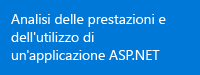</a> | <a href="app-insights-start-monitoring-app-health-usage.md">Aggiungere Application Insights SDK al progetto Web</a>    | <a href="app-insights-start-monitoring-app-health-usage.md">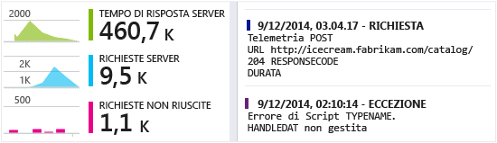</a>
<a href="app-insights-monitor-performance-live-website-now.md">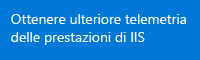</a> <a href="app-insights-monitor-performance-live-website-now.md">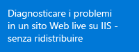</a>|<a href="app-insights-monitor-performance-live-website-now.md">Installare Status Monitor nel server IIS</a>    | <a href="app-insights-monitor-performance-live-website-now.md">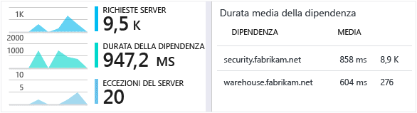</a>
<a href="insights-perf-analytics.md">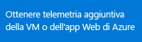</a>|<a href="insights-perf-analytics.md">Abilitare Insights nella macchina virtuale o nell'app Web di Azure</a>    | 
|<a href="app-insights-java-get-started.md">Aggiungere l'SDK al progetto Java</a>  | <a href="app-insights-java-get-started.md">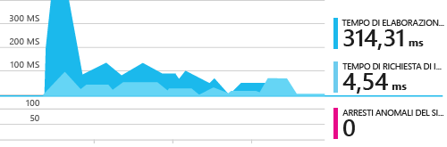</a>
<a href="app-insights-web-track-usage.md">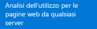</a>|<a href="app-insights-web-track-usage.md">Inserire lo script di Application Insights nelle pagine Web</a>  | <a href="app-insights-web-track-usage.md">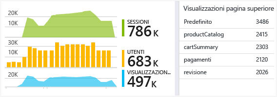</a>
<a href="app-insights-monitor-web-app-availability.md">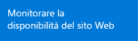</a>|<a href="app-insights-monitor-web-app-availability.md">Creare test Web</a>  | <a href="app-insights-monitor-web-app-availability.md">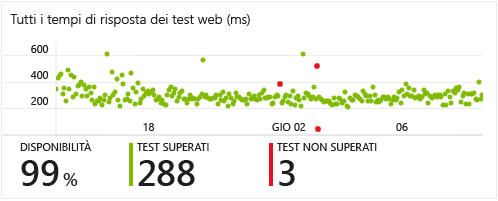</a>
<a href="app-insights-platforms.md">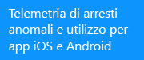</a>|<a href="http://hockeyapp.net">Usare HockeyApp</a>  | <a href="http://hockeyapp.net">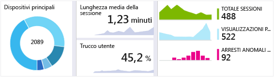</a>

## Supporto, commenti e suggerimenti

* Domande e problemi:
 * [Risoluzione dei problemi][qna]
 * [Forum di MSDN](https://social.msdn.microsoft.com/Forums/vstudio/it-IT/home?forum=ApplicationInsights)
 * [StackOverflow](http://stackoverflow.com/questions/tagged/ms-application-insights)
* Bug:
 * [Connessione](https://connect.microsoft.com/VisualStudio/Feedback/LoadSubmitFeedbackForm?FormID=6076)
* Suggerimenti:
 * [Suggerimenti dell'utente](http://visualstudio.uservoice.com/forums/121579-visual-studio/category/77108-application-insights)
* Esempi di codice
 * [Esempi di codice](app-insights-code-samples.md)

## Video

> [AZURE.VIDEO 218]

> [AZURE.VIDEO usage-monitoring-application-insights]

> [AZURE.VIDEO performance-monitoring-application-insights]

<!--Link references-->

[qna]: app-insights-troubleshoot-faq.md

<!---HONumber=AcomDC_1125_2015-->