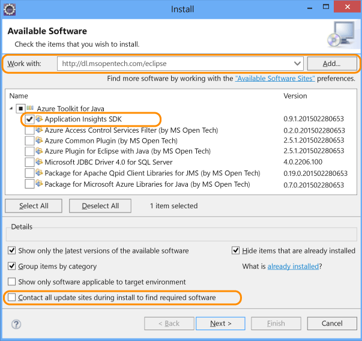
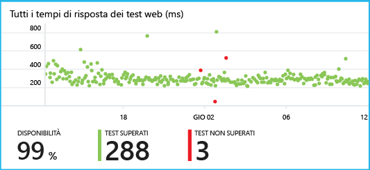

<properties 
	pageTitle="Introduzione ad Application Insights con Java in Eclipse" 
	description="Usare il plug-in Eclipse per aggiungere il monitoraggio delle prestazioni e l'uso nel sito Web Java con Application Insights" 
	services="application-insights" 
    documentationCenter="java"
	authors="alancameronwills" 
	manager="douge"/>

<tags 
	ms.service="application-insights" 
	ms.workload="tbd" 
	ms.tgt_pltfrm="ibiza" 
	ms.devlang="na" 
	ms.topic="article" 
	ms.date="09/16/2015" 
	ms.author="awills"/>
 
# Introduzione ad Application Insights con Java in Eclipse

SDK di Application Insights invia dati di telemetria dall'applicazione Web Java in modo da poter analizzare l'uso e le prestazioni. Il plug-in Eclipse per Application Insights installa automaticamente SDK nel progetto in modo da ottenere i dati di telemetria predefiniti, oltre a un'API che è possibile usare per scrivere dati di telemetria personalizzati.

## Prerequisiti

Attualmente il plug-in funziona per progetti Mavern e progetti Dynamic Web in Eclipse. [Aggiungere Application Insights ad altri tipi di progetti Java][java].

Sono necessari gli elementi seguenti:

* Oracle JRE 1.6 o versione successiva
* Una sottoscrizione a [Microsoft Azure](http://azure.microsoft.com/). È possibile iniziare con la [versione di valutazione gratuita](http://azure.microsoft.com/pricing/free-trial/).
* [ Eclipse IDE per sviluppatori Java EE](http://www.eclipse.org/downloads/), Indigo o versioni successive.
* Windows 7 o versioni successive o Windows Server 2008 o versioni successive

## Installare SDK su Eclipse (una volta)

È sufficiente eseguire questa operazione una volta per ogni macchina. Con questo passaggio viene installato un toolkit che può quindi aggiungere SDK a ciascun progetto Web dinamico.Con questo passaggio viene installato un toolkit che può quindi aggiungere SDK a ciascun Dynamic Web Project.

1. Dal menu Help di Eclipse scegliere Install New Software.

    

2. SDK è in http://dl.windowsazure.com/eclipse, in Azure Toolkit.
3. Deselezionare l'opzione **Contatta tutti i siti di aggiornamento...**

    

Seguire i passaggi rimanenti per ogni progetto Java.

## Creare una risorsa di Application Insights in Azure

1. Accedere al [portale di Azure](https://portal.azure.com).
2. 

## Aggiunta di Application Insights al progetto

1. Aggiungere Application Insights dal menu di scelta rapida del progetto Web Java.

    

2. Incollare la chiave di strumentazione recuperata dal portale di Azure.

    

La chiave viene inviata insieme a tutti gli elementi di dati di telemetria e indica ad Application Insights di visualizzarla nella risorsa.

## Eseguire l'applicazione e visualizzare le metriche

Eseguire l'applicazione.

Tornare alla risorsa di Application Insights in Microsoft Azure.

Nel pannello Panoramica verranno visualizzati i dati delle richieste HTTP. Se non sono visualizzati, attendere alcuni secondi e quindi fare clic su Aggiorna.

 

Fare clic su qualsiasi grafico per visualizzare metriche più dettagliate.

[Altre informazioni sulle metriche.][metrics]

 

E quando si visualizzano le proprietà di una richiesta, è possibile visualizzare gli eventi di telemetria associati, ad esempio le richieste e le eccezioni.
 

## Telemetria sul lato client

Dal pannello Avvio rapido fare clic su Recupera codice per monitorare le pagine Web:

Inserire il frammento di codice nella parte iniziale dei file HTML.

#### Visualizzare i dati lato client

Aprire le pagine Web aggiornate e usarle. Attendere uno o due minuti, quindi tornare ad Application Insights e aggiornare il pannello Utilizzo.

Le metriche di visualizzazioni pagine, utenti e sessioni verranno visualizzate nel pannello Utilizzo:

[Altre informazioni sull'impostazione della telemetria sul lato client.][usage]

## Pubblicare l'applicazione

A questo punto è possibile pubblicare l'applicazione nel server, permettere agli utenti di utilizzarla e visualizzare la telemetria mostrata nel portale.

* Verificare che il firewall consenta all'applicazione di inviare i dati di telemetria a queste porte:

 * dc.services.visualstudio.com:443
 * dc.services.visualstudio.com:80
 * f5.services.visualstudio.com:443
 * f5.services.visualstudio.com:80

* Nei server Windows installare:

 * [Microsoft Visual C++ Redistributable Package](http://www.microsoft.com/download/details.aspx?id=40784)

    (Ciò abilita i contatori delle prestazioni).

## Eccezioni e richieste non eseguite

Vengono raccolte automaticamente le eccezioni non gestite:

Per raccogliere dati su altre eccezioni, sono disponibili due opzioni:

* [Inserire chiamate a TrackException nel codice](app-insights-api-custom-events-metrics.md#track-exception). 
* [Installare l'agente Java sul server](app-insights-java-agent.md). È possibile specificare i metodi da controllare.

## Monitorare le chiamate al metodo e le dipendenze esterne

[Installare l'agente Java](app-insights-java-agent.md) per registrare i metodi interni specificati e le chiamate effettuate tramite JDBC, con i dati relativi alle durate.

## Contatori delle prestazioni

Fare clic sul riquadro **Server** e verrà visualizzato un intervallo di contatori delle prestazioni.

### Personalizzare la raccolta del contatore delle prestazioni

Per disabilitare la raccolta del set standard di contatori delle prestazioni, aggiungere il seguente codice al di sotto del nodo principale del file ApplicationInsights.xml:

    <PerformanceCounters>
       <UseBuiltIn>False</UseBuiltIn>
    </PerformanceCounters>

### Raccogliere dei contatori di prestazioni aggiuntive

È possibile specificare altri contatori di prestazioni da raccogliere.

#### Contatori JMX (esposti da Java Virtual Machine)

    <PerformanceCounters>
      <Jmx>
        <Add objectName="java.lang:type=ClassLoading" attribute="TotalLoadedClassCount" displayName="Loaded Class Count"/>
        <Add objectName="java.lang:type=Memory" attribute="HeapMemoryUsage.used" displayName="Heap Memory Usage-used" type="composite"/>
      </Jmx>
    </PerformanceCounters>

*	`displayName`: il nome visualizzato nel portale di Application Insights.
*	`objectName`: il nome dell'oggetto JMX.
*	`attribute`: l'attributo del nome dell'oggetto JMX da recuperare
*	`type` (facoltativo): il tipo di attributo dell'oggetto JMX:
 *	Impostazione predefinita: un tipo semplice come int o long.
 *	`composite`: i dati del contatore delle prestazioni sono nel formato 'Attribute.Data'
 *	`tabular`: i dati del contatore delle prestazioni sono nel formato della riga di una tabella

#### Contatori delle prestazioni di Windows

Ogni [contatore delle prestazioni Windows](https://msdn.microsoft.com/library/windows/desktop/aa373083.aspx) è un membro di una categoria (nello stesso modo in cui un campo è un membro di una classe). Le categorie possono essere globali o possono disporre di istanze numerate o denominate.

    <PerformanceCounters>
      <Windows>
        <Add displayName="Process User Time" categoryName="Process" counterName="%User Time" instanceName="__SELF__" />
        <Add displayName="Bytes Printed per Second" categoryName="Print Queue" counterName="Bytes Printed/sec" instanceName="Fax" />
      </Windows>
    </PerformanceCounters>

*	displayName: il nome visualizzato nel portale di Application Insights.
*	categoryName: la categoria del contatore delle prestazioni (oggetto prestazioni) a cui è associato questo contatore delle prestazioni.
*	counterName: il nome del contatore delle prestazioni.
*	instanceName: il nome dell'istanza di categoria del contatore delle prestazioni o una stringa vuota (""), se la categoria contiene una singola istanza. Se categoryName è il processo e il contatore delle prestazioni di cui raccogliere i dati proviene dal processo JVM corrente su cui è in esecuzione l'app, specificare `"__SELF__"`.

I contatori delle prestazioni sono visibili come metriche personalizzate in [Esplora metriche][metrics].

### Contatori delle prestazioni Unix

* [Installare collectd con il plug-in di Application Insights](app-insights-java-collectd.md) per ottenere una vasta gamma di dati di sistema e di rete.

## Test Web di disponibilità

Application Insights può testare il sito Web a intervalli regolari per verificare che funzioni e risponda correttamente. Per eseguire la configurazione, selezionare il grafico del test Web vuoto nel pannello Panoramica e fornire l'URL pubblico.

Se il sito è inattivo, si otterranno grafici dei tempi di risposta, nonché notifiche di posta elettronica.

[Altre informazioni sui test Web di disponibilità.][availability]

## Log di diagnostica

Se si usa Logback o Log4J (v1.2 o v2.0) per la traccia, è possibile inviare automaticamente i log di traccia ad Application Insights dove è possibile esplorarli e eseguirvi ricerche.

[Altre informazioni sui log di diagnostica][javalogs]

## Telemetria personalizzata 

Inserire alcune righe di codice nell'applicazione Web Java per scoprire come viene usato dagli utenti o per agevolare la diagnosi dei problemi.

È possibile inserire il codice sia nella pagina Web JavaScript che in Java lato server.

[Informazioni su dati di telemetria personalizzati][track]

## Passaggi successivi

#### Rilevare e diagnosticare i problemi

* [Aggiungere telemetria client Web][usage] per ottenere dati di telemetria delle prestazioni dal client Web.
* [Configurare i test Web][availability] in modo da assicurarsi che l'applicazione sia disponibile e reattiva.
* [Cercare eventi e log][diagnostic] per facilitare la diagnosi dei problemi.
* [Acquisire le tracce di Log4J o Logback][javalogs]

#### Tenere traccia dell'utilizzo

* [Aggiungere dati di telemetria al client Web][usage] per monitorare le visualizzazioni pagina e le metriche utente di base.
* [Tenere traccia di eventi personalizzati e metriche][track] per altre informazioni sulle modalità di uso dell'applicazione, sia sul lato client che server.

<!--Link references-->

[availability]: app-insights-monitor-web-app-availability.md
[diagnostic]: app-insights-diagnostic-search.md
[java]: app-insights-java-get-started.md
[javalogs]: app-insights-java-trace-logs.md
[metrics]: app-insights-metrics-explorer.md
[track]: app-insights-api-custom-events-metrics.md
[usage]: app-insights-web-track-usage.md

 

<!---HONumber=Sept15_HO4-->