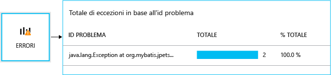
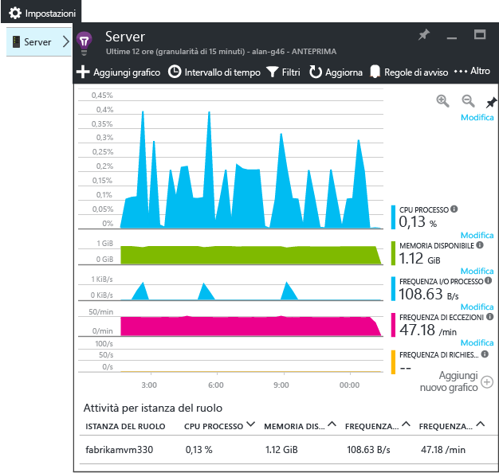
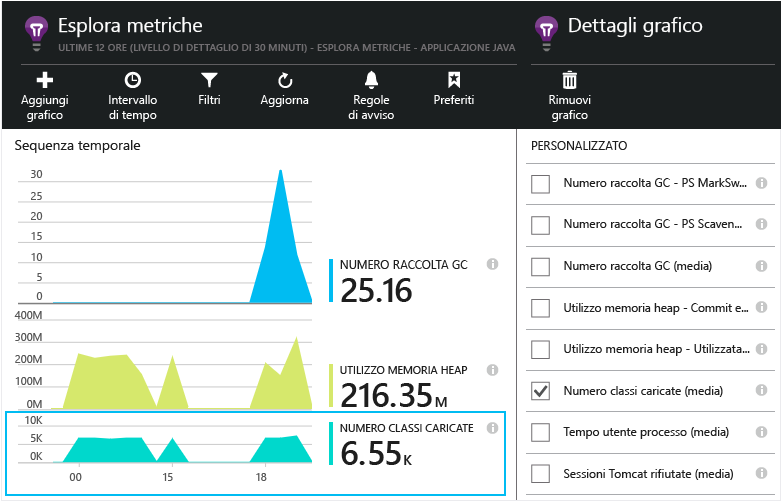

# <a name="get-started-with-application-insights-in-a-java-web-project"></a>Introduzione ad Application Insights in un progetto Web Java


[Application Insights](https://azure.microsoft.com/services/application-insights/) è un servizio di analisi estendibile per gli sviluppatori Web che semplifica la comprensione delle prestazioni e dell'uso dell'applicazione live. È possibile usarlo per [rilevare e diagnosticare i problemi di prestazioni e le eccezioni](app-insights-detect-triage-diagnose.md) e per [scrivere il codice][api] per tenere traccia della attività degli utenti con l'app.


Application Insights supporta le app Java in esecuzione in Linux, Unix o Windows.

Sono necessari:

* Oracle JRE 1.6 o versione successiva o isiZulu JRE 1.6 o versione successiva
* Una sottoscrizione a [Microsoft Azure](https://azure.microsoft.com/).

*Se è disponibile un'App Web già attiva, è possibile seguire la procedura alternativa per [aggiungere l'SDK al server Web in fase di esecuzione](app-insights-java-live.md). Tale alternativa evita di ricompilare il codice, ma non si ottiene l'opzione per scrivere codice per tenere traccia delle attività dell'utente.*

## <a name="1-get-an-application-insights-instrumentation-key"></a>1. Ottenere una chiave di strumentazione di Application Insights
1. Accedere al [portale di Microsoft Azure](https://portal.azure.com).
2. Creare una risorsa di Application Insights. Impostare il tipo di applicazione nell'applicazione Web Java.

    
3. Ottenere la chiave di strumentazione della nuova risorsa. Questa chiave dovrà a breve essere incollata nel progetto di codice.

    

## <a name="2-add-the-application-insights-sdk-for-java-to-your-project"></a>2. Aggiungere SDK per Java di Application Insights al progetto
*Scegliere il modo più appropriato per il progetto.*

#### <a name="if-youre-using-eclipse-to-create-a-maven-or-dynamic-web-project-"></a>Se si usa Eclipse per creare un progetto Web dinamico o Maven:
Usare il [plug-in di Application Insights SDK per Java][eclipse].

#### <a name="if-youre-using-maven"></a>Se si usa Maven...
Se il progetto è già stato configurato per usare Maven per la compilazione, unire il codice seguente al file pom.xml.

Aggiornare quindi le dipendenze progetto per fare in modo che i file binari vengano scaricati.

```XML

    <repositories>
       <repository>
          <id>central</id>
          <name>Central</name>
          <url>http://repo1.maven.org/maven2</url>
       </repository>
    </repositories>

    <dependencies>
      <dependency>
        <groupId>com.microsoft.azure</groupId>
        <artifactId>applicationinsights-web</artifactId>
        <!-- or applicationinsights-core for bare API -->
        <version>[1.0,)</version>
      </dependency>
    </dependencies>
```

* *Errori di convalida checksum o compilazione?* Provare a usare una versione specifica, ad esempio `<version>1.0.n</version>`. La versione più recente è disponibile nelle [note sulla versione dell'SDK](https://github.com/Microsoft/ApplicationInsights-Java#release-notes) o negli [elementi Maven](http://search.maven.org/#search%7Cga%7C1%7Capplicationinsights).
* *È necessario eseguire l'aggiornamento a un nuovo SDK?* Aggiornare le dipendenze del progetto.

#### <a name="if-youre-using-gradle"></a>Se si usa Gradle...
Se il progetto è già stato configurato per usare Gradle per la compilazione, unire il codice seguente al file build.gradle.

Aggiornare quindi le dipendenze progetto per fare in modo che i file binari vengano scaricati.

```JSON

    repositories {
      mavenCentral()
    }

    dependencies {
      compile group: 'com.microsoft.azure', name: 'applicationinsights-web', version: '1.+'
      // or applicationinsights-core for bare API
    }
```

* *Errori di convalida checksum o compilazione? Provare a usare una versione specifica, come* `version:'1.0.n'`. *La versione più recente è disponibile nelle [note sulla versione dell'SDK](https://github.com/Microsoft/ApplicationInsights-Java#release-notes).*
* *Per eseguire l'aggiornamento a un nuovo SDK*
  * Aggiornare le dipendenze del progetto.

#### <a name="otherwise-"></a>In caso contrario...
Aggiungere manualmente SDK:

1. Scaricare [Application Insights SDK per Java](https://aka.ms/aijavasdk).
2. Estrarre i file binari dal file ZIP e aggiungerli al progetto.

### <a name="questions"></a>Domande...
* *Qual è la relazione tra i componenti `-core` e `-web` nel file ZIP?*

  * `applicationinsights-core` fornisce semplicemente l'API. Questo componente sarà sempre necessario.
  * `applicationinsights-web` fornisce le metriche che consentono di tenere traccia del numero e dei tempi di risposta delle richieste HTTP. Questo componente può essere omesso se non si vuole che questi dati di telemetria vengano raccolti automaticamente. Ad esempio se si preferisce scrivere dati personalizzati.
* *Per aggiornare il SDK, quando si pubblicano le modifiche*

  * Scaricare la versione più recente di [Application Insights SDK per Java](https://aka.ms/qqkaq6) e sostituire le versioni precedenti.
  * Le modifiche sono descritte nelle [note sulla versione dell'SDK](https://github.com/Microsoft/ApplicationInsights-Java#release-notes).

## <a name="3-add-an-application-insights-xml-file"></a>3. Aggiungere un file XML di Application Insights
Aggiungere ApplicationInsights.xml alla cartella resources del progetto oppure verificare che sia stato aggiunto al percorso della classe di distribuzione del progetto. Copiarvi il seguente file XML.

Sostituire la chiave di strumentazione recuperata dal portale di Azure.

```XML

    <?xml version="1.0" encoding="utf-8"?>
    <ApplicationInsights xmlns="http://schemas.microsoft.com/ApplicationInsights/2013/Settings" schemaVersion="2014-05-30">


      <!-- The key from the portal: -->

      <InstrumentationKey>** Your instrumentation key **</InstrumentationKey>


      <!-- HTTP request component (not required for bare API) -->

      <TelemetryModules>
        <Add type="com.microsoft.applicationinsights.web.extensibility.modules.WebRequestTrackingTelemetryModule"/>
        <Add type="com.microsoft.applicationinsights.web.extensibility.modules.WebSessionTrackingTelemetryModule"/>
        <Add type="com.microsoft.applicationinsights.web.extensibility.modules.WebUserTrackingTelemetryModule"/>
      </TelemetryModules>

      <!-- Events correlation (not required for bare API) -->
      <!-- These initializers add context data to each event -->

      <TelemetryInitializers>
        <Add type="com.microsoft.applicationinsights.web.extensibility.initializers.WebOperationIdTelemetryInitializer"/>
        <Add type="com.microsoft.applicationinsights.web.extensibility.initializers.WebOperationNameTelemetryInitializer"/>
        <Add type="com.microsoft.applicationinsights.web.extensibility.initializers.WebSessionTelemetryInitializer"/>
        <Add type="com.microsoft.applicationinsights.web.extensibility.initializers.WebUserTelemetryInitializer"/>
        <Add type="com.microsoft.applicationinsights.web.extensibility.initializers.WebUserAgentTelemetryInitializer"/>

      </TelemetryInitializers>
    </ApplicationInsights>
```


* La chiave di strumentazione viene inviata insieme a tutti gli elementi di dati di telemetria e indica ad Application Insights di visualizzarla nella risorsa.
* Il componente delle richieste HTTP è facoltativo. Invia automaticamente i dati di telemetria sulle richieste e tempi di risposta al portale.
* La correlazione di eventi è un'aggiunta al componente delle richieste HTTP. Assegna un identificatore a ogni richiesta ricevuta dal server e lo aggiunge come proprietà a ogni elemento di telemetria, come proprietà "Operation.Id". Consente di correlare i dati di telemetria associati a ogni richiesta impostando un filtro in [Ricerca diagnostica][diagnostic].
* La chiave di Application Insights può essere passata dinamicamente dal portale di Azure come proprietà di sistema (-DAPPLICATION_INSIGHTS_IKEY=ikey). Se non è presente una proprietà definita, viene verificata la presenza della variabile di ambiente (APPLICATION_INSIGHTS_IKEY) nelle impostazioni dell'app Azure. Se nessuna delle due proprietà è definita, viene usato il valore InstrumentationKey predefinito di ApplicationInsights.xml. Questa sequenza consente di gestire dinamicamente valori InstrumentationKey diversi per ambienti diversi.

### <a name="alternative-ways-to-set-the-instrumentation-key"></a>Modi alternativi per impostare la chiave di strumentazione
Application Insights SDK cerca la chiave nell'ordine seguente.

1. Proprietà di sistema: -DAPPLICATION_INSIGHTS_IKEY=ikey
2. Variabile di ambiente: APPLICATION_INSIGHTS_IKEY
3. File di configurazione: ApplicationInsights.xml

È anche possibile eseguirne l' [impostazione nel codice](app-insights-api-custom-events-metrics.md#ikey):

```Java

    telemetryClient.InstrumentationKey = "...";
```

## <a name="4-add-an-http-filter"></a>4. Aggiungere un filtro HTTP
L'ultimo passaggio di configurazione consente al componente delle richieste HTTP di registrare ogni richiesta Web. Non necessario se si desidera l'API.

Individuare e aprire il file web.xml nel progetto e unire il codice seguente al di sotto del nodo app-web, in cui sono configurati i filtri dell'applicazione.

Per ottenere risultati più accurati, il filtro deve essere mappato prima di tutti gli altri filtri.

```XML

    <filter>
      <filter-name>ApplicationInsightsWebFilter</filter-name>
      <filter-class>
        com.microsoft.applicationinsights.web.internal.WebRequestTrackingFilter
      </filter-class>
    </filter>
    <filter-mapping>
       <filter-name>ApplicationInsightsWebFilter</filter-name>
       <url-pattern>/*</url-pattern>
    </filter-mapping>
```

#### <a name="if-youre-using-spring-web-mvc-31-or-later"></a>Se si usa Spring Web MVC 3.1 o versione successiva
Modificare questi elementi in *-servlet.xml per includere il pacchetto di Application Insights:

```XML

    <context:component-scan base-package=" com.springapp.mvc, com.microsoft.applicationinsights.web.spring"/>

    <mvc:interceptors>
        <mvc:interceptor>
            <mvc:mapping path="/**"/>
            <bean class="com.microsoft.applicationinsights.web.spring.RequestNameHandlerInterceptorAdapter" />
        </mvc:interceptor>
    </mvc:interceptors>
```

#### <a name="if-youre-using-struts-2"></a>Se si usa Struts 2
Aggiungere questa voce al file di configurazione Struts (in genere denominato struts.xml o struts-default.xml):

```XML

     <interceptors>
       <interceptor name="ApplicationInsightsRequestNameInterceptor" class="com.microsoft.applicationinsights.web.struts.RequestNameInterceptor" />
     </interceptors>
     <default-interceptor-ref name="ApplicationInsightsRequestNameInterceptor" />
```

Se si dispone di intercettori definiti in uno stack predefinito, l'intercettore può semplicemente essere aggiunto a tale stack.

## <a name="5-run-your-application"></a>5. Eseguire l'applicazione
Eseguire l'applicazione in modalità debug nel computer di distribuzione oppure pubblicarla nel server.

## <a name="6-view-your-telemetry-in-application-insights"></a>6. Visualizzare i dati di telemetria in Application Insights
Tornare alla risorsa di Application Insights nel [portale di Microsoft Azure](https://portal.azure.com).

Nel pannello di panoramica vengono visualizzati i dati delle richieste HTTP. Se non sono visualizzati, attendere alcuni secondi e quindi fare clic su Aggiorna.


[Altre informazioni sulle metriche.][metrics]

Fare clic su qualsiasi grafico per visualizzare metriche aggregate più dettagliate.


> Application Insights presuppone che il formato delle richieste HTTP per le applicazioni MVC sia `VERB controller/action`. Ad esempio, `GET Home/Product/f9anuh81`, `GET Home/Product/2dffwrf5` e `GET Home/Product/sdf96vws` vengono raggruppati in `GET Home/Product`. Questo raggruppamento consente aggregazioni significative delle richieste, come il numero di richieste e il tempo medio di esecuzione per le richieste.
>
>

### <a name="instance-data"></a>Dati dell'istanza
Fare clic su un tipo di richiesta specifico per visualizzare le singole istanze.

In Application Insights vengono visualizzati due tipi di dati, ovvero i dati aggregati, archiviati e visualizzati come medie, conteggi e somme, e i dati di istanza, ovvero singoli report di richieste HTTP, eccezioni, visualizzazioni di pagina o eventi personalizzati.

Quando si visualizzano le proprietà di una richiesta, è possibile visualizzare gli eventi di telemetria associati, ad esempio le richieste e le eccezioni.


### <a name="analytics-powerful-query-language"></a>Analytics: linguaggio di query avanzato
Quando si accumulano molti dati, è possibile eseguire query per aggregare i dati e per individuare istanze singole.  [Analisi](app-insights-analytics.md) è uno strumento avanzato per ottenere informazioni sulle prestazioni e sull'utilizzo e ai fini della diagnostica.


## <a name="7-install-your-app-on-the-server"></a>7. Installare l'applicazione nel server
A questo punto è possibile pubblicare l'applicazione nel server, permettere agli utenti di utilizzarla e visualizzare la telemetria mostrata nel portale.

* Verificare che il firewall consenta all'applicazione di inviare i dati di telemetria a queste porte:

  * dc.services.visualstudio.com:443
  * f5.services.visualstudio.com:443

* Se il traffico in uscita deve essere instradato attraverso un firewall, definire le proprietà di sistema `http.proxyHost` e `http.proxyPort`.

* Nei server Windows installare:

  * [Microsoft Visual C++ Redistributable Package](http://www.microsoft.com/download/details.aspx?id=40784)

    Questo componente abilita i contatori delle prestazioni.


## <a name="exceptions-and-request-failures"></a>Eccezioni e richieste non eseguite
Vengono raccolte automaticamente le eccezioni non gestite:



Per raccogliere dati su altre eccezioni, sono disponibili due opzioni:

* [Inserire chiamate a trackException() nel codice][apiexceptions].
* [Installare l'agente Java nel server](app-insights-java-agent.md). È possibile specificare i metodi da controllare.

## <a name="monitor-method-calls-and-external-dependencies"></a>Monitorare le chiamate al metodo e le dipendenze esterne
[Installare l'agente Java](app-insights-java-agent.md) per registrare i metodi interni specificati e le chiamate effettuate tramite JDBC, con i dati relativi alle durate.

## <a name="performance-counters"></a>Contatori delle prestazioni
Per visualizzare un intervallo di contatori delle prestazioni, aprire **Impostazioni** e quindi **Server**.



### <a name="customize-performance-counter-collection"></a>Personalizzare la raccolta del contatore delle prestazioni
Per disabilitare la raccolta del set standard di contatori delle prestazioni, aggiungere il seguente codice al di sotto del nodo principale del file ApplicationInsights.xml:

```XML
    <PerformanceCounters>
       <UseBuiltIn>False</UseBuiltIn>
    </PerformanceCounters>
```

### <a name="collect-additional-performance-counters"></a>Raccogliere dei contatori di prestazioni aggiuntive
È possibile specificare altri contatori di prestazioni da raccogliere.

#### <a name="jmx-counters-exposed-by-the-java-virtual-machine"></a>Contatori JMX (esposti da Java Virtual Machine)

```XML
    <PerformanceCounters>
      <Jmx>
        <Add objectName="java.lang:type=ClassLoading" attribute="TotalLoadedClassCount" displayName="Loaded Class Count"/>
        <Add objectName="java.lang:type=Memory" attribute="HeapMemoryUsage.used" displayName="Heap Memory Usage-used" type="composite"/>
      </Jmx>
    </PerformanceCounters>
```

* `displayName` : il nome visualizzato nel portale di Application Insights.
* `objectName` : il nome dell'oggetto JMX.
* `attribute` : l'attributo del nome dell'oggetto JMX da recuperare
* `type` (facoltativo): il tipo di attributo dell'oggetto JMX:
  * Impostazione predefinita: un tipo semplice come int o long.
  * `composite`: i dati del contatore delle prestazioni sono nel formato 'Attribute.Data'
  * `tabular`: i dati del contatore delle prestazioni sono nel formato della riga di una tabella

#### <a name="windows-performance-counters"></a>Contatori delle prestazioni di Windows
Ogni [contatore delle prestazioni Windows](https://msdn.microsoft.com/library/windows/desktop/aa373083.aspx) è un membro di una categoria (nello stesso modo in cui un campo è un membro di una classe). Le categorie possono essere globali o possono disporre di istanze numerate o denominate.

```XML
    <PerformanceCounters>
      <Windows>
        <Add displayName="Process User Time" categoryName="Process" counterName="%User Time" instanceName="__SELF__" />
        <Add displayName="Bytes Printed per Second" categoryName="Print Queue" counterName="Bytes Printed/sec" instanceName="Fax" />
      </Windows>
    </PerformanceCounters>
```

* displayName: il nome visualizzato nel portale di Application Insights.
* categoryName: la categoria del contatore delle prestazioni (oggetto prestazioni) a cui è associato questo contatore delle prestazioni.
* counterName: il nome del contatore delle prestazioni.
* instanceName: il nome dell'istanza di categoria del contatore delle prestazioni o una stringa vuota (""), se la categoria contiene una singola istanza. Se categoryName è il processo e il contatore delle prestazioni di cui raccogliere i dati proviene dal processo JVM corrente su cui è in esecuzione l'app, specificare `"__SELF__"`.

I contatori delle prestazioni sono visibili come metriche personalizzate in [Esplora metriche][metrics].



### <a name="unix-performance-counters"></a>Contatori delle prestazioni Unix
* [Installare collectd con il plug-in di Application Insights](app-insights-java-collectd.md) per ottenere una vasta gamma di dati di sistema e di rete.

## <a name="get-user-and-session-data"></a>Ottenere i dati relativi a utenti e sessioni
I dati di telemetria vengono normalmente inviati dal server Web. Per un quadro completo a 360 gradi dell'applicazione, è però possibile aggiungere altre funzionalità di monitoraggio:

* [Aggiungere la telemetria alle pagine Web][usage] per monitorare le visualizzazioni pagina e le metriche utente.
* [Configurare i test Web][availability] in modo da assicurarsi che l'applicazione sia disponibile e reattiva.

## <a name="capture-log-traces"></a>Acquisire le tracce dei log
È possibile usare Application Insights per analizzare approfonditamente log di Log4J, Logback o altri framework di registrazione. È possibile correlare i log con le richieste HTTP e altri dati di telemetria. [Informazioni][javalogs].

## <a name="send-your-own-telemetry"></a>Inviare i propri dati di telemetria
Ora che è stato installato SDK, è possibile usare l'API per inviare i propri dati di telemetria.

* Per informazioni sulle attività svolte dagli utenti con l'applicazione, [tenere traccia di eventi e metriche personalizzate][api].
* Per facilitare la diagnosi dei problemi, [cercare eventi e log][diagnostic].

## <a name="availability-web-tests"></a>Test Web di disponibilità
Application Insights può testare il sito Web a intervalli regolari per verificare che funzioni e risponda correttamente. [Per eseguire la configurazione][availability], fare clic su Test Web.


Se il sito è inattivo, si otterranno grafici dei tempi di risposta, nonché notifiche di posta elettronica.


[Altre informazioni sui test Web di disponibilità.][availability]

## <a name="questions-problems"></a>Domande? Problemi?
[Risoluzione dei problemi Java](app-insights-java-troubleshoot.md)

## <a name="video"></a>Video

> [!VIDEO https://channel9.msdn.com/events/Connect/2016/100/player]

## <a name="next-steps"></a>Passaggi successivi
* [Monitorare chiamate alle dipendenze](app-insights-java-agent.md)
* [Monitorare contatori delle prestazioni Unix](app-insights-java-collectd.md)
* Aggiungere il [monitoraggio alle pagine Web](app-insights-javascript.md) per monitorare i tempi di caricamento delle pagine, le chiamate AJAX e le eccezioni del browser.
* Scrivere [dati di telemetria personalizzati](app-insights-api-custom-events-metrics.md) per tenere traccia dell'uso nel browser o nel server.
* Creare [dashboard](app-insights-dashboards.md) per riunire i grafici chiave per il monitoraggio del sistema.
* Usare [Analytics](app-insights-analytics.md) per eseguire query avanzate sui dati di telemetria dall'app
* Per altre informazioni, vedere [Azure for Java developers](/java/azure) (Azure per sviluppatori Java).

<!--Link references-->

[api]: app-insights-api-custom-events-metrics.md
[apiexceptions]: app-insights-api-custom-events-metrics.md#trackexception
[availability]: app-insights-monitor-web-app-availability.md
[diagnostic]: app-insights-diagnostic-search.md
[eclipse]: app-insights-java-eclipse.md
[javalogs]: app-insights-java-trace-logs.md
[metrics]: app-insights-metrics-explorer.md
[usage]: app-insights-javascript.md
