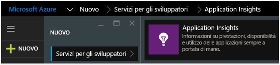
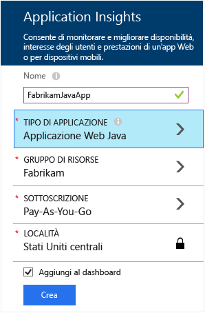
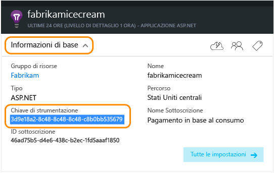

<properties 
	pageTitle="Application Insights per le applicazioni web Java che sono già live" 
	description="Avviare il monitoraggio di un'applicazione web che è già in esecuzione sul server" 
	services="application-insights" 
    documentationCenter="java"
	authors="alancameronwills" 
	manager="douge"/>

<tags 
	ms.service="application-insights" 
	ms.workload="tbd" 
	ms.tgt_pltfrm="ibiza" 
	ms.devlang="na" 
	ms.topic="article" 
	ms.date="10/21/2015" 
	ms.author="awills"/>
 
# Application Insights per le applicazioni web Java che sono già live

*Application Insights è disponibile in Anteprima.*

Se si dispone di un'applicazione web che è già in esecuzione sul server J2EE, è possibile avviare il monitoraggio con[Application Insight](app-insights-overview.md)senza la necessità di apportare modifiche al codice o ricompilare il progetto. Con questa opzione, è possibile ottenere informazioni sulle richieste HTTP inviate ai server, le eccezioni non gestite e i contatori delle prestazioni.

È necessaria una sottoscrizione di [Microsoft Azure](http://azure.com).

> [AZURE.NOTE]La procedura in questa pagina consente di aggiungere il SDK all'applicazione web in fase di esecuzione. Ciò è utile se non si desidera aggiornare o ricompilare il codice sorgente. Ma se possibile, è consigliabile[aggiungere l’SDK al codice sorgente](app-insights-java-get-started.md)invece. Che offre ulteriori opzioni, ad esempio la scrittura di codice per tenere traccia delle attività dell'utente.

## 1\. Ottenere una chiave di strumentazione di Application Insights

1. Accedere al [portale di Microsoft Azure](https://portal.azure.com)
2. Creare una nuova risorsa di Application Insights

    
3. Impostare il tipo di applicazione nell'applicazione Web Java.

    
4. Ottenere la chiave di strumentazione della nuova risorsa. Dopo poco sarà necessario incollarla in questo progetto del codice.

    

## 2\. Scaricare l'SDK

1. Scaricare [Application Insights SDK per Java](http://dl.windowsazure.com/applicationinsights/javabin/sdk.zip). 
2. Sul server, estrarre i contenuti SDK nella directory da cui vengono caricati i file binari del progetto. Se si utilizza Tomcat, in genere il risultato sarà in`webapps<your_app_name>\WEB-INF\lib`

## 3\. Aggiungere un file XML di Application Insights

Creare ApplicationInsights.xml nella cartella in cui è stato aggiunto il SDK. Copiarvi il seguente file XML.

Sostituire la chiave di strumentazione recuperata dal portale di Azure.

    <?xml version="1.0" encoding="utf-8"?>
    <ApplicationInsights xmlns="http://schemas.microsoft.com/ApplicationInsights/2013/Settings" schemaVersion="2014-05-30">

      <!-- The key from the portal: -->

      <InstrumentationKey>** Your instrumentation key **</InstrumentationKey>

      <!-- HTTP request component (not required for bare API) -->

      <TelemetryModules>
        <Add type="com.microsoft.applicationinsights.web.extensibility.modules.WebRequestTrackingTelemetryModule"/>
        <Add type="com.microsoft.applicationinsights.web.extensibility.modules.WebSessionTrackingTelemetryModule"/>
        <Add type="com.microsoft.applicationinsights.web.extensibility.modules.WebUserTrackingTelemetryModule"/>
      </TelemetryModules>

      <!-- Events correlation (not required for bare API) -->
      <!-- These initializers add context data to each event -->

      <TelemetryInitializers>
        <Add   type="com.microsoft.applicationinsights.web.extensibility.initializers.WebOperationIdTelemetryInitializer"/>
        <Add type="com.microsoft.applicationinsights.web.extensibility.initializers.WebOperationNameTelemetryInitializer"/>
        <Add type="com.microsoft.applicationinsights.web.extensibility.initializers.WebSessionTelemetryInitializer"/>
        <Add type="com.microsoft.applicationinsights.web.extensibility.initializers.WebUserTelemetryInitializer"/>
        <Add type="com.microsoft.applicationinsights.web.extensibility.initializers.WebUserAgentTelemetryInitializer"/>

      </TelemetryInitializers>
    </ApplicationInsights>

* La chiave di strumentazione viene inviata insieme a tutti gli elementi di dati di telemetria e indica ad Application Insights di visualizzarla nella risorsa.
* Il componente delle richieste HTTP è facoltativo. Invia automaticamente i dati di telemetria sulle richieste e tempi di risposta al portale.
* La correlazione di eventi è un'aggiunta al componente delle richieste HTTP. Assegna un identificatore a ogni richiesta ricevuta dal server e lo aggiunge come proprietà per ogni elemento di dati di telemetria come la proprietà 'Operation.Id'. Consente di correlare i dati di telemetria associati a ogni richiesta impostando un filtro in [Ricerca diagnostica](app-insights-diagnostic-search.md).

## 4\. Aggiungere un filtro HTTP

Individuare e aprire il file web.xml nel progetto e unire il frammento di codice seguente al di sotto del nodo app-web, in cui sono configurati i filtri dell'applicazione.

Per ottenere risultati più accurati, il filtro deve essere mappato prima di tutti gli altri filtri.

    <filter>
      <filter-name>ApplicationInsightsWebFilter</filter-name>
      <filter-class>
        com.microsoft.applicationinsights.web.internal.WebRequestTrackingFilter
      </filter-class>
    </filter>
    <filter-mapping>
       <filter-name>ApplicationInsightsWebFilter</filter-name>
       <url-pattern>/*</url-pattern>
    </filter-mapping>

## 5\. Riavviare la propria app web.

## 6\. Visualizzare i dati di telemetria in Application Insights

Tornare alla risorsa di Application Insights nel [portale di Microsoft Azure](https://portal.azure.com).

Nel pannello Panoramica verranno visualizzati i dati delle richieste HTTP. Se non sono visualizzati, attendere alcuni secondi e quindi fare clic su Aggiorna.

 

Fare clic su qualsiasi grafico per visualizzare metriche più dettagliate.

 

E quando si visualizzano le proprietà di una richiesta, è possibile visualizzare gli eventi di telemetria associati, ad esempio le richieste e le eccezioni.
 

[Altre informazioni sulle metriche.](app-insights-metrics-explorer.md)

## Passaggi successivi

* [Aggiungere la telemetria alle pagine Web](app-insights-web-track-usage.md) per monitorare le visualizzazioni pagina e le metriche utente.
* [Configurare i test Web](app-insights-monitor-web-app-availability.md) in modo da assicurarsi che l'applicazione sia disponibile e reattiva.
* [Acquisire le tracce dei log](app-insights-java-trace-logs.md)
* [Cercare eventi e log](app-insights-diagnostic-search.md) per facilitare la diagnosi dei problemi.

 

<!---HONumber=Nov15_HO1-->