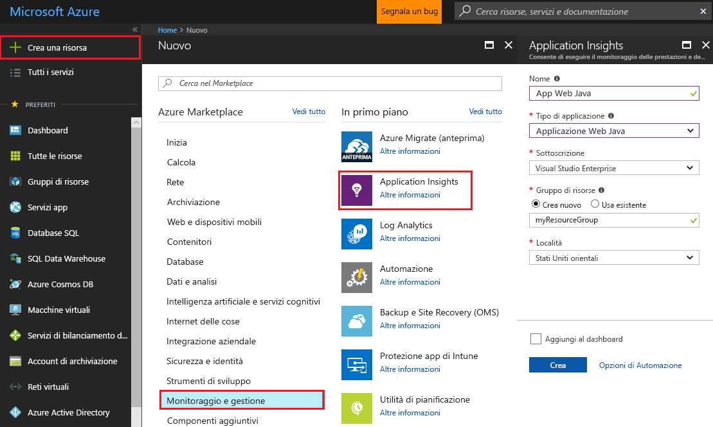
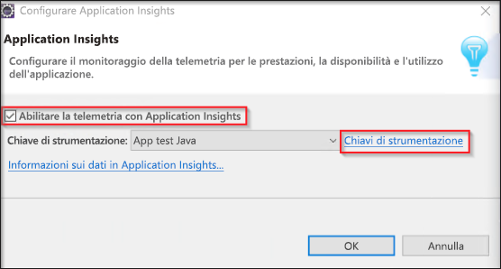
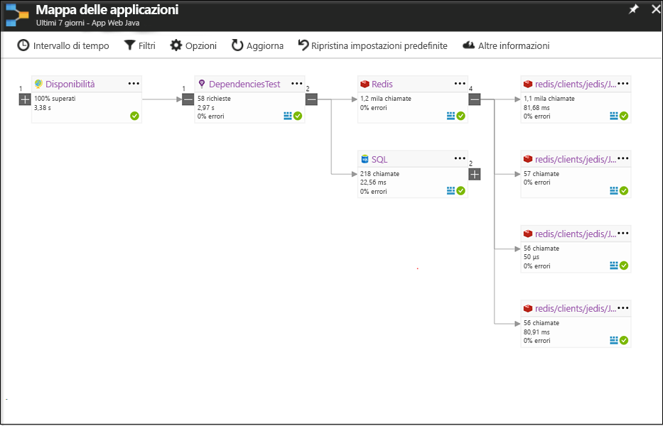
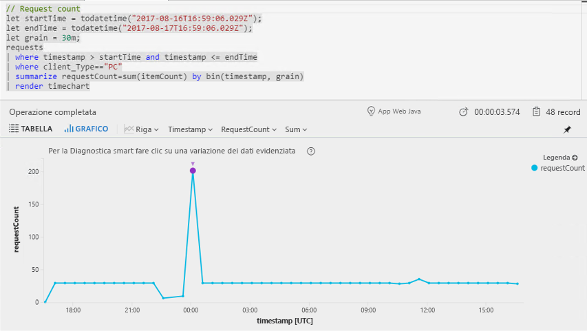
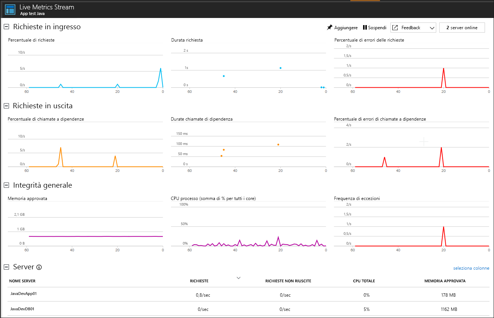

# <a name="start-monitoring-your-java-web-application"></a>Iniziare a monitorare l'applicazione Web Java

Con Azure Application Insights, è possibile monitorare facilmente la disponibilità, le prestazioni e l'uso dell'applicazione Web. È anche possibile identificare e diagnosticare rapidamente gli errori nell'applicazione senza attendere che vengano segnalati da un utente. Con Application Insights Java SDK è possibile monitorare i pacchetti di terze parti più diffusi, tra cui MongoDB, MySQL e Redis.

Questa guida introduttiva illustra l'aggiunta di Application Insights SDK a un progetto Web dinamico Java esistente.

## <a name="prerequisites"></a>prerequisiti

Per completare questa guida introduttiva:

- Installare Oracle JRE 1.6 o versione successiva o Zulu JRE 1.6 o versione successiva.
- Installare l'[IDE Eclipse gratuito per sviluppatori Java EE](http://www.eclipse.org/downloads/). Questa guida introduttiva usa Eclipse Oxygen (4.7).
- Saranno necessari una sottoscrizione di Azure e un progetto Web dinamico Java esistente.
 
Se non si ha un progetto Web dinamico Java, è possibile crearne uno con la [Guida introduttiva per la creazione di un'app Web Java](https://docs.microsoft.com/azure/app-service-web/app-service-web-get-started-java).

Se non si ha una sottoscrizione di Azure, creare un account [gratuito](https://azure.microsoft.com/free/) prima di iniziare.

## <a name="log-in-to-the-azure-portal"></a>Accedere al Portale di Azure

Accedere al [Portale di Azure](https://portal.azure.com/).

## <a name="enable-application-insights"></a>Abilitare Application Insights

Application Insights può raccogliere dati di telemetria da un'applicazione connessa a Internet, indipendentemente dal fatto che sia in esecuzione in locale o nel cloud. Usare la procedura seguente per iniziare a visualizzare questi dati.

1. Selezionare **Nuovo** > **Monitoraggio e gestione** > **Application Insights**.

   

   Verrà visualizzata una casella di configurazione. Usare la tabella seguente per completare i campi di input.

    | Impostazioni        | Valore           | DESCRIZIONE  |
   | ------------- |:-------------|:-----|
   | **Nome**      | Valore globalmente univoco | Nome che identifica l'app da monitorare |
   | **Tipo di applicazione** | Applicazione Web Java | Tipo di app da monitorare |
   | **Gruppo di risorse**     | myResourceGroup      | Nome del nuovo gruppo di risorse per l'hosting dei dati di Application Insights |
   | **Posizione** | Stati Uniti orientali | Scegliere una località nelle vicinanze o vicina a quella in cui è ospitata l'app |

2. Fare clic su **Crea**.

## <a name="install-app-insights-plugin"></a>Installare il plug-in di Application Insights

1. Avviare **Eclipse** > Fare clic su **Help** (?) > Selezionare **Install New Software** (Installa nuovo software).

   

2. Copiare ```http://dl.microsoft.com/eclipse``` nel campo "Work With" (Usa) > Selezionare **Azure Toolkit for Java** > Selezionare **Application Insights Plugin for Java** > **Deselezionare** "Contact all update sites during install to find required software" (Contatta tutti i siti di aggiornamento durante l'installazione per trovare il software necessario).

3. Al termine dell'installazione verrà richiesto di **riavviare Eclipse**.

## <a name="configure-app-insights-plugin"></a>Configurare il plug-in di Application Insights

1. Avviare **Eclipse** > Aprire il progetto scegliendo **Project** (Progetto) > Fare clic con il pulsante destro del mouse sul nome del progetto in **Project Explorer** (Esplora progetti) > Selezionare **Azure** > Fare clic su **Sign In** (Accedi).

2. Selezionare **Interactive** (Interattiva) per il metodo di autenticazione > Fare clic su **Sign In** (Accedi) > Quando richiesto, immettere le **credenziali di Azure** > Selezionare la propria **sottoscrizione di Azure**.

3. Fare clic con il pulsante destro sel mouse sul nome del progetto in **Project Explorer** (Esplora progetti) > Selezionare **Azure** > Fare clic su **Configure Application Insights** (Configura Application Insights).

4. Selezionare **Enable telemetry with Application Insights** (Abilita la telemetria con Application Insights) > Selezionare la risorsa di Application Insights e il valore associato per **Instrumentation Key** (Chiave di strumentazione) da collegare all'app Java.

   

> [!NOTE]
> Application Insights SDK for Java consente di acquisire e visualizzare le metriche in tempo reale, ma quando si abilita per la prima volta la raccolta di dati di telemetria è possibile che sia necessario attendere qualche minuto prima della visualizzazione dei dati nel portale. Se questa app è un'app di test a basso traffico, occorre ricordare che la maggior parte delle metriche viene acquisita solo in presenza di operazioni o richieste attive.

## <a name="start-monitoring-in-the-azure-portal"></a>Avviare il monitoraggio nel portale di Azure

1. È ora possibile riaprire la pagina **Panoramica** di Application Insights nel portale di Azure, dove è stata recuperata la chiave di strumentazione, per visualizzare informazioni dettagliate sull'applicazione attualmente in esecuzione.

   

2. Fare clic su **Mappa app** per ottenere un layout visivo delle relazioni di dipendenza tra i componenti dell'applicazione. Ogni componente mostra indicatori KPI come carico, prestazioni, errori e avvisi.

   

3. Fare clic sull'icona di **App Analytics** . Verrà aperta la finestra **Application Insights - Analisi**, che fornisce un linguaggio di query avanzato per l'analisi di tutti i dati raccolti da Application Insights. In questo caso viene generata una query che esegue il rendering del conteggio delle richieste sotto forma di grafico. È possibile scrivere query personalizzate per analizzare altri dati.

   

4. Tornare alla pagina **Panoramica** ed esaminare **Integrità - Panoramica sequenza temporale**.  Questo dashboard fornisce statistiche relative all'integrità dell'applicazione, ad esempio il numero di richieste in ingresso, la durata delle richieste ed eventuali errori che si sono verificati.

   

   Per abilitare la popolazione del grafico **Tempo di caricamento della visualizzazione pagina** con i dati di **telemetria lato client**, aggiungere questo script a ogni pagina da verificare:

   ```HTML
   <!-- 
   To collect end-user usage analytics about your application, 
   insert the following script into each page you want to track.
   Place this code immediately before the closing </head> tag,
   and before any other scripts. Your first data will appear 
   automatically in just a few seconds.
   -->
   <script type="text/javascript">
     var appInsights=window.appInsights||function(config){
     function i(config){t[config]=function(){var i=arguments;t.queue.push(function(){t[config].apply(t,i)})}}var t={config:config},u=document,e=window,o="script",s="AuthenticatedUserContext",h="start",c="stop",l="Track",a=l+"Event",v=l+"Page",y=u.createElement(o),r,f;y.src=config.url||"https://az416426.vo.msecnd.net/scripts/a/ai.0.js";u.getElementsByTagName(o)[0].parentNode.appendChild(y);try{t.cookie=u.cookie}catch(p){}for(t.queue=[],t.version="1.0",r=["Event","Exception","Metric","PageView","Trace","Dependency"];r.length;)i("track"+r.pop());return i("set"+s),i("clear"+s),i(h+a),i(c+a),i(h+v),i(c+v),i("flush"),config.disableExceptionTracking||(r="onerror",i("_"+r),f=e[r],e[r]=function(config,i,u,e,o){var s=f&&f(config,i,u,e,o);return s!==!0&&t["_"+r](config,i,u,e,o),s}),t
    }({
        instrumentationKey:"<instrumentation key>"
    });

    window.appInsights=appInsights;
    appInsights.trackPageView();
   </script>
    ```

5. Fare clic su **Live Stream**. Qui sono disponibili le metriche in tempo reale correlate alle prestazioni dell'app Web Java. **Live Metrics Stream** include dati relativi al numero di richieste in ingresso, alla durata di tali richieste e ad eventuali errori che si sono verificati. È anche possibile monitorare importanti metriche sulle prestazioni, come processore e memoria, in tempo reale.

   

Per altre informazioni sul monitoraggio di Java, vedere la [documentazione aggiuntiva su Java in Application Insights](.\app-insights-java-get-started.md).

## <a name="clean-up-resources"></a>Pulire le risorse

Se si prevede di continuare a usare le guide introduttive o le esercitazioni successive, non eliminare le risorse create in questa guida introduttiva. Se non si prevede di continuare, seguire questa procedura per eliminare tutte le risorse create da questa guida introduttiva nel portale di Azure.

1. Scegliere **Gruppi di risorse** dal menu a sinistra del portale di Azure e quindi fare clic su **myResourceGroup**.
2. Nella pagina del gruppo di risorse fare clic su **Elimina**, digitare **myResourceGroup** nella casella di testo e quindi fare clic su **Elimina**.

## <a name="next-steps"></a>Passaggi successivi

> [!div class="nextstepaction"]
> [Rilevare e diagnosticare i problemi di prestazioni](https://docs.microsoft.com/azure/application-insights/app-insights-analytics)