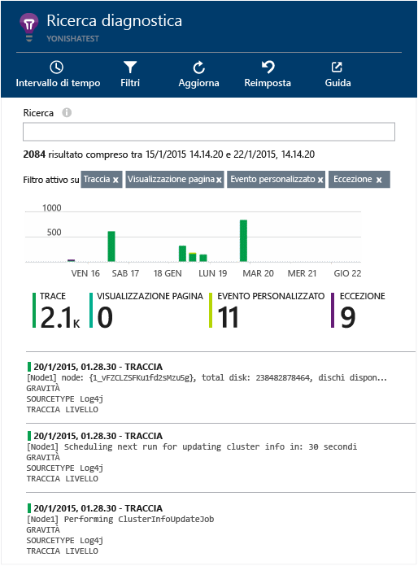

# <a name="explore-java-trace-logs-in-application-insights"></a>Esplorare i log di traccia Java in Application Insights
Se si usa Logback o Log4J (v1.2 o v2.0) per la traccia, è possibile inviare automaticamente i log di traccia ad Application Insights dove è possibile esplorarli e eseguirvi ricerche.

## <a name="install-the-java-sdk"></a>Installare Java SDK

Installare [Application Insights SDK per Java][java], se questa operazione non è già stata eseguita.

Se non si desidera tenere traccia delle richieste HTTP, è possibile omettere gran parte del file di configurazione .xml, ma è necessario includere almeno l'elemento `InstrumentationKey`. È anche necessario chiamare `new TelemetryClient()` per inizializzare il SDK.


## <a name="add-logging-libraries-to-your-project"></a>Aggiungere le librerie di registrazione al progetto
*Scegliere il modo più appropriato per il progetto.*

#### <a name="if-youre-using-maven"></a>Se si usa Maven...
Se il progetto è già stato configurato per usare Maven per la compilazione, aggiungere uno dei frammenti di codice seguenti nel file pom.xml.

Aggiornare quindi le dipendenze progetto per fare in modo che i file binari vengano scaricati.

*Logback*

```XML

    <dependencies>
       <dependency>
          <groupId>com.microsoft.azure</groupId>
          <artifactId>applicationinsights-logging-logback</artifactId>
          <version>[1.0,)</version>
       </dependency>
    </dependencies>
```

*Log4J v2.0*

```XML

    <dependencies>
       <dependency>
          <groupId>com.microsoft.azure</groupId>
          <artifactId>applicationinsights-logging-log4j2</artifactId>
          <version>[1.0,)</version>
       </dependency>
    </dependencies>
```

*Log4J v1.2*

```XML

    <dependencies>
       <dependency>
          <groupId>com.microsoft.azure</groupId>
          <artifactId>applicationinsights-logging-log4j1_2</artifactId>
          <version>[1.0,)</version>
       </dependency>
    </dependencies>
```

#### <a name="if-youre-using-gradle"></a>Se si usa Gradle...
Se il progetto è già configurato per usare Gradle per la compilazione, aggiungere una delle righe seguenti al gruppo `dependencies` nel file build.gradle:

Aggiornare quindi le dipendenze progetto per fare in modo che i file binari vengano scaricati.

**Logback**

```

    compile group: 'com.microsoft.azure', name: 'applicationinsights-logging-logback', version: '1.0.+'
```

**Log4J v2.0**

```
    compile group: 'com.microsoft.azure', name: 'applicationinsights-logging-log4j2', version: '1.0.+'
```

**Log4J v1.2**

```
    compile group: 'com.microsoft.azure', name: 'applicationinsights-logging-log4j1_2', version: '1.0.+'
```

#### <a name="otherwise-"></a>In caso contrario...
Scaricare ed estrarre l'appender appropriato e quindi aggiungere la libreria appropriata al progetto:

| Logger | Scaricare | Libreria |
| --- | --- | --- |
| Logback |[SDK con appender Logback](https://aka.ms/xt62a4) |applicationinsights-logging-logback |
| Log4J v2.0 |[SDK con appender Log4J v2](https://aka.ms/qypznq) |applicationinsights-logging-log4j2 |
| Log4J v1.2 |[SDK con appender Log4J v1.2](https://aka.ms/ky9cbo) |applicationinsights-logging-log4j1_2 |

## <a name="add-the-appender-to-your-logging-framework"></a>Aggiungere l'appender per il framework di registrazione
Per iniziare la raccolta di tracce, unire il frammento di codice rilevante al file di configurazione Log4J o Logback: 

*Logback*

```XML

    <appender name="aiAppender" 
      class="com.microsoft.applicationinsights.logback.ApplicationInsightsAppender">
    </appender>
    <root level="trace">
      <appender-ref ref="aiAppender" />
    </root>
```

*Log4J v2.0*

```XML

    <Configuration packages="com.microsoft.applicationinsights.Log4j">
      <Appenders>
        <ApplicationInsightsAppender name="aiAppender" />
      </Appenders>
      <Loggers>
        <Root level="trace">
          <AppenderRef ref="aiAppender"/>
        </Root>
      </Loggers>
    </Configuration>
```

*Log4J v1.2*

```XML

    <appender name="aiAppender" 
         class="com.microsoft.applicationinsights.log4j.v1_2.ApplicationInsightsAppender">
    </appender>
    <root>
      <priority value ="trace" />
      <appender-ref ref="aiAppender" />
    </root>
```

È possibile fare riferimento agli appender di Application Insights da qualsiasi logger configurato e non necessariamente dal logger principale (come illustrato negli esempi di codice riportati sopra).

## <a name="explore-your-traces-in-the-application-insights-portal"></a>Esplorare le tracce nel portale Application Insights.
Ora che è stato configurato il progetto per inviare tracce in Application Insights, è possibile visualizzare e cercare queste tracce nel portale di Application Insights nel pannello [Ricerca][diagnostic].



## <a name="next-steps"></a>Passaggi successivi
[Ricerca diagnostica][diagnostic]

<!--Link references-->

[diagnostic]: app-insights-diagnostic-search.md
[java]: app-insights-java-get-started.md


<!--HONumber=Dec16_HO2-->


