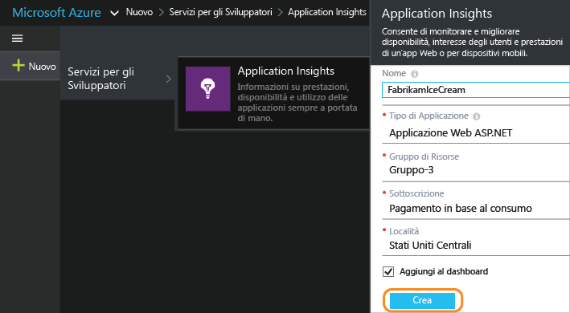
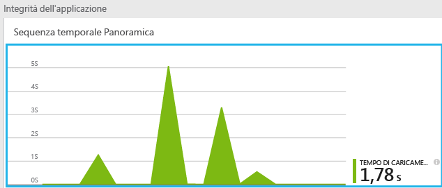
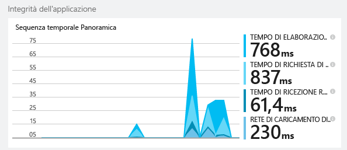
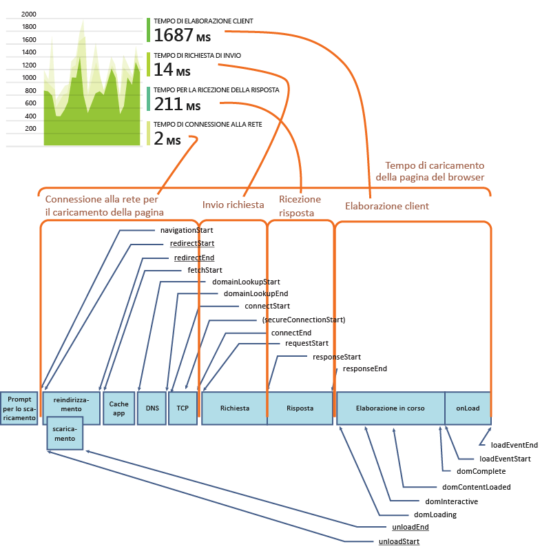
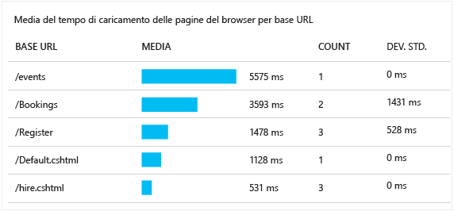
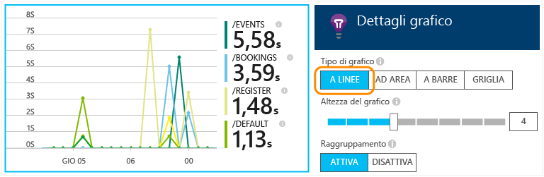
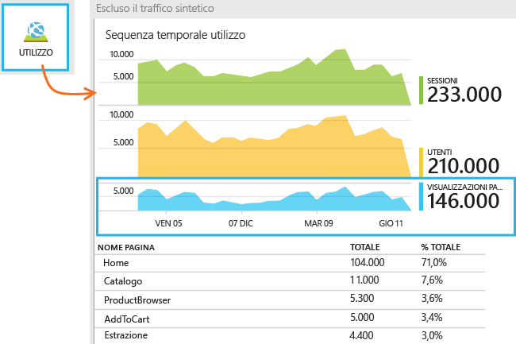
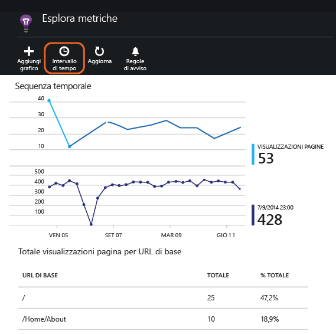
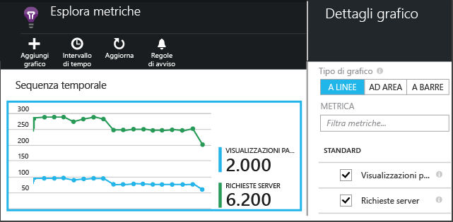
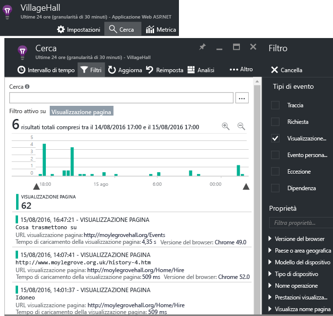

<properties
	pageTitle="Application Insights per app Web JavaScript | Microsoft Azure"
	description="Ottenere i conteggi delle visualizzazioni pagina e delle sessioni, i dati client Web e la traccia dei modelli di utilizzo. Rilevare le eccezioni e i problemi di prestazioni nelle pagine Web JavaScript."
	services="application-insights"
    documentationCenter=""
	authors="alancameronwills"
	manager="douge"/>

<tags
	ms.service="application-insights"
	ms.workload="tbd"
	ms.tgt_pltfrm="ibiza"
	ms.devlang="na"
	ms.topic="get-started-article"
	ms.date="11/03/2015"
	ms.author="awills"/>

# Application Insights per app Web JavaScript

[AZURE.INCLUDE [app-insights-selector-get-started](../../includes/app-insights-selector-get-started.md)]

Scoprire le prestazioni e l'utilizzo della pagina Web. Aggiungere Visual Studio Application Insights alla pagina e verrà illustrato il numero di utenti disponibili, la frequenza delle visite e quali pagine sono più usate. Si riceveranno anche report sui tempi di caricamento e su eventuali eccezioni. Aggiungere alcuni [eventi e metriche personalizzati][track] per analizzare in dettaglio le funzionalità usate con maggiore frequenza, scoprire quali sono gli errori più comuni e ottimizzare l'uso della pagina da parte degli utenti.

Se sono già stati configurati i dati di telemetria server per l'app Web [ASP.NET][greenbrown] o [Java][java], si otterrà l'immagine dal punto di vista client e server. I due flussi verranno integrati nel portale di Application Insights.

#### Dimostrazione rapida

Se non si ha una sottoscrizione di Azure e si vuole provare Application Insights in una pagina Web, visitare la pagina in cui è possibile [provare Application Insights](http://aka.ms/ainow).

## Creare una risorsa di Application Insights

La risorsa di Application Insights è dove vengono visualizzati i dati sulle prestazioni e l'utilizzo della pagina. Se già stata creata una risorsa, forse per raccogliere dati da un server Web, ignorare questo passaggio.

Nel [portale di Azure](http://portal.azure.com) creare una nuova risorsa di Application Insights.

*Altre domande?* [Altre informazioni sulla creazione di una risorsa][new].

## Aggiungere lo script SDK per l'app o pagine Web

In Avvio rapido ottenere lo script per le pagine Web:

Inserire lo script immediatamente prima del tag &lt;/head&gt; di ogni pagina di cui si vuole tenere traccia. Se il sito Web presenta una pagina master, è possibile inserire lo script in tale posizione. Ad esempio:

* Ad esempio, in un progetto ASP.NET MVC inserire lo script in View\\Shared\\_Layout.cshtml
* Nel pannello di controllo di un sito di SharePoint aprire [Impostazioni sito/pagina Master](app-insights-sharepoint.md).

Lo script contiene la chiave di strumentazione che indirizza i dati alla risorsa di Application Insights.

[Spiegazione più approfondita dello script.](http://apmtips.com/blog/2015/03/18/javascript-snippet-explained/)

*(Se si usa un framework di pagine Web noto, cercare adattatori Application Insights. Ad esempio, [un modulo AngularJS](http://ngmodules.org/modules/angular-appinsights)).*

## Eseguire l'app

Eseguire l'app Web, usarla un periodo di tempo per generare dati di telemetria e attendere alcuni secondi. È possibile eseguirla premendo **F5** sul computer di sviluppo o pubblicarla e metterla a disposizione degli utenti.

Se si vuole controllare i dati di telemetria che un'app Web sta inviando ad Application Insights, usare gli strumenti di debug del browser, **F12** in molti browser. I dati vengono inviati a dc.services.visualstudio.com.

## Esplorare i dati

Nel pannello di panoramica applicazione, esiste un grafico accanto alla parte superiore che indica il tempo medio di caricamento delle pagine nel browser:

*Ancora nessun dato? Fare clic su **Aggiorna** nella parte superiore della pagina. Ancora niente di fatto? Vedere [Risoluzione dei problemi][qna].*

Fare clic sul grafico e ottenere una versione più dettagliata:

Si tratta di un grafico in pila che suddivide il tempo di caricamento totale delle pagine negli [intervalli di tempo standard definiti da W3C](http://www.w3.org/TR/navigation-timing/#processing-model).

Si noti che la *connessione di rete* ora è in genere più lento del previsto, perché è una media di tutte le richieste dal browser al server. Molte richieste singole hanno un tempo di connessione pari a 0 perché esiste già una connessione attiva sul server.

### Prestazioni per pagina

Più in basso nel pannello dettagli, esiste una griglia segmentata in base all'URL pagina:

Se si vogliono visualizzare le prestazioni delle pagine nel tempo, fare doppio clic sulla griglia e modificarne il tipo di grafico:

## Panoramica sull'utilizzo del client

Nel pannello Panoramica fare clic su **Utilizzo**:

* **Utenti:** il numero di utenti distinti nell'intervallo di tempo del grafico. I cookie vengono usati per identificare gli utenti abituali.
* **Sessioni:**: una sessione viene conteggiata quando un utente non ha eseguito alcuna richiesta per 30 minuti.
* **Visualizzazioni pagina**: conta il numero di chiamate a trackPageView(), in genere chiamate una volta in ogni pagina Web.

### Fare clic per visualizzare altri dettagli

Fare clic su uno qualsiasi dei grafici per visualizzare altri dettagli. Si noti che è possibile modificare l'intervallo di tempo dei grafici.

Fare clic su un grafico per scegliere altre metriche da visualizzare o aggiungere un nuovo grafico e selezionare le metriche visualizzate.

> [AZURE.NOTE]Le metriche possono essere visualizzate solo in alcune combinazioni. Quando si seleziona una metrica, quelle incompatibili vengono disabilitate.

## Conteggi di pagina personalizzati

Per impostazione predefinita, viene conteggiata una pagina ogni volta che una nuova pagina viene caricata nel browser client. Potrebbero tuttavia essere utile conteggiare visualizzazioni di pagina aggiuntive. Ad esempio, il contenuto di una pagina potrebbe essere visualizzato in schede e si desidera conteggiare una pagina quando l'utente cambia scheda oppure un codice JavaScript nella pagina potrebbe caricare nuovi contenuti senza cambiare l'URL del browser.

Inserire una chiamata JavaScript simile a questa nel punto appropriato nel codice del client:

    appInsights.trackPageView(myPageName);

Il nome della pagina può contenere gli stessi caratteri di un URL, ma i caratteri successivi a "#" o "?" verranno ignorati.

## Esaminare singoli eventi di visualizzazione pagina

In genere la telemetria delle visualizzazioni di pagina viene analizzata da Application Insights e vengono quindi visualizzati solo i report cumulativi, mediati su tutti gli utenti del sito. A scopo di debug, tuttavia, è possibile visualizzare anche singoli eventi di visualizzazione di pagina.

Nel pannello di ricerca diagnostica, impostare Filtri su Visualizzazione pagina.

Selezionare qualsiasi evento per visualizzare altri dettagli. Nella pagina dei dettagli fare clic su "..." per visualizzare altri dettagli.

> [AZURE.NOTE]Se si usa [Ricerca][diagnostic], si noti che è necessaria la corrispondenza di tutta la parola: "Informaz" e "Info" non corrispondono a "Informazioni", a differenza di "Informa*". Inoltre, non è possibile iniziare un termine di ricerca con un carattere jolly. Ad esempio, se si cerca "*irc" non si troverà "Circa".

> [Altre informazioni sulla ricerca diagnostica][diagnostic]

### Proprietà delle visualizzazioni di pagina

* **Durata della visualizzazione di pagina**&#151;tempo necessario per caricare la pagina e iniziare a eseguire gli script. In particolare, indica l'intervallo tra l'avvio del caricamento della pagina e l'esecuzione di trackPageView. Se si sposta trackPageView dalla posizione consueta dopo l'inizializzazione dello script, rifletterà un valore diverso.

## Traccia dell'utilizzo personalizzato

Per sapere in che modo gli utenti usano l'app, inserire le chiamate nel codice del client e del server per inviare i dati di telemetria ad Application Insights. È possibile, ad esempio, scoprire quanti utenti creano ordini senza completarli, quali sono gli errori di convalida che si verificano con maggiore frequenza oppure qual è il punteggio medio di un gioco.

* [Altre informazioni sull'API per gli eventi e le metriche personalizzati][track].
* [Informazioni di riferimento sulle API](https://github.com/Microsoft/ApplicationInsights-JS/blob/master/API-reference.md)

## Telemetria server

Se non è stata ancora eseguita questa operazione, è possibile ottenere informazioni dal server e visualizzare i dati insieme a quelli sul lato client, consentendo di valutare le prestazioni del server e diagnosticare eventuali problemi.

* [Aggiungere Application Insights a un'app ASP.NET][greenbrown]
* [Aggiungere Application Insights a un'app Web Java][java]

##  Video: Tenere traccia dell'utilizzo

> [AZURE.VIDEO tracking-usage-with-application-insights]

##  Passaggi successivi

[Tracciare l'utilizzo con eventi e metriche personalizzati][track]

<!--Link references-->

[diagnostic]: app-insights-diagnostic-search.md
[greenbrown]: app-insights-start-monitoring-app-health-usage.md
[java]: app-insights-java-get-started.md
[new]: app-insights-create-new-resource.md
[qna]: app-insights-troubleshoot-faq.md
[track]: app-insights-api-custom-events-metrics.md

<!---HONumber=Nov15_HO2-->