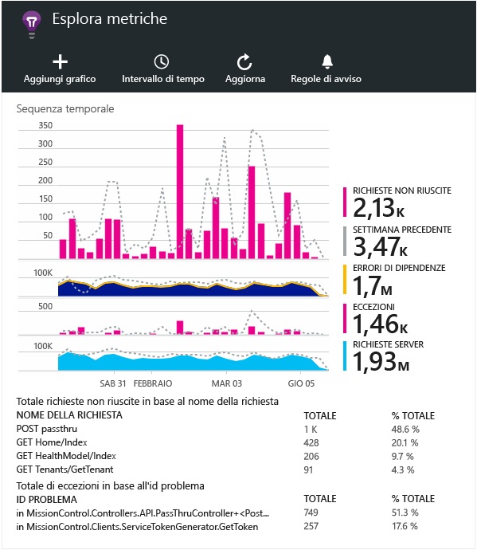

<properties 
	pageTitle="Esaminare le metriche in Application Insights" 
	description="Come interpretare i grafici in esplora metriche e come personalizzare i pannelli di esplora metriche." 
	services="application-insights" 
    documentationCenter=""
	authors="alancameronwills" 
	manager="douge"/>

<tags 
	ms.service="application-insights" 
	ms.workload="tbd" 
	ms.tgt_pltfrm="ibiza" 
	ms.devlang="na" 
	ms.topic="article" 
	ms.date="11/23/2015" 
	ms.author="awills"/>
 
# Esaminare le metriche in Application Insights

Le metriche in [Application Insights][start] sono valori e un numero di eventi misurati, inviati nella telemetria dall'applicazione. Consentono di rilevare problemi di prestazioni e osservare le tendenze nella modalità di uso dell'applicazione. Esiste una vasta gamma di metriche standard ed è anche possibile creare le proprie metriche ed eventi personalizzati.

Il conteggio delle metriche e degli eventi viene visualizzato nei grafici dei valori aggregati, ad esempio somme, medie o conteggi.

Ecco un grafico di esempio:

Alcuni grafici sono segmentati: l'altezza totale del grafico in qualsiasi punto è la somma delle metriche visualizzate. La legenda per impostazione predefinita mostra le quantità più grandi.

Le linee tratteggiate indicano il valore della metrica di una settimana precedente.

## Intervallo di tempo

È possibile modificare l'intervallo di tempo coperto dai grafici o dalle griglie in tutti i pannelli.

Se si è in attesa di alcuni dati non ancora visualizzati, fare clic su Aggiorna. I grafici si aggiornano a intervalli, ma gli intervalli sono più lunghi per gli intervalli di tempo maggiori. In modalità di rilascio è possibile che ai dati sia necessario un po' di tempo per superare la pipeline di analisi in un grafico.

Per ingrandire una parte di un grafico, trascinare sulla parte e fare clic sul simbolo di lente di ingrandimento:

## Granularità e valori dei punti

Posizionare il mouse sul grafico per visualizzare i valori delle metriche in quel punto.

Il valore della metrica in un punto particolare è aggregato al sopra dell'intervallo di campionamento precedente.

L'intervallo di campionamento o "granularità" è visibile nella parte superiore del pannello.

È possibile modificare la granularità nel pannello Intervallo di tempo:

Le granularità disponibili dipendono dall'intervallo di tempo selezionato. Le granularità esplicite costituiscono alternative alla granularità "automatica" per l'intervallo di tempo.

## Esplora metriche

Fare clic su qualsiasi grafico nel pannello Panoramica per visualizzare un set più dettagliato di griglie e grafici correlati. È possibile modificare questi grafici e griglie per concentrarsi sui dettagli a cui si è interessati.

Oppure è possibile fare clic sul pulsante Esplora metriche nell'intestazione del pannello Panoramica.

Ad esempio, fare clic sul grafico Richieste non riuscite dell'app Web:

## Cosa significano le cifre?

La legenda sul lato mostra di solito per impostazione predefinita il valore aggregato per il periodo del grafico. Se si passa il mouse sul grafico, viene visualizzato il valore in questo punto.

Ogni punto dati del grafico è una funzione di aggregazione dei valori di dati ricevuti nell'intervallo di campionamento o nella "granularità" precedente. La granularità viene visualizzata nella parte superiore del pannello e varia in base alla scala cronologica complessiva del grafico.

Le metriche possono essere aggregate in modi diversi:

 * **Somma** esegue la somma dei valori dei punti dati ricevuti tramite l'intervallo di campionamento o il periodo del grafico.
 * **Media** divide la somma del numero di punti dati ricevuti tramite l'intervallo.
 * **Unica** i conteggi vengono usati per contare gli utenti e gli account. Per tutto l'intervallo di campionamento, o per il periodo del grafico, la figura mostra il numero di utenti visualizzato in quel momento.

È possibile modificare il metodo di aggregazione:

Il metodo predefinito per ogni metrica viene visualizzato quando si crea un nuovo grafico:

## Modifica di grafici e griglie

Per aggiungere un nuovo grafico al pannello:

Selezionare un grafico nuovo o esistente per modificare il contenuto visualizzato:

È possibile visualizzare più metriche in un grafico, anche se sono presenti restrizioni sulle combinazioni che è possibile visualizzare insieme. Non appena si sceglie una metrica, alcune vengono disabilitate.

Se si codificano [metriche personalizzate][track] nell'app (chiamate a TrackMetric e TrackEvent), verranno elencate qui.

## Segmentare i dati

Selezionare un grafico o una griglia, passare a un raggruppamento e scegliere una proprietà per eseguire il raggruppamento in base a:

Se si codificano [metriche personalizzate][track] nell'app e includono i valori delle proprietà, sarà possibile selezionare la proprietà nell'elenco.

Il grafico è troppo piccolo per dati segmentati? Modificarne l'altezza:

## Filtrare i dati

Per visualizzare solo le metriche per un set di valori di proprietà selezionati:

Se non si seleziona alcun valore per una determinata proprietà, è come se si selezionassero tutti: non sono presenti filtri su quella proprietà.

Si noti il numero di eventi vicino a ogni valore della proprietà. Quando si selezionano i valori di una proprietà, i conteggi vicino ad altri valori di proprietà vengono modificati.

### Per aggiungere proprietà all'elenco di filtri

Si desidera filtrare i dati di telemetria su una categoria di propria scelta? Ad esempio, forse se si dividono gli utenti in categorie diverse si potrebbero ottenere la segmentazione dei dati in base a queste categorie.

[Creare proprietà personalizzate](app-insights-api-custom-events-metrics.md#properties). Impostazione in un [Inizializzatore di telemetria](app-insights-api-custom-events-metrics.md#telemetry-initializers) affinché venga visualizzato in tutti i dati di telemetria - compresa la telemetria standard inviata dai diversi moduli SDK.

## Rimuovere il traffico di bot e test Web

Usare il filtro **Traffico reale o sintetico** e selezionare **Reale**.

È possibile anche filtrare in base a **Origine del traffico sintetico**.

## Modificare il tipo di grafico

In particolare, si noti che è possibile passare dalle griglie ai grafici e viceversa:

## Salvare il pannello delle metriche

Dopo aver creato alcuni grafici, è possibile salvarli come preferiti. È possibile scegliere se condividerlo con altri membri del team, se si usa un account aziendale.

Per visualizzare nuovamente il pannello, **andare al pannello** e aprire Preferiti:

Se si è scelto l'intervallo di tempo Relativo al momento del salvataggio, il pannello verrà aggiornato con le metriche più recenti. Se si è scelto l'intervallo di tempo Assoluto, verranno visualizzati gli stessi dati ogni volta.

## Reimpostare il pannello

Se si modifica un pannello ma poi si desidera tornare a quello impostato salvato in origine, fare clic su Reimposta.

## Impostazione di avvisi

Per ricevere tramite posta elettronica una notifica dei valori insoliti di una metrica, aggiungere un avviso. È possibile scegliere di inviare il messaggio di posta elettronica agli amministratori di account o a indirizzi di posta elettronica specifici.

[Altre informazioni sugli avvisi][alerts].

## Eseguire l'esportazione in Excel

È possibile esportare in un file di Excel i dati delle metriche visualizzati in Esplora metriche. I dati esportati includono i dati di tutti i grafici e le tabelle visualizzati nel portale.

I dati di ogni grafico o tabella vengono esportati in un foglio separato nel file di Excel.

Gli elementi visualizzati sono quelli che vengono esportati. È pertanto necessario modificare l'intervallo di tempo o i filtri se si vuole modificare l'intervallo di dati esportato. Per le tabelle, se è visibile il comando **Carica altro**, sarà possibile fare clic su di esso prima di fare clic su Esporta per esportare una quantità maggiore di dati.

*Esporta attualmente funziona solo per Internet Explorer e Chrome. In futuro verrà aggiunto il supporto per altri browser.*

### Esportazione continua

Se si vuole che i dati vengano esportati in modo continuo per poterli elaborare esternamente, considerare la possibilità di usare l'[esportazione continua](app-insights-export-telemetry.md).

### Power BI

Per visualizzazione dei dati ancora più avanzate, è possibile [esportare in Power BI](http://blogs.msdn.com/b/powerbi/archive/2015/11/04/explore-your-application-insights-data-with-power-bi.aspx).

## Passaggi successivi

* [Monitoraggio dell'utilizzo con Application Insights](app-insights-overview-usage.md)
* [Uso di Ricerca diagnostica](app-insights-diagnostic-search.md)

<!--Link references-->

[alerts]: app-insights-alerts.md
[start]: app-insights-overview.md
[track]: app-insights-api-custom-events-metrics.md

 

<!---HONumber=AcomDC_1125_2015-->