# Esaminare le metriche in Application Insights
Le metriche in [Application Insights][start] sono valori e conteggi di eventi misurati, inviati nei dati di telemetria dall'applicazione. Consentono di rilevare problemi di prestazioni e osservare le tendenze nella modalità di uso dell'applicazione. Esiste una vasta gamma di metriche standard ed è anche possibile creare metriche ed eventi personalizzati.

Il conteggio delle metriche e degli eventi viene visualizzato nei grafici dei valori aggregati, ad esempio somme, medie o conteggi.

Ecco un esempio di set di grafici:

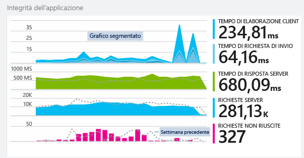

I grafici delle metriche sono disponibili ovunque nel portale di Application Insights. Nella maggior parte dei casi possono essere personalizzati ed è possibile aggiungere altri grafici al pannello. Nel pannello Panoramica fare clic per visualizzare grafici più dettagliati (con titoli come "Server") oppure fare clic su **Esplora metriche** per aprire un nuovo pannello in cui è possibile creare grafici personalizzati.

## Intervallo di tempo
È possibile modificare l'intervallo di tempo coperto dai grafici o dalle griglie in tutti i pannelli.

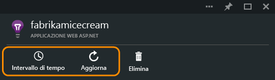

Se si è in attesa di alcuni dati non ancora visualizzati, fare clic su Aggiorna. I grafici si aggiornano a intervalli regolari, ma gli intervalli sono più lunghi per gli intervalli di tempo maggiori. Ai dati potrebbe essere necessario un po' di tempo per superare la pipeline di analisi in un grafico.

Per ingrandire una parte di un grafico, trascinare sulla parte:

Fare clic sul pulsante Annulla zoom per ripristinarlo.

## Granularità e valori dei punti
Posizionare il mouse sul grafico per visualizzare i valori delle metriche in quel punto.

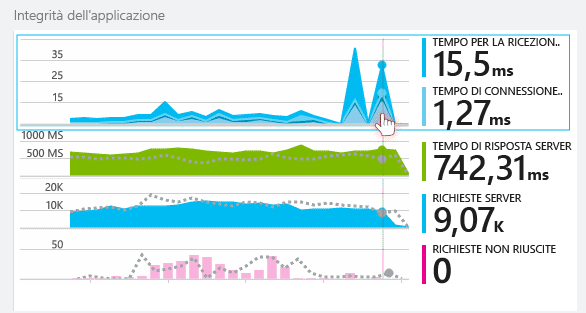

Il valore della metrica in un punto particolare viene aggregato in base all'intervallo di campionamento precedente.

L'intervallo di campionamento o "granularità" è visibile nella parte superiore del pannello.

È possibile modificare la granularità nel pannello Intervallo di tempo:

Le granularità disponibili dipendono dall'intervallo di tempo selezionato. Le granularità esplicite costituiscono alternative alla granularità "automatica" per l'intervallo di tempo.

## Modifica di grafici e griglie
Per aggiungere un nuovo grafico al pannello:

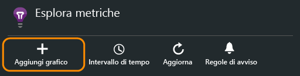

Selezionare **Modifica** su un grafico nuovo o esistente per modificare il contenuto visualizzato:

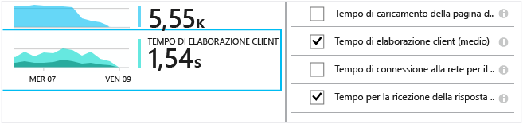

È possibile visualizzare più metriche in un grafico, anche se sono presenti restrizioni sulle combinazioni che è possibile visualizzare insieme. Non appena si sceglie una metrica, alcune vengono disabilitate.

Eventuali [metriche personalizzate][track] codificate nell'app (chiamate a TrackMetric e TrackEvent) vengono elencate qui.

## Segmentare i dati
È possibile suddividere una metrica per la proprietà, ad esempio eseguire un confronto delle visualizzazioni di una pagina sui client con sistemi operativi differenti.

Selezionare un grafico o una griglia, attivare il raggruppamento e scegliere una proprietà in base a cui eseguire il raggruppamento:

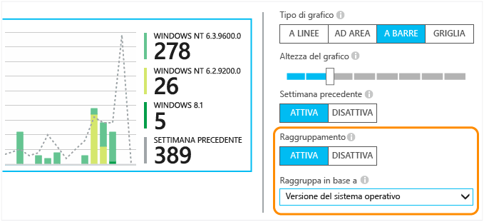

> [!NOTE]
> Quando si utilizza la funzione di raggruppamento, i grafici ad area e a barre forniscono una visualizzazione in pila, che risulta ottimale se il metodo di aggregazione selezionato è Somma. Ma se il tipo di aggregazione selezionato è Media, è consigliabile scegliere i tipi di visualizzazione a righe o a griglia.
>
>

Se si codificano [metriche personalizzate][track] nell'app e si includono valori di proprietà, sarà possibile selezionare le proprietà da questo elenco.

Il grafico è troppo piccolo per dati segmentati? modificarne l'altezza:

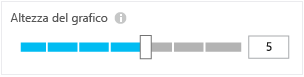

## Tipi di aggregazione
La legenda sul lato mostra di solito per impostazione predefinita il valore aggregato per il periodo del grafico. Se si passa il mouse sul grafico, viene visualizzato il valore in questo punto.

Ogni punto dati del grafico è una funzione di aggregazione dei valori di dati ricevuti nell'intervallo di campionamento o nella "granularità" precedente. La granularità viene visualizzata nella parte superiore del pannello e varia in base alla scala cronologica complessiva del grafico.

Le metriche possono essere aggregate in modi diversi:

* **Conteggio** è un conteggio degli eventi ricevuti nell'intervallo di campionamento. Viene utilizzato per gli eventi come le richieste. Le variazioni in altezza del grafico indicano variazioni della frequenza con cui si verificano gli eventi. Ma si noti che il valore numerico cambia quando si modifica l'intervallo di campionamento.
* **Somma** : esegue la somma dei valori dei punti dati ricevuti tramite l'intervallo di campionamento o il periodo del grafico.
* **Media** : divide la somma per il numero di punti dati ricevuti tramite l'intervallo.
* **Unica** : i conteggi vengono usati per contare gli utenti e gli account. Per tutto l'intervallo di campionamento, o per il periodo del grafico, la cifra mostra il numero di utenti diversi visualizzato in quel momento.
* **%** - le versioni in percentuale di ogni aggregazione vengono utilizzate solo con i grafici segmentati. Il totale raggiunge sempre il 100% e il grafico mostra il contributo relativo dei diversi componenti di un totale.

    

### Modificare il tipo di aggregazione

Il metodo predefinito per ciascuna metrica viene visualizzato quando si crea un nuovo grafico o quando si deselezionano tutte le metriche:

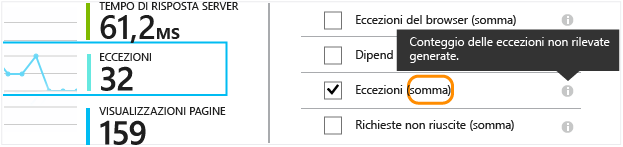

## Bloccare l'asse Y 
Per impostazione predefinita, in un grafico i valori dell'asse Y sono visualizzati a partire da zero fino ai valori massimi dell'intervallo di dati, per offrire una rappresentazione visiva del quantum dei valori. In alcuni casi tuttavia, più che il quantum, può essere interessante esaminare le modifiche secondarie ai valori. Per personalizzazioni di questo tipo, usare la funzionalità di modifica dell'intervallo dell'asse Y per bloccare il valore minimo o massimo dell'asse Y nel punto desiderato.
Fare clic sulla casella di controllo "Impostazioni avanzate" per visualizzare le impostazioni dell'intervallo dell'asse Y.

## Filtrare i dati
Per visualizzare solo le metriche per un set di valori di proprietà selezionati:

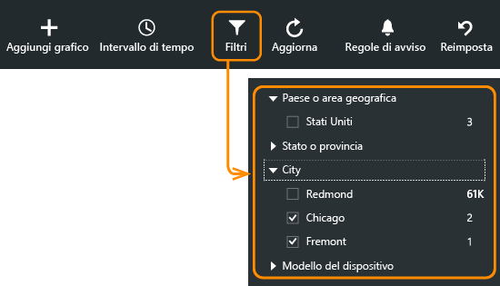

Se non si seleziona alcun valore per una determinata proprietà, è come se si selezionassero tutti i valori, ovvero alla proprietà non verrà applicato alcun filtro.

Si noti il numero di eventi vicino a ogni valore della proprietà. Quando si selezionano i valori di una proprietà, i conteggi vicino ad altri valori di proprietà vengono modificati.

I filtri si applicano a tutti i grafici in un pannello. Se si desidera applicare filtri diversi a grafici differenti, creare e salvare pannelli di metriche diversi. Se si desidera, è possibile aggiungere sul dashboard grafici di pannelli diversi, in modo da visualizzarli uno accanto all'altro.

### Rimuovere il traffico di bot e test Web
Usare il filtro **Traffico reale o sintetico** e selezionare **Reale**.

È possibile anche filtrare in base a **Origine del traffico sintetico**.

### Per aggiungere proprietà all'elenco di filtri
È possibile che si voglia filtrare i dati di telemetria in base a una categoria personalizzata. Ad esempio, è possibile che si dividano gli utenti in categorie diverse e si voglia segmentare i dati in base a queste categorie.

[Creare proprietà personalizzate](app-insights-api-custom-events-metrics.md#properties). Impostazione in un [Inizializzatore di telemetria](app-insights-api-custom-events-metrics.md#defaults) affinché venga visualizzato in tutti i dati di telemetria - compresa la telemetria standard inviata dai diversi moduli SDK.

## Modificare il tipo di grafico
Si noti che è possibile passare dalle griglie ai grafici e viceversa:

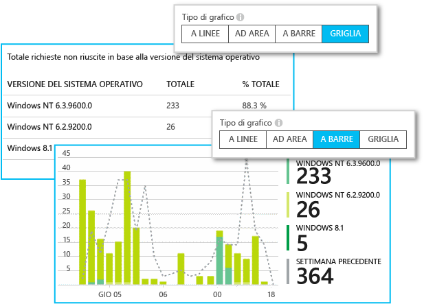

## Salvare il pannello delle metriche
Dopo aver creato alcuni grafici, è possibile salvarli come preferiti. È possibile scegliere se condividerlo con altri membri del team, se si usa un account aziendale.

Per visualizzare nuovamente il pannello, **andare al pannello** e aprire Preferiti:

Se si è scelto l'intervallo di tempo Relativo al momento del salvataggio, il pannello verrà aggiornato con le metriche più recenti. Se si è scelto l'intervallo di tempo Assoluto, verranno visualizzati gli stessi dati ogni volta.

## Reimpostare il pannello
Se si modifica un pannello ma poi si vuole tornare a quello salvato in origine, fare clic su Reimposta.

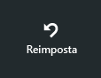

## Flusso metriche attive

Per una visualizzazione molto più immediata dei dati di telemetria, aprire [flusso live](app-insights-live-stream.md). La visualizzazione della maggior parte delle metriche richiede alcuni minuti, a causa del processo di aggregazione. Al contrario, le metriche attive sono ottimizzate per bassa latenza. 

## Impostazione di avvisi
Per ricevere tramite posta elettronica una notifica relativa a valori insoliti di una metrica, aggiungere un avviso. È possibile scegliere di inviare il messaggio di posta elettronica agli amministratori di account o a indirizzi di posta elettronica specifici.

[Altre informazioni sugli avvisi][alerts].

## Esportazione continua
Se si vuole che i dati vengano esportati in modo continuo per poterli elaborare esternamente, considerare la possibilità di usare l' [esportazione continua](app-insights-export-telemetry.md).

### Power BI
Per visualizzazione dei dati ancora più avanzate, è possibile [esportare in Power BI](http://blogs.msdn.com/b/powerbi/archive/2015/11/04/explore-your-application-insights-data-with-power-bi.aspx).

## Analytics
[Analytics](app-insights-analytics.md) è un modo più versatile per analizzare i dati di telemetria usando un linguaggio di query avanzato. Usare l'opzione per combinare o calcolare i risultati delle metriche oppure per eseguire un'analisi approfondita delle prestazioni recenti dell'applicazione. 

Da un grafico di metriche è possibile fare clic sull'icona di Analytics per passare direttamente alla query di Analytics equivalente.

## Risoluzione dei problemi
*All'interno del grafico non vengono visualizzati dati.*

* I filtri si applicano a tutti i grafici del pannello. Assicurarsi che, mentre ci si concentra su un grafico, non sia stato impostato un filtro che escluda tutti i dati di un altro grafico.

    Se si desidera impostare filtri diversi nei vari grafici, creare grafici in diversi pannelli e salvarli come Preferiti separati. Se si desidera, è possibile impostarli sul dashboard in modo da visualizzarli uno accanto all'altro.
* Se si raggruppa un grafico per una proprietà non definita sulla metrica, il grafico sarà vuoto. Provare a lasciare il campo "Raggruppa in base a" vuoto o scegliere una proprietà di raggruppamento diversa.
* I dati sulle prestazioni (CPU, velocità di IO e così via) sono disponibili per servizi Web Java, app desktop di Windows, [app Web IIS se si installa Status Monitor](app-insights-monitor-performance-live-website-now.md) e [servizi cloud di Azure](app-insights-azure.md). I dati non sono disponibili per i siti Web di Azure.

## Video

> [!VIDEO https://channel9.msdn.com/events/Connect/2016/112/player]

## Passaggi successivi
* [Monitoraggio dell'utilizzo con Application Insights](app-insights-web-track-usage.md)
* [Uso di Ricerca diagnostica](app-insights-diagnostic-search.md)

<!--Link references-->

[alerts]: app-insights-alerts.md
[start]: app-insights-overview.md
[track]: app-insights-api-custom-events-metrics.md
