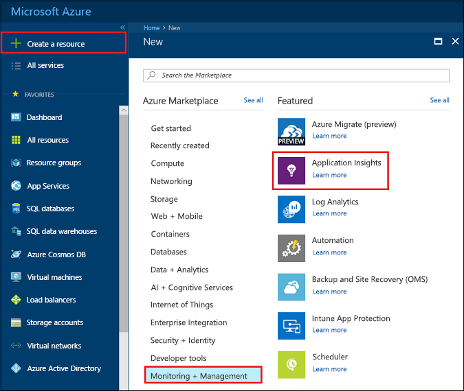
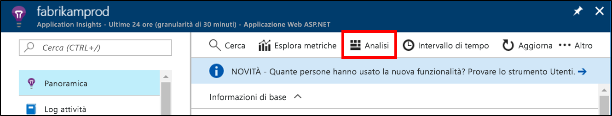
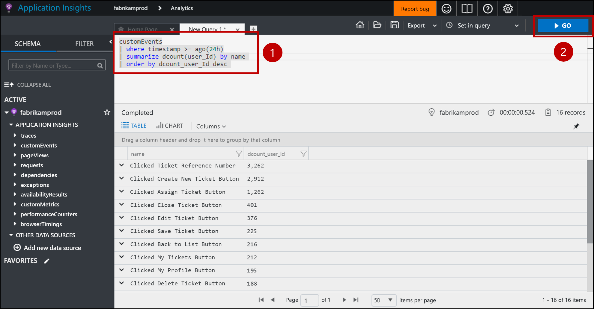
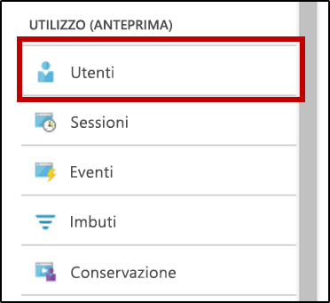
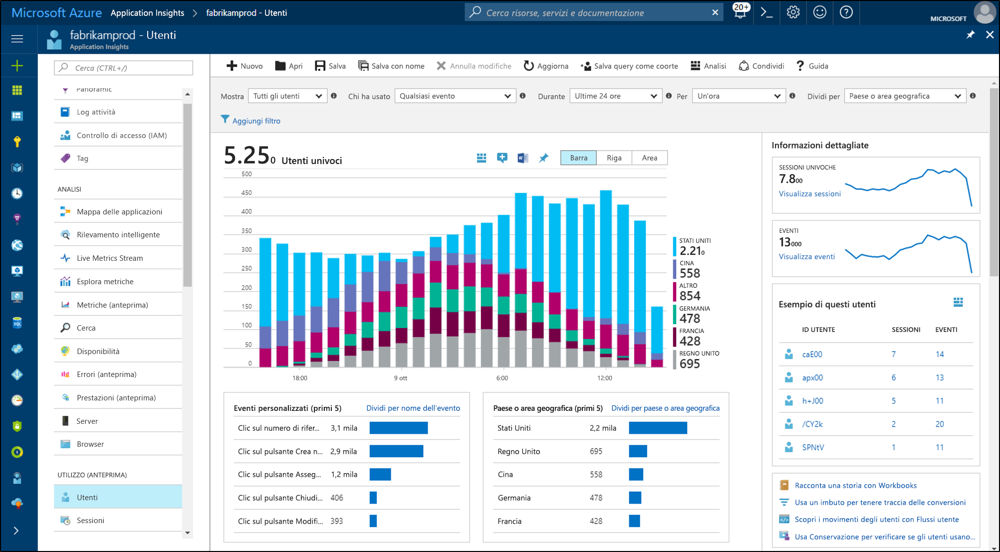
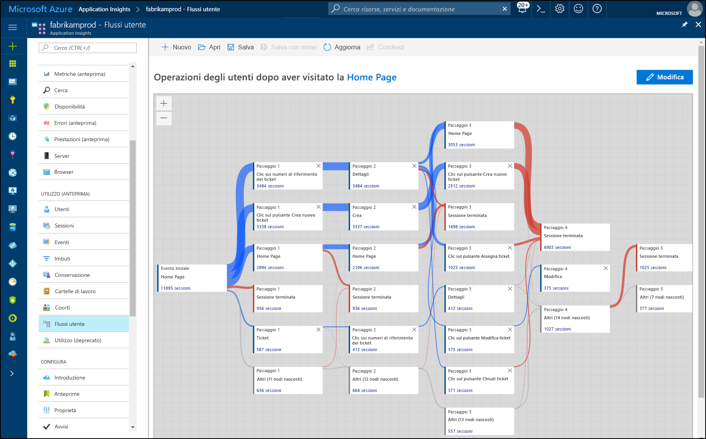

# <a name="start-analyzing-your-mobile-app-with-app-center-and-application-insights"></a>Avviare l'analisi dell'app per dispositivi mobili con App Center e Application Insights

Questa guida introduttiva illustra come eseguire la connessione dell'istanza App Center dell'app ad Application Insights. Con Application Insights è possibile eseguire query, segmentare, filtrare e analizzare i dati di telemetria con gli strumenti più potenti disponibili del servizio [Analytics](https://docs.microsoft.com/mobile-center/analytics/) di App Center.

## <a name="prerequisites"></a>prerequisiti

Per completare l'esercitazione introduttiva, sono necessari gli elementi seguenti:

- Una sottoscrizione di Azure.
- Un'app di iOS, Android, Xamarin, Universal Windows o React Native.
 
Se non si ha una sottoscrizione di Azure, creare un account [gratuito](https://azure.microsoft.com/free/) prima di iniziare.

## <a name="onboard-to-app-center"></a>Caricare in App Center

Prima di poter usare Application Insights con l'app per dispositivi mobili, è necessario caricare l'app in [App Center](https://docs.microsoft.com/mobile-center/). Application Insights non riceve dati di telemetria direttamente dall'app per dispositivi mobili. L'app invia dati di telemetria personalizzati su un evento ad App Center. Pertanto, App Center esporta continuamente copie di questi eventi personalizzati in Application Insights quando vengono ricevuti gli eventi.

Per caricare l'app, attenersi alla guida introduttiva di App Center per ogni piattaforma supportata dall'app. Creare istanze di App Center separate per ogni piattaforma:

* [iOS](https://docs.microsoft.com/mobile-center/sdk/getting-started/ios).
* [Android](https://docs.microsoft.com/mobile-center/sdk/getting-started/android).
* [Xamarin](https://docs.microsoft.com/mobile-center/sdk/getting-started/xamarin).
* [Universal Windows](https://docs.microsoft.com/mobile-center/sdk/getting-started/uwp).
* [React Native](https://docs.microsoft.com/mobile-center/sdk/getting-started/react-native).

## <a name="track-events-in-your-app"></a>Tenere traccia degli eventi nell'app

Dopo aver caricato l'app in App Center, è necessario modificarla per inviare dati di telemetria su un evento personalizzato tramite l'SDK di App Center. Gli eventi personalizzati sono l'unico tipo di dati di telemetria di App Center che viene esportato in Application Insights.

Per inviare gli eventi personalizzati dalle app iOS, usare i metodi `trackEvent` o `trackEvent:withProperties` dell'SDK di App Center. [Altre informazioni sul monitoraggio di eventi da app iOS.](https://docs.microsoft.com/mobile-center/sdk/analytics/ios)

```Swift
MSAnalytics.trackEvent("Video clicked")
```

Per inviare gli eventi personalizzati dalle app Android, usare il metodo `trackEvent` dell'SDK di App Center. [Altre informazioni sul monitoraggio di eventi da app Android.](https://docs.microsoft.com/mobile-center/sdk/analytics/android)

```Java
Analytics.trackEvent("Video clicked")
```

Per inviare eventi personalizzati da altre piattaforme di app, usare il metodo `trackEvent` negli SDK di App Center.

Per assicurarsi che gli eventi personalizzati vengano ricevuti, passare alla scheda **Eventi** nella sezione **Analytics** in App Center. Dall'invio degli eventi dall'app fino alla visualizzazione potrebbero essere necessari un paio di minuti.

## <a name="create-an-application-insights-resource"></a>Creare una risorsa di Application Insights

Quando l'app invia eventi personalizzati e questi vengono ricevuti da App Center, è necessario creare una risorsa di Application Insights di tipo App Center nel portale di Azure:

1. Accedere al [Portale di Azure](https://portal.azure.com/).
2. Selezionare **Nuovo** > **Monitoraggio e gestione** > **Application Insights**.

    

    Verrà visualizzata una finestra di configurazione. Usare la tabella seguente per completare i campi di input.

    | Impostazioni        |  Valore           | DESCRIZIONE  |
   | ------------- |:-------------|:-----|
   | **Nome**      | Un valore univoco a livello globale, ad esempio "myApp-iOS" | Nome che identifica l'app da monitorare |
   | **Tipo di applicazione** | Applicazione App Center | Tipo di app da monitorare |
   | **Gruppo di risorse**     | Un nuovo gruppo di risorse o un gruppo esistente del menu | Il gruppo di risorse in cui creare la nuova risorsa di Application Insights |
   | **Posizione** | Un percorso del menu | Scegliere una località nelle vicinanze o vicina a quella in cui è ospitata l'app |

3. Fare clic su **Crea**.

Se l'app supporta più piattaforme, iOS, Android e così via, è consigliabile creare risorse di Application Insights separate, una per ogni piattaforma.

## <a name="export-to-application-insights"></a>Esportare in Application Insights

Nella pagina **Panoramica** della nuova risorsa di Application Insights, nella sezione **Informazioni di base** in alto copiare la chiave di strumentazione per questa risorsa.

Nell'istanza di App Center per l'app:

1. Nella pagina **Impostazioni** fare clic su **Esporta**.
2. Scegliere **Nuova esportazione**, selezionare **Application Insights**, quindi fare clic su **Personalizza**.
3. Incollare la chiave di strumentazione di Application Insights nella casella.
4. Consentire l'aumento dell'uso della sottoscrizione di Azure che contiene la risorsa di Application Insights. Ogni risorsa di Application Insights offre gratuitamente la ricezione di 1 GB di dati al mese. [Altre informazioni sui prezzi di Application Insights.](https://azure.microsoft.com/pricing/details/application-insights/)

Ricordarsi di ripetere l'operazione per ogni piattaforma supportata l'app.

Dopo aver configurato l'[esportazione](https://docs.microsoft.com/mobile-center/analytics/export), ogni evento personalizzato ricevuto da App Center viene copiato in Application Insights. Affinché gli eventi raggiungano Application Insights potrebbero essere necessari alcuni minuti, pertanto se non vengono visualizzati immediatamente, attendere qualche istante prima eseguire altre indagini.

Per consentire all'utente di avere un numero maggiore di dati durante la prima connessione, gli eventi personalizzati di App Center delle ultime 48 ore vengono esportati automaticamente in Application Insights.

## <a name="start-monitoring-your-app"></a>Avviare il monitoraggio dell'app

Application Insights può eseguire query, segmentare, filtrare e analizzare i dati di telemetria relativi agli eventi personalizzati delle app, oltre agli strumenti di analisi offerti da App Center.

1. **Eseguire query sui dati di telemetria relativi agli eventi personalizzati.** Nella pagina **Panoramica** di Application Insights scegliere **Analytics**. 

   

   Verrà aperto il portale Analytics di Application Insights associato alla risorsa di Application Insights. Il portale Analytics consente di eseguire direttamente una query sui dati tramite il linguaggio di query di Log Analytics, pertanto è possibile porre domande complesse in modo arbitrario sull'app e i suoi utenti.
   
   Aprire una nuova scheda nel portale di Analytics, quindi incollare la query seguente. Restituisce il conteggio del numero di singoli utenti che hanno inviato singoli eventi personalizzati dall'app nelle ultime 24 ore, ordinati in base ai singoli conteggi.

   ```AIQL
   customEvents
   | where timestamp >= ago(24h)
   | summarize dcount(user_Id) by name 
   | order by dcount_user_Id desc 
   ```

   

   1. Selezionare la query facendo clic su un punto qualsiasi della query nell'editor di testo.
   2. Quindi fare clic su **Vai** per eseguire la query. 

   Altre informazioni su [Analytics di Application Insights](app-insights-analytics.md) e [il linguaggio di query di Log Analytics](https://docs.loganalytics.io/docs/Language-Reference).


2. **Segmentare e filtrare i dati di telemetria relativi a un evento personalizzato.** Nella pagina **Panoramica** di Application Insights scegliere **Utenti** nella tabella dei contenuti.

   

   Lo strumento Utenti mostra il numero di utenti dell'app che hanno fatto clic su determinati pulsanti, hanno visitato determinate pagine o eseguito altre azioni di cui si esegue il monitoraggio come un evento con l'SDK di App Center. Se si sta cercando un modo per segmentare e filtrare gli eventi di App Center, lo strumento Utenti è un'ottima scelta.

    

   Segmentare, ad esempio, l'uso per area geografica scegliendo **Paese o area geografica** nel menu a discesa **Split by** (Dividi per).

3. **Analizzare i modelli di conversione, conservazione e navigazione nell'app.** Nella pagina **Panoramica** di Application Insights scegliere **Flussi utente** nella tabella dei contenuti.

   

   Lo strumento Flussi utenti mostra gli utenti che inviano gli eventi in seguito a un evento iniziale. È utile per ottenere un quadro complessivo dell'uso che gli utenti fanno dell'app. Consente anche di vedere le pagine più visitate dell'app o le stesse azioni ripetute più volte.

   Oltre a Flussi utente, Application Insights dispone di diversi altri strumenti di analisi d'uso per rispondere a domande specifiche:

   * **Imbuti** per l'analisi e monitoraggio dei tassi di conversione.
   * **Conservazione** per analizzare il modo in cui l'app mantiene gli utenti nel tempo.
   * **Cartelle di lavoro** per la combinazione di visualizzazioni e testo in un report condivisibile.
   * **Coorti** per la denominazione e il salvataggio di specifici gruppi di utenti o eventi in modo che sia possibile fare facilmente riferimento a questi da altri strumenti di analisi.

## <a name="clean-up-resources"></a>Pulire le risorse

Se non si desidera continuare a usare Application Insights con App Center, disattivare l'esportazione in App Center ed eliminare la risorsa di Application Insights. In questo modo si evita che Application Insights addebiti altri costi per questa risorsa.

Per disabilitare l'esportazione in App Center:

1. In App Center passare a **Impostazioni** e scegliere **Esporta**.
2. Scegliere l'esportazione di Application Insights che si desidera eliminare, quindi fare clic su **Elimina esportazione** nella parte inferiore e confermare.

Per eliminare la risorsa di Application Insights:

1. Nel menu a sinistra del portale di Azure fare clic su **Gruppi di risorse** e quindi scegliere il gruppo di risorse in cui è stata creata la risorsa di Application Insights.
2. Aprire la risorsa di Application Insights che si desidera eliminare. Quindi fare clic su **Elimina** nel menu in alto della risorsa e confermare. Questa operazione eliminerà definitivamente la copia dei dati che è stata esportata in Application Insights.

## <a name="next-steps"></a>Passaggi successivi

> [!div class="nextstepaction"]
> [Analisi dell'utilizzo dell'app da parte dei clienti](app-insights-usage-overview.md)