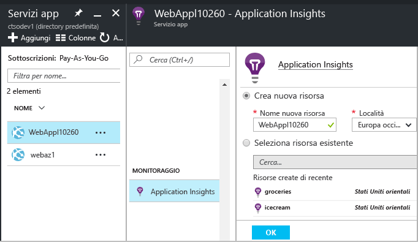

# Instrumentare app Web in fase di esecuzione con Application Insights

È possibile instrumentare un'app Web attiva con Azure Application Insights senza dover modificare o ridistribuire il codice. In caso di app ospitate da un server IIS locale, si installa Status Monitor. In caso di app Web di Azure o in esecuzione in una VM di Azure, invece, è possibile installare l'estensione Application Insights. Sono disponibili anche articoli separati sulla strumentazione di [app Web J2EE live](app-insights-java-live.md) e [Servizi cloud di Azure](app-insights-cloudservices.md). È necessaria una sottoscrizione di [Microsoft Azure](http://azure.com) .

È possibile scegliere di applicare Application Insights alle applicazioni Web .NET in tre modi:

* **Fase di compilazione:** [aggiungere Application Insights SDK][greenbrown] al codice dell'app Web.
* **Fase di esecuzione:** instrumentare l'app Web sul server, come descritto di seguito, senza ricompilare e ridistribuire il codice.
* **Entrambe le opzioni:** compilare l'SDK nel codice dell'app Web e applicare anche le estensioni della fase di esecuzione, sfruttando il meglio delle due opzioni.

Ecco un riepilogo di ciò che offrono i singoli modi:

|  | Fase di compilazione | Fase di esecuzione |
| --- | --- | --- |
| Richieste ed eccezioni |Sì |Sì |
| [Eccezioni più dettagliate](app-insights-asp-net-exceptions.md) | |Sì |
| [Diagnostica delle dipendenze](app-insights-asp-net-dependencies.md) |In .NET 4.6 e versioni successive, ma meno dettagli |Sì, dettagli completi: codici di risultato, testo del comando SQL, verbo HTTP|
| [Contatori delle prestazioni di sistema](app-insights-performance-counters.md) |Sì |Sì |
| [API per telemetria personalizzata][api] |Sì | |
| [Integrazione log di traccia](app-insights-asp-net-trace-logs.md) |Sì | |
| [Visualizzazione pagina e dati utente](app-insights-javascript.md) |Sì | |
| Ricompilazione del codice non necessaria |No | |

## Monitorare un'app Web live di Azure

Se l'applicazione è in esecuzione come servizio Web di Azure, ecco come attivare il monitoraggio:

* Selezionare Application Insights nel pannello di controllo dell'app in Azure.

    
* Quando viene visualizzata la pagina di riepilogo di Application Insights, fare clic sul collegamento nella parte inferiore per aprire la risorsa completa di Application Insights.

    

[Monitoraggio di app cloud e VM](app-insights-azure.md).

## Monitorare un'app Web live di IIS

Se l'app è ospitata in un server IIS, abilitare Application Insights usando Status Monitor.

1. Nel server Web IIS accedere con le credenziali di amministratore.
2. Se Application Insights Status Monitor non è già installato, scaricare ed eseguire il [programma di installazione di Status Monitor](http://go.microsoft.com/fwlink/?LinkId=506648).
3. In Status Monitor selezionare l'applicazione Web installata o il sito Web da monitorare. Accedere con le credenziali di Azure.

    Configurare la risorsa in cui si vogliono visualizzare i risultati nel portale di Application Insights. È in genere consigliabile creare una nuova risorsa. Selezionare una risorsa esistente se sono già disponibili [test Web][availability] o il [monitoraggio del client][client] per questa app. 

    

4. Riavviare IIS.

    

    Il servizio Web verrà interrotto per un breve periodo di tempo.

## Personalizzare le opzioni di monitoraggio

L'abilitazione di Application Insights aggiunge DLL e il file ApplicationInsights.config all'app Web. È possibile [modificare il file con estensione config](app-insights-configuration-with-applicationinsights-config.md) per modificare alcune opzioni.

## Quando si ripubblica l'app, riabilitare Application Insights

Prima di ripubblicare l'app, prendere in considerazione l'[aggiunta di Application Insights al codice in Visual Studio][greenbrown]. Questo approccio consente di ottenere dati di telemetria più dettagliati e di scrivere dati di telemetria personalizzati.

Per ripetere la pubblicazione senza aggiungere Application Insights al codice, si noti che il processo di distribuzione potrebbe eliminare i file DLL e il file ApplicationInsights.config dal sito Web pubblicato. Di conseguenza:

1. Se sono state apportate modifiche al file ApplicationInsights.config, copiarlo prima di ripubblicare l'app.
2. Pubblicare di nuovo l'app.
3. Abilitare di nuovo il monitoraggio di Application Insights. Usare il metodo appropriato, ovvero il pannello di controllo dell'app Web di Azure o Status Monitor in un host IIS.
4. Ripristinare eventuali modifiche apportate al file con estensione config.

## Risoluzione dei problemi della configurazione del runtime di Application Insights

### Nessuna connessione? Nessun dato di telemetria?

* Per consentire il funzionamento di Status Monitor è necessario aprire [alcune porte in uscita](app-insights-ip-addresses.md#outgoing-ports) nel firewall del server.

* Aprire Status Monitor e selezionare la propria applicazione nel pannello a sinistra. Verificare se sono presenti messaggi di diagnostica per l'applicazione nella sezione "Configuration notifications":

  
* Se sul server viene visualizzato un messaggio relativo alle autorizzazioni insufficienti, provare a seguire questa procedura:
  * In Gestione IIS selezionare il pool di applicazioni, aprire **Impostazioni avanzate** e prendere nota dell'identità in **Modello di processo**.
  * Nel pannello di controllo Gestione computer, aggiungere questa identità al gruppo Utenti di Performance Monitor.
* Se nel server è installato MMA/SCOM, è possibile che alcune versioni entrino in conflitto. Disinstallare SCOM e Status Monitor e reinstallare le versioni più recenti.
* Vedere [Risoluzione dei problemi][qna].

## Requisiti di sistema
Supporto del sistema operativo per Application Insights Status Monitor sul server

* Windows Server 2008
* Windows Server 2008 R2
* Windows Server 2012
* Windows Server 2012 R2
* Windows Server 2016

con SP più recente e .NET Framework 4.5

Sul lato client Windows 7, 8, 8.1 e 10, con .NET Framework 4.5

Il supporto IIS è: IIS 7, 7.5, 8, 8.5 (IIS è obbligatorio)

## Automazione con PowerShell
È possibile usare PowerShell nel server IIS per avviare e arrestare il monitoraggio.

Importare prima di tutto il modulo di Application Insights:

`Import-Module 'C:\Program Files\Microsoft Application Insights\Status Monitor\PowerShell\Microsoft.Diagnostics.Agent.StatusMonitor.PowerShell.dll'`

Individuare le applicazioni sottoposte a monitoraggio:

`Get-ApplicationInsightsMonitoringStatus [-Name appName]`

* `-Name` (facoltativo): nome di un'app Web.
* Visualizza lo stato del monitoraggio di Application Insights per ogni app Web o per l'app denominata nel server IIS.
* Restituisce `ApplicationInsightsApplication` per ogni app.

  * `SdkState==EnabledAfterDeployment`: l'app viene monitorata ed è stata instrumentata in fase di esecuzione dallo strumento Status Monitor oppure da `Start-ApplicationInsightsMonitoring`.
  * `SdkState==Disabled`: l'app non è instrumentata per Application Insights. Non è mai stata instrumentata oppure il monitoraggio in fase di esecuzione è stato disabilitato con lo strumento Status Monitor o con `Stop-ApplicationInsightsMonitoring`.
  * `SdkState==EnabledByCodeInstrumentation`: l'app è stata instrumentata aggiungendo l'SDK al codice sorgente. Il relativo SDK non può essere aggiornato o arrestato.
  * `SdkVersion` : mostra la versione usata per il monitoraggio dell'app.
  * `LatestAvailableSdkVersion`: mostra la versione attualmente disponibile nella raccolta NuGet. Per aggiornare l'app a questa versione, usare `Update-ApplicationInsightsMonitoring`.

`Start-ApplicationInsightsMonitoring -Name appName -InstrumentationKey 00000000-000-000-000-0000000`

* `-Name` : nome dell'app in IIS.
* `-InstrumentationKey` : valore ikey della risorsa di Application Insights in cui visualizzare i risultati.
* Questo cmdlet influisce solo sulle app che non sono già instrumentate, ovvero SdkState==NotInstrumented.

    Il cmdlet non influisce sulle app già instrumentate, in fase di compilazione aggiungendo l'SDK al codice o in fase di esecuzione da un uso precedente di questo cmdlet.

    La versione SDK usata per instrumentare l'app è la versione scaricata più di recente nel server.

    Per scaricare l'ultima versione, usare Update-ApplicationInsightsVersion.
* Se l'esito è positivo, restituisce `ApplicationInsightsApplication` . Se l'esito è negativo, registra una traccia in stderr.

          Name                      : Default Web Site/WebApp1
          InstrumentationKey        : 00000000-0000-0000-0000-000000000000
          ProfilerState             : ApplicationInsights
          SdkState                  : EnabledAfterDeployment
          SdkVersion                : 1.2.1
          LatestAvailableSdkVersion : 1.2.3

`Stop-ApplicationInsightsMonitoring [-Name appName | -All]`

* `-Name` : nome di un'app in IIS.
* `-All`: arresta il monitoraggio di tutte le app nel server IIS per cui `SdkState==EnabledAfterDeployment`
* Arresta il monitoraggio delle app specificate e rimuove la strumentazione. Funziona solo per le app instrumentate in fase di esecuzione usando lo strumento Status Monitor o Start-ApplicationInsightsApplication. (`SdkState==EnabledAfterDeployment`)
* Restituisce ApplicationInsightsApplication.

`Update-ApplicationInsightsMonitoring -Name appName [-InstrumentationKey "0000000-0000-000-000-0000"`]

* `-Name`: nome di un'app Web in IIS.
* `-InstrumentationKey` (facoltativo): consente di modificare la risorsa a cui vengono inviati i dati di telemetria dell'app.
* Questo cmdlet:
  * Aggiorna l'app denominata alla versione dell'SDK scaricata più di recente nel computer. Funziona solo se `SdkState==EnabledAfterDeployment`.
  * Se si specifica una chiave di strumentazione, l'app denominata viene riconfigurata per l'invio di dati di telemetria alla risorsa con tale chiave. Funziona se `SdkState != Disabled`.

`Update-ApplicationInsightsVersion`

* Scarica l'ultima versione di Application Insights SDK nel server.

## Passaggi successivi

Visualizzare i dati di telemetria:

* [Esaminare le metriche](app-insights-metrics-explorer.md) per monitorare le prestazioni e l'utilizzo
* Per diagnosticare i problemi, vedere [Eventi e log di ricerca][diagnostic]
* Per informazioni sulle query più avanzate, vedere [Analytics](app-insights-analytics.md)
* [Creare i dashboard](app-insights-dashboards.md)

Aggiungere altri dati di telemetria:

* [Creare test Web][availability] per assicurarsi che il sito rimanga attivo.
* [Aggiungere dati di telemetria del client Web][usage] per visualizzare le eccezioni dal codice della pagina Web e consentire di inserire le chiamate di traccia.
* [Aggiungere Application Insights SDK al codice][greenbrown] per poter inserire chiamate di traccia e log nel codice del server

<!--Link references-->

[api]: app-insights-api-custom-events-metrics.md
[availability]: app-insights-monitor-web-app-availability.md
[client]: app-insights-javascript.md
[diagnostic]: app-insights-diagnostic-search.md
[greenbrown]: app-insights-asp-net.md
[qna]: app-insights-troubleshoot-faq.md
[roles]: app-insights-resources-roles-access-control.md
[usage]: app-insights-web-track-usage.md

<!--HONumber=Feb17_HO2-->

