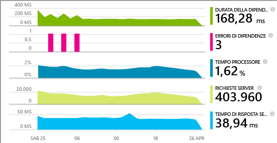
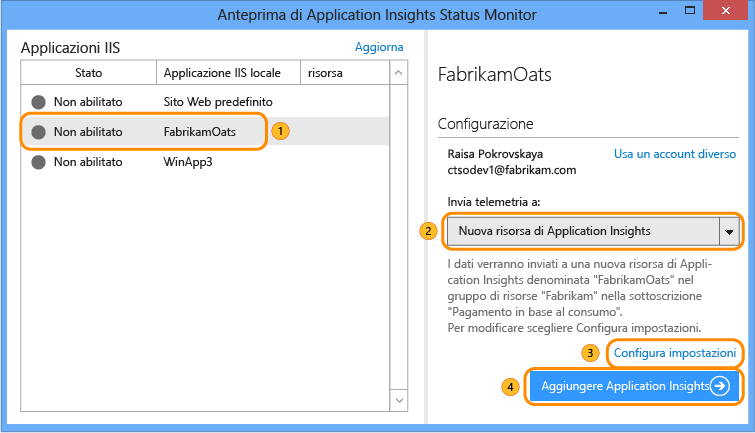
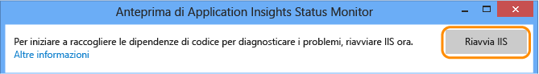
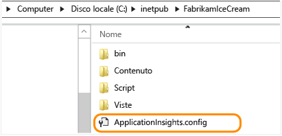
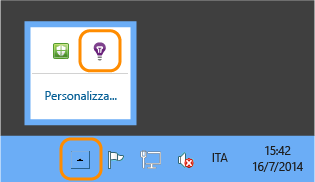
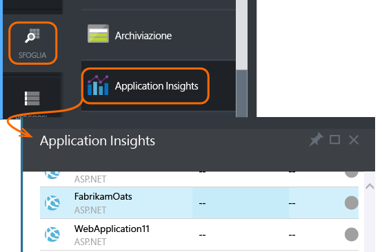
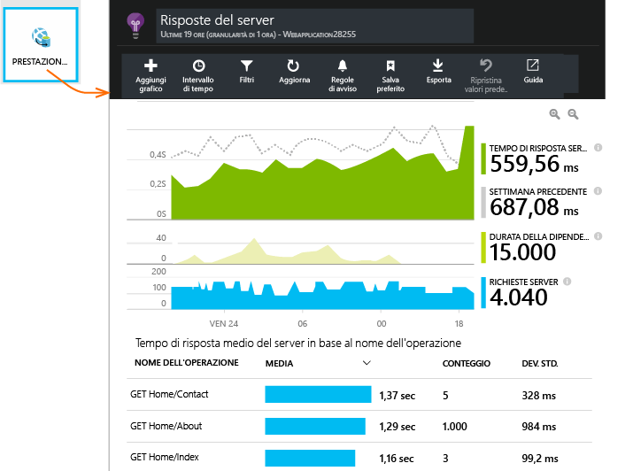
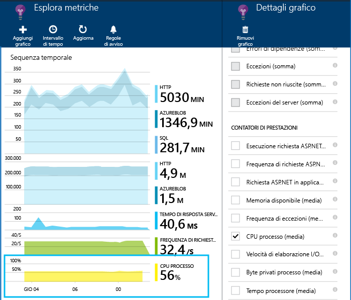
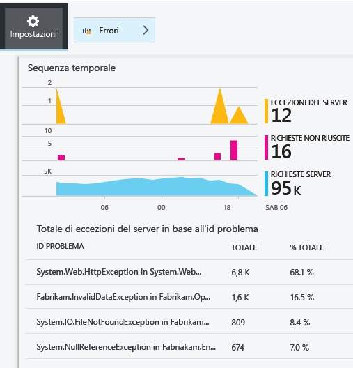
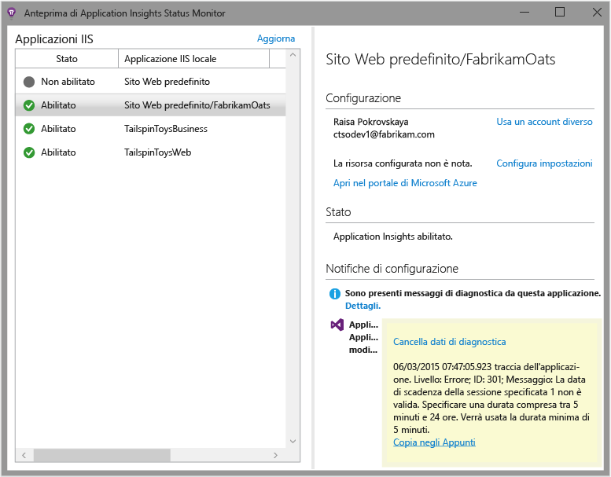

<properties
	pageTitle="Diagnosi dei problemi di prestazioni in un sito IIS in esecuzione | Microsoft Azure"
	description="Monitorare le prestazioni di un sito Web senza ripetere la distribuzione. Usare la versione autonoma o con Application Insights SDK per ottenere la telemetria di dipendenza."
	services="application-insights"
    documentationCenter=".net"
	authors="alancameronwills"
	manager="douge"/>

<tags
	ms.service="application-insights"
	ms.workload="tbd"
	ms.tgt_pltfrm="ibiza"
	ms.devlang="na"
	ms.topic="get-started-article"
	ms.date="09/23/2015"
	ms.author="awills"/>

# Installare Application Insights Status Monitor per monitorare le prestazioni del sito Web

*Application Insights è disponibile in anteprima.*

Application Insights Status Monitor di Visual Studio consente di diagnosticare le eccezioni e i problemi di prestazioni nelle applicazioni ASP.NET.

> [AZURE.TIP]Sono disponibili articoli separati sulla strumentazione [app web live J2EE](app-insights-java-live.md) e [servizi Cloud di Azure](app-insights-cloudservices.md).

È possibile scegliere di applicare Application Insights alle applicazioni Web IIS in tre modi:

* **Tempo di compilazione:** [Aggiungere Application Insights SDK][greenbrown] al codice dell'app Web: Il risultato è il seguente:
 * Una gamma di diagnostica standard e telemetria relativa all'utilizzo.
 * L’[Application Insights API][api] consente di scrivere i propri dati di telemetria per tenere traccia delle informazioni dettagliate sull'utilizzo o diagnosticare i problemi.
* **Tempo di esecuzione**: usare Status Monitor per instrumentare l'app Web sul server.
 * Monitorare le app Web che sono già in esecuzione, senza doverle ricompilare o ripubblicare.
 * Una gamma di diagnostica standard e telemetria relativa all'utilizzo.
 * Diagnostica delle dipendenze&#151;trovare gli errori o le prestazioni scarse in cui l'app usa altri componenti come database, API REST o altri servizi.
 * Risolvere eventuali problemi di telemetria.
* **Entrambi:** compilare l'SDK nel codice dell'app Web ed eseguire Status Monito nel server Web. Offre le migliori funzionalità:
 * Diagnostica standard e telemetria relativa all'utilizzo.
 * Diagnostica delle dipendenze.
 * L'API consente di scrivere dati di telemetria personalizzati.
 * Risolvere eventuali problemi dell'SDK e di telemetria.

## Installare Application Insights Status Monitor

È necessaria una sottoscrizione di [Microsoft Azure](http://azure.com).

### Se l'app è in esecuzione nel server IIS

1. Nel server Web IIS accedere con le credenziali di amministratore.
2. Scaricare e installare il [programma di installazione di Status Monitor](http://go.microsoft.com/fwlink/?LinkId=506648).
4. Nell'Installazione guidata accedere a Microsoft Azure.

    

    *Errori di connessione Vedere [Risoluzione dei problemi](#troubleshooting).*

5. Selezionare l'applicazione Web installata o il sito Web da monitorare, quindi configurare la risorsa in cui visualizzare i risultati nel portale Application Insights.

    

    In genere, si sceglie di configurare una nuova risorsa e un nuovo [gruppo di risorse][roles].

    In alternativa, è possibile usare una risorsa esistente se sono già stati configurati [test Web][availability] per il sito o il [monitoraggio del client Web][client].

6. Riavviare IIS.

    

    Il servizio Web verrà interrotto per un breve periodo di tempo.

6. Si noti che ApplicationInsights.config è stato inserito tra le app Web da monitorare.

    

   Sono inoltre state apportate alcune modifiche al file web.config.

#### Configurare o riconfigurare in un secondo momento

Dopo aver completato la procedura guidata, è possibile riconfigurare l'agente in qualsiasi momento. È inoltre possibile usare questa stessa procedura se l'agente è stato installato ma la configurazione iniziale presenta alcuni problemi.

### Se l'applicazione viene eseguita come un'app Web di Azure

Nel pannello di controllo dell'app Web di Azure aggiungere l'estensione di Application Insights.

### è un progetto di Servizi cloud di Azure

[Aggiungere gli script ai ruoli web e di lavoro](app-insights-cloudservices.md)

## Visualizzare i dati di telemetria relativi alle prestazioni

Accedere al [portale di anteprima di Azure](http://portal.azure.com), passare ad Application Insights e aprire la risorsa creata.

Aprire il pannello delle prestazioni per visualizzare una richiesta, il tempo di risposta, le dipendenze e altri dati.

Fare clic per modificare i dettagli della descrizione o aggiungere un nuovo grafico.

## Dipendenze

Il grafico di durata delle dipendenze mostra il tempo impiegato dalle chiamate dall'app a componenti esterni quali database, API REST o archiviazione BLOB di Azure.

Per segmentare il grafico in base alle chiamate a diverse dipendenze, selezionare il grafico, attivare il raggruppamento e poi la dipendenza, il tipo di dipendenza o la prestazione di dipendenza.

È inoltre possibile filtrare il grafico per esaminare un bucket specifico di dipendenza, tipo o prestazione. Fare clic su filtri.

#### Contatori delle prestazioni

(Non per le app web di Azure.) Fare clic su Server nel pannello della panoramica per visualizzare i grafici dei contatori delle prestazioni del server, come l'utilizzo di memoria e di occupazione della CPU.

Aggiungere un nuovo grafico, o fare clic su qualsiasi grafico per modificare quello che viene visualizzato.

È inoltre possibile [modificare il set di contatori delle prestazioni segnalati da SDK](app-insights-configuration-with-applicationinsights-config.md#nuget-package-3).

#### Eccezioni

È possibile eseguire il drill down di eccezioni specifiche (degli ultimi sette giorni) e ottenere le analisi dello stack e i dati di contesto.

## Risoluzione dei problemi

### Errori di connessione

È necessario aprire alcune porte in uscita nei firewall del server per consentire il funzionamento di Status Monitor:

+ Telemetria - queste informazioni sono sempre necessarie:
 +	`dc.services.visualstudio.com:80`
 +	`f5.services.visualstudio.com:80`
 +	`dc.services.visualstudio.com:443`
 +	`f5.services.visualstudio.com:443`
 +	`dc.services.vsallin.net:443`
+ Configurazione - necessaria solo quando si apportano modifiche:
 -	`management.core.windows.net:443`
 -	`management.azure.com:443`
 -	`login.windows.net:443`
 -	`login.microsoftonline.com:443`
 -	`secure.aadcdn.microsoftonline-p.com:443`
 -	`auth.gfx.ms:443`
 -	`login.live.com:443`
+ Installazione:
 +	`packages.nuget.org:443`
 +	`appinsightsstatusmonitor.blob.core.windows.net:80`

Questo elenco può variare nel tempo.

### Nessun dato di telemetria?

  * Usare il sito per generare alcuni dati.
  * Attendere qualche minuto l'arrivo dei dati, quindi fare clic su **Aggiorna**.
  * Aprire il riquadro Ricerca diagnostica (il riquadro Ricerca) per visualizzare i singoli eventi. Gli eventi sono spesso visibili in Ricerca diagnostica prima che vengano visualizzati i dati aggregati nei grafici.
  * Aprire Status Monitor e selezionare la propria applicazione nel pannello a sinistra. Verificare se sono presenti messaggi di diagnostica per l'applicazione nella sezione "Configuration notifications":

  

  * Assicurarsi che il firewall del server consenta il traffico in uscita sulle porte sopra elencate.
  * Se sul server viene visualizzato un messaggio relativo alle autorizzazioni insufficienti, provare a seguire questa procedura:
    * In Gestione IIS selezionare il pool di applicazioni, aprire **Impostazioni avanzate** e prendere nota dell'identità in **Modello di processo**.
    * Nel pannello di controllo Gestione computer, aggiungere questa identità al gruppo Utenti di Performance Monitor.
  * Vedere [Risoluzione dei problemi][qna].

## Requisiti di sistema

Supporto del sistema operativo per Application Insights Status Monitor sul server

- Windows Server 2008
- Windows Server 2008 R2
- Windows Server 2012
- Windows Server 2012 R2

con la Service Pack più recente e .NET Framework 4.0 e 4.5

Sul lato client Windows 7, 8 e 8.1, con .NET Framework 4.0 e 4.5

Il supporto IIS è: IIS 7, 7.5, 8, 8.5 (IIS è obbligatorio)

## Passaggi successivi

* [Creare test Web][availability] per assicurarsi che il sito rimanga attivo.
* [Cercare eventi e log][diagnostic] per facilitare la diagnosi dei problemi.
* [Aggiungere dati di telemetria del client Web][usage] per visualizzare le eccezioni dal codice della pagina Web e consentire di inserire le chiamate di traccia.
* [Aggiungere Application Insights SDK al codice del servizio Web][greenbrown] per poter inserire chiamate di traccia e log nel codice del server.

## Video

#### Monitoraggio delle prestazioni

[AZURE.VIDEO app-insights-performance-monitoring]

<!--Link references-->

[api]: app-insights-api-custom-events-metrics.md
[availability]: app-insights-monitor-web-app-availability.md
[client]: app-insights-javascript.md
[diagnostic]: app-insights-diagnostic-search.md
[greenbrown]: app-insights-start-monitoring-app-health-usage.md
[qna]: app-insights-troubleshoot-faq.md
[roles]: app-insights-resources-roles-access-control.md
[usage]: app-insights-web-track-usage.md

<!---HONumber=Oct15_HO1-->