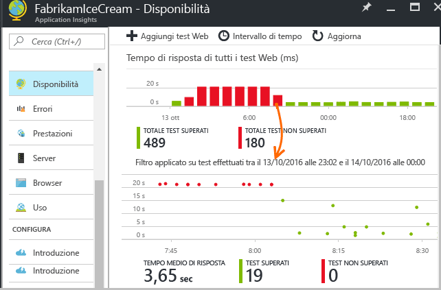
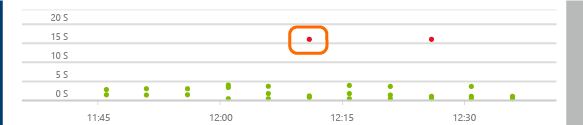
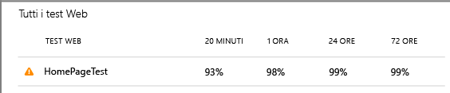
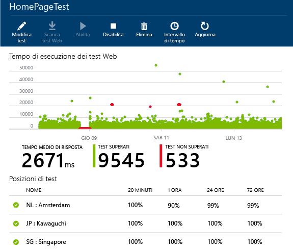
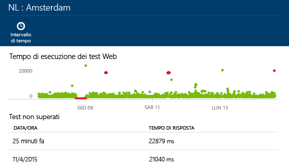
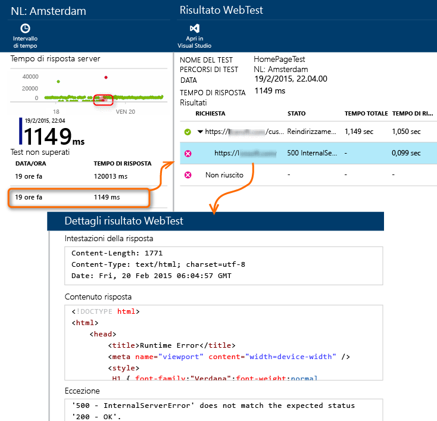

<properties 
	pageTitle="Monitorare la disponibilità e la velocità di risposta dei siti Web" 
	description="Configurare i test Web in Application Insights. Ottenere avvisi se un sito Web diventa non disponibile o risponde lentamente." 
	services="application-insights" 
    documentationCenter=""
	authors="alancameronwills" 
	manager="douge"/>

<tags 
	ms.service="application-insights" 
	ms.workload="tbd" 
	ms.tgt_pltfrm="ibiza" 
	ms.devlang="na" 
	ms.topic="article" 
	ms.date="07/08/2015" 
	ms.author="awills"/>
 
# Monitorare la disponibilità e la velocità di risposta dei siti Web

[AZURE.INCLUDE [app-insights-selector-get-started](../../includes/app-insights-selector-get-started.md)]

Dopo aver distribuito l'applicazione Web, è possibile configurare test web per monitorarne la disponibilità e la velocità di risposta. Application Insights invia richieste Web a intervalli regolari da vari punti distribuiti in tutto il mondo e può inviare avvisi all'utente nel caso in cui l'applicazione risponda lentamente o non risponda affatto.

È possibile configurare test Web per qualsiasi endpoint HTTP accessibile dalla rete Internet pubblica.

Sono disponibili due tipi di test Web:

* [Test di ping URL](#set-up-a-url-ping-test): un semplice test che può essere creato nel portale di Azure.
* [Test Web in più passaggi](#multi-step-web-tests): viene creato in Visual Studio Ultimate o Visual Studio Enterprise e caricato nel portale.

*Si tratta di un app Web di Azure? È sufficiente [creare l'app Web nel pannello App Web][azure-availability].*

## Configurare un test di ping URL

### 1. Creare una nuova risorsa

Ignorare questo passaggio se è già stata [configurata una risorsa di Application Insights][start] per questa applicazione e si vuole visualizzare i dati sulla disponibilità nella stessa posizione.

Accedere a [Microsoft Azure](http://azure.com), passare al [portale di Azure](https://portal.azure.com) e creare una nuova risorsa di Application Insights.

Verrà aperto il pannello Panoramica per la nuova risorsa. Per trovarlo in qualsiasi momento nel [portale di Azure](https://portal.azure.com) fare clic su Sfoglia.

### 2. Creare un test Web

Nella risorsa di Application Insights cercare il riquadro Disponibilità. Fare clic per aprire il pannello dei test Web per l'applicazione e aggiungere un test Web.

- L'**URL **deve essere visibile dalla rete Internet pubblica. Può includere una stringa di query, pertanto è possibile, ad esempio, esercitarsi nell'uso del database. Se l'URL comporta un reindirizzamento, l'operazione verrà effettuata fino a un numero massimo di 10 reindirizzamenti.

- Se la casella **Abilitare tentativi** è selezionata, quando il test non riesce verrà riprovato dopo un breve intervallo. Un errore viene segnalato solo se tre tentativi successivi non riescono. I test successivi vengono quindi eseguiti all'intervallo consueto. I nuovi tentativi saranno temporaneamente sospesi fino al completamento successivo. Questa regola viene applicata in modo indipendente in ogni posizione di test.

- Le **posizioni dei test** sono le ubicazioni da cui i server inviano richieste Web all'URL indicato. Sceglierne più di una, per poter distinguere i problemi del sito Web dai problemi di rete. È possibile selezionare fino a 16 posizioni.

- **Criteri di successo**:

    **Codice stato HTTP**: in genere 200.

    Stringa relativa alla **corrispondenza di contenuto**, quale "Benvenuto!" Verrà verificato che sia presente in tutte le risposte. Deve trattarsi di una stringa di testo normale, senza caratteri jolly. È importante ricordare che, se il contenuto cambia, potrebbe essere necessario aggiornare la stringa.

- Gli **avvisi** vengono inviati, per impostazione predefinita, se si verificano errori ripetuti nell'arco di 15 minuti. È comunque possibile modificare l'impostazione in modo da aumentare la sensibilità del test e modificare gli indirizzi di posta elettronica a cui inviare la notifica.

#### Testare più URL

È possibile aggiungere test per qualsiasi numero di URL. Ad esempio, oltre a testare la home page è possibile verificare che il database sia in esecuzione testando l'URL per una ricerca.

### 3. Visualizzare i report di disponibilità

Dopo 1-2 minuti fare clic su Aggiorna nel pannello della disponibilità o dei test Web. (l'aggiornamento non viene eseguito automaticamente).

Fare clic su qualsiasi barra nel grafico di riepilogo in alto per ottenere una visualizzazione più dettagliata di quel periodo di tempo.

Questi grafici combinano i risultati per tutti i test Web di questa applicazione.

#### Componenti della pagina Web

Immagini, fogli di stile, script e altri componenti statici della pagina Web sottoposta a test sono richiesti nell'ambito del test.

Il tempo di risposta registrato è il tempo impiegato per il caricamento completo di tutti i componenti.

In caso di errore di caricamento dei componenti, il test viene contrassegnato come non riuscito.

## Se si verificano errori...

Fare clic su un punto rosso.

In alternativa, scorrere verso il basso e fare clic su un test con risultato inferiore al 100%.

Ciò consente di visualizzare i risultati di tale test.

Il test viene eseguito da diverse posizioni; selezionarne una in cui i risultati siano inferiori al 100%.

Scorrere verso il basso fino a **Test non superati** e selezionare un risultato.

Fare clic sul risultato per valutarlo nel portale e visualizzare il motivo dell'errore.

In alternativa, scaricare il file dei risultati ed esaminarlo in Visual Studio.

*Ha un aspetto corretto ma è segnalato come errore?* Controllare tutte le immagini, gli script, i fogli di stile e qualsiasi altro file caricato dalla pagina. Se uno di essi non riesce, il test verrà segnalato come non superato, anche se la pagina HTML principale viene caricata correttamente.

## Test Web in più passaggi

È possibile monitorare uno scenario che comporta una sequenza di URL. Ad esempio, se si monitora un sito Web di vendita, si potrebbe testare il corretto funzionamento dei carrelli acquisti.

Per creare un test in più passaggi, registrare lo scenario con Visual Studio, quindi caricare la registrazione in Application Insights. Application Insights riprodurrà lo scenario a intervalli e verificherà le risposte.

#### 1. Registrare uno scenario

Usare Visual Studio Ultimate per registrare una sessione Web.

1. Creare un progetto di test delle prestazioni Web.

    

2. Aprire il file .webtest e iniziare la registrazione.

    

3. Eseguire le azioni utente che si vuole simulare nel test: aprire il sito Web, aggiungere un prodotto al carrello e così via. Quindi, arrestare il test.

    

    Non creare uno scenario lungo, in quanto è presente un limite di 100 passaggi e 2 minuti.

4. Eseguire il test in Visual Studio per verificarne il corretto funzionamento.

    Il programma di esecuzione del test Web apre un browser Web e ripete le azioni registrate. Verificare che funzioni come previsto.

    
 

Non inserire cicli nel codice del test Web.

#### 2. Caricare il test Web in Application Insights

1. Nel portale Application Insights, creare un nuovo test Web.

    

2. Selezionare un test in più passaggi e caricare il file .webtest.

    

Visualizzare i risultati del test e gli eventuali errori nello stesso modo dei test con singolo URL.

Un motivo frequente di errore è l'eccessiva durata del test. L'esecuzione non deve superare i due minuti.

Non dimenticare che, perché il test riesca, tutte le risorse di una pagina devono essere caricate correttamente, inclusi script, fogli di stile, immagini e così via.

### Inserimento di plug-in relativi a tempo e numeri casuali nel test in più passaggi

Si supponga di voler testare uno strumento che riceva dati dipendenti dal tempo, come ad esempio valori di scorte da un feed esterno. Quando si registra il test Web, è necessario usare tempi specifici impostandoli come parametri del test, StartTime e EndTime.

Quando si esegue il test, si vuole che EndTime sia sempre l'ora corrente e StartTime 15 minuti fa.

I plug-in del test Web consentono di definire questa impostazione.

1. Aggiungere un plug-in del test Web per ciascun valore di parametro desiderato. Nella barra degli strumenti del test Web scegliere **Aggiungi plug-in test Web**.

    

    In questo esempio, verranno usate due istanze di Plug-in data e ora, una per "15 minuti fa" e l'altra per "ora".

2. Aprire le proprietà di ciascun plug-in. Assegnare un nome al plug-in e impostarlo in modo che usi l'ora corrente. Per uno di essi, impostare Aggiungi minuti = -15.

    

3. Nei parametri del test Web, usare {{nome plug-in}} per fare riferimento a un nome di plug-in.

    

Ora caricare il test nel portale. Userà i valori dinamici ogni volta che verrà eseguito.

##  Modificare o disabilitare un test

Aprire un singolo test per modificarlo o disabilitarlo.

Disabilitare i test Web può essere utile durante l'esecuzione di operazioni di manutenzione sul servizio.

## Video

> [AZURE.VIDEO monitoring-availability-with-application-insights]

## Passaggi successivi

[Ricerca nei registri di diagnostica][diagnostic]

[Risoluzione dei problemi][qna]

<!--Link references-->

[azure-availability]: ../insights-create-web-tests.md
[diagnostic]: app-insights-diagnostic-search.md
[qna]: app-insights-troubleshoot-faq.md
[start]: app-insights-get-started.md

 

<!---HONumber=July15_HO4-->