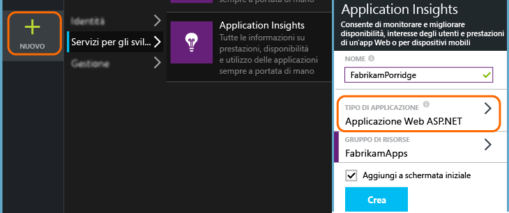
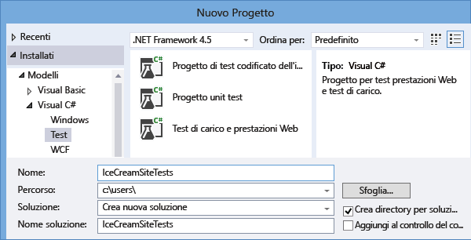
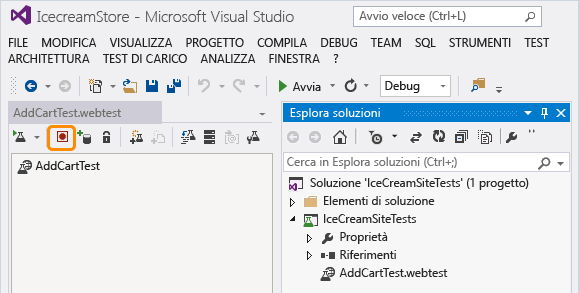
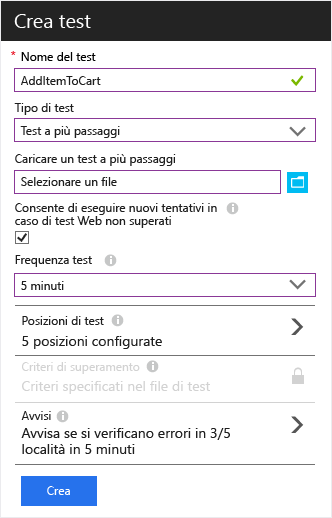
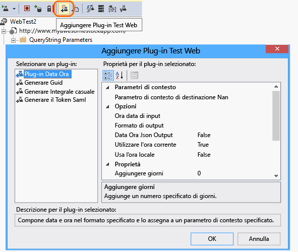
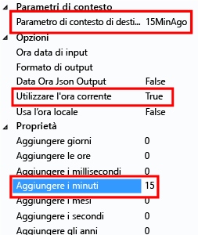

# Monitorare la disponibilità e la velocità di risposta dei siti Web
Dopo aver distribuito l'app Web o il sito Web in qualsiasi server, è possibile configurare alcuni test per monitorarne la disponibilità e la velocità di risposta. [Azure Application Insights](app-insights-overview.md) invia richieste Web all'applicazione a intervalli regolari da diversi punti in tutto il mondo. Invia avvisi all'utente nel caso in cui l'applicazione risponda lentamente o non risponda affatto.

È possibile configurare test di disponibilità per qualsiasi endpoint HTTP o HTTPS accessibile dalla rete Internet pubblica. Non è necessario aggiungere altro al sito Web che si sta testando. Non deve necessariamente trattarsi del proprio sito: è possibile testare un servizio API REST da cui si dipende.

Sono disponibili due tipi di test di disponibilità:

* [Test di ping URL](#create): un semplice test che può essere creato nel portale di Azure.
* [Test Web in più passi](#multi-step-web-tests): viene creato in Visual Studio Enterprise e caricato nel portale.

È possibile creare fino a 25 test di disponibilità per ogni risorsa dell'applicazione.

## 1. Aprire una risorsa per i report dei test di disponibilità

**Se si è già configurato Application Insights** per l'app Web, aprire la risorsa di Application Insights nel [portale di Azure](https://portal.azure.com).

**Se invece si vogliono visualizzare i report in una nuova risorsa**, accedere a [Microsoft Azure](http://azure.com), passare al [portale di Azure](https://portal.azure.com) e creare una risorsa di Application Insights.

Fare clic su **Tutte le risorse** per aprire il pannello Panoramica per la nuova risorsa.

## 2. Creare un test di ping URL
Aprire il pannello Disponibilità e aggiungere un test.

* **L'URL** può essere qualsiasi pagina Web che si vuole testare, ma deve essere visibile da Internet pubblico. L'URL può includere una stringa di query. In questo modo, ad esempio, è possibile esercitarsi nell'uso del database. Se l'URL comporta un reindirizzamento, l'operazione viene effettuata fino a un numero massimo di 10 reindirizzamenti.
* **Analizza richieste dipendenti**: se questa opzione è selezionata, il test richiede immagini, script, file di stile e altri file che fanno parte della pagina Web sottoposta a test. Il tempo di risposta registrato include il tempo impiegato per ottenere questi file. Il test avrà esito negativo se non è possibile scaricare tutte queste risorse entro il timeout definito per l'intero test. 

    Se l'opzione non viene selezionata, il test richiede solo il file in corrispondenza dell'URL specificato.
* **Abilita nuovi tentativi**: se questa opzione viene selezionata, quando il test ha esito negativo, viene eseguito un nuovo tentativo dopo un breve intervallo. Un errore viene segnalato solo se tre tentativi successivi non riescono. I test successivi vengono quindi eseguiti in base alla frequenza di test normale. I nuovi tentativi saranno temporaneamente sospesi fino al completamento successivo. Questa regola viene applicata in modo indipendente in ogni località di test. Questa opzione è consigliata. In media, circa l'80% degli errori non si ripresenta al nuovo tentativo.
* **Frequenza test**: impostare la frequenza di esecuzione del test da ogni località di test. Con una frequenza di cinque minuti e cinque località di test, il sito verrà testato in media ogni minuto.
* **Località di test** : sono le posizioni da cui i server inviano richieste Web all'URL indicato. Sceglierne più di una, per poter distinguere i problemi del sito Web dai problemi di rete. È possibile selezionare fino a 16 località.
* **Criteri di successo**:

    **Timeout test**: ridurre questo valore per ricevere avvisi in merito alle risposte lente. Il test viene conteggiato come non riuscito se le risposte dal sito non sono state ricevute entro questo periodo. Se è stata selezionata l'opzione **Analizza richieste dipendenti**, è necessario che tutti gli script, i file di stile, le immagini e le altre risorse dipendenti siano stati ricevuti entro questo periodo.

    **Risposta HTTP**: codice di stato restituito che viene conteggiato come operazione riuscita. 200 è il codice che indica che è stata restituita una normale pagina Web.

    **Il contenuto corrisponde a**: stringa, ad esempio "Benvenuto", Verifichiamo che in ogni risposta ci una corrispondenza esatta di maiuscolo e minuscolo. Deve trattarsi di una stringa di testo normale, senza caratteri jolly. È importante ricordare che, se il contenuto cambia, potrebbe essere necessario aggiornare la stringa.
* **Avvisi** vengono inviati se si verificano errori in tre posizioni in cinque minuti. Un errore in una posizione può indicare un errore di rete e non un problema con il sito. È comunque possibile modificare la soglia in modo da aumentare la sensibilità del test e modificare i destinatari a cui inviare i messaggi di posta elettronica.

    È possibile configurare un [webhook](../monitoring-and-diagnostics/insights-webhooks-alerts.md) che verrà chiamato quando viene generato un avviso. Si noti però che attualmente i parametri di query non vengono passati come proprietà.

### Testare più URL
Aggiungere altri test. Oltre a testare la home page, ad esempio, è possibile verificare che il database sia in esecuzione testando l'URL per una ricerca.

## 3. Visualizzare i risultati del test di disponibilità

Dopo pochi minuti, fare clic su **Aggiorna** per visualizzare i risultati del test. 

Il grafico a dispersione mostra alcuni campioni dei risultati del test che includono dettagli diagnostici sui passaggi del test. Il motore di test archivia i dettagli diagnostici per i test che hanno restituito errori. Per i test riusciti, vengono archiviati i dettagli diagnostici per un subset delle esecuzioni. Posizionare il puntatore del mouse su uno dei punti verdi/rossi per visualizzare il timestamp del test, la durata del test, la posizione e il nome del test. Fare clic su qualsiasi punto del grafico a dispersione per visualizzare i dettagli del risultato del test.  

Selezionare una posizione o un test specifico oppure ridurre il periodo di tempo per visualizzare più risultati riguardo all'intervallo desiderato. Usare Esplora ricerche per visualizzare i risultati di tutte le esecuzioni oppure usare query di analisi per eseguire report personalizzati per i dati.

Oltre ai risultati non elaborati, Esplora metriche include due metriche di disponibilità: 

1. Disponibilità: percentuale dei test riusciti rispetto a tutte le esecuzioni di test. 
2. Durata test: durata media dei test rispetto a tutte le esecuzioni di test.

È possibile applicare filtri per il nome di test e la posizione per analizzare le tendenze per un test e/o una posizione specifici.

##  Esaminare e modificare i test

Nella pagina di riepilogo selezionare uno specifico test. Sarà possibile visualizzarne i risultati specifici e modificarlo o disabilitarlo temporaneamente.

Può essere necessario disabilitare i test di disponibilità o le regole di avviso associate ai test durante le operazioni di manutenzione del servizio. 

## In caso di errori
Fare clic su un punto rosso.

Dal risultato di un test di disponibilità è possibile eseguire le operazioni seguenti:

* Controllare la risposta ricevuta dal server.
* Aprire i dati di telemetria inviati dall'app server durante l'elaborazione dell'istanza della richiesta non riuscita.
* Registrare un problema o elemento di lavoro in Git o VSTS per tenere traccia del problema. Il bug conterrà un collegamento a questo evento.
* Aprire il risultato del test Web in Visual Studio.

*Ha un aspetto corretto ma è segnalato come errore?* Controllare tutte le immagini, gli script, i fogli di stile e qualsiasi altro file caricato dalla pagina. In caso di errore in uno di essi, il test verrà segnalato come non superato, anche se la pagina HTML principale viene caricata correttamente.

*Nessun elemento correlato?* Se Application Insights è configurato per l'applicazione lato server, il motivo può essere l'esecuzione del [campionamento](app-insights-sampling.md). 

## Test Web in più passaggi
È possibile monitorare uno scenario che comporta una sequenza di URL. Ad esempio, se si monitora un sito Web di vendita, si potrebbe testare il corretto funzionamento dell'aggiunta di articoli al carrelli acquisti.

> [!NOTE] 
> È prevista una tariffa per i test Web in più passaggi. Vedere lo [schema dei prezzi](http://azure.microsoft.com/pricing/details/application-insights/).
> 

Per creare un test in più passaggi, registrare lo scenario con Visual Studio Enterprise, quindi caricare la registrazione in Application Insights. Application Insights riprodurrà lo scenario a intervalli e verificherà le risposte.

> [!NOTE]
> Non è possibile usare funzioni codificate o cicli nei test. Il test deve essere interamente contenuto nello script con estensione webtest. È tuttavia possibile usare plug-in standard.
>

#### 1. Registrare uno scenario
Usare Visual Studio Enterprise per registrare una sessione Web.

1. Creare un progetto di test delle prestazioni Web.

    

 * *Se il modello di test di carico e prestazioni Web non viene visualizzato*, chiudere Visual Studio Enterprise. Aprire il **programma di installazione di Visual Studio** per modificare l'installazione di Visual Studio Enterprise. In **Singoli componenti** selezionare **Strumenti per test di carico e delle prestazioni Web**.

2. Aprire il file con estensione webtest e iniziare la registrazione.

    
3. Eseguire le azioni utente che si vuole simulare nel test: aprire il sito Web, aggiungere un prodotto al carrello e così via. Quindi, arrestare il test.

    

    Non creare uno scenario lungo, in quanto è presente un limite di 100 passaggi e 2 minuti.
4. Modificare il test per:

   * Aggiungere convalide per verificare i codici di testo e di risposta ricevuti.
   * Rimuovere tutte le interazioni superflue. È inoltre possibile rimuovere le richieste dipendenti per le immagini o per Active Directory o i siti di rilevamento.

     Tenere presente che è possibile modificare solo lo script del test ma non è possibile aggiungere codice personalizzato o chiamare altri test web. Non inserire cicli nel test. È possibile utilizzare i plug-in del test web standard.
5. Eseguire il test in Visual Studio per verificarne il corretto funzionamento.

    Il programma di esecuzione del test Web apre un browser Web e ripete le azioni registrate. Verificare che funzioni come previsto.

    

#### 2. Caricare il test Web in Application Insights
1. Nel portale di Application Insights creare un test Web.

    
2. Selezionare un test in più passaggi e caricare il file con estensione webtest.

    

    Impostare le posizioni di test, la frequenza e i parametri di avviso allo stesso modo dei test ping.

#### 3. Visualizzare i risultati

Visualizzare i risultati del test e gli eventuali errori nello stesso modo dei test con singolo URL.

È anche possibile scaricare i risultati del test per visualizzarli in Visual Studio.

#### Numero di errori elevato

* Un motivo frequente di errore è l'eccessiva durata del test. L'esecuzione non deve superare i due minuti.

* Non dimenticare che, perché il test abbia esito positivo, tutte le risorse di una pagina devono essere caricate correttamente, inclusi script, fogli di stile, immagini e così via.

* Il test Web deve essere interamente contenuto nello script con estensione webtest: non è possibile usare funzioni codificate nel test.

### Inserimento di plug-in relativi a tempo e numeri casuali nel test in più passaggi
Si supponga di voler testare uno strumento che riceva dati dipendenti dal tempo, come ad esempio valori di scorte da un feed esterno. Quando si registra il test Web, è necessario usare tempi specifici impostandoli come parametri del test, StartTime e EndTime.

Quando si esegue il test, si vuole che EndTime sia sempre l'ora corrente e StartTime 15 minuti fa.

I plug-in del test Web consentono di impostare questi parametri.

1. Aggiungere un plug-in del test Web per ciascun valore di parametro desiderato. Nella barra degli strumenti del test Web scegliere **Aggiungi plug-in test Web**.

    

    In questo esempio vengono usate due istanze di Plug-in data e ora, una per "15 minuti fa" e l'altra per "ora".
2. Aprire le proprietà di ciascun plug-in. Assegnare un nome al plug-in e impostarlo in modo che usi l'ora corrente. Per uno di essi, impostare Aggiungi minuti = -15.

    
3. Nei parametri del test Web, usare {{nome plug-in}} per fare riferimento a un nome di plug-in.

    

Caricare quindi il test nel portale. Userà i valori dinamici ogni volta che verrà eseguito.

## Gestione degli accessi
Se gli utenti accedono all'app, è possibile simulare l'accesso in vari modi per testare le pagine usate per l'accesso. L'approccio da preferire dipende dal tipo di sicurezza fornito dall'app.

In tutti i casi è consigliabile creare un account nell'applicazione solo a scopo di test. Se possibile, limitare le autorizzazioni dell'account di test in modo che i test Web non possano influire in alcun modo sugli utenti reali.

### Nome utente e password semplici
Registrare un test Web nel modo consueto. Eliminare prima di tutto i cookie.

### SAML Authentication
usare il plug-in SAML disponibile per i test Web.

### Segreto client
Se l'app ha un percorso di accesso che prevede un segreto client, usare tale percorso. Un servizio che offre l'accesso con segreto client è ad esempio Azure Active Directory (AAD). In AAD, il segreto client è la chiave dell'app.

Ecco un test Web di esempio di un'app Web di Azure che usa una chiave dell'app:

1. Ottenere il token da AAD usando il segreto client (AppKey).
2. Estrarre il token di connessione dalla risposta.
3. Chiamare l'API usando il token di connessione nell'intestazione dell'autorizzazione.

Verificare che il test Web sia effettivamente un client, ovvero che abbia una propria app in AAD, e usare i relativi valori ClientId e AppKey. Anche il servizio sottoposto a test ha una propria app in AAD, il cui URI ID app è riportato nel campo "resource" del test Web.

### Autenticazione aperta
Un esempio di autenticazione aperta è l'accesso con il proprio account Microsoft o Google. Molte app che usano OAuth offrono l'alternativa del segreto client ed è quindi consigliabile ricercare prima di tutto tale possibilità.

Se il test deve eseguire l'accesso con OAuth, procedere come indicato di seguito:

* Usare uno strumento come Fiddler per esaminare il traffico tra il Web browser, il sito di autenticazione e l'app.
* Eseguire due o più accessi usando computer o browser diversi oppure a distanza di tempo, per lasciar scadere i token.
* Mettendo a confronto le diverse sessioni, identificare il token restituito dal sito di autenticazione e poi passato al server applicazioni dopo l'accesso.
* Registrare un test Web usando Visual Studio.
* Impostare i parametri dei token quando questi vengono restituiti dall'autenticatore e usarli per l'esecuzione di query nel sito.
  Visual Studio prova a impostare i parametri del test, ma non imposta correttamente i parametri dei token.

## Test delle prestazioni
È possibile eseguire un test di carico nel sito Web. Analogamente al test di disponibilità, è possibile inviare semplici richieste o richieste in più passaggi da diversi punti in tutto il mondo. A differenza dei test di disponibilità, vengono inviate molte richieste, simulando più utenti simultanei.

Dal pannello Panoramica aprire **Impostazioni**, **Test delle prestazioni**. Quando si crea un test, si è invitati a connettersi o a creare un account di Visual Studio Team Services.

Al termine del test verranno visualizzati i tempi di risposta e le percentuali di successo.

> [!TIP]
> Per osservare gli effetti di un test delle prestazioni, usare [Live Stream](app-insights-live-stream.md) e [Profiler](app-insights-profiler.md).
>

## Automazione
* [Usare script di PowerShell per configurare un test di disponibilità](app-insights-powershell.md#add-an-availability-test) automaticamente.
* Configurare un [webhook](../monitoring-and-diagnostics/insights-webhooks-alerts.md) che verrà chiamato quando viene generato un avviso.

## Domande? Problemi?
* *È possibile chiamare codice da un test Web?*

    No. I passaggi del test devono essere nel file con estensione webtest. Inoltre non è possibile chiamare altri test web o utilizzare cicli. Esistono diversi plug-in che potrebbero risultare utili.
* *HTTPS è supportato?*

    Sono supportati TLS 1.1 e TLS 1.2.
* *Esiste una differenza tra "test Web" e "test di disponibilità"?*

    I due termini vengono usati in modo intercambiabile. Test di disponibilità è un termine più generico che include i singoli test di ping URL oltre ai test Web in più passaggi.
* *È possibile usare test di disponibilità nel server interno protetto da un firewall?*

    Le soluzioni possono essere due:
    
    * Configurare il firewall per consentire richieste in ingresso dagli [indirizzi IP degli agenti di test Web](app-insights-ip-addresses.md).
    * Scrivere il proprio codice per testare periodicamente il server interno. Eseguire il codice come processo in background in un server di prova protetto da firewall. Il processo di test può inviare i risultati ad Application Insights tramite l'API [TrackAvailability()](https://docs.microsoft.com/dotnet/api/microsoft.applicationinsights.telemetryclient.trackavailability) nel pacchetto SDK di base. In questo modo è necessario testare il server per avere un accesso in uscita per l'endpoint di inserimento di Application Insights, ma questo rappresenta un minore rischio per la sicurezza rispetto all'alternativa di consentire le richieste in ingresso. I risultati non verranno visualizzati nei pannelli dei test Web di disponibilità, ma verranno mostrati come risultati relativi alla disponibilità in Analisi, Ricerca ed Esplorazione metriche.
* *Non è possibile caricare un test Web in più passi*

    È previsto un limite di dimensioni pari a 300 KB.

    I cicli non sono supportati.

    I riferimenti ad altri test Web non sono supportati.

    Le origini dati non sono supportate.
* *Il test in più passi non viene completato*

    È previsto un limite di 100 richieste per ogni test.

    Il test viene arrestato se la durata dell'esecuzione è superiore a due minuti.
* *È possibile eseguire un test con certificati client?*

    Questa funzionalità non è supportata.

## Passaggi successivi
[Ricerca nei registri di diagnostica][diagnostic]

[Risoluzione dei problemi][qna]

[Indirizzi IP degli agenti di test Web](app-insights-ip-addresses.md)

<!--Link references-->

[azure-availability]: ../insights-create-web-tests.md
[diagnostic]: app-insights-diagnostic-search.md
[qna]: app-insights-troubleshoot-faq.md
[start]: app-insights-overview.md
