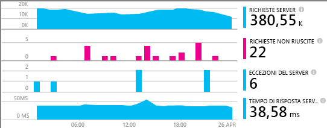
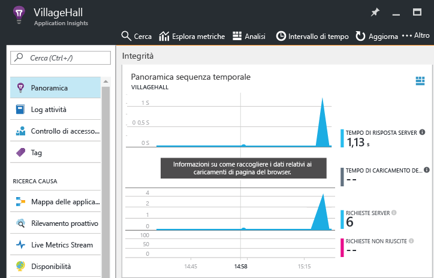

# <a name="monitor-your-nodejs-services-and-apps-with-application-insights"></a>Monitorare servizi e app Node.js con Application Insights

[Azure Application Insights](app-insights-overview.md) monitora i componenti e i servizi back-end dopo che sono stati distribuiti consentendo così di [individuare e diagnosticare rapidamente i problemi di prestazioni e di altro tipo](app-insights-detect-triage-diagnose.md). Usare Azure Application Insights per servizi Node.js ospitati ovunque: nel data center, in app Web e VM di Azure e anche in altri cloud pubblici.

Per ricevere, archiviare ed esplorare i dati di monitoraggio, seguire le istruzioni riportate più avanti per includere un agente nel codice e configurare una risorsa di Application Insights corrispondente in Azure. L'agente invia i dati a tale risorsa per analisi ed esplorazioni aggiuntive.

L'agente Node.js può monitorare automaticamente le richieste HTTP in ingresso e in uscita, diverse metriche di sistema e le eccezioni. A partire dalla versione 0.20, può monitorare anche alcuni pacchetti comuni di terze parti come `mongodb`, `mysql` e `redis`. Tutti gli eventi relativi a una richiesta HTTP in ingresso vengono correlati per velocizzare la risoluzione dei problemi.

È possibile monitorare aspetti aggiuntivi dell'app e del sistema instrumentandoli manualmente con l'API dell'agente descritta più avanti.



## <a name="getting-started"></a>Introduzione

Verrà ora illustrata la configurazione del monitoraggio per un'app o un servizio.

### <a name="resource"></a> Configurare una risorsa di Application Insights

**Prima di iniziare**, verificare di avere una sottoscrizione di Azure oppure [ottenerne una nuova gratuitamente][azure-free-offer]. Se l'organizzazione ha già una sottoscrizione di Azure, un amministratore può aggiungere l'utente alla sottoscrizione seguendo [queste istruzioni][add-aad-user].

[azure-free-offer]: https://azure.microsoft.com/en-us/free/
[add-aad-user]: https://docs.microsoft.com/en-us/azure/active-directory/active-directory-users-create-azure-portal

Accedere quindi al [portale di Azure][portal] e creare una risorsa di Application Insights come illustrato di seguito, facendo clic su "Nuovo" > "Strumenti di sviluppo" > "Application Insights". La risorsa include un endpoint per la ricezione dei dati di telemetria, l'archiviazione di tali dati, dei report salvati e dei dashboard, la configurazione di regole e avvisi e altro ancora.


Nella pagina di creazione della risorsa scegliere "Applicazione Node.js" nell'elenco a discesa Tipo di applicazione. Il tipo di app determina il set predefinito di dashboard e report creato automaticamente. Qualsiasi risorsa di Application Insights, tuttavia, può di fatto raccogliere dati da qualsiasi linguaggio e piattaforma.


### <a name="agent"></a> Configurare l'agente Node.js

È ora possibile includere l'agente nell'app affinché possa raccogliere dati.
Per iniziare, copiare la chiave di strumentazione della risorsa (`ikey`) dal portale come illustrato di seguito. Questa chiave viene usata dal sistema Application Insights per il mapping dei dati alla risorsa di Azure e deve quindi essere specificata in una variabile di ambiente o nel codice perché possa essere usata dall'agente.  


Aggiungere quindi la libreria dell'agente Node.js alle dipendenze dell'app tramite package.json. Dalla cartella radice dell'app eseguire:

```bash
npm install applicationinsights --save
```

È ora necessario caricare in modo esplicito la libreria nel codice. Dato che l'agente inserisce la strumentazione in molte altre librerie, è consigliabile eseguire il caricamento prima possibile e prima di altre istruzioni `require`. Per iniziare, aggiungere quanto segue all'inizio del primo file con estensione js:

```javascript
const appInsights = require("applicationinsights");
appInsights.setup("<instrumentation_key>");
appInsights.start();
```

Il metodo `setup` configura la chiave di strumentazione e quindi la risorsa di Azure da usare per impostazione predefinita per tutti gli elementi rilevati. Chiamare `start` al termine della configurazione per avviare la raccolta e l'invio dei dati di telemetria.

È anche possibile specificare una chiave di strumentazione tramite la variabile di ambiente APPINSIGHTS\_INSTRUMENTATIONKEY, anziché passandola manualmente a `setup()` o `getClient()`. Questa procedura consente di non includere le chiavi di strumentazione nel codice sorgente sottoposto a commit e di specificare chiavi diverse per ambienti diversi.

Di seguito sono documentate le opzioni di configurazione aggiuntive.

È possibile provare l'agente senza inviare dati di telemetria impostando la chiave di strumentazione su qualsiasi stringa non vuota.

### <a name="monitor"></a> Monitorare l'app

L'agente raccoglie automaticamente dati di telemetria sul runtime Node.js e su alcuni moduli comuni di terze parti. Usare ora l'applicazione per generare alcuni dati di questo tipo.

Nel [portale di Azure][portal] passare quindi alla risorsa di Application Insights creata in precedenza e cercare i primi punti dati in Panoramica sequenza temporale, come nell'immagine seguente. Per altri dettagli, fare clic sui grafici.



Fare clic sul pulsante Mappa delle applicazioni per visualizzare la topologia individuata per l'app, come nell'immagine seguente. Per altri dettagli, fare clic sui componenti riportati nella mappa.


È possibile ottenere altre informazioni sull'app e risolvere i problemi usando le altre visualizzazioni disponibili nella sezione "Analisi".


#### <a name="no-data"></a>Dati non visualizzati

Dato che l'agente esegue l'invio dei dati in batch, potrebbe verificarsi un ritardo nella visualizzazione degli elementi nel portale. Se i dati non sono visibili nella risorsa, provare alcune delle correzioni seguenti:

* Continuare a usare l'applicazione ed eseguire altre azioni per generare dati di telemetria aggiuntivi.
* Fare clic su **Aggiorna** nella visualizzazione della risorsa nel portale. I grafici vengono aggiornati in modo automatico periodicamente, ma così è possibile forzare l'aggiornamento immediato.
* Verificare che le [porte in uscita necessarie](app-insights-ip-addresses.md) siano aperte.
* Aprire il riquadro [Ricerca](app-insights-diagnostic-search.md) e cercare singoli eventi.
* Vedere le [domande frequenti][].


## <a name="agent-configuration"></a>Configurazione dell'agente

Di seguito sono riportati i metodi di configurazione dell'agente e i relativi valori predefiniti.

Per correlare completamente gli eventi in un servizio, assicurarsi di impostare `.setAutoDependencyCorrelation(true)`. In questo modo, l'agente può tenere traccia del contesto tra callback asincroni in Node.js.

```javascript
const appInsights = require("applicationinsights");
appInsights.setup("<instrumentation_key>")
    .setAutoDependencyCorrelation(false)
    .setAutoCollectRequests(true)
    .setAutoCollectPerformance(true)
    .setAutoCollectExceptions(true)
    .setAutoCollectDependencies(true)
    .start();
```

## <a name="agent-api"></a>API dell'agente

<!-- TODO: Fully document agent API. -->

Per una descrizione completa dell'API dell'agente .NET, vedere [qui](app-insights-api-custom-events-metrics.md).

Con il client Node.js di Application Insights è possibile tenere traccia di qualsiasi richiesta, evento, metrica o eccezione. L'esempio seguente illustra alcune delle API disponibili.

```javascript
let appInsights = require("applicationinsights");
appInsights.setup().start(); // assuming ikey in env var
let client = appInsights.getClient();

client.trackEvent("my custom event", {customProperty: "custom property value"});
client.trackException(new Error("handled exceptions can be logged with this method"));
client.trackMetric("custom metric", 3);
client.trackTrace("trace message");

let http = require("http");
http.createServer( (req, res) => {
  client.trackRequest(req, res); // Place at the beginning of your request handler
});
```

### <a name="track-your-dependencies"></a>Tenere traccia delle dipendenze

```javascript
let appInsights = require("applicationinsights");
let client = appInsights.getClient();

var success = false;
let startTime = Date.now();
// execute dependency call here....
let duration = Date.now() - startTime;
success = true;

client.trackDependency("dependency name", "command name", duration, success);
```

### <a name="add-a-custom-property-to-all-events"></a>Aggiungere una proprietà personalizzata a tutti gli eventi

```javascript
appInsights.client.commonProperties = {
    environment: process.env.SOME_ENV_VARIABLE
};
```

### <a name="track-http-get-requests"></a>Tenere traccia delle richieste HTTP GET

```javascript
var server = http.createServer((req, res) => {
    if ( req.method === "GET" ) {
            appInsights.client.trackRequest(req, res);
    }
    // other work here....
    res.end();
});
```

### <a name="track-server-startup-time"></a>Tenere traccia del tempo di avvio del server

```javascript
let start = Date.now();
server.on("listening", () => {
    let duration = Date.now() - start;
    appInsights.client.trackMetric("server startup time", duration);
});
```

## <a name="more-resources"></a>Altre risorse

* [Monitorare i dati di telemetria nel portale](app-insights-dashboards.md)
* [Presentazione dello strumento Analisi in Application Insights](app-insights-analytics-tour.md)

<!--references-->

[portal]: https://portal.azure.com/
[domande frequenti]: app-insights-troubleshoot-faq.md

