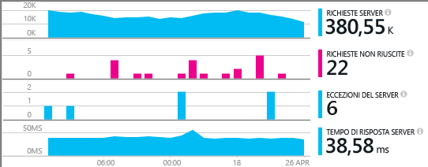
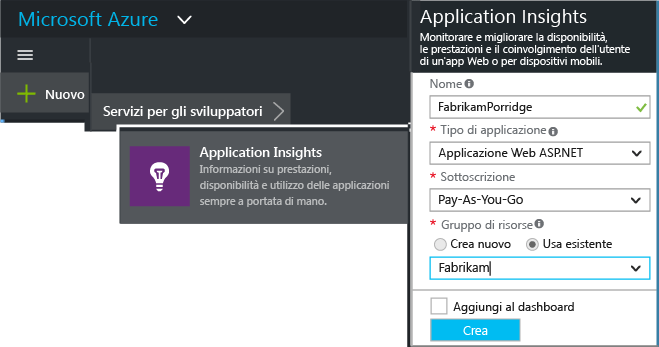
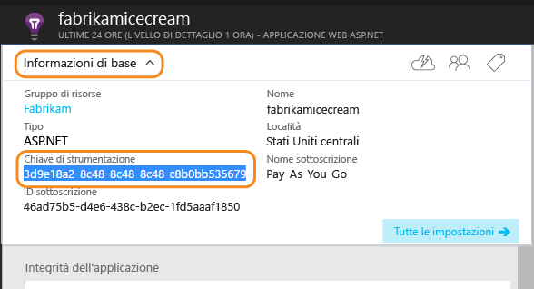
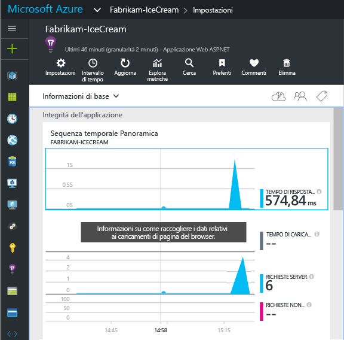

<properties
	pageTitle="Aggiungere Application Insights SDK per monitorare un'app Node.js | Microsoft Azure"
	description="Analizzare l'uso, la disponibilità e le prestazioni dell'applicazione locale o Web di Microsoft Azure con Application Insights."
	services="application-insights"
    documentationCenter=""
	authors="alancameronwills"
	manager="douge"/>

<tags
	ms.service="application-insights"
	ms.workload="tbd"
	ms.tgt_pltfrm="ibiza"
	ms.devlang="na"
	ms.topic="get-started-article"
	ms.date="08/30/2016"
	ms.author="awills"/>



# Aggiungere Application Insights SDK per monitorare un'app Node.js

*Application Insights è disponibile in anteprima.*

[Visual Studio Application Insights](app-insights-overview.md) consente di monitorare un'applicazione live per [rilevare e diagnosticare i problemi di prestazioni e le eccezioni](app-insights-detect-triage-diagnose.md) e [individuare la modalità di uso dell'app](app-insights-overview-usage.md). Può essere usato per app ospitate nei server IIS locali dell'utente o in macchine virtuali di Azure oppure per app Web di Azure,


L'SDK offre la raccolta automatica delle risposte e delle frequenze delle richieste HTTP in ingresso, dei contatori delle prestazioni (CPU, memoria, RPS) e delle eccezioni non gestite. È anche possibile aggiungere chiamate personalizzate per rilevare le dipendenze, le metriche o altri eventi.





#### Prima di iniziare

Sono necessari:

* Visual Studio 2013 o versione successiva. È preferibile una versione successiva.
* Una sottoscrizione a [Microsoft Azure](http://azure.com). Se il team o l'organizzazione ha una sottoscrizione di Azure, il proprietario potrà aggiungere l'utente alla sottoscrizione usando il rispettivo [account Microsoft](http://live.com).

## <a name="add"></a>Creare una risorsa di Application Insights

Accedere al [portale di Azure][portal] e creare una nuova risorsa di Application Insights. Una [risorsa][roles] in Azure è un'istanza di un servizio. In questa risorsa la telemetria dell'app verrà analizzata e visualizzata.




Scegliere Altro come tipo di applicazione. La scelta del tipo di applicazione imposta il contenuto predefinito dei pannelli delle risorse e le proprietà visibili in [Esplora metriche][metrics].

#### Eseguire una copia della chiave di strumentazione

La chiave identifica la risorsa e verrà installata subito nell'SDK per indirizzare i dati alla risorsa.





## <a name="sdk"></a> Installare l’SDK nell'applicazione

```
npm install applicationinsights --save
```

## Uso

In questo modo viene abilitato il monitoraggio delle richieste, il rilevamento delle eccezioni non gestite e il monitoraggio delle prestazioni di sistema (CPU/memoria/RPS).

```javascript

var appInsights = require("applicationinsights");
appInsights.setup("<instrumentation_key>").start();
```

È anche possibile impostare la chiave di strumentazione nella variabile di ambiente APPINSIGHTS\_INSTRUMENTATIONKEY. In questo caso, nella chiamata a `appInsights.setup()` o `appInsights.getClient()` non sono necessari argomenti.

È possibile provare l'SDK senza invio di dati di telemetria, impostando la chiave di strumentazione su una stringa non vuota.


## <a name="run"></a> Eseguire il progetto

Eseguire l'applicazione e provarla aprendo pagine diverse per generare alcuni dati di telemetria.


## <a name="monitor"></a> Visualizzare i dati di telemetria

Tornare al [portale di Azure](https://portal.azure.com) e passare alla risorsa Application Insights.


Cercare i dati nella pagina di panoramica. All'inizio si vedranno solo uno o due punti. Ad esempio:




Fare clic su qualsiasi grafico per visualizzare metriche più dettagliate. [Altre informazioni sulle metriche.][perf]

#### Dati non visualizzati

* Usare l'applicazione, aprendo pagine diverse in modo da generare alcuni dati di telemetria.
* Aprire il riquadro [Ricerca](app-insights-diagnostic-search.md) per visualizzare i singoli eventi. Talvolta agli eventi ci vuole un po' più di tempo per passare attraverso la pipeline delle metriche.
* Attendere alcuni secondi e fare clic su **Aggiorna**. I grafici si aggiornano periodicamente, ma è possibile aggiornare manualmente se si è in attesa di alcuni dati da visualizzare.
* Vedere [Domande su Application Insights per ASP.NET][qna].

## Pubblicare l'app

Ora distribuire l'applicazione a ISS o ad Azure e osservare l'accumulo dei dati.


#### Nessun dato dopo la pubblicazione nel server?

Aprire le seguenti porte per il traffico in uscita nel firewall del server:

+ `dc.services.visualstudio.com:443`

+ `f5.services.visualstudio.com:443`



#### Problemi del server di compilazione

Vedere [questa sezione sulla risoluzione dei problemi](app-insights-asp-net-troubleshoot-no-data.md#NuGetBuild).


## Uso personalizzato 

### Disabilitazione della raccolta automatica

```javascript
import appInsights = require("applicationinsights");
appInsights.setup("<instrumentation_key>")
    .setAutoCollectRequests(false)
    .setAutoCollectPerformance(false)
    .setAutoCollectExceptions(false)
    // no telemetry will be sent until .start() is called
    .start();
```

### Monitoraggio personalizzato

```javascript
import appInsights = require("applicationinsights");
var client = appInsights.getClient();

client.trackEvent("custom event", {customProperty: "custom property value"});
client.trackException(new Error("handled exceptions can be logged with this method"));
client.trackMetric("custom metric", 3);
client.trackTrace("trace message");
```

[Altre informazioni sull'API di telemetria](app-insights-api-custom-events-metrics.md).

### Uso di più chiavi di strumentazione

```javascript
import appInsights = require("applicationinsights");

// configure auto-collection with one instrumentation key
appInsights.setup("<instrumentation_key>").start();

// get a client for another instrumentation key
var otherClient = appInsights.getClient("<other_instrumentation_key>");
otherClient.trackEvent("custom event");
```

## esempi

### Rilevamento delle dipendenze

```javascript
import appInsights = require("applicationinsights");
var client = appInsights.getClient();

var startTime = Date.now();
// execute dependency call
var endTime = Date.now();

var elapsedTime = endTime - startTime;
var success = true;
client.trackDependency("dependency name", "command name", elapsedTime, success);
```


### Rilevamento manuale di tutte le richieste "GET"

```javascript
var http = require("http");
var appInsights = require("applicationinsights");
appInsights.setup("<instrumentation_key>")
    .setAutoCollectRequests(false) // disable auto-collection of requests for this example
    .start();

// assign common properties to all telemetry sent from the default client
appInsights.client.commonProperties = {
    environment: process.env.SOME_ENV_VARIABLE
};

// track a system startup event
appInsights.client.trackEvent("server start");

// create server
var port = process.env.port || 1337
var server = http.createServer(function (req, res) {
    // track all "GET" requests
    if(req.method === "GET") {
        appInsights.client.trackRequest(req, res);
    }

    res.writeHead(200, { "Content-Type": "text/plain" });
    res.end("Hello World\n");
}).listen(port);

// track startup time of the server as a custom metric
var start = +new Date;
server.on("listening", () => {
    var end = +new Date;
    var duration = end - start;
    appInsights.client.trackMetric("StartupTime", duration);
});
```

## Passaggi successivi

* [Monitorare i dati di telemetria nel portale](app-insights-dashboards.md)
* [Presentazione dello strumento Analisi in Application Insights](app-insights-analytics-tour.md)


<!--Link references-->



[knowUsers]: app-insights-overview-usage.md
[metrics]: app-insights-metrics-explorer.md
[perf]: app-insights-web-monitor-performance.md
[portal]: http://portal.azure.com/
[qna]: app-insights-troubleshoot-faq.md
[roles]: app-insights-resources-roles-access-control.md

<!---HONumber=AcomDC_0914_2016-->