<properties
	pageTitle="Uso dell'analisi con Application Insights"
	description="Panoramica dell'analisi dell'uso con Application Insights"
	services="application-insights"
    documentationCenter=""
	authors="alancameronwills"
	manager="kamrani"/>

<tags
	ms.service="application-insights"
	ms.workload="tbd"
	ms.tgt_pltfrm="ibiza"
	ms.devlang="na"
	ms.topic="get-started-article" 
	ms.date="05/03/2015"
	ms.author="awills"/>

# Uso dell'analisi con Application Insights

La conoscenza della modalità d'uso dell'applicazione consente di concentrare l'attenzione sugli scenari più importanti e ottenere informazioni sugli obiettivi più facili o più difficili da raggiungere per gli utenti.

Application Insights può offrire una visione chiara dell'uso dell'applicazione, consentendo di migliorare l'esperienza degli utenti e soddisfare gli obiettivi aziendali.

## Analisi predefinita

Aggiungere [Application Insights][start] al progetto e senza altri sforzi vengono generati grafici che mostrano il numero di utenti disponibili e altro ancora.

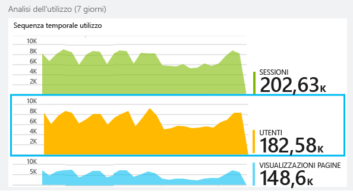

Passare il mouse nella parte vuota su un grafico per visualizzare i conteggi in un momento specifico. In caso contrario, i numeri indicano il valore aggregato, ad esempio una media, un totale o un numero di utenti definito durante il periodo.

Nelle applicazioni Web gli utenti vengono conteggiati usando i cookie. Una persona che usa diversi browser, cancella i cookie o usa la funzionalità di privacy verrà conteggiata più volte.

Una sessione Web viene conteggiata dopo 30 minuti di inattività. Una sessione su un telefono o un altro dispositivo viene conteggiata quando l'app viene sospesa per più di pochi secondi.

Fare clic su qualsiasi grafico per visualizzare altri dettagli. ad esempio:

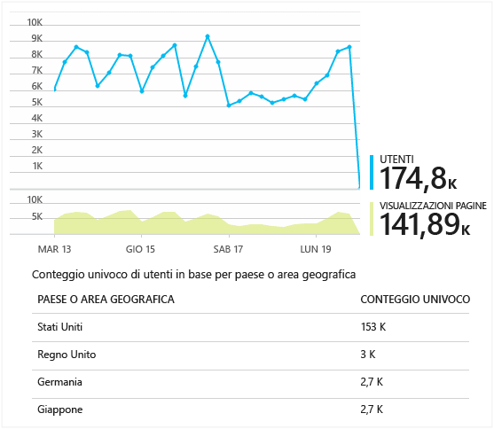

Questo esempio è tratto da un sito Web, ma i grafici sono simili per le app in esecuzione sui dispositivi.

Confrontare con la settimana precedente per verificare se vi sono cambiamenti:

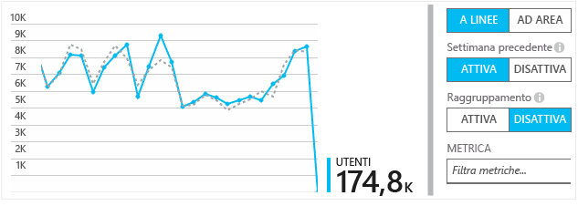

Confrontare due metriche, ad esempio utenti e nuovi utenti:

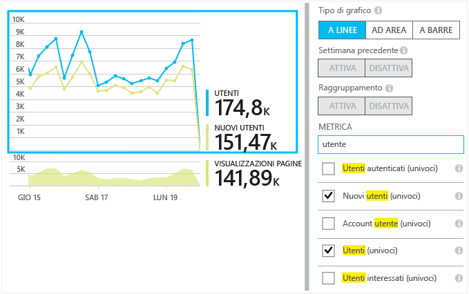

Raggruppare (segmentare) i dati in base a una proprietà come browser, sistema operativo o città:

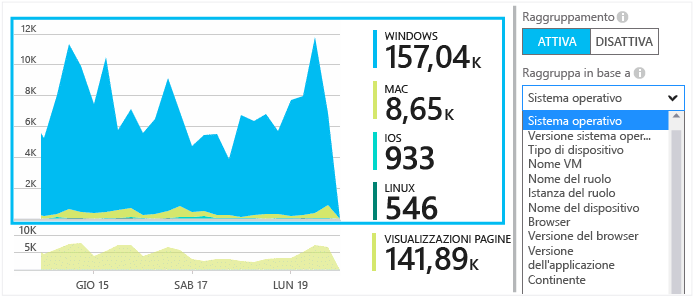

## Uso delle pagine

Fare clic sul grafico di visualizzazioni pagina per ottenere una versione con dimensioni ingrandite insieme a una suddivisione delle pagine più diffuse:

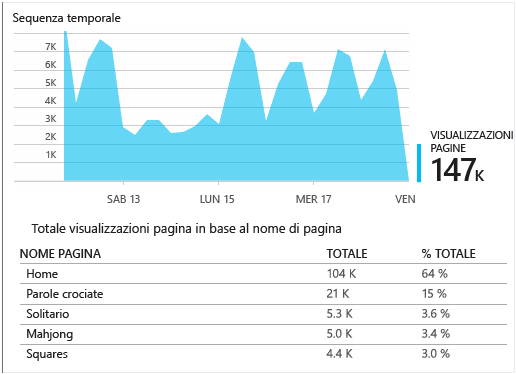

L'esempio precedente è tratto da un sito Web di giochi. Da quest'ultimo è immediatamente evidente quanto segue:

* L'uso non è stato migliorato nell'ultima settimana. Forse è opportuno definire l'ottimizzazione del motore di ricerca.
* Le pagine di giochi sono visualizzate da molte meno persone rispetto alla Home page. Perché la Home page non invoglia gli utenti a giocare?
* 'Crossword' è il gioco più diffuso. È opportuno dare la priorità a nuove idee e ai miglioramenti disponibili.

## Rilevamento personalizzato

Si supponga che, invece di implementare ogni gioco in una pagina Web separata, si decida di eseguire il refactoring di tutti i giochi nella stessa app a singola pagina con la maggior parte delle funzionalità codificate come Javascript nella pagina Web. Ciò consente all'utente di passare rapidamente da un gioco all'altro o di avere a disposizione diversi giochi in un'unica pagina.

Tuttavia, si vuole comunque che Application Insights registri il numero di volte in cui ogni gioco viene aperto, esattamente come se fossero in pagine Web separate. La risposta è semplice: inserire solo una chiamata nel modulo di telemetria in JavaScript in cui si vuole registrare l'apertura di una nuova 'pagina':

	telemetryClient.trackPageView(game.Name);

## Eventi personalizzati

È possibile usare i dati di telemetria in molti modi per comprendere l'uso dell'applicazione. Ma non sempre si desidera combinare i messaggi con le visualizzazioni pagina. Usare invece gli eventi personalizzati. È possibile inviarli da app per dispositivi, pagine Web o un server Web:

(JavaScript)

    telemetryClient.trackEvent("GameEnd");

(C#)

    var tc = new Microsoft.ApplicationInsights.TelemetryClient();
    tc.TrackEvent("GameEnd");

(VB)

    Dim tc = New Microsoft.ApplicationInsights.TelemetryClient()
    tc.TrackEvent("GameEnd")

Gli eventi personalizzati più frequenti sono elencati nel pannello Panoramica.

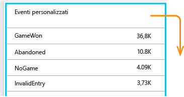

Fare clic sull'intestazione della tabella per visualizzare il numero totale di eventi. È possibile segmentare il grafico in base a vari attributi, ad esempio il nome dell'evento:

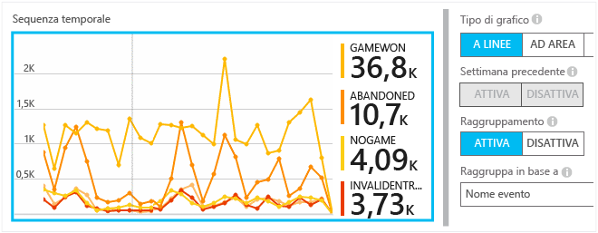

La funzionalità particolarmente utile delle sequenze temporali è che è possibile correlare le modifiche con altre metriche ed eventi. Ad esempio, in alcuni casi, quando vengono riprodotti più giochi, è possibile aspettarsi anche un aumento dei giochi abbandonati. Ma l'aumento dei giochi abbandonati è sproporzionato, per cui si intende sapere se il carico elevato causa problemi ritenuti inaccettabili dagli utenti.

## Esaminare eventi specifici

Per una migliore comprensione dell'andamento di una sessione tipica, è possibile concentrarsi su una sessione utente specifica che contiene un particolare tipo di evento.

In questo esempio viene codificato un evento personalizzato "NoGame" che viene chiamato se l'utente si disconnette senza effettivamente iniziare un gioco. Perché un utente si comporta in questo modo? Forse se si esaminano alcune occorrenze specifiche, si otterranno delle indicazioni.

Gli eventi personalizzati ricevuti dall'app sono elencati per nome nel pannello Panoramica:

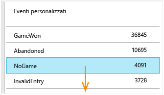

Fare clic nell'evento di interesse e quindi selezionare un'occorrenza specifica recente:

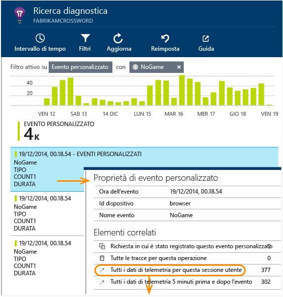

Verranno ora esaminati i dati di telemetria relativi alla sessione in cui si è verificato l'evento NoGame specifico.

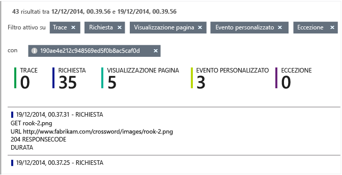

Non si sono verificate eccezioni, per cui non sono stati eventuali errori a impedire all'utente di giocare.

È possibile filtrare tutti i tipi di dati di telemetria, ad eccezione delle visualizzazioni pagina per la sessione corrente:

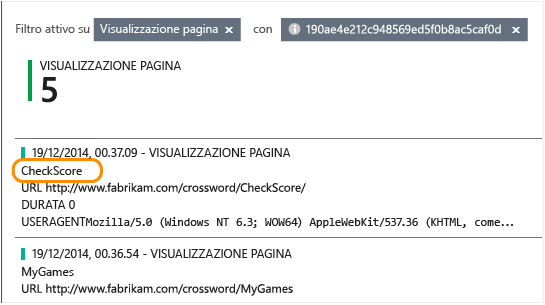

A questo punto è possibile vedere che questo utente esegue l'accesso semplicemente per controllare i punteggi più recenti. Forse si deve valutare l'opportunità di sviluppare la storia di un utente per facilitare la comprensione. Si deve implementare un evento personalizzato per segnalare quando si verifica questa storia specifica.

## Filtrare, cercare e segmentare i dati con le proprietà
È possibile allegare tag arbitrari e valori numerici agli eventi.

JavaScript nel client

    appInsights.trackEvent("WinGame",
        // String properties:
        {Game: currentGame.name, Difficulty: currentGame.difficulty},
        // Numeric measurements:
        {Score: currentGame.score, Opponents: currentGame.opponentCount}
    );

C# nel server

    // Set up some properties:
    var properties = new Dictionary <string, string>
        {{"game", currentGame.Name}, {"difficulty", currentGame.Difficulty}};
    var measurements = new Dictionary <string, double>
        {{"Score", currentGame.Score}, {"Opponents", currentGame.OpponentCount}};

    // Send the event:
    telemetry.TrackEvent("WinGame", properties, measurements);

VB nel server

    ' Set up some properties:
    Dim properties = New Dictionary (Of String, String)
    properties.Add("game", currentGame.Name)
    properties.Add("difficulty", currentGame.Difficulty)

    Dim measurements = New Dictionary (Of String, Double)
    measurements.Add("Score", currentGame.Score)
    measurements.Add("Opponents", currentGame.OpponentCount)

    ' Send the event:
    telemetry.TrackEvent("WinGame", properties, measurements)

Allegare le proprietà alle visualizzazioni pagine nello stesso modo:

JavaScript nel client

    appInsights.trackPageView("Win",
        {Game: currentGame.Name},
        {Score: currentGame.Score});

Nella Ricerca diagnostica è possibile visualizzare le proprietà facendo clic su una singola occorrenza di un evento.

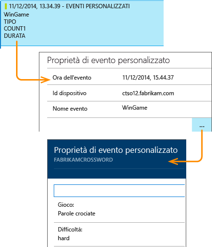

Usare il campo Ricerca per visualizzare le occorrenze di eventi con un valore della proprietà particolare.

## Test A | B

Se non si sa quale variante di una funzionalità sarà più efficace, rilasciarle entrambe, rendendo ognuna accessibile a utenti diversi. Valutare la riuscita di ognuna e quindi passare a una versione unificata.

Per questa tecnica è possibile collegare tag differenti per tutti i dati di telemetria inviati da ogni versione dell'app. A tale scopo definire le proprietà nel TelemetryContext attivo. Queste proprietà predefinite vengono aggiunte a ogni messaggio di telemetria che l'applicazione invia, non solo ai messaggi personalizzati, ma anche alla telemetria standard.

Nel portale Application Insights sarà quindi possibile filtrare e raggruppare (segmentare) i dati sui tag, in modo da confrontare versioni diverse.

C# nel server

    using Microsoft.ApplicationInsights.DataContracts;

    var context = new TelemetryContext();
    context.Properties["Game"] = currentGame.Name;
    var telemetry = new TelemetryClient(context);
    // Now all telemetry will automatically be sent with the context property:
    telemetry.TrackEvent("WinGame");

VB nel server

    Dim context = New TelemetryContext
    context.Properties("Game") = currentGame.Name
    Dim telemetry = New TelemetryClient(context)
    ' Now all telemetry will automatically be sent with the context property:
    telemetry.TrackEvent("WinGame")

I singoli dati di telemetria possono sostituire i valori predefiniti.

È possibile impostare un inizializzatore universale in modo che tutti i nuovi TelemetryClient usino automaticamente il contesto.

    // Telemetry initializer class
    public class MyTelemetryInitializer : IContextInitializer
    {
        public void Initialize (TelemetryContext context)
        {
            context.Properties["AppVersion"] = "v2.1";
        }
    }

Nell'inizializzatore di app, ad esempio Global.asax.cs, procedere come segue:

    protected void Application_Start()
    {
        // ...
        TelemetryConfiguration.Active.ContextInitializers
        .Add(new MyTelemetryInitializer());
    }

## Compilare - Misurare - Acquisire informazioni

Quando si usa l'analisi, questa diventa parte integrante del ciclo di sviluppo, non solo un'attività da prendere in considerazione per la risoluzione dei problemi. Di seguito sono riportati alcuni suggerimenti:

* Determinare la metrica chiave dell'applicazione. Si vogliono prendere in considerazione tutti gli utenti possibili o è preferibile un piccolo gruppo di utenti molto soddisfatti? Si vogliono ottimizzare le visite o le vendite?
* Pianificare la misurazione di ogni storia. Quando si rappresenta una nuova storia o funzionalità utente oppure si pianifica di aggiornarne una esistente, pensare sempre a come si misurerà la riuscita della modifica. Prima di avviare il codice, chiedersi quale effetto avrà sulle metriche, se funziona e se si dovrà tenere traccia dei nuovi eventi. Naturalmente, quando la funzionalità è disponibile, assicurarsi di esaminare l'analisi e agire sui risultati.
* Correlare altre metriche alla metrica chiave. Ad esempio, se si aggiunge una funzionalità 'Preferiti', si vuole sapere con quale frequenza gli utenti aggiungono i preferiti. Tuttavia, forse è più interessante sapere con quale frequenza tornano a consultare i preferiti. E, ancora più importante, i clienti, che usano i preferiti, in definitiva fanno più acquisti relativi al prodotto?
* Test Canary. Impostare uno switch di funzionalità che consenta di visualizzare una nuova funzionalità solo ad alcuni utenti. Usare Application Insights per verificare se la nuova funzionalità viene usata nel modo previsto. Apportare modifiche, quindi rilasciarla per un pubblico più ampio.
* Comunicare con gli utenti L'analisi non è sufficiente da sola, ma è complementare per mantenere una buona relazione con i clienti.

## Video

> [AZURE.VIDEO usage-monitoring-application-insights]

<!--Link references-->

[start]: app-insights-get-started.md
 

<!---HONumber=July15_HO4-->