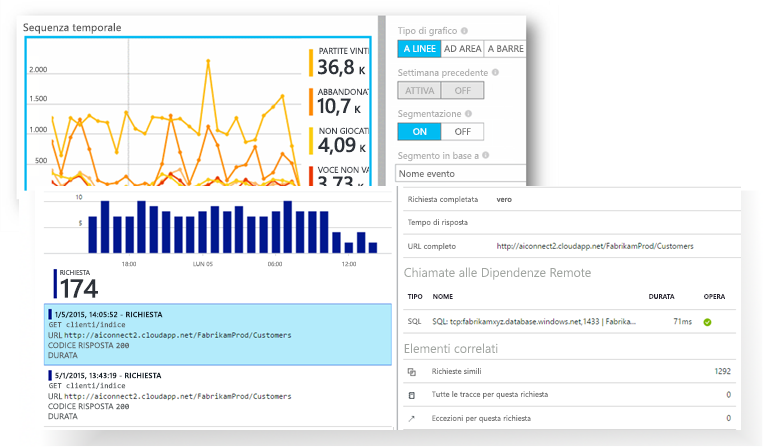
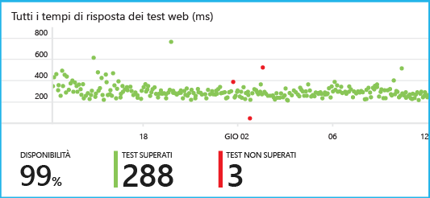
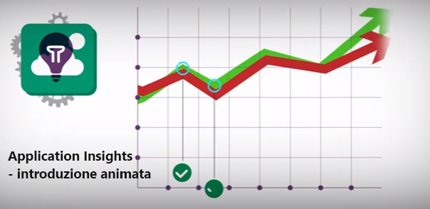

<properties 
	pageTitle="Esercitazione di Application Insights | Microsoft Azure" 
	description="Tenere traccia dell'utilizzo e delle prestazioni dell'applicazione Web live. Rilevare, valutare e diagnosticare i problemi. Monitorare continuamente e migliorare l'uso con gli utenti." 
	services="application-insights" 
    documentationCenter=""
	authors="alancameronwills" 
	manager="douge"/>

<tags 
	ms.service="application-insights" 
	ms.workload="tbd" 
	ms.tgt_pltfrm="ibiza" 
	ms.devlang="na" 
	ms.topic="article" 
	ms.date="07/18/2016" 
	ms.author="awills"/>
 
# Application Insights - Introduzione

Visual Studio Application Insights è un servizio di analisi estendibile che consente di monitorare un'applicazione Web live. Permette di rilevare e diagnosticare problemi di prestazioni e comprendere le operazioni effettivamente eseguite dagli utenti nell'applicazione. Il servizio è progettato per aiutare gli sviluppatori a migliorare continuamente le prestazioni e l'usabilità. Funziona per le app su un'ampia gamma di piattaforme, tra cui .NET o J2EE, ospitate in locale o nel cloud.





[Osservare l'animazione dell'introduzione](https://www.youtube.com/watch?v=fX2NtGrh-Y0).

## Come funziona?

Si installa un piccolo pacchetto di strumentazione nell'applicazione e si configura una risorsa di Application Insights nel portale di Microsoft Azure. La strumentazione monitora l'app e invia i dati di telemetria al portale. Il portale consente di visualizzare grafici statistici e offre strumenti di ricerca avanzati che consentono di diagnosticare i problemi.





Application Insights include più [moduli di strumentazione standard](app-insights-configuration-with-applicationinsights-config.md) che raccolgono diversi tipi di dati di telemetria, ad esempio i tempi di risposta alle richieste, le eccezioni e le chiamate a dipendenze. È anche possibile [scrivere codice per inviare dati di telemetria personalizzati](app-insights-api-custom-events-metrics.md) al portale.

### Informazioni sul sovraccarico

L'impatto sulle prestazioni dell'app è molto ridotto. Le chiamate di rilevamento non sono bloccanti e vengono riunite in batch e inviate in un thread separato.

## Funzione

Application Insights è destinato al team di sviluppo, a cui consente di comprendere le prestazioni e le modalità d'uso dell'app. Fornisce:

Tipi di dati di telemetria:

* Frequenza delle richieste HTTP, tempi di risposta e percentuali di riuscita
* Frequenza delle chiamate a dipendenze (HTTP e SQL), tempi di risposta e percentuali di riuscita
* Tracce delle eccezioni da server e client
* Tracce di log di diagnostica
* Conteggi delle visualizzazioni pagina, delle sessioni e degli utenti, tempi di caricamento del browser ed eccezioni
* Frequenza delle chiamate AJAX, tempi di risposta e percentuali di riuscita
* Contatori delle prestazioni del server
* Dati di telemetria personalizzati di server e client
* Segmentazione per posizione del client, versione del browser, versione del sistema operativo, istanza del server, dimensioni personalizzate e altro ancora
* Test della disponibilità

Strumenti di diagnostica e di analisi:

* Avvisi intelligenti e manuali sulle percentuali di errori e altre metriche e sulla disponibilità
* Grafici di metriche aggregate nel tempo
* Ricerca diagnostica su istanze di richieste, eccezioni, eventi personalizzati, tracce di log, visualizzazioni pagina e chiamate AJAX e a dipendenze
* Analisi, con un linguaggio avanzato di query per la telemetria
* Dashboard, per comporre i grafici necessari per monitorare tutti i componenti dell'app

## Introduzione

Application Insights è uno dei molti servizi ospitati in Microsoft Azure e riceve i dati di telemetria per l’analisi e la presentazione. Prima di eseguire qualsiasi altra operazione, è necessario ottenere una sottoscrizione a [Microsoft Azure](http://azure.com). È possibile crearla gratuitamente e quindi scegliere il [piano tariffario](https://azure.microsoft.com/pricing/details/application-insights/) gratuito di Application Insights. Se l'organizzazione ha già una sottoscrizione, può aggiungervi l'account Microsoft dell'utente.

È possibile iniziare in diversi modi. Iniziare con il metodo più adatto alle proprie esigenze. È possibile aggiungere gli altri in un secondo momento.

* **In fase di esecuzione, instrumentare l'app Web sul server.** È così possibile evitare qualsiasi aggiornamento del codice. È necessario l'accesso amministrativo al server.
 * [**IIS in locale o in una VM**](app-insights-monitor-performance-live-website-now.md)
 * [**VM o app Web di Azure**](app-insights-monitor-performance-live-website-now.md#if-your-app-runs-as-an-azure-web-app)
 * [**J2EE**](app-insights-java-live.md)
* **In fase di sviluppo, aggiungere Application Insights al codice.** È così possibile scrivere telemetria personalizzata e instrumentare app back-end e desktop.
 * [Visual Studio](app-insights-asp-net.md) 2013 Update 2 o versioni successive
 * Java in [Eclipse](app-insights-java-eclipse.md) o [altri strumenti](app-insights-java-get-started.md)
 * [Node.JS](app-insights-nodejs.md)
 * [Altre piattaforme](app-insights-platforms.md)
* **[Instrumentare le pagine Web](app-insights-javascript.md)** per visualizzazioni pagina, AJAX e altri dati di telemetria sul lato client.
* **[Test di disponibilità](app-insights-monitor-web-app-availability.md)**. Effettuare regolarmente il ping del sito Web dai server.

> [AZURE.NOTE]  A questo punto, è possibile iniziare semplicemente a sperimentare. Se invece si preferisce ottenere informazioni sulle funzionalità offerte da Application Insights, continuare a leggere l'articolo.

## Esplorazione delle metriche

Eseguire l'applicazione (in modalità di debug sulla macchina di sviluppo o tramite distribuzione su un server) e usarla per un po’. Accedere quindi al [portale di Azure](https://portal.azure.com).

Andare al pannello Panoramica di Application Insights dell'applicazione:





La panoramica consente di visualizzare immediatamente le prestazioni dell'applicazione. È possibile confrontare il carico (in termini di frequenza di richieste) con l'ora in cui l’app ci impiega troppo per rispondere alle richieste. Se si verifica un aumento eccessivo del tempo di risposta quando aumenta il carico, esiste la possibilità di allocare altre risorse in supporto all'applicazione. Se si verifica un maggior numero di risposte non riuscite dopo aver distribuito una nuova build, è possibile eseguire il rollback.

#### Ottenere ulteriori dettagli

Fare clic su qualsiasi grafico per visualizzare un set di grafici più dettagliato. Ad esempio, il grafico relativo al tempo di risposta del server rimanda ai grafici che mostrano la frequenza delle richieste, i tempi di risposta e i tempi di risposta delle dipendenze (vale a dire, i servizi richiamati dall'app).





Il grafico delle dipendenze è utile perché consente di verificare se i database e le API REST utilizzati dall'app rispondono correttamente o causano ritardi.

#### Personalizzare un grafico

Provare a modificare uno dei grafici seguenti. Ad esempio, se l'applicazione Web viene eseguita su una raccolta di istanze del server, è possibile confrontare i tempi di risposta sulle diverse istanze del server:





1. Passare il cursore del mouse sul grafico e fare clic su Modifica.
2. Scegliere una metrica. È possibile visualizzare più metriche in un solo grafico, ma soltanto secondo alcune combinazioni: potrebbe essere necessario deselezionare una metrica prima di poter selezionare quella desiderata.
3. Per segmentare una metrica in base a una proprietà, usare Raggruppa per. In questo esempio, vengono visualizzate delle righe separate per i diversi tempi di risposta.

    Tenere presente che è necessario selezionare una proprietà valida per la metrica, altrimenti il grafico non visualizzerà alcun dato.
4. Selezionare un tipo di grafico. I grafici a barre e ad aree offrono una visualizzazione in pila adatta per il tipo di aggregazione 'Sum'.

[Altre informazioni sull'esame delle metriche](app-insights-metrics-explorer.md).

## Dati dell'istanza di ricerca

Per analizzare un problema, è utile esaminare le istanze di un evento specifico.

Fare clic su un grafico delle metriche per cercare i dati dell’istanza con i filtri adatti e l’intervallo di tempo. Ad esempio, fare clic su conteggi delle richieste server per visualizzare i report delle singole richieste.

In alternativa, è possibile ottenere direttamente i dati dell’istanza dalla ricerca nella pagina Panoramica:





Usare i filtri per concentrarsi su particolari tipi di evento e sui valori delle proprietà selezionate:





Fare clic su "..." per visualizzare l’elenco completo delle proprietà, oppure aprire altri eventi associati alla stessa richiesta. In questo esempio, la richiesta non riuscita dispone di un report delle eccezioni associate:





Aprire un evento - in questo esempio l'eccezione correlata - e creare un elemento di lavoro (se si usa Visual Studio Team Services per tenere traccia delle attività).
 




## Analytics

[Analisi](app-insights-analytics.md) è una funzionalità di ricerca e analisi ancora più avanzata, in cui è possibile scrivere query di tipo SQL sui dati di telemetria per cercare problemi specifici o per compilare informazioni statistiche.





Aprire la finestra dell'esercitazione per visualizzare ed eseguire esempi di query sui dati oppure vedere la più esaustiva [procedura dettagliata di esercitazione](app-insights-analytics-tour.md). IntelliSense visualizza istruzioni con le query che possono essere usate. Sono anche disponibili [informazioni di riferimento complete sul linguaggio](app-insights-analytics-reference.md).

Le query in genere iniziano con il nome di un flusso di telemetria, ad esempio le richieste, le eccezioni o le dipendenze. Aprire la barra dello schema a sinistra per visualizzare un elenco dei flussi di telemetria disponibili. La query è una pipeline di [operazioni di query](app-insights-analytics-reference.md#queries-and-operators), ad esempio `where` (un filtro booleano) o `project` (per il calcolo di nuove proprietà). `summarize` [aggrega le istanze](app-insights-analytics-tour.md#aggregate-groups-of-rows), raggruppandole in base alle funzioni definite e applicando quindi funzioni di aggregazione ai dati raggruppati.

I risultati possono essere [sottoposti a rendering in tabelle o vari tipi di grafico](app-insights-analytics-tour.md#charting-the-results).

## Telemetria personalizzata

La telemetria integrata che si ottiene installando semplicemente Application Insights consente di analizzare i conteggi, la percentuale di successo e i tempi di risposta sia per le richieste Web all'applicazione, che per le dipendenze (vale a dire le chiamate dalla propria app a SQL e alle API REST). È inoltre possibile ottenere l’analisi delle eccezioni e (con Status Monitor sul server) i contatori delle prestazioni di sistema. Se si aggiunge il frammento di codice client alle pagine Web, si ottengono i conteggi delle visualizzazioni delle pagine e i tempi di caricamento, le eccezioni client, le chiamate AJAX riuscite e la velocità di risposta.

Dall’analisi di tutti questi dati di telemetria è possibile ottenere molte informazioni sulle prestazioni e sull’utilizzo dell'app. Ma a volte questo non è ancora sufficiente. Si potrebbe voler monitorare la lunghezza di una coda in modo da poter migliorare le prestazioni; conteggiare le vendite e segmentarle in base alla posizione; oppure, sul lato client, scoprire con quale frequenza gli utenti fanno clic su un particolare pulsante in modo da poter ottimizzare l'esperienza dell'utente.

L'[API di Application Insights](app-insights-api-custom-events-metrics.md) fornisce le chiamate `TrackEvent(name)` e `TrackMetric(name, value)` che consentono di inviare metriche ed eventi personalizzati. Esistono delle chiamate equivalenti per il lato client.

Ad esempio, se la pagina Web è un'applicazione di gioco a pagina singola, è possibile inserire una riga nei punti appropriati a cui registrarsi quando l'utente vince o perde una partita:

    
    appInsights.trackEvent("WinGame");
    ...
    appInsights.trackEvent("LoseGame");

A quel punto è possibile creare un grafico con i conteggi degli eventi personalizzati, segmentandoli in base al nome dell’evento:





### Analisi di log

A fini diagnostici, è disponibile un evento `TrackTrace(message)` personalizzato che può essere usato per le tracce esecuzione. Nelle funzionalità Ricerca e Analytics, è possibile cercare nei contenuti del messaggio, che possono essere più lunghi del nome di un evento.

Se si usa già un framework di registrazione come Log4Net, NLog, Log4J o System.Diagnostic.Trace, allora le chiamate di traccia possono essere acquisite da Application Insights e verranno visualizzate insieme ad altri dati di telemetria. Gli strumenti di Visual Studio aggiungono il modulo SDK appropriato.

## Dashboard

Molte applicazioni sono costituite da alcuni componenti, come ad esempio un servizio Web e uno o più processori back-end . Ogni componente viene monitorato da una risorsa autonoma di Application Insights. Se il sistema è in esecuzione in Azure, determinati servizi (ad esempio Hub eventi e Machine Learning) potrebbero essere utilizzati e soggetti a monitoraggio.

Per monitorare l'intero sistema, è possibile selezionare i grafici più interessanti delle diverse app e aggiungerli a un [dashboard](app-insights-dashboards.md) di Azure, in modo da controllare continuamente l'intero sistema.





È infatti possibile creare più dashboard, tra cui ad esempio: un dashboard per il team con cui monitorare l’integrità ngenerale del sistema; un dashboard di progettazione che consente di concentrarsi sull'uso di diverse funzionalità; un dashboard per i componenti in fase di test e così via.

I dashboard, come le risorse, possono essere condivisi tra i membri del team.

## Sviluppo in Visual Studio

Se si utilizza Visual Studio per sviluppare l'applicazione, l’utente può contare su alcuni strumenti integrati in Application Insights.

### Ricerca diagnostica

La finestra di ricerca mostra gli eventi che sono stati registrati. Se è stato eseguito l'accesso ad Azure durante la configurazione di Application Insights, sarà possibile cercare gli stessi eventi nel portale.





La ricerca di testo libero funziona in tutti i campi degli eventi. Ad esempio, è possibile cercare parte dell'URL di una pagina, il valore di una proprietà, come la città del client, o parole specifiche in un log di traccia.

Fare clic su qualsiasi evento per visualizzarne le proprietà dettagliate.

È anche possibile aprire la scheda Elementi correlati per poter diagnosticare le richieste non riuscite o le eccezioni.





### Hub diagnostica

In Visual Studio 2015 o versione successiva Hub diagnostica mostra i dati di telemetria del server Application Insights man mano che vengono generati. Questo avviene anche se si è scelto di installare solo l'SDK, senza connetterlo a una risorsa nel portale di Azure.





### Eccezioni

Se è stato [configurato il monitoraggio delle eccezioni](app-insights-asp-net-exceptions.md), i report eccezioni verranno visualizzati nella finestra di ricerca.

Fare clic su un'eccezione per ottenere un'analisi dello stack. Se il codice dell'app è aperto in Visual Studio, è possibile fare clic nell'analisi dello stack per visualizzare la relativa riga del codice.





Nella riga CodeLens sopra ogni metodo viene inoltre visualizzato un conteggio delle eccezioni registrate da Application Insights nelle ultime 24 ore.





### Monitoraggio locale

(Da Visual Studio 2015 Update 2) Se l'SDK non è stato configurato per l'invio della telemetria al portale di Application Insights (e quindi non è presente nessuna chiave di strumentazione in ApplicationInsights.config), la finestra di diagnostica visualizzerà la telemetria dalla sessione di debug più recente.

Questo è consigliabile se è già stata pubblicata una versione precedente dell'app. Si vuole però evitare di combinare la telemetria delle sessioni di debug con la telemetria nel portale di Application Insights dell'app pubblicata.

È utile anche se si vuole eseguire il debug di alcuni [dati di telemetria personalizzati](app-insights-api-custom-events-metrics.md) prima di inviarli al portale.

* *Inizialmente, Application Insights è stato interamente configurato per inviare i dati di telemetria al portale. Ora però si vuole fare in modo che i dati di telemetria vengano visualizzati solo in Visual Studio.*

 * Nelle impostazioni della finestra di ricerca è disponibile un'opzione per cercare la diagnostica locale anche se l'app invia la telemetria al portale.
 * Per arrestare l'invio dei dati di telemetria al portale, impostare come commento la riga `<instrumentationkey>...` di ApplicationInsights.config. Quando si è pronti a inviare nuovamente i dati di telemetria al portale, rimuovere il commento.

## Tendenze

Tendenze è uno strumento di Visual Studio per la visualizzazione del comportamento dell'app nel tempo.

Scegliere **Esplora tendenze di telemetria** usando il pulsante della barra degli strumenti di Application Insights o la finestra di ricerca di Application Insights. Scegliere una delle cinque query più comuni per iniziare. È possibile analizzare set di dati diversi in base ai tipi di dati di telemetria, agli intervalli di tempo e ad altre proprietà.

Per trovare le anomalie nei dati, scegliere una delle opzioni relative alle anomalie nell'elenco a discesa del tipo di visualizzazione. Le opzioni di filtro nella parte inferiore della finestra permettono di trovare facilmente subset specifici dei dati di telemetria.





## Rilascio di una nuova build

### Flusso di metriche live

Flusso di metriche live mostra le metriche dell’applicazione in questo esatto momento, con una latenza quasi in tempo reale di 1 secondo. Ciò è molto utile quando si sta rilasciando una nuova compilazione e si desidera assicurarsi che tutto funzioni come previsto oppure si sta indagando su un evento imprevisto in tempo reale.





A differenza di Esplora metriche, Flusso di metriche live consente di visualizzare un set fisso di metriche. I dati vengono mantenuti finché si trovano nel grafico, poi vengono eliminati.

### Annotazioni

Le [annotazioni sulla versione](app-insights-annotations.md) nei grafici delle metriche indicano dove è stata distribuita una nuova build e consentono di verificare facilmente se le modifiche hanno avuto effetto sulle prestazioni dell'applicazione. Possono essere create automaticamente dal [sistema di compilazione di Visual Studio Team Services](https://www.visualstudio.com/it-IT/get-started/build/build-your-app-vs) nonché essere [create dall'utente da PowerShell](#create-annotations-from-powershell).





Le annotazioni sulla versione sono una funzionalità della build basata sul cloud e del servizio versione di Visual Studio Team Services.

## Avvisi

Se si verificano problemi con l'applicazione, è opportuno saperlo subito.

Application Insights offre tre tipi di avviso, che vengono inviati tramite e-mail.

### Diagnostica proattiva 

La [diagnostica proattiva](app-insights-nrt-proactive-diagnostics.md) viene impostata automaticamente. Non è necessario che venga configurata dall'utente. Se il sito dispone di traffico sufficiente, l’utente riceve un messaggio e-mail in caso di un aumento delle richieste non riuscite che appare insolito per la fascia oraria del giorno o per la frequenza delle richieste. L’avviso contiene le informazioni di diagnostica.

Ecco un avviso di esempio.





Un secondo tipo di rilevamento proattivo individua le correlazioni tra gli errori e i fattori come la posizione, il sistema operativo del client o il tipo di browser.

### Avvisi delle metriche

È possibile configurare [avvisi relativi alle metriche](app-insights-alerts.md) per essere informati quando una qualsiasi metrica, relativa ad esempio a numero di errori, memoria o visualizzazioni pagina, supera un valore di soglia per un determinato periodo.





### Disponibilità

I [test Web della disponibilità](app-insights-monitor-web-app-availability.md) inviano richieste al sito da server in varie località del mondo. Indicano quando il sito non è disponibile in Internet o risponde lentamente.





## Esporta

Esistono diversi modi per ottenere i dati di telemetria dal portale di Application Insights:

* L'[esportazione continua](app-insights-export-telemetry.md) è ideale se si vogliono mantenere grandi volumi di dati di telemetria più a lungo rispetto al periodo di conservazione standard.
* Il [pulsante Esporta](app-insights-metrics-explorer.md#export-to-excel) nella parte superiore del pannello delle metriche o della ricerca consente di trasferire tabelle e grafici in un foglio di calcolo di Excel.
* [Analisi](app-insights-analytics.md) offre un linguaggio avanzato di query per la telemetria e consente anche di esportare i risultati.
* L'API REST di accesso ai dati può essere usata per cercare ed estrarre i dati. È possibile eseguire le query di Analytics.
* Se si vogliono [esplorare i dati in Power BI](http://blogs.msdn.com/b/powerbi/archive/2015/11/04/explore-your-application-insights-data-with-power-bi.aspx), non è necessario usare l'esportazione continua.




 
## Gestione dati

Esistono dei limiti per l’utilizzo di Application Insights che dipendono in parte dallo schema di prezzi selezionato. I limiti principali riguardano:

* Frequenza di telemetria al minuto
* Numero di punti dati al mese
* Periodo di conservazione dei dati

Il [campionamento](app-insights-sampling.md) è un meccanismo per ridurre il costo ed evitare la limitazione. Ignora parte dei dati di telemetria, conservandone un campione significativo. Gli elementi associati (ad esempio le eccezioni e le richieste che le hanno causate) vengono mantenuti o eliminati congiuntamente. Per le applicazioni ASP.NET, il campionamento viene applicato automaticamente nell’applicazione; in caso contrario, è possibile impostarlo per essere applicato all'inserimento nel portale.

## Passaggi successivi

Introduzione in fase di esecuzione a:

* [Server IIS](app-insights-monitor-performance-live-website-now.md)
* [Server J2EE](app-insights-java-live.md)

Introduzione in fase di sviluppo a:

* [ASP.NET](app-insights-asp-net.md)
* [Java](app-insights-java-get-started.md)
* [Node.JS](app-insights-nodejs.md)

## Supporto, commenti e suggerimenti

* Domande e problemi:
 * [Risoluzione dei problemi][qna]
 * [Forum di MSDN](https://social.msdn.microsoft.com/Forums/vstudio/home?forum=ApplicationInsights)
 * [StackOverflow](http://stackoverflow.com/questions/tagged/ms-application-insights)
* Suggerimenti:
 * [UserVoice](https://visualstudio.uservoice.com/forums/357324)
* Blog:
 * [Blog di Application Insights](https://azure.microsoft.com/blog/tag/application-insights)

## Video

> [AZURE.VIDEO 218]

> [AZURE.VIDEO usage-monitoring-application-insights]

> [AZURE.VIDEO performance-monitoring-application-insights]

> [Animazione dell'introduzione](https://www.youtube.com/watch?v=fX2NtGrh-Y0)

<!--Link references-->

[android]: https://github.com/Microsoft/ApplicationInsights-Android
[azure]: ../insights-perf-analytics.md
[client]: app-insights-javascript.md
[desktop]: app-insights-windows-desktop.md
[detect]: app-insights-detect-triage-diagnose.md
[greenbrown]: app-insights-asp-net.md
[ios]: https://github.com/Microsoft/ApplicationInsights-iOS
[java]: app-insights-java-get-started.md
[knowUsers]: app-insights-overview-usage.md
[platforms]: app-insights-platforms.md
[portal]: http://portal.azure.com/
[qna]: app-insights-troubleshoot-faq.md
[redfield]: app-insights-monitor-performance-live-website-now.md

 

<!---HONumber=AcomDC_0907_2016-->