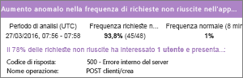
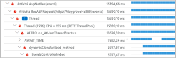
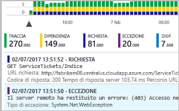
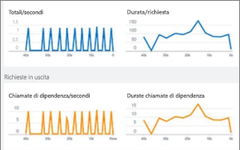
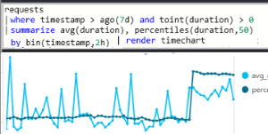
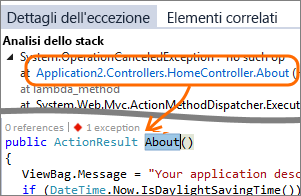
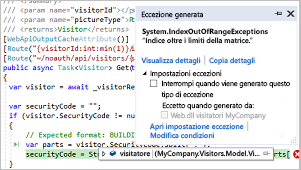
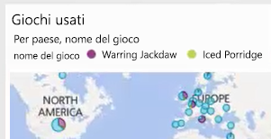
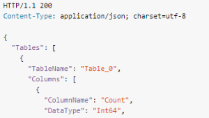

# Informazioni su Azure Application Insights
Application Insights è un servizio estendibile di gestione delle prestazioni delle applicazioni per sviluppatori Web su più piattaforme, che consente di monitorare un'applicazione Web live. Il servizio rileva automaticamente le anomalie nelle prestazioni e include avanzati strumenti di analisi che consentono di diagnosticare i problemi e conoscere come viene effettivamente usata l'app dagli utenti.  Il servizio è progettato per supportare il miglioramento continuo delle prestazioni e dell'usabilità. Funziona per le app su un'ampia gamma di piattaforme, tra cui .NET o J2EE, ospitate in locale o nel cloud. Si integra con il processo DevOps e offre punti di connessione per diversi altri strumenti di sviluppo.

[Osservare l'animazione dell'introduzione](https://www.youtube.com/watch?v=fX2NtGrh-Y0).

## Come funziona Application Insights?
Si installa un piccolo pacchetto di strumentazione nell'applicazione e si configura una risorsa di Application Insights nel portale di Microsoft Azure. La strumentazione monitora l'app e invia i dati di telemetria al portale. L'applicazione può essere eseguita ovunque, non deve necessariamente essere ospitata in Azure.

È possibile instrumentare non solo l'applicazione di servizio web, ma anche i componenti in background e il codice JavaScript nelle pagine web stesse. 

Inoltre, è possibile effettuare il pull dei dati di telemetria dagli ambienti host, ad esempio i contatori delle prestazioni, la diagnostica di Azure o i log di Docker. È possibile configurare test web che inviano periodicamente richieste sintetiche al servizio web.

Tutti i flussi di dati di telemetria sono integrati nel portale di Azure, dove è possibile applicare potenti strumenti di analisi e ricerca ai dati non elaborati.

### Informazioni sul sovraccarico
L'impatto sulle prestazioni dell'app è molto ridotto. Le chiamate di rilevamento non sono bloccanti e vengono riunite in batch e inviate in un thread separato.

## Quali sono gli elementi monitorati da Application Insights?

Application Insights è destinato al team di sviluppo, a cui consente di comprendere le prestazioni e le modalità d'uso dell'app. Esegue il monitoraggio di:

* **Frequenza delle richieste, tempi di risposta e percentuali di errore**: trovare le pagine più visitate, gli orari di visita e la posizione degli utenti.  Vedere quali pagine abbiano prestazioni migliori. Se i tempi di risposta e le percentuali di errore aumentano di pari passo con le richieste, è probabile che ci sia un problema di assegnazione delle risorse. 
* **Tassi di dipendenza, tempi di risposta e percentuali di errore**: trovare quali servizi esterni causino un rallentamento.
* **Eccezioni**: analizzare le statistiche aggregate o selezionare istanze specifiche e approfondire l'analisi dello stack e le richieste correlate. Vengono segnalate eccezioni di server e browser.
* **Visualizzazioni pagina e prestazioni di carico**, segnalate dai browser degli utenti.
* **Chiamate AJAX** dalle pagine Web: tassi, tempi di risposta e percentuali di errore.
* **Numeri di utenti e sessioni**.
* **Contatori delle prestazioni** dai computer server Windows o Linux, ad esempio l'uso di CPU, memoria e rete. 
* **Diagnostica dell'host** da Docker o Azure. 
* **Log di traccia di diagnostica** dall'app, in modo da poter correlare gli eventi di traccia con le richieste.
* **Eventi e metriche personalizzati** scritti dall'utente stesso nel codice del client o del server per tracciare eventi aziendali come gli articoli venduti o le partite vinte.

## Dove è possibile visualizzare i dati di telemetria?

È possibile esaminare i dati in numerosi modi. Vedere i seguenti articoli:

|  |  |
| --- | --- |
| [**Rilevamento intelligente e avvisi manuali**](app-insights-proactive-diagnostics.md) Gli avvisi automatici si adattano ai modelli normali di telemetria dell'app e si attivano quando i dati si discostano dal modello consueto. È anche possibile [impostare avvisi](app-insights-alerts.md) per determinati livelli di metriche standard o personalizzate. | |
| [**Mappa delle applicazioni**](app-insights-app-map.md) I componenti dell'applicazione, con le metriche e gli avvisi chiave. |  |
| [**Profiler**](app-insights-profiler.md) Ispezionare i profili di esecuzione delle richieste campionate. | |
| [**Analisi dell'utilizzo**](app-insights-usage-overview.md) Analizzare la segmentazione e la conservazione degli utenti.| |
| [**Ricerca diagnostica dei dati dell'istanza**](app-insights-diagnostic-search.md) Cercare e filtrare eventi come richieste, eccezioni, chiamate a dipendenze, tracce di log e visualizzazioni di pagina.  | |
| [**Esplora metriche per i dati aggregati**](app-insights-metrics-explorer.md) Esaminare, filtrare e segmentare dati aggregati come frequenza delle richieste, errori, eccezioni, tempi di risposta e tempi di caricamento delle pagine. | |
| [**Dashboard**](app-insights-dashboards.md#dashboards) Combinare dati di più risorse e condividerli con altri utenti. Ideale per le applicazioni multi-componente e per la visualizzazione continua negli spazi del team. | |
| [**Flusso di metriche in tempo reale**](app-insights-live-stream.md) Quando si distribuisce una nuova build, controllare questi indicatori delle prestazioni in tempo quasi reale per verificare che tutto funzioni come previsto. | |
| [**Analisi**](app-insights-analytics.md) Questo avanzato linguaggio di query consente di trovare risposta a domande approfondite sull'utilizzo e sulle prestazioni dell'app. | |
| [**Visual Studio**](app-insights-visual-studio.md) Vedere i dati sulle prestazioni nel codice. Passare al codice dall'analisi dello stack.| |
| [**Debugger di snapshot**](app-insights-snapshot-debugger.md) Eseguire il debug di snapshot campionati da operazioni attive, con i valori dei parametri.| |
| [**Power BI**](app-insights-export-power-bi.md) Integrare le metriche di uso con altra business intelligence.| |
| [**API REST**](https://dev.applicationinsights.io/) Scrivere codice per eseguire query su metriche e dati non elaborati.|  |
| [**Esportazione continua**](app-insights-export-telemetry.md) Eseguire l'esportazione bulk dei dati non elaborati nell'archivio non appena arrivano. | |

## Come si usa Application Insights?

### Monitoraggio
Installare Application Insights nell'app, impostare i [test Web di disponibilità](app-insights-monitor-web-app-availability.md) e:

* Impostare un [dashboard](app-insights-dashboards.md) per la chat team, in modo da controllare carico, velocità di risposta e prestazioni delle dipendenze, caricamenti di pagina e chiamate AJAX.
* Scoprire quali sono le richieste più lente e con un maggior numero di errori.
* Guardare [Live Stream](app-insights-live-stream.md) quando si distribuisce una nuova versione, in modo da rendersi immediatamente conto di eventuali riduzioni delle prestazioni.

### Rilevare, eseguire una diagnosi
Quando si riceve un avviso o si individua un problema:

* Individuare il numero di utenti interessati.
* Correlare gli errori con eccezioni, chiamate alle dipendenze e tracce.
* Esaminare profiler, snapshot, dump dello stack e log di traccia.

### Compilare, misurare, acquisire informazioni
[Misurare l'efficacia](app-insights-usage-overview.md) di ogni nuova funzionalità che si distribuisce.

* Pianificare la misurazione del modo in cui i clienti usano nuove funzionalità aziendali o per l'esperienza utente.
* Scrivere dati di telemetria personalizzati nel codice.
* Basare il ciclo di sviluppo successivo sulle salde prove derivate dai dati di telemetria.

## Introduzione
Application Insights è uno dei molti servizi ospitati in Microsoft Azure e riceve i dati di telemetria per l’analisi e la presentazione. Prima di eseguire qualsiasi altra operazione, è necessario ottenere una sottoscrizione a [Microsoft Azure](http://azure.com). L'iscrizione è gratuita e, se si sceglie il [piano tariffario](https://azure.microsoft.com/pricing/details/application-insights/) Basic di Application Insights, la sottoscrizione resta gratuita finché l'applicazione non cresce fino a un uso sostanziale. Se l'organizzazione ha già una sottoscrizione, può aggiungervi l'account Microsoft dell'utente.

È possibile iniziare in diversi modi. Iniziare con il metodo più adatto alle proprie esigenze. È possibile aggiungere gli altri in un secondo momento.

* **In fase di esecuzione, instrumentare l'app Web sul server.** È così possibile evitare qualsiasi aggiornamento del codice. È necessario l'accesso amministrativo al server.
  * [**IIS in locale o in una VM**](app-insights-monitor-performance-live-website-now.md)
  * [**VM o App Web di Azure**](app-insights-monitor-performance-live-website-now.md)
  * [**J2EE**](app-insights-java-live.md)
* **In fase di sviluppo, aggiungere Application Insights al codice.** È così possibile scrivere telemetria personalizzata e instrumentare app back-end e desktop.
  * [Visual Studio](app-insights-asp-net.md) 2013 Update 2 o versioni successive
  * Java in [Eclipse](app-insights-java-eclipse.md) o [altri strumenti](app-insights-java-get-started.md)
  * [Node.JS](app-insights-nodejs.md)
  * [Altre piattaforme](app-insights-platforms.md)
* **[Instrumentare le pagine Web](app-insights-javascript.md)** per visualizzazione pagina, AJAX e altri dati di telemetria sul lato client.
* **[Test di disponibilità](app-insights-monitor-web-app-availability.md)**: effettuare regolarmente il ping del sito Web dai server.

## Passaggi successivi
Introduzione in fase di esecuzione a:

* [Server IIS](app-insights-monitor-performance-live-website-now.md)
* [Server J2EE](app-insights-java-live.md)

Introduzione in fase di sviluppo a:

* [ASP.NET](app-insights-asp-net.md)
* [Java](app-insights-java-get-started.md)
* [Node.JS](app-insights-nodejs.md)

## Supporto, commenti e suggerimenti
* Domande e problemi:
  * [Risoluzione dei problemi][qna]
  * [Forum MSDN](https://social.msdn.microsoft.com/Forums/vstudio/home?forum=ApplicationInsights)
  * [StackOverflow](http://stackoverflow.com/questions/tagged/ms-application-insights)
* Suggerimenti:
  * [UserVoice](https://visualstudio.uservoice.com/forums/357324)
* Blog:
  * [Blog di Application Insights](https://azure.microsoft.com/blog/tag/application-insights)

## Video

> [!VIDEO https://channel9.msdn.com/events/Connect/2016/100/player] 

<!--Link references-->

[android]: https://github.com/Microsoft/ApplicationInsights-Android
[azure]: ../insights-perf-analytics.md
[client]: app-insights-javascript.md
[desktop]: app-insights-windows-desktop.md
[detect]: app-insights-detect-triage-diagnose.md
[greenbrown]: app-insights-asp-net.md
[ios]: https://github.com/Microsoft/ApplicationInsights-iOS
[java]: app-insights-java-get-started.md
[knowUsers]: app-insights-web-track-usage.md
[platforms]: app-insights-platforms.md
[portal]: http://portal.azure.com/
[qna]: app-insights-troubleshoot-faq.md
[redfield]: app-insights-monitor-performance-live-website-now.md

