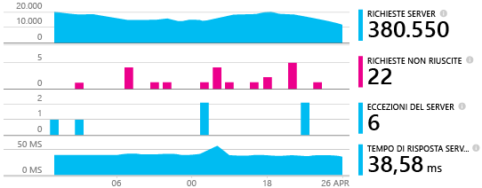
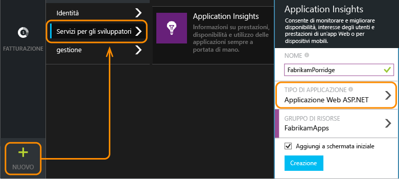
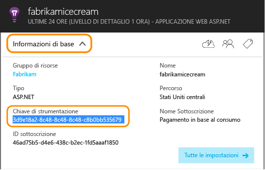
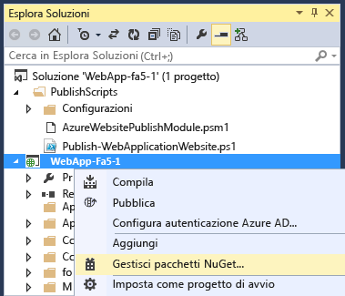
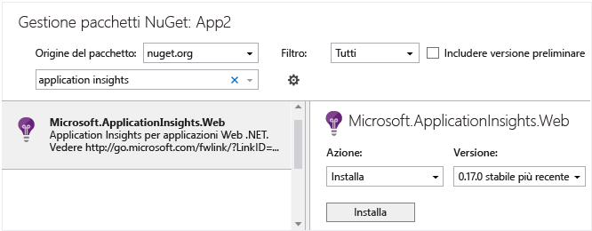
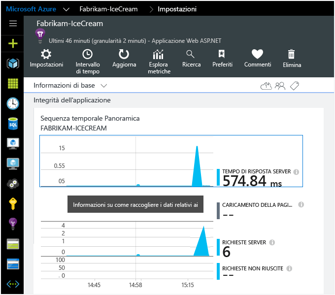
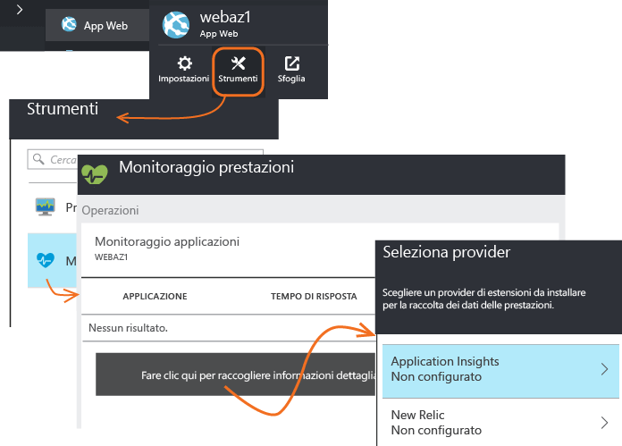
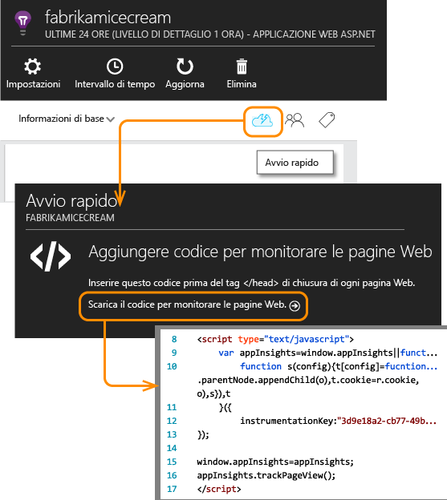

<properties
	pageTitle="Aggiungere Application Insights SDK per monitorare l'app ASP.NET | Microsoft Azure"
	description="Analizzare l'uso, la disponibilità e le prestazioni dell'applicazione locale o Web di Microsoft Azure con Application Insights."
	services="application-insights"
    documentationCenter=".net"
	authors="alancameronwills"
	manager="douge"/>

<tags
	ms.service="application-insights"
	ms.workload="tbd"
	ms.tgt_pltfrm="ibiza"
	ms.devlang="na"
	ms.topic="get-started-article"
	ms.date="09/23/2015"
	ms.author="awills"/>


# Aggiungere Application Insights SDK per monitorare l'app ASP.NET

*Application Insights è disponibile in anteprima.*

[AZURE.INCLUDE [app-insights-selector-get-started](../../includes/app-insights-selector-get-started.md)]


Visual Studio Application Insights consente di monitorare un'applicazione live per [rilevare e diagnosticare i problemi di prestazioni e le eccezioni][detect] e [individuare la modalità di uso dell'app][knowUsers]. È possibile usarlo con una vasta gamma di tipi di applicazioni. Può essere usato per app ospitate nei server IIS locali dell'utente o in macchine virtuali di Azure oppure per app Web di Azure,




*Vedere anche:*

* [ASP.NET 5](app-insights-asp-net-five.md)
* [Applicazioni per dispositivi e server Java][platforms]

#### Prima di iniziare

Per molti tipi di applicazioni [Visual Studio può aggiungere Application Insights all'app](#ide) quasi automaticamente. Tuttavia, poiché si sta leggendo questo articolo per una migliore comprensione, verranno illustrati i passaggi manuali.


È necessario:

* Una sottoscrizione a [Microsoft Azure](http://azure.com). Se il team o l'organizzazione ha una sottoscrizione di Azure, il proprietario potrà aggiungere l'utente alla sottoscrizione usando il rispettivo [account Microsoft](http://live.com).
* Visual Studio 2013 o versione successiva.

## <a name="add"></a> 1. Creare una risorsa di Application Insights

Accedere al [portale di Azure][portal] e creare una nuova risorsa di Application Insights. Scegliere ASP.NET come tipo di applicazione.



Una [risorsa][roles] in Azure è un'istanza di un servizio. In questa risorsa la telemetria dell'app verrà analizzata e visualizzata.

La scelta del tipo di applicazione imposta il contenuto predefinito dei pannelli delle risorse e le proprietà visibili in [Esplora metriche][metrics].

#### Eseguire una copia della chiave di strumentazione.

La chiave identifica la risorsa e verrà installata subito nell'SDK per indirizzare i dati alla risorsa.



La procedura appena effettuata per creare una nuova risorsa è un buon modo di iniziare a monitorare qualsiasi applicazione. È ora possibile inviare dati a esso.

## <a name="sdk"></a> 2. Installare l'SDK nell'applicazione

L'installazione e la configurazione di Application Insights SDK varia a seconda della piattaforma in cui si sta lavorando. Per le applicazioni ASP.NET, è facile.

1. In Visual Studio è possibile modificare i pacchetti NuGet del progetto di app desktop.

    

2. Installare Application Insights SDK per app Web.

    

3. Modificare ApplicationInsights.config (che è stato aggiunto dall'installazione di NuGet). Inserire questo comando immediatamente prima del tag di chiusura:

    `<InstrumentationKey>` *chiave di strumentazione copiata* `</InstrumentationKey>`

    In alternativa, è possibile [impostare la chiave scrivendo codice][apikey] nell'app.

#### Per eseguire l'aggiornamento a future versioni di SDK

Si rilascerà una nuova versione del SDK di tanto in tanto.

Per eseguire l'aggiornamento a una [nuova versione dell'SDK](app-insights-release-notes-dotnet.md), riaprire Gestione pacchetti NuGet e filtrare i pacchetti installati. Selezionare **Microsoft.ApplicationInsights.Web** e scegliere **Aggiorna**

Se sono state eseguite tutte le personalizzazioni apportate al file ApplicationInsights.config, salvarne una copia prima di eseguire l'aggiornamento e, successivamente, unire le modifiche nella nuova versione.


## <a name="run"></a> 3. Eseguire il progetto

Eseguire l'applicazione premendo **F5** e provarla aprendo pagine diverse per generare alcuni dati di telemetria.

In Visual Studio verrà visualizzato il conteggio degli eventi che sono stati inviati.


## <a name="monitor"></a> 4. Visualizzare i dati di telemetria

Tornare al [portale di Azure][portal] e passare alla risorsa Application Insights.


Cercare i dati nei grafici Panoramica. All'inizio si vedranno solo uno o due punti. ad esempio:



Fare clic su qualsiasi grafico per visualizzare metriche più dettagliate. [Altre informazioni sulle metriche.][perf]

#### Dati non visualizzati

* Aprire il riquadro [Ricerca][diagnostic] per visualizzare i singoli eventi.
* Usare l'applicazione, aprendo pagine diverse in modo da generare alcuni dati di telemetria.
* Attendere alcuni secondi e fare clic su **Aggiorna**. I grafici si aggiornano periodicamente, ma è possibile aggiornare manualmente se si è in attesa di alcuni dati da visualizzare.
* Vedere [Risoluzione dei problemi][qna].

## Pubblicare l'app

Ora distribuire l'applicazione a ISS o ad Azure e osservare l'accumulo dei dati.

Quando si esegue la modalità debug, la telemetria viene velocizzata nella pipeline, quindi i dati vengono visualizzati in pochi secondi. Quando si distribuisce l'app, i dati si accumulano più lentamente.

#### Nessun dato dopo la pubblicazione nel server?

Aprire le seguenti porte per il traffico in uscita nel firewall del server:

+ `dc.services.visualstudio.com:443`
+ `f5.services.visualstudio.com:443`


#### Problemi del server di compilazione

Vedere [questa sezione sulla risoluzione dei problemi](app-insights-troubleshoot-faq.md#NuGetBuild).


## Rilevare la versione dell’applicazione

Assicurarsi che `buildinfo.config` sia generato dal processo di compilazione. Nel file con estensione csproj, aggiungere:

```XML

    <PropertyGroup>
      <GenerateBuildInfoConfigFile>true</GenerateBuildInfoConfigFile>    <IncludeServerNameInBuildInfo>true</IncludeServerNameInBuildInfo>
    </PropertyGroup> 
```

Quando dispone delle informazioni di compilazione, il modulo Web Application Insights aggiunge automaticamente la **versione dell'applicazione** come una proprietà per ogni elemento dei dati di telemetria. Questo consente di filtrare in base alla versione quando si eseguono [ricerche diagnostiche][diagnostic] o quando si [esplorano le metriche][metrics].


## 5\. Aggiungere i contatori delle prestazioni e del rilevamento delle dipendenze

L'SDK necessita di alcune configurazioni per ottenere l'accesso a determinati dati. In particolare, questo passaggio aggiuntivo sarà necessario per misurare automaticamente le chiamate dall'app ai database, alle API REST e ad altri componenti esterni. Queste metriche relative alle dipendenze possono essere estremamente utili per semplificare la diagnosi dei problemi di prestazioni.

#### Se l'app è in esecuzione nel server IIS

Accedere al server con diritti di amministratore, quindi installare [Application Insights Status Monitor](http://go.microsoft.com/fwlink/?LinkId=506648).

Potrebbe essere necessario [aprire porte in uscita aggiuntive nel firewall](app-insights-monitor-performance-live-website-now.md#troubleshooting).

Questo passaggio consente inoltre il [report dei contatori delle prestazioni](app-insights-web-monitor-performance.md#system-performance-counters) come il CPU,la memoria, l’occupazione della rete.

#### Se l'app è un'app Web di Azure

Nel pannello di controllo dell'app Web di Azure aggiungere l'estensione di Application Insights.



(Quest’estensione è applicabile solo a un'app compilata con l'SDK e pubblicata su Azure. A differenza di Status Monitor, non è in grado di instrumentare un'app esistente.

#### è un progetto di Servizi cloud di Azure

[Aggiungere gli script ai ruoli web e di lavoro](app-insights-cloudservices.md)


## 6\. Aggiungere il monitoraggio sul lato client

È stato installato l'SDK che invia i dati di telemetria dal lato server (back-end) dell'applicazione. Ora è possibile aggiungere il monitoraggio sul lato client, che fornisce dati su utenti, sessioni, visualizzazioni di pagina ed eventuali eccezioni o arresti anomali verificatisi nel client.

Sarà anche possibile scrivere codice personalizzato per tenere traccia del modi in cui gli utenti interagiscono con l'app, a un livello di dettaglio che include i clic e le sequenze di tasto.

#### Se i client sono Web browser

Se l'app visualizza pagine Web, aggiungere un frammento di codice JavaScript in ogni pagina. Ottenere il codice dalla risorsa di Application Insights:



Si noti che il codice contiene la chiave di strumentazione che identifica la risorsa dell'applicazione.

[Altre informazioni sul rilevamento delle pagine Web.](app-insights-web-track-usage.md)

#### Se i client sono app per dispositivi

Se l'applicazione soddisfa le richieste di client quali telefono o altri dispositivi, aggiungere l'[SDK appropriato](app-insights-platforms.md) all'app per dispositivi.

Se si configura l'SDK client con la stessa chiave di strumentazione dell'SDK del server, i due flussi verranno integrati e sarà possibile visualizzarli insieme.


## 7\. Completare l'installazione

Per ottenere una visione completa a 360 gradi dell'applicazione, è necessario eseguire ancora alcune operazioni:

* [Configurare i test Web][availability] in modo da assicurarsi che l'applicazione sia disponibile e reattiva.
* [Acquisire le tracce dei log][netlogs] dal framework di registrazione preferito
* [Tenere traccia di eventi personalizzati e metriche][api] nei client, nel server o in entrambi per altre informazioni sulle modalità di uso dell'applicazione.

## <a name="ide"></a> Il metodo automatico

All'inizio di questo articolo è stato affermato che sarebbe stato illustrato il metodo manuale per creare una risorsa di Application Insights e quindi installare l'SDK. È importante comprendere le due parti di tale procedura. Ma per le applicazioni ASP.NET (e molti altri) esiste un modo automatico anche più rapido.

Saranno necessari [Visual Studio](http://go.microsoft.com/fwlink/?linkid=397827&clcid=0x409) (2013 aggiornamento 3 o versione successiva) e un account in [Microsoft Azure](http://azure.com).

#### Se è un nuovo progetto...

Quando si crea un nuovo progetto in Visual Studio, assicurarsi che l'opzione **Aggiungi Application Insights** sia selezionata.


Visual Studio crea una risorsa in Application Insights, aggiunge l'SDK al progetto e posiziona la chiave nel file `.config`.

Se il progetto contiene pagine Web, aggiunge anche [SDK JavaScript][client] alla pagina master Web.

#### o se è un progetto esistente

Fare clic con il pulsante destro del mouse in Esplora soluzioni e scegliere **Aggiungi Application Insights**.


Visual Studio crea una risorsa in Application Insights, aggiunge l'SDK al progetto e posiziona la chiave nel file `.config`.

In questo caso, non aggiunge l'[SDK JavaScript][client] alle pagine Web; si consiglia di farlo come passaggio successivo.

#### Opzioni di configurazione

Se si tratta del primo utilizzo, verrà richiesto di accedere o di iscriversi all'anteprima di Microsoft Azure. Questo account è diverso dall'account Visual Studio Online.

Se l'app fa parte di un'applicazione di maggiori dimensioni, potrebbe essere utile usare le impostazioni di configurazione per inserirla nello stesso gruppo di risorse degli altri componenti.

*Se non è disponibile alcuna opzione di Application Insights, Verificare che si stia usando Visual Studio 2013 aggiornamento 3 o versioni successive e che gli Strumenti Application Insights siano abilitati in Estensioni e aggiornamenti.*

#### Aprire Application Insights dal progetto.


## <a name="video"></a>Video

> [AZURE.VIDEO getting-started-with-application-insights]


<!--Link references-->

[api]: app-insights-api-custom-events-metrics.md
[apikey]: app-insights-api-custom-events-metrics.md#ikey
[availability]: app-insights-monitor-web-app-availability.md
[azure]: ../insights-perf-analytics.md
[client]: app-insights-javascript.md
[detect]: app-insights-detect-triage-diagnose.md
[diagnostic]: app-insights-diagnostic-search.md
[knowUsers]: app-insights-overview-usage.md
[metrics]: app-insights-metrics-explorer.md
[netlogs]: app-insights-asp-net-trace-logs.md
[perf]: app-insights-web-monitor-performance.md
[platforms]: app-insights-platforms.md
[portal]: http://portal.azure.com/
[qna]: app-insights-troubleshoot-faq.md
[redfield]: app-insights-monitor-performance-live-website-now.md
[roles]: app-insights-resources-roles-access-control.md
[start]: app-insights-get-started.md

<!---HONumber=Sept15_HO4-->