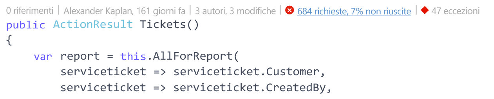
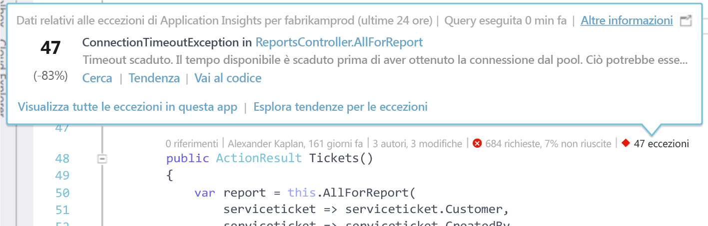
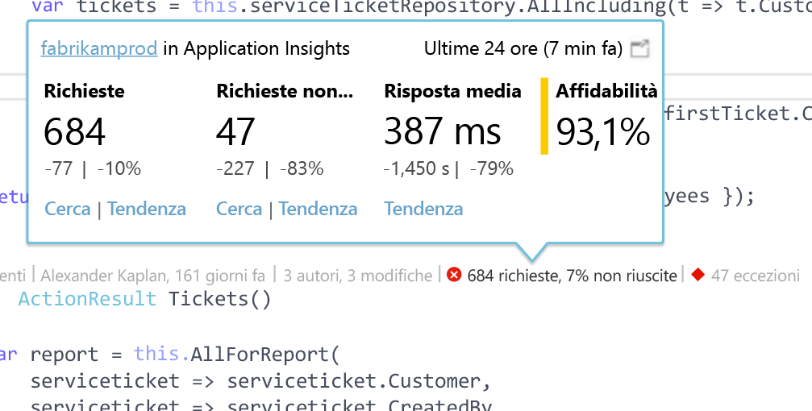

# Application Insights Telemetry in CodeLens di Visual Studio
I metodi nel codice dell'app Web possono essere annotati con dati di telemetria relativi alle eccezioni di run-time e ai tempi di risposta della richiesta. Se si installa [Azure Application Insights](app-insights-overview.md) nell'applicazione, i dati di telemetria vengono visualizzati in [CodeLens](https://msdn.microsoft.com/library/dn269218.aspx) di Visual Studio, ovvero nelle note nella parte superiore di ogni funzione in cui vengono visualizzate informazioni utili, ad esempio il numero di posizioni in cui si fa riferimento alla funzione o l'utente che l'ha modificata per ultimo.

> [!NOTE]
> Application Insights in CodeLens è disponibile in Visual Studio 2015 Update 3 e versioni successive o con la versione più recente dell' [estensione Developer Analytics Tools](https://visualstudiogallery.msdn.microsoft.com/82367b81-3f97-4de1-bbf1-eaf52ddc635a). CodeLens è disponibile nelle edizioni Enterprise e Professional di Visual Studio.
> 
> 

## Dove trovare i dati di Application Insights
Cercare i dati di Application Insights Telemetry negli indicatori di CodeLens dei metodi di richiesta pubblici dell'applicazione Web. Gli indicatori di CodeLens vengono visualizzati sopra il metodo e le altre dichiarazioni in codice C# e Visual Basic. Se i dati di Application Insights sono disponibili per un metodo, verranno visualizzati indicatori per richieste ed eccezioni, ad esempio "100 richieste, 1% non riuscite" oppure "10 eccezioni". Fare clic su un indicatore di CodeLens per altri dettagli. 

> [!TIP]
> Il caricamento degli indicatori di richieste ed eccezioni di Application Insights può richiedere alcuni secondi aggiuntivi dopo la visualizzazione di altri indicatori di CodeLens.
> 
> 

## Eccezioni in CodeLens

L'indicatore delle eccezioni di CodeLens visualizza il numero di eccezioni che si sono verificate nelle ultime 24 ore dalle 15 eccezioni più frequenti dell'applicazione in tale periodo, durante l'elaborazione della richiesta servita dal metodo.

Per visualizzare altri dettagli, fare clic sull'indicatore delle eccezioni di CodeLens:

* Variazione percentuale nel numero di eccezioni delle ultime 24 ore rispetto alle 24 ore precedenti
* Scegliere **Vai al codice** per passare al codice sorgente della funzione che genera l'eccezione
* Scegliere **Cerca** per eseguire una query su tutte le istanze di questa eccezione che si sono verificate nelle ultime 24 ore
* Scegliere **Tendenza** per visualizzare la tendenza delle occorrenze di questa eccezione nelle ultime 24 ore
* Scegliere **Visualizza tutte le eccezioni in questa app** per eseguire una query su tutte le eccezioni che si sono verificate nelle ultime 24 ore
* Scegliere **Esplora tendenze per le eccezioni** per visualizzare la tendenza di tutte le eccezioni che si sono verificate nelle ultime 24 ore. 

> [!TIP]
> Se CodeLens visualizza "0 eccezioni", ma si è certi che siano presenti eccezioni, verificare che sia selezionata la risorsa di Application Insights corretta in CodeLens. Per selezionare un'altra risorsa, fare clic con il pulsante destro del mouse sul progetto in Esplora soluzioni e scegliere **Application Insights > Scegli origine dati di telemetria**. CodeLens viene visualizzato solo per le 15 eccezioni che si sono verificate più frequentemente nell'applicazione nelle ultime 24 ore, quindi se ad esempio un'eccezione è la sedicesima in ordine di frequenza verrà visualizzato "0 eccezioni". Le eccezioni delle visualizzazioni ASP.NET potrebbero non essere indicate per i metodi del controller che hanno generato le visualizzazioni.
> 
> [!TIP]
> Se viene visualizzato "? eccezioni" in CodeLens, è necessario associare l'account Azure a Visual Studio oppure le credenziali dell'account Azure potrebbero essere scadute. In entrambi i casi, fare clic su "? eccezioni" e scegliere **Aggiungi un account** per immettere le credenziali.
> 
> 

## Richieste in CodeLens

L'indicatore delle richieste di CodeLens visualizza il numero di richieste HTTP servite da un metodo nelle ultime 24 ore, nonché la percentuale di tali richieste che non ha avuto esito positivo.

Per visualizzare altri dettagli, fare clic sull'indicatore delle richieste di CodeLens:

* La variazione assoluta e percentuale nel numero di richieste, richieste non riuscite e tempi di risposta medi nelle ultime 24 ore rispetto alle 24 ore precedenti
* L'affidabilità del metodo, calcolata come percentuale di richieste che hanno avuto esito positivo nelle ultime 24 ore
* Scegliere **Cerca** per le richieste o le richieste non riuscite per eseguire una query su tutte le richieste o richieste non riuscite delle ultime 24 ore
* Scegliere **Tendenza** per visualizzare la tendenza per richieste, richieste non riuscite o tempi di risposta medi nelle ultime 24 ore.
* Scegliere il nome della risorsa di Application Insights nell'angolo superiore sinistro della visualizzazione dei dettagli CodeLens per modificare la risorsa che rappresenta l'origine dei dati di CodeLens.

## Passaggi successivi
|  |  |
| --- | --- |
| **[Uso di Application Insights in Visual Studio](app-insights-visual-studio.md)** Ricerca sui dati di telemetria, visualizzazione dei dati in CodeLens e configurazione di Application Insights. Tutto in Visual Studio. | |
| **[Aggiungere altri dati](app-insights-asp-net-more.md)** Monitorare l'utilizzo, la disponibilità, le dipendenze e le eccezioni, integrare le tracce dei framework di registrazione e scrivere telemetria personalizzata. | |
| **[Uso del portale Application Insights](app-insights-dashboards.md)** Dashboard, strumenti avanzati di diagnostica e di analisi, avvisi, mappa attiva delle dipendenze dell'applicazione ed esportazione dei dati di telemetria. | |

