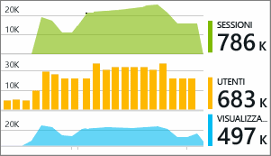

# Uso di Azure Application Insights in Visual Studio
In Visual Studio 2015 e versioni successive è possibile analizzare le prestazioni e diagnosticare i problemi nell'app Web ASP.NET sia durante il debug che nell'ambiente di produzione, usando i dati di telemetria di [Azure Application Insights](app-insights-overview.md).

Se l'app web ASP.NET è stata creata con Visual Studio 2017 o versioni successive, include già Application Insights SDK. In caso contrario, se non è ancora stato fatto, [aggiungere Application Insights all'app](app-insights-asp-net.md).

Per monitorare l'app quando è in produzione, in genere si visualizzano i dati di telemetria di Application Insights nel [portale di Azure](https://portal.azure.com), che permette di impostare gli avvisi e applicare strumenti di monitoraggio efficaci. Per il debug, invece, è anche possibile cercare e analizzare i dati di telemetria in Visual Studio. È possibile usare Visual Studio per analizzare i dati di telemetria sia dal sito di produzione che dalle esecuzioni di debug nel computer di sviluppo. Nel secondo caso, è possibile analizzare le esecuzioni di debug anche se non è ancora stato configurato l'SDK per l'invio dei dati di telemetria al portale di Azure. 

##  Eseguire il debug del progetto
Per eseguire l'app Web in modalità di debug locale, premere F5. Aprire pagine diverse per generare alcuni dati di telemetria.

In Visual Studio viene visualizzato un conteggio degli eventi registrati dal modulo di Application Insights nel progetto.

Fare clic su questo pulsante per cercare nei dati di telemetria. 

## Ricerca in Application Insights
La finestra di ricerca di Application Insights mostra gli eventi che sono stati registrati. Se è stato eseguito l'accesso ad Azure durante la configurazione di Application Insights, sarà possibile cercare gli stessi eventi nel portale di Azure.

> [!NOTE] 
> Dopo aver selezionato o deselezionato i filtri, fare clic sul pulsante di ricerca alla fine del campo di ricerca di testo.
>

La ricerca di testo libero funziona in tutti i campi degli eventi. Ad esempio, è possibile cercare parte dell'URL di una pagina, il valore di una proprietà, come la città del client, o parole specifiche in un log di traccia.

Fare clic su qualsiasi evento per visualizzarne le proprietà dettagliate.

Per le richieste all'app Web, è possibile fare clic per visualizzare il codice.

È anche possibile aprire gli elementi correlati per diagnosticare le richieste non riuscite o le eccezioni.

## Eccezioni e richieste non riuscite
I report delle eccezioni vengono visualizzati nella finestra di ricerca. In alcuni tipi di applicazioni ASP.NET meno recenti è necessario [configurare il monitoraggio delle eccezioni](app-insights-asp-net-exceptions.md) per visualizzare le eccezioni gestite dal framework.

Fare clic su un'eccezione per ottenere un'analisi dello stack. Se il codice dell'app è aperto in Visual Studio, è possibile fare clic nell'analisi dello stack per visualizzare la relativa riga del codice.

## Riepiloghi di eccezioni e richieste nel codice
Nella riga CodeLens sopra ogni metodo del gestore viene visualizzato un conteggio delle richieste e delle eccezioni registrate da Application Insights nelle ultime 24 ore.

> [!NOTE] 
> CodeLens mostra i dati di Application Insights unicamente se l'[app è configurata per l'invio dei dati di telemetria al portale di Application Insights](app-insights-asp-net.md).
>

[Altre informazioni su Application Insights in CodeLens](app-insights-visual-studio-codelens.md)

## Tendenze
Tendenze è uno strumento che permette di visualizzare il comportamento dell'app nel tempo. 

Scegliere **Esplora tendenze di telemetria** usando il pulsante della barra degli strumenti di Application Insights o la finestra di ricerca di Application Insights. Scegliere una delle cinque query più comuni per iniziare. È possibile analizzare set di dati diversi in base ai tipi di dati di telemetria, agli intervalli di tempo e ad altre proprietà. 

Per trovare le anomalie nei dati, scegliere una delle opzioni relative alle anomalie nell'elenco a discesa del tipo di visualizzazione. Le opzioni di filtro nella parte inferiore della finestra permettono di trovare facilmente subset specifici dei dati di telemetria.

[Altre informazioni su Tendenze](app-insights-visual-studio-trends.md).

## Monitoraggio locale
(Da Visual Studio 2015 Update 2) Se l'SDK non è stato configurato per l'invio della telemetria al portale di Application Insights (e quindi non è presente nessuna chiave di strumentazione in ApplicationInsights.config), la finestra di diagnostica visualizzerà la telemetria dalla sessione di debug più recente. 

Questo è consigliabile se è già stata pubblicata una versione precedente dell'app. Si vuole però evitare di combinare la telemetria delle sessioni di debug con la telemetria nel portale di Application Insights dell'app pubblicata.

È utile anche se si vuole eseguire il debug di alcuni [dati di telemetria personalizzati](app-insights-api-custom-events-metrics.md) prima di inviarli al portale.

* *Inizialmente, Application Insights è stato interamente configurato per inviare i dati di telemetria al portale. Ora però si vuole fare in modo che i dati di telemetria vengano visualizzati solo in Visual Studio.*
  
  * Nelle impostazioni della finestra di ricerca è disponibile un'opzione per cercare la diagnostica locale anche se l'app invia la telemetria al portale.
  * Per arrestare l'invio dei dati di telemetria al portale, impostare come commento la riga `<instrumentationkey>...` di ApplicationInsights.config. Quando si è pronti a inviare nuovamente i dati di telemetria al portale, rimuovere il commento.

## Passaggi successivi
|  |  |
| --- | --- |
| **[Aggiungere altri dati](app-insights-asp-net-more.md)** Monitorare l'utilizzo, la disponibilità, le dipendenze e le eccezioni, integrare le tracce dei framework di registrazione e scrivere telemetria personalizzata. | |
| **[Uso del portale Application Insights](app-insights-dashboards.md)** Dashboard, strumenti avanzati di diagnostica e di analisi, avvisi, mappa attiva delle dipendenze dell'applicazione ed esportazione dei dati di telemetria. | |

