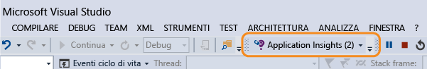

<properties 
	pageTitle="Uso di Application Insights in Visual Studio" 
	description="Diagnostica e analisi delle prestazioni durante il debug e nell'ambiente di produzione." 
	services="application-insights" 
    documentationCenter=".net"
	authors="alancameronwills" 
	manager="douge"/>

<tags 
	ms.service="application-insights" 
	ms.workload="tbd" 
	ms.tgt_pltfrm="ibiza" 
	ms.devlang="na" 
	ms.topic="get-started-article" 
	ms.date="05/25/2016" 
	ms.author="awills"/>

# Uso di Application Insights in Visual Studio

In Visual Studio (2015 e versioni successive) è possibile analizzare le prestazioni e diagnosticare i problemi sia durante il debug che nell'ambiente di produzione con i dati di telemetria di [Visual Studio Application Insights](app-insights-overview.md).

Se non si è ancora installato [Application Insights nell'app](app-insights-asp-net.md), è possibile farlo ora.

##  Eseguire il debug del progetto

Eseguire l'applicazione con F5 e provarla aprendo pagine diverse per generare alcuni dati di telemetria.

In Visual Studio verrà visualizzato il conteggio degli eventi che sono stati registrati.

Fare clic su questo pulsante per aprire la ricerca diagnostica.

## Ricerca diagnostica

La finestra di ricerca mostra gli eventi che sono stati registrati. Se è stato eseguito l'accesso ad Azure durante la configurazione di Application Insights, sarà possibile cercare gli stessi eventi nel portale.

La ricerca di testo libero funziona in tutti i campi degli eventi. Ad esempio, è possibile cercare parte dell'URL di una pagina, il valore di una proprietà, come la città del client, o parole specifiche in un log di traccia.

Fare clic su qualsiasi evento per visualizzarne le proprietà dettagliate.

È anche possibile aprire la scheda Elementi correlati per poter diagnosticare le richieste non riuscite o le eccezioni.

## Hub diagnostica

In Visual Studio 2015 o versione successiva Hub diagnostica mostra i dati di telemetria del server Application Insights man mano che vengono generati. Questo avviene anche se si è scelto di installare solo l'SDK, senza connetterlo a una risorsa nel portale di Azure.

## Eccezioni

Se è stato [configurato il monitoraggio delle eccezioni](app-insights-asp-net-exceptions.md), i report di eccezione verranno visualizzati nella finestra di ricerca.

Fare clic su un'eccezione per ottenere un'analisi dello stack. Se il codice dell'app è aperto in Visual Studio, è possibile fare clic nell'analisi dello stack per visualizzare la relativa riga del codice.

Nella riga CodeLens sopra ogni metodo viene inoltre visualizzato un conteggio delle eccezioni registrate da Application Insights nelle ultime 24 ore.

## Monitoraggio locale

(Da Visual Studio 2015 Update 2) Se l'SDK non è stato configurato per l'invio della telemetria al portale di Application Insights (e quindi non è presente nessuna chiave di strumentazione in ApplicationInsights.config), la finestra di diagnostica visualizzerà la telemetria dalla sessione di debug più recente.

Questo è consigliabile se è già stata pubblicata una versione precedente dell'app. Si vuole però evitare di combinare la telemetria delle sessioni di debug con la telemetria nel portale di Application Insights dell'app pubblicata.

È utile anche se si vuole eseguire il debug di alcuni [dati di telemetria personalizzati](app-insights-api-custom-events-metrics.md) prima di inviarli al portale.

* *Application Insights è stato inizialmente configurato per l'invio dei dati di telemetria al portale. Ora però si vuole fare in modo che i dati di telemetria vengano visualizzati solo in Visual Studio.*

 * Nelle impostazioni della finestra di ricerca è disponibile un'opzione per cercare la diagnostica locale anche se l'app invia la telemetria al portale.
 * Per arrestare l'invio dei dati di telemetria al portale, impostare come commento la riga `<instrumentationkey>...` di ApplicationInsights.config. Quando si è pronti a inviare nuovamente i dati di telemetria al portale, rimuovere il commento.

## Per eseguire l'aggiornamento a future versioni di SDK

Per eseguire l'aggiornamento a una [nuova versione dell'SDK](app-insights-release-notes-dotnet.md), riaprire Gestione pacchetti NuGet e filtrare i pacchetti installati. Selezionare Microsoft.ApplicationInsights.Web e scegliere Aggiorna

Se sono state eseguite tutte le personalizzazioni apportate al file ApplicationInsights.config, salvarne una copia prima di eseguire l'aggiornamento e, successivamente, unire le modifiche nella nuova versione.

## Passaggi successivi

||
|---|---
|**[More telemetry from Application Insights](app-insights-asp-net-more.md)**  (Altri dati di telemetria da Application Insights) Monitorare l'uso, la disponibilità, le dipendenze e le eccezioni, integrare le tracce dei framework di registrazione e scrivere telemetria personalizzata. | 
|**[Spostamento e dashboard nel portale Application Insights](app-insights-dashboards.md)** Dashboard, strumenti avanzati di diagnostica e di analisi, avvisi, mappa attiva delle dipendenze dell'applicazione ed esportazione dei dati di telemetria. |

 

<!---HONumber=AcomDC_0615_2016-->