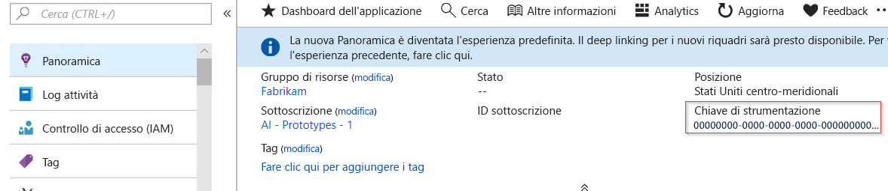
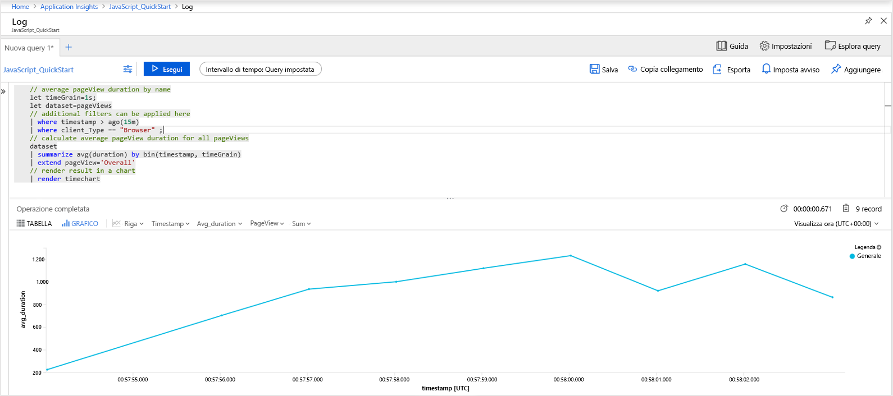
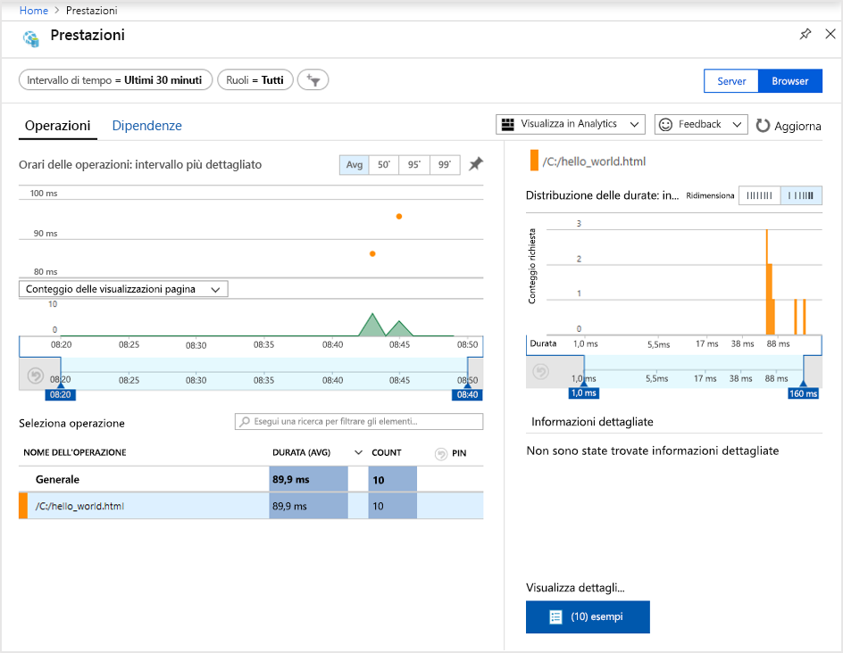
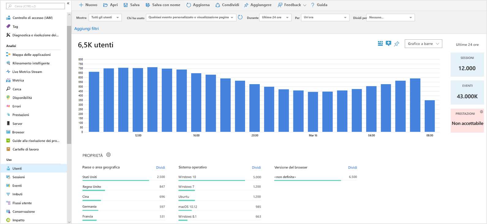

# <a name="start-monitoring-your-website"></a>Avviare il monitoraggio del sito Web

Con Application Insights di Monitoraggio di Azure è possibile monitorare facilmente la disponibilità, le prestazioni e l'utilizzo di un sito Web. È anche possibile identificare e diagnosticare rapidamente gli errori nell'applicazione senza attendere che vengano segnalati da un utente. Application Insights offre sia funzionalità di monitoraggio sul lato server, che funzionalità di monitoraggio sul lato client/browser.

Questa guida introduttiva include istruzioni per l'aggiunta di [Application Insight JavaScript SDK open source](https://github.com/Microsoft/ApplicationInsights-JS), che consente di comprendere l'esperienza sul lato client/browser per i visitatori del sito Web.

## <a name="prerequisites"></a>Prerequisiti

Per completare questa guida introduttiva:

- È necessaria una sottoscrizione di Azure.

Se non si ha una sottoscrizione di Azure, creare un account [gratuito](https://azure.microsoft.com/free/) prima di iniziare.

## <a name="sign-in-to-the-azure-portal"></a>Accedere al portale di Azure

Accedere al [portale di Azure](https://portal.azure.com/).

## <a name="enable-application-insights"></a>Abilitare Application Insights

Application Insights può raccogliere dati di telemetria da qualsiasi applicazione connessa a Internet, in esecuzione in locale o nel cloud. Usare la procedura seguente per iniziare a visualizzare questi dati.

1. Selezionare **Crea una risorsa** > **Strumenti di gestione** > **Application Insights**.

   Verrà visualizzata una casella di configurazione. Usare la tabella seguente per completare i campi di input.

    | Impostazioni        | Valore           | DESCRIZIONE  |
   | ------------- |:-------------|:-----|
   | **Nome**      | Valore globalmente univoco | Nome che identifica l'app da monitorare |
   | **Tipo di applicazione** | Applicazione generale | Tipo di app da monitorare |
   | **Gruppo di risorse**     | myResourceGroup      | Nome del nuovo gruppo di risorse per l'hosting dei dati di Application Insights |
   | **Posizione** | Stati Uniti orientali | Scegliere una località nelle vicinanze o vicina a quella in cui è ospitata l'app |

2. Fare clic su **Create**(Crea).

## <a name="create-an-html-file"></a>Creare un file HTML

1. Nel computer locale creare un file denominato ``hello_world.html``. In questo esempio il file verrà inserito nella radice dell'unità C: in ``C:\hello_world.html``.
2. Copiare lo script seguente in ``hello_world.html``:

    ```html
    <!DOCTYPE html>
    <html>
    <head>
    <title>Azure Monitor Application Insights</title>
    </head>
    <body>
    <h1>Azure Monitor Application Insights Hello World!</h1>
    <p>You can use the Application Insights JavaScript SDK to perform client/browser-side monitoring of your website. To learn about more advanced JavaScript SDK configurations visit the <a href="https://github.com/Microsoft/ApplicationInsights-JS/blob/master/API-reference.md" title="API Reference">API reference</a>.</p>
    </body>
    </html>
    ```

## <a name="configure-app-insights-sdk"></a>Configurare Application Insights SDK

1. Selezionare **Panoramica** > **Informazioni di base** > copiare la **chiave di strumentazione** dell'applicazione.

   

2. Aggiungere lo script seguente al file ``hello_world.html`` prima del tag ``</head>`` di chiusura:

   ```javascript
      <script type="text/javascript">
        var appInsights=window.appInsights||function(a){
            function b(a){c[a]=function(){var b=arguments;c.queue.push(function(){c[a].apply(c,b)})}}var c={config:a},d=document,e=window;setTimeout(function(){var b=d.createElement("script");b.src=a.url||"https://az416426.vo.msecnd.net/scripts/a/ai.0.js",d.getElementsByTagName("script")[0].parentNode.appendChild(b)});try{c.cookie=d.cookie}catch(a){}c.queue=[];for(var f=["Event","Exception","Metric","PageView","Trace","Dependency"];f.length;)b("track"+f.pop());if(b("setAuthenticatedUserContext"),b("clearAuthenticatedUserContext"),b("startTrackEvent"),b("stopTrackEvent"),b("startTrackPage"),b("stopTrackPage"),b("flush"),!a.disableExceptionTracking){f="onerror",b("_"+f);var g=e[f];e[f]=function(a,b,d,e,h){var i=g&&g(a,b,d,e,h);return!0!==i&&c["_"+f](a,b,d,e,h),i}}return c
        }({
            instrumentationKey: "xxxxxxxx-xxxx-xxxx-xxxx-xxxxxxxx"
        });
        
        window.appInsights=appInsights,appInsights.queue&&0===appInsights.queue.length&&appInsights.trackPageView();
</script>
   ```

3. Modificare il file ``hello_world.html`` e aggiungere la chiave di strumentazione.

4. Aprire ``hello_world.html`` in una sessione del browser locale. Verrà creata una visualizzazione pagina singola. È possibile aggiornare il browser per generare più visualizzazioni pagina di test.

## <a name="start-monitoring-in-the-azure-portal"></a>Avviare il monitoraggio nel portale di Azure

1. È ora possibile riaprire la pagina **Panoramica** di Application Insights nel portale di Azure, dove è stata recuperata la chiave di strumentazione, per visualizzare informazioni dettagliate sull'applicazione attualmente in esecuzione. I quattro grafici predefiniti nella pagina di panoramica hanno come ambiti i dati dell'applicazione lato server. Dato che si stanno instrumentando le interazioni sul lato client/browser con JavaScript SDK, questa particolare visualizzazione non è applicabile a meno che non sia installato anche un SDK lato server.

2. Fare clic su  **Analisi**.  Verrà aperta la finestra **Analisi**, che fornisce un linguaggio di query avanzato per l'analisi di tutti i dati raccolti da Application Insights. Per visualizzare i dati relativi alle richieste del browser sul lato client, eseguire la query seguente:

    ```kusto
    // average pageView duration by name
    let timeGrain=1s;
    let dataset=pageViews
    // additional filters can be applied here
    | where timestamp > ago(15m)
    | where client_Type == "Browser" ;
    // calculate average pageView duration for all pageViews
    dataset
    | summarize avg(duration) by bin(timestamp, timeGrain)
    | extend pageView='Overall'
    // render result in a chart
    | render timechart
    ```

   

3. Tornare alla pagina **Panoramica**. Fare clic su **Browser** nell'intestazione **Analisi** e quindi selezionare **Prestazioni**. In questa sezione sono disponibili le metriche correlate alle prestazioni del sito Web. È anche disponibile una visualizzazione corrispondente per l'analisi degli errori e delle eccezioni nel sito Web. È possibile fare clic su **Esempi** per esaminare i dettagli di singole transazioni. Da qui è possibile accedere all'esperienza [Dettagli sulle transazioni end-to-end](app-insights-transaction-diagnostics.md).

   

4. Per iniziare l'esplorazione degli [strumenti di analisi dei comportamenti utente](app-insights-usage-overview.md), dal menu principale di Application Insights scegliere [**Utenti**](app-insights-usage-segmentation.md) sotto l'intestazione **Utilizzo**. Dato che i test vengono eseguiti da un unico computer, si vedranno i dati per un solo utente. Per un sito Web reale, la distribuzione degli utenti potrebbe essere simile alla seguente:

     

5. Per l'instrumentazione di un sito Web più complesso con più pagine, un altro strumento utile sarebbe [**Flussi utente**](app-insights-usage-flows.md). Con **Flussi utente** è possibile tenere traccia del percorso scelto dai visitatori attraverso le varie parti del sito Web.

  

Per altre informazioni sulle configurazioni più avanzate per il monitoraggio di siti Web, vedere le [informazioni di riferimento sull'API di JavaScript SDK](https://github.com/Microsoft/ApplicationInsights-JS/blob/master/API-reference.md).

## <a name="clean-up-resources"></a>Pulire le risorse

Se si prevede di continuare a usare le guide di avvio rapido successive o le esercitazioni, non pulire le risorse create in questa guida di avvio rapido. In caso contrario, se non si prevede di continuare, seguire questa procedura per eliminare tutte le risorse create da questa guida introduttiva nel portale di Azure.

1. Scegliere **Gruppi di risorse** dal menu a sinistra del portale di Azure e quindi fare clic su **myResourceGroup**.
2. Nella pagina del gruppo di risorse fare clic su **Elimina**, digitare **myResourceGroup** nella casella di testo e quindi fare clic su **Elimina**.

## <a name="next-steps"></a>Passaggi successivi

> [!div class="nextstepaction"]
> [Rilevare e diagnosticare i problemi di prestazioni](https://docs.microsoft.com/azure/application-insights/app-insights-analytics)
