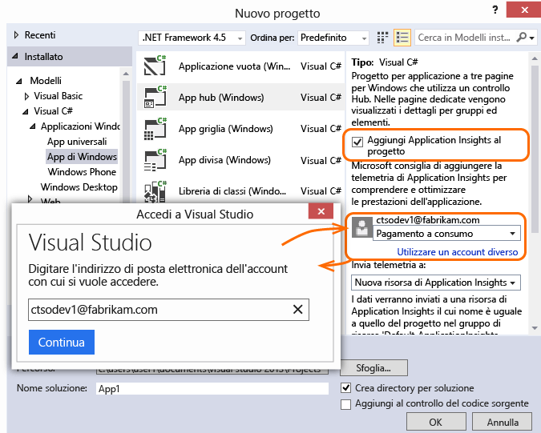
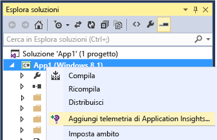

<properties
	pageTitle="Application Insights per app di Windows Phone e Windows Store | Microsoft Azure"
	description="Analizzare l'utilizzo e le prestazioni dell'app per dispositivi Windows."
	services="application-insights"
    documentationCenter="windows"
	authors="alancameronwills"
	manager="douge"/>

<tags
	ms.service="application-insights"
	ms.workload="tbd"
	ms.tgt_pltfrm="ibiza"
	ms.devlang="na"
	ms.topic="get-started-article"
	ms.date="11/11/2015"
	ms.author="awills"/>

# Analisi per app di Windows Phone e Windows Store


Visual Studio Application Insights consente di monitorare l'utilizzo e le prestazioni di un'applicazione pubblicata.


> [AZURE.NOTE]È consigliabile [HockeyApp](http://support.hockeyapp.net/kb/client-integration-windows-and-windows-phone/hockeyapp-for-windows-store-apps-and-windows-phone-store-apps) per ottenere segnalazioni di arresto anomalo, analisi, distribuzione e gestione di commenti e suggerimenti.


## Configurazione di Application Insights per il progetto per dispositivi Windows

Sono necessari gli elementi seguenti:

* Una sottoscrizione a [Microsoft Azure][azure].
* Visual Studio 2013 o versione successiva.

**App UAP C++**: vedere il [manuale di installazione di Application Insights C++](https://github.com/Microsoft/ApplicationInsights-CPP)

### <a name="new"></a>Se si crea un nuovo progetto di app di Windows

Nella finestra di dialogo **Nuovo progetto** selezionare **Application Insights**.

Se viene chiesto di effettuare l'accesso, usare le credenziali dell'account Azure.




### <a name="existing"></a>O se si tratta di un progetto esistente

Aggiungere Application Insights da Esplora soluzioni.


**App universali di Windows**: ripetere per i progetti Phone e Store. [Esempio di app universale di Windows 8.1](https://github.com/Microsoft/ApplicationInsights-Home/tree/master/Samples/Windows%208.1%20Universal).

## <a name="network"></a>3. Abilitare l'accesso alla rete per l'app

Se l'app non ha già [richiesto l'accesso a Internet](https://msdn.microsoft.com/library/windows/apps/hh452752.aspx), sarà necessario aggiungerla al relativo manifesto come una [funzionalità necessaria](https://msdn.microsoft.com/library/windows/apps/br211477.aspx).

## <a name="run"></a>4. Eseguire il progetto

[Eseguire l'applicazione con F5](http://msdn.microsoft.com/library/windows/apps/bg161304.aspx) e usarla in modo da generare alcuni dati di telemetria.

In Visual Studio verrà visualizzato il conteggio degli eventi che sono stati ricevuti.


In modalità di debug la telemetria viene inviata non appena viene generata. In modalità di rilascio la telemetria è archiviata nel dispositivo e inviata solo quando l'app viene ripresa.


## <a name="monitor"></a>5. Visualizzare i dati monitorati

Nel [portale di Azure](https://portal.azure.com) aprire la risorsa di Application Insights creata in precedenza.

All'inizio si vedranno solo uno o due punti. ad esempio:


Se si prevedono più dati, fare clic su **Aggiorna** dopo pochi secondi.

Per visualizzare altri dettagli, fare clic su qualsiasi grafico.


## <a name="deploy"></a>5. Pubblicare l'applicazione in Store

[Pubblicare l'applicazione](http://dev.windows.com/publish) e controllare i dati accumulati quando gli utenti li scaricano e li usano.

## Personalizzare i dati di telemetria

#### Scegliere gli agenti di raccolta

Application Insights SDK include alcuni agenti di raccolta , che raccolgono automaticamente diversi tipi di dati dall'app. Per impostazione predefinita, sono tutti attivi. È però possibile scegliere gli agenti di raccolta da inizializzare nel costruttore dell'app:

    WindowsAppInitializer.InitializeAsync( "00000000-0000-0000-0000-000000000000",
       WindowsCollectors.Metadata
       | WindowsCollectors.PageView
       | WindowsCollectors.Session
       | WindowsCollectors.UnhandledException);

#### Inviare dati di telemetria personalizzati

Usare l'[API][api] per inviare eventi, metriche e dati di diagnostica ad Application Insights. Riepilogo:

```C#

 var tc = new TelemetryClient(); // Call once per thread

 // Send a user action or goal:
 tc.TrackEvent("Win Game");

 // Send a metric:
 tc.TrackMetric("Queue Length", q.Length);

 // Provide properties by which you can filter events:
 var properties = new Dictionary{"game", game.Name};

 // Provide metrics associated with an event:
 var measurements = new Dictionary{"score", game.score};

 tc.TrackEvent("Win Game", properties, measurements);

```

Per informazioni dettagliate, vedere [Panoramica dell'API: Metriche ed eventi personalizzati][api].

## Passaggi successivi

* [Rilevare e diagnosticare gli arresti anomali nell'app][windowsCrash]
* [Informazioni sulle metriche][metrics]
* [Informazioni su Ricerca diagnostica][diagnostic]


## Per eseguire l'aggiornamento a una nuova versione dell'SDK

Quando [viene rilasciata una nuova versione dell'SDK](app-insights-release-notes-windows.md):

* In Visual Studio fare clic con il pulsante destro del mouse sul progetto e scegliere Gestisci pacchetti NuGet.
* Selezionare i pacchetti di Application Insights installati e scegliere **Azione: Aggiorna**.


## <a name="usage"></a>Passaggi successivi


[Rilevare e diagnosticare gli arresti anomali nell'app][windowsCrash]

[Acquisire ed eseguire ricerche nei log di diagnostica][diagnostic]


[Tenere traccia dell'utilizzo dell'app][windowsUsage]

[Usare l'API per inviare dati di telemetria personalizzati][api]

[Risoluzione dei problemi][qna]


<!--Link references-->

[api]: app-insights-api-custom-events-metrics.md
[azure]: ../insights-perf-analytics.md
[diagnostic]: app-insights-diagnostic-search.md
[metrics]: app-insights-metrics-explorer.md
[portal]: http://portal.azure.com/
[qna]: app-insights-troubleshoot-faq.md
[roles]: app-insights-resources-roles-access-control.md
[windowsCrash]: app-insights-windows-crashes.md
[windowsUsage]: app-insights-windows-usage.md

<!---HONumber=Nov15_HO4-->