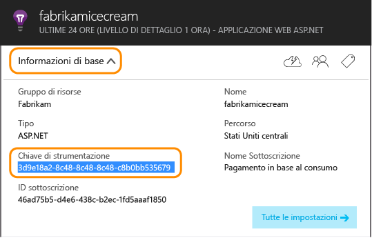
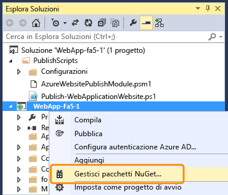
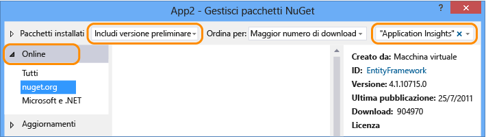
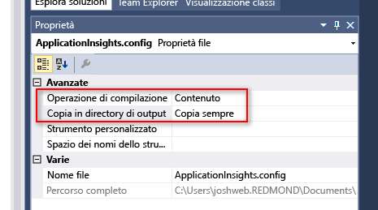
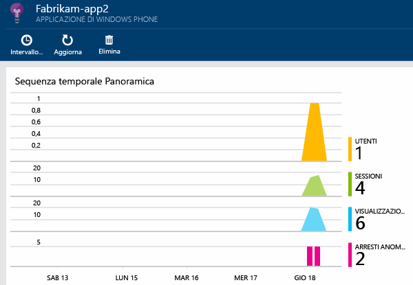

<properties
	pageTitle="Application Insights per app di Windows Phone e Windows Store | Microsoft Azure"
	description="Analizzare l'utilizzo e le prestazioni dell'app per dispositivi Windows."
	services="application-insights"
    documentationCenter="windows"
	authors="alancameronwills"
	manager="douge"/>

<tags
	ms.service="application-insights"
	ms.workload="tbd"
	ms.tgt_pltfrm="ibiza"
	ms.devlang="na"
	ms.topic="get-started-article"
	ms.date="02/03/2016"
	ms.author="awills"/>

# Analisi per app di Windows Phone e Windows Store

Microsoft offre due soluzioni di sviluppo per i dispositivi: [HockeyApp](http://hockeyapp.net/), per l'analisi lato client, e [Application Insights](app-insights-overview.md), per il lato server.

[HockeyApp](http://hockeyapp.net/) è la soluzione DevOps mobile per la compilazione di app per dispositivi iOS, OS X, Android e Windows, nonché di app multipiattaforma basate su Xamarin, Cordova e Unity. Permette di distribuire le compilazioni ai beta tester, raccogliere dati sugli arresti anomali del sistema e ottenere commenti e metriche utente. L'integrazione con Visual Studio Team Services semplifica la distribuzione delle compilazioni e l'integrazione degli elementi di lavoro.

Passare a:

* [HockeyApp](http://support.hockeyapp.net/kb)
* [Blog di HockeyApp](http://hockeyapp.net/blog/)
* Partecipando a [HockeyApp Preseason](http://hockeyapp.net/preseason/) è possibile accedere ai rilasci anticipati.

Se l'app ha un lato server, usare [Application Insights](app-insights-overview.md) per monitorare il lato server Web dell'app in [ASP.NET](app-insights-asp-net.md) o [J2EE](app-insights-java-get-started.md).

## Application Insights SDK per dispositivi Windows

Anche se è consigliabile usare HockeyApp, è disponibile anche una versione precedente di Application Insights SDK che consente di monitorare gli [arresti anomali][windowsCrash] e l'[utilizzo][windowsUsage] nelle app per dispositivi Windows.

Si noti che il supporto per la versione meno recente dell'SDK per dispositivi verrà eliminato gradualmente.


Per installare l'SDK precedente, è necessario:

* Una sottoscrizione a [Microsoft Azure][azure].
* Visual Studio 2013 o versione successiva.


### 1\. Ottenere una risorsa di Application Insights 

Nel [portale di Azure][portal] creare una risorsa di Application Insights.

Creare una nuova risorsa:


Una [risorsa][roles] in Azure è un'istanza di un servizio. In questa risorsa la telemetria dell'app verrà analizzata e visualizzata.

#### Eseguire una copia della chiave di strumentazione

La chiave identifica la risorsa. È necessaria subito per configurare SDK per l'invio di dati alla risorsa.




### 2\. Aggiungere Application Insights SDK alle app

In Visual Studio aggiungere l'SDK appropriato al progetto.


* Se si tratta di un'app C++, usare il [C++ SDK](https://github.com/Microsoft/ApplicationInsights-CPP) anziché il pacchetto NuGet illustrato di seguito.

Se si tratta di un'app universale di Windows, ripetere i passaggi seguenti per il progetto Windows Phone e quello Windows.

1. Fare clic con il pulsante destro del mouse in Esplora soluzioni e scegliere **Gestisci pacchetti NuGet**.

    

2. Cercare "Application Insights".

    

3. Selezionare **Application Insights per applicazioni Windows**.

4. Aggiungere un file ApplicationInsights.config alla radice del progetto e inserire la chiave di strumentazione copiata in precedenza. Di seguito è riportato un file XML di esempio per questo file di configurazione.

	```xml
		<?xml version="1.0" encoding="utf-8" ?>
		<ApplicationInsights>
			<InstrumentationKey>YOUR COPIED INSTRUMENTATION KEY</InstrumentationKey>
		</ApplicationInsights>
	```

    Impostare le proprietà del file ApplicationInsights.config: **Azione di compilazione** == **Contenuto** e **Copia nella directory di output** == **Copia sempre**.
	
	

5. Aggiungere il codice di inizializzazione seguente. È preferibile aggiungere questo codice al costruttore `App()`. Se si esegue in un'altra operazione, si potrebbe perdere la raccolta automatica delle prime PageViews.

```C#
	public App()
	{
	   // Add this initilization line. 
	   WindowsAppInitializer.InitializeAsync();
	
	   this.InitializeComponent();
	   this.Suspending += OnSuspending;
	}  
```

**App universali di Windows**: ripetere i passaggi per i progetti Phone e Store. [Esempio di app universale di Windows 8.1](https://github.com/Microsoft/ApplicationInsights-Home/tree/master/Samples/Windows%208.1%20Universal).

### <a name="network"></a>3. Abilitare l'accesso alla rete per l'app

Se l'app non ha già [richiesto l'accesso alla rete in uscita](https://msdn.microsoft.com/library/windows/apps/hh452752.aspx), sarà necessario aggiungere il manifesto come una [funzionalità necessaria](https://msdn.microsoft.com/library/windows/apps/br211477.aspx).

### <a name="run"></a>4. Eseguire il progetto

[Eseguire l'applicazione con F5](http://msdn.microsoft.com/library/windows/apps/bg161304.aspx) e usarla in modo da generare alcuni dati di telemetria.

In Visual Studio verrà visualizzato il conteggio degli eventi che sono stati ricevuti.


In modalità di debug la telemetria viene inviata non appena viene generata. In modalità di rilascio la telemetria è archiviata nel dispositivo e inviata solo quando l'app viene ripresa.


### <a name="monitor"></a>5. Visualizzare i dati monitorati

Aprire Application Insights dal progetto.


All'inizio si vedranno solo uno o due punti. ad esempio:



Se si prevedono più dati, fare clic su Aggiorna dopo pochi secondi.

Per visualizzare altri dettagli, fare clic su qualsiasi grafico.


### <a name="deploy"></a>5. Pubblicare l'applicazione in Store

[Pubblicare l'applicazione](http://dev.windows.com/publish) e controllare i dati accumulati quando gli utenti li scaricano e li usano.

### Personalizzare i dati di telemetria

#### Scelta degli agenti di raccolta

Application Insights SDK include alcuni agenti di raccolta , che raccolgono automaticamente diversi tipi di dati dall'app. Per impostazione predefinita, sono tutti attivi. È però possibile scegliere gli agenti di raccolta da inizializzare nel costruttore dell'app:

    WindowsAppInitializer.InitializeAsync( "00000000-0000-0000-0000-000000000000",
       WindowsCollectors.Metadata
       | WindowsCollectors.PageView
       | WindowsCollectors.Session 
       | WindowsCollectors.UnhandledException);

#### Inviare dati di telemetria personalizzati

Usare l'[API][api] per inviare eventi, metriche e dati di diagnostica ad Application Insights. Riepilogo:

```C#

 var tc = new TelemetryClient(); // Call once per thread

 // Send a user action or goal:
 tc.TrackEvent("Win Game");

 // Send a metric:
 tc.TrackMetric("Queue Length", q.Length);

 // Provide properties by which you can filter events:
 var properties = new Dictionary{"game", game.Name};

 // Provide metrics associated with an event:
 var measurements = new Dictionary{"score", game.score};

 tc.TrackEvent("Win Game", properties, measurements);

```

Per informazioni dettagliate, vedere [Metriche ed eventi personalizzati][api].

## Passaggi successivi

* [Rilevare e diagnosticare gli arresti anomali nell'app][windowsCrash]
* [Informazioni sulle metriche][metrics]
* [Informazioni su Ricerca diagnostica][diagnostic]
* [Tenere traccia dell'utilizzo dell'app][windowsUsage]
* [Usare l'API per inviare dati di telemetria personalizzati][api]
* [Risoluzione dei problemi][qna]

* [Usare HockeyApp per l'analisi di arresti anomali, la distribuzione beta e i commenti e suggerimenti sull'app](http://hockeyapp.net/)


<!--Link references-->

[api]: app-insights-api-custom-events-metrics.md
[azure]: ../insights-perf-analytics.md
[diagnostic]: app-insights-diagnostic-search.md
[metrics]: app-insights-metrics-explorer.md
[portal]: http://portal.azure.com/
[qna]: app-insights-troubleshoot-faq.md
[roles]: app-insights-resources-roles-access-control.md
[windowsCrash]: app-insights-windows-crashes.md
[windowsUsage]: app-insights-windows-usage.md

<!---HONumber=AcomDC_0211_2016-->