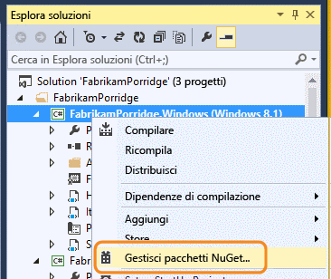
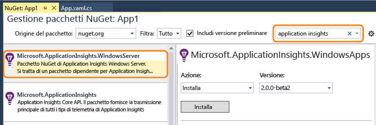
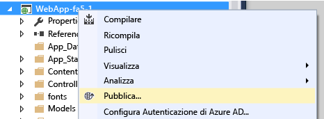

# Configurare manualmente Application Insights per applicazioni .NET

È possibile configurare [Application Insights](app-insights-overview.md) per monitorare un'ampia gamma di applicazioni o componenti, microservizi o ruoli applicazione. Per i servizi e le app Web, Visual Studio offre una [configurazione in un solo passaggio](app-insights-asp-net.md). Per altri tipi di applicazione .NET, come ruoli server back-end o applicazioni desktop, è possibile configurare Application Insights manualmente.

#### Prima di iniziare

È necessario:

* Una sottoscrizione a [Microsoft Azure](http://azure.com). Se il team o l'organizzazione ha una sottoscrizione di Azure, il proprietario potrà aggiungere l'utente alla sottoscrizione usando il rispettivo [account Microsoft](http://live.com).
* Visual Studio 2013 o versione successiva.

## 1. Scegliere una risorsa di Application Insights

La "risorsa" è la posizione in cui verranno raccolti e visualizzati i dati nel portale di Azure. È necessario decidere se crearne una nuova oppure condividerne una esistente.

### Parte di un'app più grande: usare una risorsa esistente

Se l'applicazione Web include diversi componenti, ad esempio un'app Web front-end e uno o più servizi back-end, è consigliabile inviare i dati di telemetria di tutti i componenti alla stessa risorsa. In questo modo potranno essere visualizzati in una singola mappa delle applicazioni e sarà possibile tracciare una richiesta da un componente a un altro.

Se vengono già monitorati altri componenti dell'app, usare quindi la stessa risorsa.

Aprire la risorsa nel [portale di Azure](https://portal.azure.com/). 

### App completa: creare una nuova risorsa

Se la nuova app non è correlata ad altre applicazioni, dovrà avere una propria risorsa.

Accedere al [portale di Azure](https://portal.azure.com/)e creare una nuova risorsa di Application Insights. Scegliere ASP.NET come tipo di applicazione.

La scelta del tipo di applicazione determina l'impostazione del contenuto predefinito dei pannelli della risorsa.

## 2. Eseguire una copia della chiave di strumentazione
La chiave identifica la risorsa e verrà installata nell'SDK per indirizzare i dati alla risorsa.

## 3. Installare il pacchetto Application Insights nell'applicazione
L'installazione e la configurazione del pacchetto Application Insights variano a seconda della piattaforma in cui si lavora. 

1. In Visual Studio fare clic con il pulsante destro del mouse sul progetto e scegliere **Gestisci pacchetti NuGet**.
   
    
2. Installare il pacchetto Application Insights per le app di Windows Server, "Microsoft.ApplicationInsights.WindowsServer".
   
    
   
    *Quale versione?*

    Per provare le funzionalità più recenti, selezionare **Includi versione preliminare**. I documenti o i blog pertinenti indicano se è necessaria una versione preliminare.
    
    *È possibile usare altri pacchetti?*
   
    Sì. Se si vuole solo usare l'API per inviare i propri dati di telemetria, scegliere "Microsoft.ApplicationInsights". Il pacchetto per Windows Server include l'API e diversi altri pacchetti, ad esempio la raccolta dei contatori delle prestazioni e il monitoraggio delle dipendenze. 

### Per eseguire l'aggiornamento a future versioni del pacchetto
Si rilascerà una nuova versione del SDK di tanto in tanto.

Per eseguire l'aggiornamento a una [nuova versione del pacchetto](https://github.com/Microsoft/ApplicationInsights-dotnet-server/releases/), riaprire Gestione pacchetti NuGet e filtrare i pacchetti installati. Selezionare **Microsoft.ApplicationInsights.WindowsServer** e scegliere **Aggiorna**.

Se sono state eseguite tutte le personalizzazioni apportate al file ApplicationInsights.config, salvarne una copia prima di eseguire l'aggiornamento e, successivamente, unire le modifiche nella nuova versione.

## 4. Inviare dati di telemetria
**Se è stato installato solo il pacchetto dell'API:**

* Impostare la chiave di strumentazione nel codice, ad esempio in `main()`: 
  
    `TelemetryConfiguration.Active.InstrumentationKey = "` *nome della chiave* `";` 
* [Scrivere dati di telemetria usando l'API](app-insights-api-custom-events-metrics.md#ikey).

**Se sono installati altri pacchetti di Application Insights** è possibile, se si preferisce, usare il file config per impostare la chiave di strumentazione:

* Modificare ApplicationInsights.config (che è stato aggiunto dall'installazione di NuGet). Inserire questo comando immediatamente prima del tag di chiusura:
  
    `<InstrumentationKey>` *chiave di strumentazione copiata* `</InstrumentationKey>`
* Verificare che le proprietà di ApplicationInsights.config in Esplora soluzioni siano impostate su **= Contenuto, Copia nella directory di output = Copia**.

È utile impostare la chiave di strumentazione nel codice se si vuole [cambiare la chiave per configurazioni della build diverse](app-insights-separate-resources.md). Se si imposta la chiave nel codice, non è necessario impostarla nel file `.config`.

##  Eseguire il progetto
Eseguire l'applicazione premendo **F5** e provarla aprendo pagine diverse per generare alcuni dati di telemetria.

In Visual Studio verrà visualizzato il conteggio degli eventi che sono stati inviati.

##  Visualizzare i dati di telemetria
Tornare al [portale di Azure](https://portal.azure.com/) e passare alla risorsa Application Insights.

Cercare i dati nei grafici Panoramica. All'inizio si vedranno solo uno o due punti. Ad esempio:

Fare clic su qualsiasi grafico per visualizzare metriche più dettagliate. [Altre informazioni sulle metriche.](app-insights-web-monitor-performance.md)

### Dati non visualizzati
* Usare l'applicazione, aprendo pagine diverse in modo da generare alcuni dati di telemetria.
* Aprire il riquadro [Ricerca](app-insights-diagnostic-search.md) per visualizzare i singoli eventi. Talvolta agli eventi ci vuole un po' più di tempo per passare attraverso la pipeline delle metriche.
* Attendere alcuni secondi e fare clic su **Aggiorna**. I grafici si aggiornano periodicamente, ma è possibile aggiornare manualmente se si è in attesa di alcuni dati da visualizzare.
* Vedere [Domande su Application Insights per ASP.NET](app-insights-troubleshoot-faq.md).

## Pubblicare l'app
Distribuire ora l'applicazione nel server o in Azure e osservare l'accumulo dei dati.

Quando si esegue la modalità debug, la telemetria viene velocizzata nella pipeline, quindi i dati vengono visualizzati in pochi secondi. Quando si distribuisce l'applicazione nella configurazione Release, i dati si accumulano più lentamente.

### Nessun dato dopo la pubblicazione nel server?
Aprire le porte per il traffico in uscita nel firewall del server. Per l'elenco degli indirizzi necessari, vedere [questa pagina](https://docs.microsoft.com/azure/application-insights/app-insights-ip-addresses). 

### Problemi del server di compilazione
Vedere [questa sezione sulla risoluzione dei problemi](app-insights-asp-net-troubleshoot-no-data.md#NuGetBuild).

> [!NOTE]
> Se l’app genera molti dati di telemetria, il modulo di campionamento adattivo riduce automaticamente il volume che viene inviato al portale inviando solo una frazione rappresentativa di eventi. Tuttavia, gli eventi che fanno parte della stessa richiesta verranno selezionati o deselezionati come gruppo, per rendere possibile lo spostamento tra eventi correlati. 
> [Informazioni sul campionamento](app-insights-sampling.md).
> 
> 

## Video

> [!VIDEO https://channel9.msdn.com/events/Connect/2016/100/player]

## Passaggi successivi
* [Aggiungere altri dati di telemetria](app-insights-asp-net-more.md) per un quadro completo a 360 gradi dell'applicazione.

